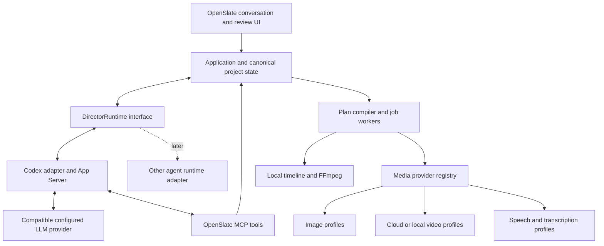

# OpenSlate — Codex and Provider Boundaries

**Version:** 0.4 · September 10, 2026
**Status:** proposed integration, verified against official documentation; adapters remain unimplemented.

## 1. Two different extension boundaries

OpenSlate is a single-user local application with user-configured credentials. Its project model must remain independent of a particular LLM, image model, video model, or speech service.

**DirectorRuntime** owns an agent session's interaction mechanics: start/resume, send a request, stream normalized events, receive tool/input requests, interrupt, and dispose. OpenSlate supplies context, pinned creative instructions, and domain tool contracts. Codex is the first implementation. Other implementations must satisfy the same project-isolation, instruction-loading, structured-tool, interruption, and recovery contract; swapping an adapter does not imply equal model quality or features.

**MediaProvider** owns capability discovery and the lifecycle of a media task: validate, submit, monitor/reconcile when applicable, obtain outputs, and report errors/usage. Image, video, speech, and transcription use role-specific typed requests rather than one large untyped parameter object. Synchronous APIs still use durable job records; local transformations use trusted worker handlers.

A new model in an existing protocol can be a new validated profile. A new protocol needs an adapter. Project state stores logical roles and resolved immutable profile revisions, not scattered H3/GPT conditionals. The skeleton's interfaces are placeholders and will evolve toward these boundaries.

## 2. What Codex supplies and what we build

Codex App Server exposes persistent threads, turn execution, streamed items, steering/interruption, and client response paths for runtime approvals and questions. We integrate its local stdio protocol from the TypeScript server. [App Server](https://learn.chatgpt.com/docs/app-server)

| Capability | Codex supplies | OpenSlate builds |
|---|---|---|
| Conversation | Thread/turn lifecycle, stored history, streaming interaction | Project/session mapping, fresh scoped context, accepted creative decisions |
| Agent loop | Model reasoning and tool interaction | Film-production instructions, tool handlers, plan validation |
| Skills | Discovery and explicit instruction activation | Trusted catalog, immutable versions, compatibility and request activation records |
| Tools | MCP connectivity and runtime tool-call events | Five bounded domain tools and application-side authorization |
| User intervention | Turn steering/interruption and question/approval plumbing | Review cards, pending decisions, scoped dispatch holds and safe resume |
| Execution controls | Runtime permissions and sandbox mechanisms | Budget admission, mandatory human keyframe approval, generation policy |
| Media production | No OpenSlate production engine | Provider jobs, receipts, reconciliation, artifacts, lineage and rendering |
| Editing | Can reason about a requested change | Revisioned shots/timelines, impact analysis, reuse and stale-result protection |

Codex skill discovery/injection and MCP connection behavior are documented independently of OpenSlate's proposed locks and handlers. [Skills](https://learn.chatgpt.com/docs/build-skills), [MCP](https://learn.chatgpt.com/docs/extend/mcp)

We use Codex as the director runtime. Its conversation history is not the production database, its own plan/progress messages are not our executable graph, and its runtime permission responses are not human approval of a storyboard. The application keeps these records distinct. A model tool call can propose an operation; only OpenSlate can admit it under project policy.

## 3. One request through the integration

1. The local application records a user message or review decision. If it requests an edit, it persists the appropriate dispatch hold before waiting on model reasoning.
2. The director adapter starts/resumes the project's runtime session, loads the selected capability snapshot, and sends current relevant project/shot/job state with the request.
3. Codex reasons with the production/plan-authoring guidance and calls OpenSlate MCP tools. The application reads context, prepares changes, or commits authorized revisions through the same services used by its UI.
4. Normalized text/progress/questions stream to the browser. Runtime-specific IDs stay in the adapter/session mapping; durable project IDs identify the film and jobs.
5. Once the graph is committed, workers independently generate keyframes, await recorded human approval, dispatch video jobs, and render previews. Routine polling does not require Codex turns.
6. A new user edit or unresolved decision starts a director request. V0 authority-changing requests revoke the previous tool epoch and drain/replace its runtime process before obtaining new mutation authority; informational steering is optional only when authority remains unchanged and attribution is proven. The [runtime design](../technical/DIRECTOR-RUNTIME.md) defines this boundary. Interrupting Codex also persists OpenSlate's director-automation pause; it does not cancel already accepted provider jobs or automatically resume paused dispatch.

All native method names, event details, approval round trips, and effective tool restrictions must pass a pinned-release compatibility test. Native general-purpose file/shell capabilities must not provide a second path to credentials, paid-generation APIs, or canonical state writes. The adapter verifies effective runtime permissions and the MCP catalog before production; prompt instructions alone are insufficient.

## 4. Model configuration without promising universal compatibility

| Profile role | Examples of configuration | Compatibility the application checks |
|---|---|---|
| Director | Runtime adapter, provider/model ID, credential reference, context/vision/tool capabilities | Supported protocol and reliable structured tool interaction |
| Image | Provider/model, reference modes, geometry, settings | Required product references and keyframe format |
| Video | Provider/model, image conditioning, supported durations, geometry, execution location | Actual approved-keyframe consumption and job recovery behavior |
| Speech | Provider/model, voice, language, pronunciation/pacing options | Audio format, text limits, voice availability and revision provenance |
| Transcription/alignment | Provider/model or local handler, language/timing support | Timing granularity/confidence needed for narration cues |

Codex supports configured custom model providers, but its current generic provider configuration accepts the Responses wire protocol. A custom API key or base URL does not make every vendor API compatible. Test compatible profiles inside Codex; use another DirectorRuntime implementation when the desired LLM stack needs different agent/protocol behavior. [Codex configuration](https://learn.chatgpt.com/docs/config-file/config-reference)

This is a two-level extension strategy, not a claim that arbitrary LLMs already work. V0 ships Codex plus fake-runtime contract fixtures; additional production runtime adapters can follow. Provider capability differences remain visible, and unsupported combinations fail preparation with useful alternatives. No silent model fallback or discarded conditioning inputs.

Settings keep credentials in backend-only secret storage/environment integration. Plans, skill context, debug exports, and shared project files contain credential references only. The browser may accept keys through a local setup flow but must not expose saved secrets through ordinary state APIs; media keys are not injected into the director process. Only the credentials needed by the chosen LLM/runtime reach that runtime.

Changing a configured default affects future selections, not accepted jobs. Each attempt retains its requested provider/model/settings, implementation identity, and provider-reported resolved model identity when available. A pinned local profile does not freeze a hosted model alias or weights; record uncertainty when the provider does not reveal a resolved identity. Switching among profiles already included in the lock is a scoped project change with capability validation and renewed affected review when needed. Adding an unlocked profile or changing the runtime requires the explicit successor-lock/run boundary described in the [framework upgrade rules](SKILLS-AND-TOOLS.md#upgrade-rules): hold affected new dispatch, validate and rebind new work, and recreate runtime context when needed. Old attempts retain their original locks and continue being monitored. Apply LLM changes at a turn boundary; provider/runtime changes may require a new process. No model switch replays completed side effects.

## 5. Minimum extensibility proof

Before expanding the adapter library, demonstrate a second fake image/video profile, a fake speech/transcription path, and a fake DirectorRuntime using the same project/tool/compiler services. Reject a video profile that cannot consume reviewed keyframes. Verify that changing profiles or recreating a runtime cannot release a review gate, lose narration decisions, or duplicate generation. Real API tests then establish actual access, capabilities, cost/latency reporting, and recovery behavior.
