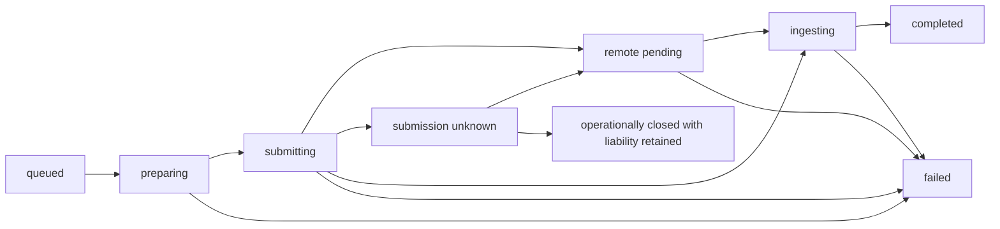

# OpenSlate — Component Design

Companion to the [overall design](README.md). All interfaces, package names, and schema fragments below are proposed OpenSlate contracts, not provider API definitions or implemented code.

## 1. Project domain, revisions, and storage

**Purpose:** preserve a complete, editable production independently of the director session.

### Core records

| Record | Essential content |
|---|---|
| Project | ID, title, schema version, output profile, policy, current revision pointers |
| BriefRevision | Audience, intent, format, duration target, constraints, supplied inputs, assumptions |
| BibleRevision | Characters, locations, wardrobe/props, style, continuity rules, voice intent |
| SceneRevision | Narrative purpose, setting/time, participants, duration allocation, ordered shot IDs |
| ShotRevision | Scene, action, framing, camera, continuity in/out, desired edit duration, reference requirements, audio intent |
| AssetRevision | Logical asset ID, role, immutable blob checksum, metadata, origin and dependency links |
| GenerationIntent / Spec | Service-issued batch/candidate identity; exact creative prompt, input revisions, conditioning mode, model/profile, settings, compiler/skill versions |
| Job / Attempt | Durable logical work and each execution attempt; phase, provider receipt, lease, recovery data |
| Take | Shot/spec/attempt references, ingested media, actual properties, review findings |
| Approval / Reservation | Authorized input/scope/policy and admitted financial liability |
| TimelineRevision | Exact take/asset references, placement, trims, tracks, transitions, captions |
| Render | Timeline, output profile, toolchain identity, manifest, final artifact |
| DirectorSession / Run | Runtime/thread mapping, turn status, scoped context, wakeups, execution limits |

Use stable IDs for logical objects and immutable version IDs for their revisions. Current pointers and job status are mutable through transactions. Full event sourcing is unnecessary: relational records are authoritative; a transactional event log supports audit, UI updates, and wakeups.

### Commit and conflict rules

Every UI or tool mutation carries project scope, an operation ID, and an expected revision. Validate the patch, check authorization, commit entity changes and an event in one transaction, then return committed revision IDs. Repeating the same operation ID with identical input returns its previous result; conflicting reuse is rejected.

Start with a project-level revision for user/agent edits. Worker progress uses separate job versions so polling does not constantly conflict with plan editing. Later, entity-level revision checks can reduce contention. A stale patch returns current state and a conflict; it never overwrites newer user changes automatically.

### Dependency and invalidation rules

Record actual dependencies: a take depends on a generation spec; that spec depends on particular shot and asset revisions; a timeline depends on selected takes. Do not mark every shot outdated because an unrelated scene title changed.

Semantic edits such as wardrobe, action, or conditioning changes produce an impact list. Existing media remains usable if the user chooses it. Selection and freshness are separate: an accepted take may be marked outdated, and a new unreviewed take may be current. A stale result cannot change the selected-take pointer without an explicit validated mutation.

### Local storage layout

```text
OpenSlate application data/
  state.sqlite                 # Projects, jobs, revisions, events, ledger
  blobs/<checksum>.<extension>  # Immutable originals and outputs
  derivatives/                 # Rebuildable proxies, thumbnails, previews
  exports/<project>/<render>/  # Published videos and project bundles
  scratch/<job>/              # Temporary output with bounded retention
  runtime/                    # Separately protected Codex state
```

Keep secrets outside project bundles and readable agent exports. SQLite uses controlled migrations, short write transactions, and a documented backup operation. A portable export contains a schema-versioned manifest, dependency references, provenance, and the referenced media; it excludes credentials and ephemeral signed URLs. Export takes a consistent database snapshot and pins referenced blobs so cleanup cannot remove them mid-export. Import validates paths, checksums, schema versions, and identifiers before committing.

Disk-space checks precede large downloads/renders. Cleanup removes only unreferenced derivatives or explicitly deleted project media after a retention period. Accepted media, uncertain provider jobs, and currently exported snapshots are not automatic cleanup candidates.

## 2. Codex director and creative skills

**Purpose:** turn user intent and review evidence into planning, generation, and editing decisions.

### Runtime boundary

`DirectorRuntime` exposes session creation/resume, message submission, interruption, normalized events, replies to pending approval/input requests, and shutdown. The adapter tracks request IDs, timeout/cancellation, and whether a user response was delivered, so a runtime or MCP request cannot silently strand a turn. `CodexDirectorRuntime` owns the child process, protocol handshake, request correlation, thread mapping, and translation of Codex events. Other packages do not import Codex protocol types.

Use local stdio App Server for the interactive experience and MCP tools for OpenSlate operations. Codex can consume MCP servers over stdio or Streamable HTTP. Media tools return durable job IDs promptly, rather than holding a tool request open for a full video generation. [Codex MCP documentation](https://learn.chatgpt.com/docs/extend/mcp)

A thin MCP process can forward validated commands to the local application service using a project- and action-scoped capability. The capability’s scope is bound by the service, not trusted from an arbitrary tool argument. It cannot call UI approval, policy editing, credential, or worker-administration endpoints. The bridge calls the same domain services as the UI and CLI.

In v0, each active project has its own runtime/bridge scope, created on demand and stopped when idle. Start with one active director project to bound resource use. Do not reuse a project-bound MCP process for another project merely by starting a new Codex thread; any future per-thread scoping must be verified explicitly.

### Director logic

1. Build a bounded context packet: brief/bible summary, selected scene and shot revisions, pending decisions, relevant asset previews, and job results.
2. Send the user request or a persisted production wakeup to the director.
3. Let the director load applicable creative skills and retrieve more context with tools.
4. Validate proposals and tool mutations through the application service.
5. End or pause the turn when waiting for jobs, user decisions, budget, or an execution limit.
6. Resume from committed project state when a meaningful event arrives.

A disappeared Codex session does not delete the production. Recreate a session with a compact state summary and links to exact entities. Full transcripts and media binaries are not repeatedly injected into the prompt. Session history and summary freshness are tracked separately from project revisions.

### Initial skill bundle

| Skill | Inputs | Main output |
|---|---|---|
| Story development | Brief, audience, constraints | Narrative outline and bible proposals |
| Scene and shot planning | Story, audio anchors, capabilities | Scene/shot plan and dependencies |
| Continuity direction | Bible, neighboring shots, accepted references | Continuity requirements and impact analysis |
| Asset direction | Reference needs and style | Canonical reference and keyframe requests |
| H3 prompt writing | Shot intent, references, mode | Creative prompt suitable for compilation |
| Take review | Shot requirements, sampled frames, metadata | Findings, acceptance or bounded revision proposal |
| Editorial assembly | Accepted takes, audio, duration targets | Timeline proposal and coverage gaps |

Skills are versioned creative instructions and examples. Typed code enforces schemas, provider constraints, budgets, and destructive actions. Start with one director; parallel image/video jobs provide concurrency without introducing autonomous specialist agents. If specialists are added later, they return scoped proposals through the same revision checks.

### Tool surface

| Category | Proposed operations |
|---|---|
| Read | `get_project_context`, `get_scene`, `get_shot`, `list_assets`, `inspect_jobs`, `get_timeline` |
| Plan | `propose_plan_patch`, `commit_plan_patch`, `get_change_impact` |
| Assets | `request_asset_generation`, `inspect_asset`, `choose_reference` |
| Production | `estimate_generation`, `submit_shot_batch`, `request_job_cancellation` |
| Review/edit | `record_review`, `select_take`, `propose_timeline_patch`, `commit_timeline_patch` |
| Finish | `validate_timeline`, `request_preview`, `request_render` |

UI upload/import and approval commands also use application services. The director may request a user decision; it cannot manufacture an approval record. A generation request pins an execution snapshot so later planning edits cannot mutate a running request.

### Wakeups and controls

Commit job-completion events and director wakeup intents durably. Coalesce a batch’s progress into useful milestones instead of starting a turn for every poll. Allow one active turn per session, with a bounded wakeup queue and at-least-once delivery. Reconcile an uncertain turn-start acknowledgment against runtime and project state before starting another turn.

Paid-work deduplication uses service-issued generation intent/candidate IDs from the authorized execution batch. Admission enforces uniqueness for each intent and attempt ordinal; `submit` cannot mint a new intent. Replayed reasoning may invent fresh tool operation IDs, so those IDs alone are insufficient. A deliberate regeneration advances the candidate through a separate revision-checked, authorized action. Repeating that action against the prior candidate version conflicts or returns the existing result. Preserve the source decision/wakeup identity for audit.

Separate **interrupt director**, **pause new dispatch**, and **request cancellation of accepted jobs**. Interruption sets persisted director automation to paused until explicit resume; completion events accumulate without restarting it. Dispatch has its own paused/running state, and accepted jobs continue to be monitored. A browser disconnect changes none of these. Batch state and user controls remain available without an active model call.

## 3. Story, shots, continuity, and review

**Purpose:** convert an open-ended story into feasible, editable generation units.

### Planning logic

Allocate narrative beats and duration across scenes, then allocate shots within each scene. For audio-led work, import/analyze the narration or music first and establish cue boundaries before deciding coverage. Record approximate timing until actual media exists; final timing is validated against probed duration.

For v0, one generated shot maps to one provider clip. A longer cinematic beat uses multiple shots. Continuous chunked extension can later become a separate production strategy with explicit predecessor dependencies.

A shot records narrative purpose, participants, visible action, shot size, camera motion, environment, lighting, intended starting/ending state, edit duration, dialogue/audio intent, and reference roles. Separate desired edit length from requested generation length so there is room for trimming where provider limits permit.

Validation checks duration coverage, duplicate/missing entities, cyclic dependencies, incompatible references, and unachievable requests. A speculative style or complex action is a quality risk to test, not a deterministic validation failure.

### Continuity strategy

Canonical identity references are reused across scenes. A keyframe can combine an approved character, costume, setting, and composition for a particular shot. Direct continuation may depend on an accepted predecessor frame or video excerpt; only that dependency blocks downstream scheduling.

Provider mode matters: exact frame anchoring and multimodal reference conditioning may be mutually exclusive. The planner chooses a supported strategy and records the tradeoff. It cannot silently drop an audio or character reference to make a request valid.

Do not chain every shot from the previous final frame. Independent references allow parallel work and avoid propagating one flawed take through the whole film. Use continuity chains only where the story requires them.

### Review and revision

Technical checks inspect decodability, duration, dimensions, streams, missing/black frames where practical, and unexpected silent/truncated media. Sample beginning/middle/end frames and create contact sheets for visual review. Detecting possible internal cuts can flag a take; it does not automatically split the planned shot.

The director compares evidence with intent and records specific findings, such as wrong wardrobe or missed action. Sampled images cannot prove motion continuity, dialogue accuracy, or lip sync. Full clip playback remains available to the user; richer audio/video evaluation is an explicit later capability.

A technical retry repeats recoverable execution work. A creative regeneration creates a new take with a recorded reason and usually a changed prompt or reference. Limit attempts per shot and total run spend. Exhaustion returns a visible decision with available alternatives; it never causes an unbounded self-improvement loop.

## 4. Image assets and artifact service

**Purpose:** create reusable references and safely store every imported/generated artifact.

Use the OpenAI Images API through a TypeScript provider adapter for GPT Image 2 generation/editing. The official guide includes JavaScript generation calls and returned image bytes; image dimensions and request options need model-specific validation. [OpenAI image-generation guide](https://developers.openai.com/api/docs/guides/image-generation)

Asset production proceeds from canonical references to derived keyframes. Each request freezes the creative instruction, references, target dimensions, model/profile, and output role. Multiple candidates remain distinct revisions until a reference is selected. Editing a reference creates a new artifact and preserves its parent.

Before image-to-video submission, validate first/last-frame geometry against the intended composition and project ratio. Deliberately crop or pad when needed and record the result as a derived asset for review. Final-render normalization is too late to correct a generation composed at the wrong ratio.

Ingestion writes to temporary storage, checks file type/size and media properties, calculates a checksum, then moves the file atomically and commits metadata. A crash between file publication and metadata commit is recovered by scanning the job’s ingestion manifest; orphan files are not treated as completed assets. Jobs become usable only after metadata and blob availability agree.

Store native originals and produce rebuildable review proxies. Record user imports, generated media, derived crops, and extracted frames as different origins. Every transformation records its inputs and recipe. The image generator is not asked to encode authoritative project JSON in an image.

### Provider-facing media transfer

Local application paths and localhost URLs are not reachable by cloud providers. `MediaTransfer` resolves internal artifact IDs into a supported request representation: bounded inline images where accepted, or uploaded objects with sufficiently long-lived signed read URLs. Imported audio/video reference features require this transfer path before they are advertised as usable.

Select the initial staging transport during the H3 spike. Signed URLs must survive queueing and reference retrieval, while originals remain private and durable locally. Keep staging objects until the provider no longer needs them; expire them through recorded transfer leases. Do not log signed query strings or include them in portable manifests. The cloud-only happy path must be demonstrated on an ordinary local installation, not only inside a public development server.

## 5. Provider contracts and H3 cloud

**Purpose:** translate stable project intent into each provider’s actual capabilities.

```ts
// Illustrative domain contract; exact shapes are designed during implementation.
interface VideoProvider {
  capabilities(): Promise<VideoCapabilities>;
  prepare(input: ShotGenerationInput): Promise<PreparedGeneration>;
  estimate(spec: PreparedGeneration): Promise<CostEstimate>;
  submit(spec: PreparedGeneration, operationId: string): Promise<SubmissionResult>;
  inspect(receipt: ProviderReceipt): Promise<RemoteJobState>;
  outputs(receipt: ProviderReceipt): Promise<RemoteArtifact[]>;
  cancel?(receipt: ProviderReceipt): Promise<CancelOutcome>;
  reconcile?(attempt: UnknownSubmission): Promise<ReconciliationOutcome>;
}
```

`SubmissionResult` distinguishes accepted, definitely rejected, and uncertain outcomes. Passing an operation ID does not imply the provider honors idempotency. Preparation produces a versioned immutable execution spec and a request fingerprint. Expiring URLs are transport material: refreshing them for the same immutable blob does not change creative identity, but delivery details are retained with the attempt.

Capabilities describe conditioning modes and incompatible combinations, duration ranges, dimensions/ratios, reference types and limits, audio output, progress semantics, cancellation, idempotency/reconciliation, and model identity. Their version is saved with each request. Unsupported fields produce actionable errors; adapters never silently substitute a model or omit a required reference.

### H3 cloud facts verified for this design

The current V2 create API returns a task ID. H3 supports integer 4–15 second clips at 768P/2K. First/last-frame inputs cannot mix with reference-image/video/audio roles. Reference mode permits up to nine images, three video clips totaling at most 15 seconds, and three audio clips totaling at most 15 seconds. Image-to-video ratio follows its input image. The request body limit is 64 MB. H3 Max needs a different capability profile. [H3 V2 create](https://platform.minimax.io/docs/api-reference/video-generation-v2-create)

V2 query returns output through `task.content.url`; use that contract instead of the older file-ID flow. Query/list history is limited to seven days, and no durable output URL retention guarantee was established. Copy results promptly and preserve local records. [H3 V2 query](https://platform.minimax.io/docs/api-reference/video-generation-v2-query), [H3 V2 list](https://platform.minimax.io/docs/api-reference/video-generation-v2-list)

The documented delete endpoint cancels queued tasks, rejects running cancellation, and deletes terminal task records. A status race can therefore turn a cancellation attempt into deletion. [H3 cancel/delete](https://platform.minimax.io/docs/api-reference/video-generation-v2-delete)

OpenSlate's v0 H3 adapter advertises remote cancellation as unsupported until a race-safe method is verified. Users can stop new dispatch while accepted work remains tracked and ingested. A query followed by DELETE does not remove the race. If provider deletion is exposed later, it is a separate explicit operation after local preservation, not a side effect of stopping the director.

No documented client idempotency key or conclusive lost-response reconciliation method was found in the reviewed create/list contracts. The adapter defaults to unknown-submission handling until a verified stronger guarantee exists.

### Execution flow

The worker materializes transfers, records submission intent, sends the prepared request, and persists the receipt. Poll with backoff and jitter through the existing receipt. Provider completion starts artifact ingestion; it does not directly set the take usable. Keep normalized errors plus redacted provider details and request IDs for diagnosis.

Polling is the initial completion path because a local app usually lacks a public callback endpoint. Webhooks may later accelerate it; verify authenticity and terminal state through provider queries, deduplicate notifications, and retain polling for recovery. Callback setup alone is not an authentication guarantee.

OpenSlate compiles the creative request sent to H3; the provider owns its internal hosted processing. Additional standalone Context-IR jobs are optional, recorded, and separately budgeted. OpenSlate must not silently add these extra calls, costs, or data destinations.

## 6. Durable jobs, budgets, and recovery

**Purpose:** execute long-running work safely across crashes and director/browser interruptions.

### State model



`remote pending` carries the observed provider state such as queued/running. Synchronous image responses can enter ingestion directly; a definite rejection goes to failed. Local renders use queued → rendering → validating → completed, with their own retryable failure phases. `failed` records the failed phase and whether it is retryable. Pre-submit cancellation is local and terminal. Accepted jobs carry a cancellation-request flag and an eventual confirmed outcome when supported. An unknown submission can be operationally closed with a recorded user disposition, while its uncertain liability remains.

### Admission and ownership

In one transaction, validate the execution snapshot and policy, reserve the allowed cost, create the job/attempt, and append the event. A scheduler claims work with a lease owner, expiry, and increasing fencing token. Workers heartbeat; only the current token can commit progress. The local service and workers share one SQLite installation and coordinate through transactions.

Record `submitting` before sending bytes. An expired lease during submission is ambiguous even if another worker cannot find a receipt. A lease prevents stale database commits; it cannot prevent a remote side effect already in flight. Reclaiming work with a known receipt resumes inspection; reclaiming uncertain submission starts reconciliation, never automatic paid resubmission.

Keep progress commits fenced, but permit a trusted stale submitter to append immutable receipt evidence correlated to its original attempt. The current owner/reconciler validates it before attaching a receipt or changing state. This preserves delayed successful responses without allowing the former owner to overwrite current progress. Conflicting receipts remain an explicit reconciliation problem.

Retries are per phase: preparation, inspection, transfer, and render can often retry safely. Repeating creation requires a definite rejection/no-send condition, a provider-supported idempotency guarantee, or a documented user decision to risk another paid attempt. Disable or constrain SDK/HTTP automatic retries for potentially billable creation when their safety is unproven. Image generation has the same lost-response concern even if it returns synchronously.

### Budget model

Track media, director, and later local-compute estimates separately. Reserve a conservative estimate before dispatch; atomically enforce project/run caps against spent estimates, unsettled liabilities, and active reservations. Also cap attempts, generated seconds, concurrent jobs, director turns, and per-turn output where supported.

An estimate records rate source/version, currency, assumptions, and confidence. Unknown submissions retain potential liability. Cancellation requests do not release liability before outcome is established. When actual usage is unavailable, move the reservation to an explicitly estimated charge rather than treating it as zero. Show estimated and reported spend separately.

Authorizing replacement of an unknown submission creates a distinct attempt and reservation. The original liability remains counted until reconciled or booked as an estimated charge. A user's acknowledgment can resolve the operational decision; it is not evidence that the provider did not charge.

An application budget is an admission bound under its estimate, not a promise about the provider invoice. Where no trustworthy maximum is available, require a conservative allowance and provider/account limits for stronger control. Codex billing/auth and media-provider billing remain separate; an existing Codex login does not supply H3 or Images API credentials.

### Recovery table

| Situation | Required behavior |
|---|---|
| Crash while still queued/preparing, before submission intent | Reclaim preparation safely |
| Crash or timeout after submission may have started | Mark unknown; preserve reservation; reconcile without blind create |
| Receipt persisted, worker dies | Resume monitoring that receipt |
| Provider succeeds, download fails | Retry output retrieval/ingestion; do not regenerate |
| Media URL expires | Try supported refresh/re-query; otherwise report artifact unavailable and retain liability |
| User edits a running shot | Attach late take to original revision; mark impact; preserve current selection |
| Two jobs compete for remaining budget | Transaction admits only work within the available allowance |
| User pauses a batch | Stop new dispatch; continue observing accepted external work |
| Render process dies | Retry from the same frozen manifest, preserving existing exports |
| Browser or director disappears | Jobs continue while app workers are running; restart recovers persisted work |
| Machine sleeps or app fully stops | Cloud may continue; recovery reconciles on restart; local work makes no progress while stopped |

A reconciler finds expired leases, overdue polls, incomplete ingestion, unresolved submissions, undelivered events, and abandoned temporary files. Display unresolved cases as actionable job states, not generic “agent failed.”

## 7. Audio, timeline, rendering, and post-processing

**Purpose:** create a reproducible edit from independent generated clips.

### Audio policy

Plan audio before generating visuals when it drives pacing. The initial modes are imported narration/music, retained native shot audio, and silence. An audio adapter can later add speech/music generation without changing the timeline model. Audio import includes probing, duration, waveform/cue extraction as needed, and provenance; transcript/cue times may be supplied or edited manually in v0.

Native generated audio is treated as one mixed stream unless separate stems are actually returned. Each clip chooses retain, mute, or gain-adjusted mix. Do not promise removal of only dialogue or music from a mixed stream. Exact dialogue, lip sync, speaker consistency, and forced alignment need their own later acceptance tests.

### Edit model

Start with one primary video sequence, narration/music/effects audio tracks, text captions, cuts, simple dissolves, trims, gain/fades, and a small set of supported visual adjustments. The UI exposes reorder/trim/take selection and these supported controls; it is not a full professional editor.

Use integer frame placement at a declared rational frame rate, and integer audio samples at the project sample rate. Convert imported timestamp/time-base values explicitly with a single rounding policy. Preserve original timing metadata; map source trims to normalized derivatives. A fixed v0 profile can use 24 fps, 48 kHz stereo and an explicitly chosen 16:9 export size, subject to the first media test.

Each timeline clip references an exact source revision, source in/out, placement, fit/crop policy, transform, and audio policy. Transition overlap shortens the aggregate runtime and requires sufficient handles. Captions use explicit ranges; narration continues across visual cuts unless an edit says otherwise.

Validation rejects missing/unusable sources, out-of-range trims, negative lengths, unsupported effects, invalid overlaps, and unintended gaps. Intentional black frames or silence are explicit clips. Compare final timeline duration against the brief’s tolerance and audio endpoint; do not calculate it as a naive sum of requested generation durations.

### Render logic

1. Freeze the timeline and resolve all artifact revisions and checksums.
2. Preflight source availability, media properties, output directory, and disk capacity.
3. Normalize dimensions, fit/crop, frame rate, pixel format, sample rate, and timestamps where required.
4. Compile the edit model into validated FFmpeg arguments/filter graphs; never execute a model-written shell command as the render recipe.
5. Render a preview or final output to a job-specific temporary file and stream real progress.
6. Probe/decode the result, verify expected duration/streams, then publish atomically with a manifest.

Direct concatenation is only an optimization when stream compatibility is proven. FFmpeg’s concat demuxer expects compatible streams, so mixed sources need deliberate normalization. [FFmpeg concat documentation](https://ffmpeg.org/ffmpeg-formats.html#concat)

The manifest pins timeline revision, source hashes, normalization/effect settings, render compiler version, and FFmpeg version. Reproducing edit decisions is the target; byte-identical outputs across different encoders or hardware are not guaranteed. Cache derivatives by input hashes and recipes. Changing subtitles or music re-renders the edit without paying to generate shots again.

Post-processing is a typed set of operations: audio fades/normalization, transitions, captions, fit/crop, limited color adjustments, and final encode. Upscaling, stabilization, or interpolation can become optional worker jobs with explicit model/cost and fidelity tradeoffs.

## 8. User interface, API, and observability

**Purpose:** keep production understandable and controllable throughout a long run.

The primary workspace combines a director conversation with views for the brief/plan, asset library, scene storyboard, shot/take review, timeline/preview, and jobs/costs. Users can edit structured objects directly; conversational changes use the same domain commands.

Show real distinctions: proposed, awaiting review, queued, generating, downloading, ready for review, accepted, outdated, failed, and unresolved submission. Provider-derived percentages are optional; when unavailable, show phase and elapsed time instead of inventing a percentage.

REST commands manage projects, revisions, approvals, generation batches, take selections, and renders. Server-sent events carry committed domain events with monotonic IDs; reconnect resumes after the last ID or refreshes a snapshot when history is unavailable. Ephemeral director token streaming is distinct from durable project/job events. Serve local video with range support for seeking.

Every diagnostic record links project, run, scene/shot revision, job/attempt, provider receipt/request ID, artifact, and render where applicable. Record latency by phase, queue wait, estimated/reported usage, regeneration reasons, ingestion failures, and continuity findings. Redact credentials, signed URLs, and sensitive payloads from default logs; exact creative prompts remain in access-controlled project provenance.

| Symptom | First records to inspect | Owning component |
|---|---|---|
| Director repeats a generation | Tool operation IDs, wakeup delivery, job admission | Runtime bridge + jobs |
| Shot uses old wardrobe | Spec input revisions and dependency impact | Planning + assets |
| Provider succeeded but preview missing | Remote receipt, ingestion phase, blob metadata | Provider + artifact service |
| Video pauses after a restart | Job lease, next poll time, unresolved submission | Reconciler |
| Audio drifts or cut is wrong | Source time bases, normalized trims, timeline overlap | Timeline + render |
| Spend exceeds displayed estimate | Reservation history, unknown liability, rate version | Budget ledger |
| Local worker differs from cloud | Capability/model/preprocessing versions | Local provider adapter |

## 9. Runtime configuration and application boundaries

Use a dedicated Codex runtime state location and a sanitized subprocess environment. The director receives readable project projections/previews and a writable scratch area. Keep authoritative database files, media originals, service code, trusted skills, and provider credentials outside its writable scope; protect sensitive reads with actual permission rules.

Codex permissions/configuration support filesystem controls, while MCP access requires its own application checks. Disabling one shell tool is not proof of a complete tools-only runtime. Verify effective access in the Phase 0 spike. [Codex permissions](https://learn.chatgpt.com/docs/permissions), [Codex configuration](https://learn.chatgpt.com/docs/config-file/config-reference)

The browser talks to the application service, not raw App Server command/process methods. Bind the local service to loopback by default, validate origins, require a local session token for mutations, and restrict media paths to known artifact IDs. The MCP capability is project-scoped. Provider keys stay with trusted workers and are excluded from agent context and exports. Codex’s own authentication is configured separately.

Imported project text, provider messages, and asset metadata are data; none can change execution policy or enable a skill/plugin. Trusted creative skills ship with OpenSlate and have pinned versions. Proposed plan changes still pass through validation regardless of their origin.

A same-user local installation is not a multi-tenant isolation boundary. Hosted or untrusted multi-user execution requires separate principals/containers, identity and authorization, secret management, and storage access control before exposure.

## 10. Future Python H3 worker

**Purpose:** add locally operated model inference while preserving OpenSlate’s production model.

The TypeScript local-provider adapter communicates with a versioned Python job API. The worker advertises model/checkpoint identity, supported modes, memory/capacity, current health, and output characteristics. It accepts idempotent job IDs, persists accepted work, reports progress, and exposes result artifacts. Worker restarts must not silently forget accepted jobs; queued work survives, while interrupted inference reports a retryable terminal outcome or explicit recovery state.

Python owns model loading and warm residency, GPU admission, precision/offloading configuration, preprocessing, inference, and output encoding. TypeScript owns project/budget policy and global scheduling; the worker can reject or queue work based on real device capacity. Retries consume a local compute allowance even when there is no API charge.

Transfer bytes through scoped uploads/downloads or explicitly configured shared storage. A shared filesystem is an optimization, not part of the portable request contract. Authenticate remote workers and use encrypted transport outside loopback; never embed application-provider credentials in inference requests.

Offer distinct profiles for local Base and optional hybrid processing with hosted enhancement. Local-only mode must never send data to hosted stages automatically. Benchmark the selected inference runtime and hardware before setting concurrency, performance, or quality expectations. Model weights and third-party runtime licenses remain separate from the OpenSlate software license.

Here, local-only describes H3 inference. The configured Codex director and GPT Image 2 adapter can still use hosted services, including receiving review frames or reference images. A fully offline OpenSlate application would require additional director and image-provider implementations.

Hybrid orchestration remains in TypeScript: separately track hosted context preparation, Python Base inference, and any supported hosted 2K stage. Python workers receive prepared inputs and return artifacts; they do not need media-provider API keys or perform hidden hosted enhancement. Enable each stage only after its access and input compatibility are verified.

See [implementation phases and validation gates](IMPLEMENTATION-PLAN.md).
