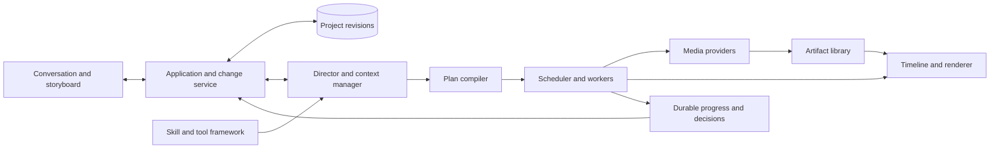
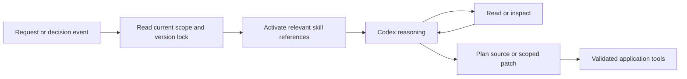
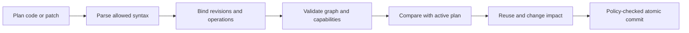
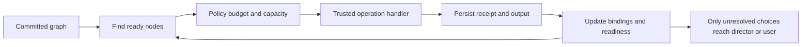

# OpenSlate — Component Design

**Version:** 0.2 · September 10, 2026
**Level:** architecture and execution logic. API fields, SQL tables, worker protocols, and implementation details are intentionally deferred.

Read the [overall design](README.md) first. The two focused companions cover [skills/tools](SKILLS-AND-TOOLS.md) and [execution/editing](EXECUTION-AND-EDITING.md).

## 1. Components and ownership

| Component | Owns | Produces |
|---|---|---|
| Application/change service | User actions, policy, revision conflicts, scoped change commits | Accepted project and plan revisions |
| Director/context manager | Intent, creative reasoning, relevant context, decision dialogue | Creative proposals and plan source/patches |
| Skill/tool framework | Discovery, compatibility, activation, authorization boundaries | Locked capabilities for each request/run |
| Plan compiler | Allowed plan syntax, operation validation, dependency analysis, graph diff | Validated execution graph and impact report |
| Scheduler/workers | Readiness, concurrency, receipts, budgets, restart recovery | Durable progress and usable outputs |
| Artifact/provider layer | Media requests, transfers, ingestion, provenance, capability differences | References and generated takes |
| Timeline/renderer | Edit resolution, media normalization, audio, captions, export | Editable timeline, previews, final video |
| Project/event store | Persistent revisions, execution state, decisions and lineage | Reconstructable state and reconnectable updates |

The browser, director, and CLI use the same application rules. None gets an alternate route around job admission or revision checks.

## 2. Director, context, skills, and tools

**Goal:** reason at useful decision points and carry context across requests without making the model the job runner.

**Algorithm:** resolve the selected scene/shot and current execution state; activate the pinned production and/or plan-authoring guidance; retrieve additional context only as needed; propose a plan or change; use tools to prepare and apply it; end the turn when work can proceed deterministically. Wake the director for a new user request, a failed creative constraint, or a required choice—not every provider poll.

The initial skills are `production` and `plan-authoring`. Production includes story, shot planning, basic continuity, asset selection, review, and edit guidance as small references. A skill does not own mutable project state or grant tool permissions. The [framework design](SKILLS-AND-TOOLS.md) defines how the same versions are activated after subsequent requests, compaction, or session recreation.

## 3. Creative planning and reference direction

**Goal:** turn narrative intent into feasible shots and reusable assets.

**Algorithm:** establish story beats and duration; define a minimal bible for recurring characters/locations; split scenes into provider-sized shots; record action, composition, timing, continuity requirements, and audio intent; reuse known references and request only missing assets; mark review gates where later expensive work depends on a creative choice.

For audio-led films, establish narration/music cues before visual coverage. Desired edit duration and requested generation duration are different: a take may include trim handles. V0 maps one generated shot to one provider clip; longer films come from editorial assembly.

| Function | Example | Required now? |
|---|---|---|
| Continuity direction | Shot 7 must preserve the red coat and left-hand suitcase from shot 6; a direct continuation may depend on shot 6's accepted frame | Basic guidance and dependency recording: yes. Separate specialist skill: no |
| Asset direction | Reuse the approved character portrait; create one station reference and a correctly composed keyframe for shot 7 | Basic reference planning: yes. Separate specialist skill: no |

Continuity requirements belong in project state, not only prose inside prompts. A semantic relationship can require review without requiring a generation-order dependency. Independent shots that share an approved character reference can execute in parallel.

## 4. Plan compiler and change service

**Goal:** convert code-authored intent into bounded executable work and small reviewable revisions.

**Algorithm:** accept source/patch plus its expected base revision; parse a restricted TypeScript planning language without executing arbitrary code; resolve operation and input references; reject unsupported operations, cycles, or invalid provider combinations; compare normalized node specifications; calculate affected work and estimates; commit the project patch, new plan revision, and admission intent together when authorized.

Recompiling a whole small graph is cheap. The compiler can do that after each edit while preserving unchanged nodes and results; the agent only needs to author the requested patch. The graph's stable logical IDs are distinct from its revision number and individual generation candidates.

Bind literal prompts/specs to the generation-relevant creative intent and bible constraints used to author them. An intent edit makes that provenance stale until the prompt is reauthored or explicitly reconfirmed; unchanged prompt text alone is insufficient for reuse. The compiler checks freshness without judging prose. Project-only discussion changes can be saved before plan code exists, but must hold affected active work if they invalidate its intent.

Plan validation has no media side effects. A valid plan is still subject to execution policy, budget, input availability, and review gates. The concrete code example and edit algorithm are in [Execution and Editing](EXECUTION-AND-EDITING.md).

## 5. Scheduler and durable operations

**Goal:** keep ready work moving with minimal model round trips.

**Algorithm:** select nodes whose required inputs and gates are satisfied; prioritize estimated critical-path work and first useful previews; admit them within provider limits and budget; dispatch directly to registered handlers; persist external receipts; poll/reconcile independently; ingest results; advance dependent nodes. Limit work in flight so upload, GPU, API, or render bottlenecks do not overwhelm each other.

Only four operation families are needed initially: image generation, video generation, timeline assembly, and rendering. Transfer, polling, and technical validation are trusted lifecycle steps inside those handlers. New operations later enter the same registry and compiler.

Recovery preserves completed nodes and known external jobs. A lost submission response is uncertain, not an instruction to generate again. Stable service-issued work identities prevent a replayed director request from duplicating admission. Unknown liability remains accounted for even if the user authorizes a replacement.

## 6. Assets and provider adapters

**Goal:** make imported/generated media durable and keep provider differences explicit.

**Algorithm:** resolve immutable input assets; validate their role and geometry; prepare a supported cloud transfer or local upload; submit through the job handler; save the receipt; retrieve output; verify bytes and media properties; publish the artifact and its provenance; create inexpensive review proxies.

Keep original references and takes immutable. Every derived crop/keyframe records its parents. In image-to-video, prepare keyframes at the intended composition before generation; final export cropping cannot repair an incorrectly composed source. A provider output URL is a temporary retrieval location, not the project archive.

Adapters report supported modes, input constraints, output properties, concurrency, and recovery/cancellation behavior. They do not silently drop required references or substitute another model. V0 uses polling and conservatively avoids H3's cancel/delete race; stop controls can always stop new dispatch. Provider-specific API details belong in adapter implementation notes and contract tests, rather than this architecture overview.

A later Python worker owns model residency and inference. TypeScript continues to compose cloud, local, or explicitly hybrid jobs. A local worker uses its own capability profile and transferable asset references rather than application-machine paths.

## 7. Timeline, review, and rendering

**Goal:** preserve editorial decisions while making previews and exports reproducible.

**Algorithm:** resolve accepted candidates into exact take references; place trims/cuts, audio, and captions against a declared time base; validate coverage and overlaps; normalize incompatible media; compile supported edit operations into trusted FFmpeg arguments; render a temporary output; validate it; then publish with a frozen manifest.

A working edit can describe pending replacements, but a render uses only a resolved snapshot with exact usable media. The last good preview stays available while replacements are being generated. Changing captions or narration reuses video takes; it may rebuild timing, audio, and rendering. Changing a generated action creates a new candidate only for the shots affected by that action.

Native shot audio is a mixed stream unless stems are actually available. Imported narration/music are the initial external tracks. Sampled images help visual review but cannot prove motion, lip sync, or dialogue accuracy; full playback remains available. Creative quality loops are bounded and remain visible to the user.

## 8. User intervention and project state

**Goal:** support editing during production without stale results overwriting the latest intent.

**Algorithm:** identify the requested scope; immediately hold new dispatch for that scope and its known potentially affected semantic and execution dependents; read the current revision; have the director explain and prepare the required atomic changes; recheck conflicts; commit a replacement plan revision; resume authorized affected work while unrelated branches continue.

Scope expansion blocks future dispatch; work already started before its relevance was discovered is handled as in-flight work. Committing a patch releases only its own edit hold, never an independent user pause or another edit.

A result is checked against its current logical node/candidate binding, not just the global project revision. Accepted provider work may finish even after an edit. Keep its take with its original lineage; it cannot automatically replace a newer candidate. A final preview/export assembled for an older target remains a historical output rather than becoming the current one.

The UI displays a small impact summary: what changes, what will be reused, what needs a choice, and the likely extra time/cost. It supports direct edits and conversation through the same change service. If a request is ambiguous, the agent asks about the affected scope while preserving everything else.

## 9. Invariants and first proof

- Skills, tool handlers, and compiled plans have pinned identities; updates do not silently change running work.
- Project state and the budget ledger remain outside direct agent write access.
- A logical patch commits atomically; external media production completes asynchronously and cannot be rolled back like a database transaction.
- Provider completion becomes usable media only after local ingestion succeeds.
- Review/authorization gates block only the work they govern.
- A user interrupt pauses automatic director turns until resume; dispatch controls and monitoring are separate.
- Reconnecting the UI or replacing the Codex session reconstructs current state rather than restarting production.

The first proof is a small fake-media graph with parallel branches, one review gate, a mid-run shot edit, and restart recovery. Add real providers after the compiler, framework, and edit semantics pass that test.
