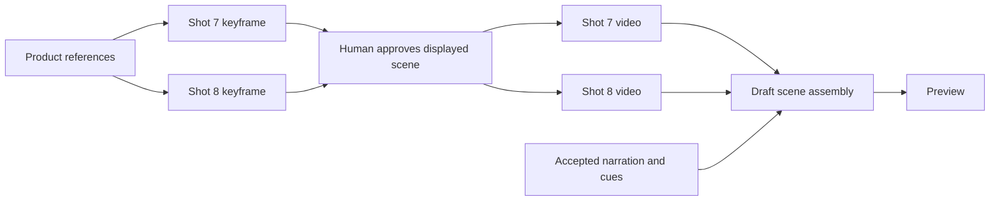

# OpenSlate — Execution Plans and Live Editing

**Version:** 0.3 · September 10, 2026
**Status:** proposed algorithms and illustrative plan syntax, not implemented APIs.

## 1. Code as the production plan

After clarifying the requested intent and reading current state, Codex writes a small TypeScript plan. It describes operations, input bindings, dependencies, and decision gates. OpenSlate compiles that source into a persistent directed acyclic graph (DAG), then trusted workers execute it.

The planning language accepts a bounded subset of TypeScript: literal parameters, named references, operation declarations, lists, and approved composition helpers. Parse and validate this subset; do not run model-written JavaScript using `eval`, arbitrary imports, filesystem access, network calls, or subprocesses. Compilation has no generation side effects. This is a declarative code format, not a general-purpose agent-written server program.

```ts
// Illustrative OpenSlate DSL, not a shipped API or general JS execution.
definePlan({ baseRevision: "r12" }, (p) => {
  const boots = p.asset("boots-reference@3");
  const narration = p.asset("accepted-narration@2");
  const shot7 = p.shot("shot-7@5");
  const shot8 = p.shot("shot-8@2");
  const frame7 = p.image("shot-7/keyframe", {
    intent: shot7, profile: "image/main@1", references: [boots],
    prompt: "Side view of the exact brown boot on a workshop bench",
  });
  const frame8 = p.image("shot-8/keyframe", {
    intent: shot8, profile: "image/main@1", references: [boots],
    prompt: "Close-up of the boot's stitching, matching the reference",
  });
  const review = p.humanReview("scene-2/storyboard", {
    shots: [
      { intent: shot7, keyframe: frame7, videoProfile: "video/main@1",
        motionPrompt: "Slow camera push toward the boot", seconds: 6 },
      { intent: shot8, keyframe: frame8, videoProfile: "video/main@1",
        motionPrompt: "Gentle sideways camera move along the stitching", seconds: 6 },
    ],
  });
  const take7 = p.video("shot-7/take", {
    intent: shot7, profile: "video/main@1",
    firstFrame: p.approvedImage(frame7, review),
    prompt: "Slow camera push toward the boot", seconds: 6,
  });
  const take8 = p.video("shot-8/take", {
    intent: shot8, profile: "video/main@1",
    firstFrame: p.approvedImage(frame8, review),
    prompt: "Gentle sideways camera move along the stitching", seconds: 6,
  });
  const edit = p.timeline("scene-2/draft", {
    takes: [take7, take8], narration, cueRange: "scene-2@4", transition: "cut",
  });
  return p.render("scene-2/preview", { timeline: edit });
});
```

The record IDs and versioned model profiles resolve to persisted project data. Here `image/main@1` might select GPT Image 2 and `video/main@1` H3 cloud; the compiler validates the actual profiles and supported durations. The example uses a previously accepted narration artifact and cue range. A prior plan phase may contain speech synthesis or transcription/alignment operations to produce them; compilation can be staged as decisions settle.

`p.shot` binds the intent used to author each prompt. `p.humanReview` declares an unresolved human gate; it does not grant permission. `p.approvedImage` is a symbolic dependency that becomes usable only after the review service records approval for that exact artifact and matching shot/video specification. The compiler compares the displayed motion/profile/duration with the video node and rejects mismatches. Gate conditions are also checked at dispatch. Whole-scene approval covers both images, and both videos can then run concurrently. Every video node must declare equivalent approved conditioning; compilation rejects source that omits it.

The user sees the scene summary, images, short intended-motion descriptions and duration, not this code. Detailed shot plans and code remain inspectable for debugging. Existing valid approval can be reused for an explicitly requested additional take with unchanged setup; changed keyframes or material shot specifications require renewed review.



Other approved scene batches can proceed independently. Review batches deliberately synchronize only their own shots; narrative order alone does not serialize production. The final draft can use technically valid takes without declaring them creatively accepted.

## 2. Compile and execute

### Compile algorithm

1. Read the expected project/plan revision and the locked operation catalog.
2. Parse allowed syntax and normalize it into nodes with stable logical IDs.
3. Bind immutable project inputs and symbolic references to future outputs; validate prompt/spec provenance against the current generation-relevant intent.
4. Validate required fields, unique IDs, references, cycles, provider modes, the configured 360-second final-timeline ceiling (after trims/overlaps), timing dependencies, and mandatory human keyframe gates; return useful diagnostics together. Speech/transcription/keyframe preparation can compile with explicit pending timing. Relevant video dispatch and resolved timeline assembly require accepted measured cues; final export verifies actual duration. Do not require the output of a preparation operation before its plan can compile.
5. Compare the candidate graph with the active graph and identify reuse, new work, obsolete work, and review requirements.
6. Produce a human-readable impact summary and a prepared change ID. Commit only when policy permits and the base revision still matches.

Store readable source and the normalized graph as one versioned artifact. The graph is the execution representation. Future edits can be small patch commands; the service can regenerate canonical source and recompile the whole graph without asking the LLM to rewrite unchanged content. An incremental compiler is unnecessary for the initial scale.

### Scheduling algorithm

1. Maintain a ready queue of nodes whose input artifacts, selection bindings, and gates are resolved.
2. Prioritize the estimated critical path and work that yields an early scene preview; use a simple ready queue until measurements justify more sophisticated priorities.
3. Transactionally check current node binding, exact human keyframe approval for video, applicable narration/timing readiness, holds, policy, cost allowance, and resource capacity before recording dispatch intent.
4. Execute the registered handler directly. Persist provider receipts and monitor completion outside the director turn.
5. Ingest and validate artifacts; resolve the node's outputs; update dependent readiness.
6. Emit UI progress continuously, but coalesce director wakeups into decisions, exceptions, or review batches.

References, generation, download, and rendering can overlap across independent branches. There is no default whole-film barrier requiring every scene's keyframes or every shot's video to finish before useful downstream work starts. A reviewed scene can advance while another remains held; a user can choose whole-storyboard review first. Optional scene previews operate on ready sections; the final render waits for its required complete timeline.

### Where speed comes from

| Technique | Benefit | Constraint |
|---|---|---|
| Plan a useful scope in one reasoning pass | Fewer model/tool round trips | Clarify material uncertainty first |
| Execute the graph in application code | No agent polling or per-shot dispatch loop | Every operation still passes admission checks |
| Parallel ready branches | Overlap API latency | Respect rate, concurrency, memory, and budget limits |
| Reuse accepted assets and deterministic derivatives | Avoid repeated generation and processing | Exact effective inputs must match |
| Coalesce reviews and automatic wakeups | Reduce conversation overhead | User requests preempt queued automation |
| Recompile/diff after a local edit | Preserve valid work | Meaningful dependency changes still propagate |

Do not generate speculative extra takes or run autonomous aesthetic-regeneration loops. Human quality feedback initiates creative changes; only eligible technical failures trigger automatic recovery within policy. Code execution reduces orchestration overhead; provider inference may still dominate wall time. Measure time to first useful preview, ready-to-dispatch delay, critical-path wait, edit turnaround, and extra generated seconds per edit.

## 3. Identity, dependencies, and reuse

Keep four identities separate:

| Identity | Example meaning |
|---|---|
| Logical node ID | The shot 7 generation slot, stable across revisions |
| Plan revision | One immutable version of source and graph |
| Candidate/attempt ID | One explicitly requested take and its execution attempts |
| Execution fingerprint | Effective inputs/settings used to decide whether work can be reused |

A changed global plan revision must not invalidate every node. A retry delivering the same intent is not a request for another take. “Generate another take” creates a distinct authorized candidate even when the prompt is identical. Admission bounds initial candidates to the authorized plan slots. Every additional or replacement creative candidate must link to a recorded user request/decision covering that scope; unused budget and a reusable keyframe approval are insufficient. Automatic replacement requires a trusted worker/provider technical-failure record and a remaining retry allowance. The model cannot invent that evidence or authorize a new candidate by labeling it a technical retry.

Maintain two kinds of relationship:

- **Semantic influence:** wardrobe, setting, narrative state, or audio intent affects what a shot should depict. A change may require review, prompt revision, or regeneration.
- **Execution dependency:** an operation needs an actual output/choice before it can run, such as an accepted keyframe or predecessor clip.

The director records semantic influence in structured project data; the compiler handles mechanical dependencies and impact. Semantic influence alone does not serialize shots. Scene order and scene membership are not execution dependencies.

Reuse is based on consumed fields and exact input bindings, not the entire bible/project revision. At compile time, downstream references can be symbolic. Finalize an execution fingerprint only when actual input artifact identities are resolved. Include the effective prompt, input roles/content, model/profile, settings, and relevant handler/transform behavior. Exclude transient signed URLs, UI labels, and unrelated project edits.

Literal prompts and operation specs also record the creative intent and referenced bible constraints they were authored against. If framing, appearance, or action changes, require reauthoring or explicit reconfirmation before dispatch or reuse, even when the old prompt string and media fingerprint match. V0 can conservatively bind the full generation-relevant intent snapshot; narrower field dependencies need validated contracts. The compiler checks freshness, not whether prose is artistically correct. Executable patches update intent, prompt/spec provenance, and graph bindings together.

A matching generated take is eligible for explicit reuse, not an instruction to suppress a deliberate new candidate. Deterministic thumbnails, normalized clips, and render intermediates can use ordinary content-based caching.

## 4. User changes during execution

```mermaid
sequenceDiagram
    participant U as User
    participant A as Application
    participant D as Director
    participant C as Compiler/change service
    participant W as Workers
    U->>A: Make shot 7 a close-up
    A->>A: Persist edit scope and hold affected dispatch
    A->>D: Current shot, relevant context, active jobs
    Note over W: Unrelated work continues
    D->>C: Prepare scoped creative and plan patch
    C->>C: Recompile, compare, calculate impact
    C-->>A: Reuse / replace / review / render changes
    A-->>U: Explain effect and request only needed choices
    A->>C: Apply under existing or updated authorization
    C->>C: Atomic revision and binding update
    C->>W: Release affected hold; resume ready work
```

### Edit algorithm

1. **Capture scope immediately.** V0 creative edits arrive through chat; use the selected review card, playback timestamp, or explicit shot IDs to identify their target; if the scope cannot be identified safely, pause new dispatch briefly at project scope and ask for clarification. Holds are persisted before lengthy planning begins and conservatively include known potentially affected semantic dependents and execution consumers. Unrelated known-safe work continues when the scope is known.
2. **Read current evidence.** Provide the director the target, relevant neighbors, consumed references, dependency summary, active candidates, and latest accepted decisions. The latest message changes that state; it does not replace the original objective.
3. **Prepare atomic changes.** The agent proposes the smallest meaningful set of changes: intent fields, reference bindings, operation parameters, selection policy, and editing consequences. Code calculates mechanical impact; the agent explains creative consequences and flags uncertain semantic relationships for review.
4. **Expand scope when necessary.** If a “shot-only” request also changes a continuity-dependent successor or a shared reference, extend the hold to block further dispatch. Newly discovered affected work might already have started; classify it under the in-flight rules and report that fact rather than promising retroactive prevention. Present the additional consequences. Do not automatically modify the global character reference for a local wardrobe change.
5. **Preview the patch.** Classify work as reuse, compatible in flight, regenerate, re-review, reassemble/re-render, or retire. Show estimated extra cost/time and accepted jobs that cannot be stopped. Ask only for unresolved choices or authorization beyond the current policy.
6. **Commit atomically.** Verify base revision, edit ownership, applicable holds, candidate bindings, policy, and budget. In one transaction, publish the new project/plan revision, preserve reusable bindings, retire obsolete unsent work, create authorized replacement intents, append events, and release/narrow only this edit's own hold. User pauses, other edits' holds, and unresolved gates still apply. External execution remains asynchronous.
7. **Resume from the graph.** Workers advance ready work directly. If another edit won the revision race, return its delta and rebase the proposed patch; do not silently merge conflicting creative changes.

Holds are visible, scoped controls. If the director crashes during an edit, leave the affected scope held with an actionable status. The user can resume the edit or discard it and resume the prior plan. An expired lease alone does not resume spending. After a successful patch, remaining required choices become explicit gates rather than forgotten editing holds. A replacement keyframe or materially changed motion/timing/profile invalidates affected approval; releasing the edit hold does not release that human review gate.

### Concrete edit examples

| Request | Typical atomic change set | What is preserved |
|---|---|---|
| “Make shot 7 a close-up” | Change framing; reuse references; replace its keyframe if needed; renew affected human review before video; re-review direct continuation; update edit/render bindings | Other independent shots and their running jobs |
| “Trim shot 7 by one second” | Change source trim; validate handles/overlaps; adjust downstream timeline placement or flag audio constraint; rebuild edit/render | All generated takes |
| “Make Maya's coat blue throughout” | Change appearance requirement; identify affected shots via semantic influence; prepare a reference variant and replacement candidates; re-review continuity | Shots unaffected by the visible wardrobe and all historical takes |
| “Use take 2 instead” | Change selection binding; validate dependent continuation and trim ranges; reassemble/re-render where needed | Existing take 2 and independent clips |

A framing edit might not require regeneration if an acceptable crop exists; the agent can offer that cheaper/faster alternative with the composition tradeoff. Broader consequences are explained, not hidden behind a “regenerate project” action.

## 5. Results arriving while the user edits

The decisive boundary is persisted dispatch intent. Before it, a hold or superseded binding prevents submission. After it, treat work as potentially sent, retain its liability, and keep monitoring even if the user changes the plan. V0 H3 remote cancellation remains conservative because its API combines queued cancellation and terminal record deletion. [H3 cancel/delete contract](https://platform.minimax.io/docs/api-reference/video-generation-v2-delete)

Ingest outputs regardless of whether they are still selected. Attach a result to current work only if its logical node, candidate, and effective input binding still match. An unrelated project edit does not make it stale; an incompatible replacement does. Serialize binding updates against patch commits so late results cannot overwrite the latest intent.

Keep the last good timeline/preview while a working revision waits for replacement media. Render from a frozen, fully resolved timeline, never “latest take for each shot.” A late render for a superseded target is retained as history and cannot silently become the current preview.

Media effects cannot be rolled back transactionally. Undo creates a new project revision that reuses eligible earlier assets; it does not undo provider billing. Unknown submissions retain their uncertainty and allowance even when a replacement is approved.

## 6. Decision and execution controls

“Interrupt the director,” “pause dispatch,” and “edit this shot” are different controls. Persist director automation pause until explicit resume so a job event cannot immediately restart an interrupted conversation. A scoped edit holds only affected work; monitoring accepted jobs continues. Agent-issued resume and patch completion cannot clear a user pause or another edit's hold without the corresponding authorization; dispatch requires every applicable control to permit it. User requests take precedence over queued automatic review turns, with one active director turn per project to avoid competing proposals.

Discussion-only requests can save decisions and a non-executing proposal. Applying a creative change can be already authorized under the standing policy; it does not require repeatedly asking the user to approve harmless edits. Paid work or expanded scope beyond that policy produces a focused decision request. The director guides the user through choices while the application enforces the boundary. General budget permission does not waive human keyframe review. Structured review replies or chat approvals must identify the presented review snapshot; ambiguous or stale approval is clarified instead of releasing unseen changed work.

## 7. Technical recovery versus creative regeneration

| Outcome | Default behavior |
|---|---|
| Poll/download temporarily fails | Retry monitoring or retrieval with backoff; preserve the accepted generation job |
| Submission definitely rejected transiently | Retry only within bounded policy; keep service-owned intent and deduplication identity |
| Generation definitively failed technically | Allow a recorded replacement attempt only within retry and spending policy; preserve attempt lineage and charges |
| Submission outcome unknown | Keep liability and reconcile; do not start another job just because of a timeout |
| Invalid parameters or policy refusal | Surface a fix/choice; no automatic prompt rewrite or retry loop |
| Technically valid media looks wrong | Show it for review; user requests whether and how to change it |

Provider errors and creative dissatisfaction are separate result categories. Technical retries preserve approved creative inputs; a change to those inputs follows the edit/review protocol. Upload/transcription/speech jobs follow the same durable admission and recovery principles as image/video jobs. A successful API response is not sufficient until its output is locally usable.

## 8. First acceptance scenario

Using fake asynchronous operations, start two independent scene batches. Approve one set of keyframes, hold the other for human review, and allow only the approved scene's videos to advance. Edit the first shot while a task is in flight. Confirm that the old result is preserved without replacing the new candidate, unchanged work is reused, the current preview points to the latest resolved edit, and restarting the director/worker does not duplicate submission. Then repeat a bounded version with real providers.
