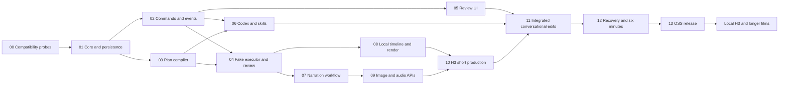

# OpenSlate — Development Plan

**Version:** 0.4 · September 10, 2026
**Status:** detailed design complete for review; production features remain unimplemented. The existing repository provides the web/API skeleton and build/typecheck CI.

This plan follows the [detailed component designs](../technical/README.md). The [architecture overview](README.md) remains the product direction; the [Codex development workflow](../development/CODEX-WORKFLOW.md) describes how to implement these slices with GPT-6.

## 1. Confirmed release scope

Single-user local application; user-configured model/credential profiles; up to 360 seconds of resolved output; uploaded or conversationally developed/generated narration; scene/shot plans and debug records; human-reviewed conditioning keyframes for every video shot; user-directed creative regeneration; bounded technical recovery; conversational creative edits and visual review/playback. Initial production integrations are Codex, GPT Image 2, H3 cloud and selected speech/transcription profiles. Python H3 workers, ten/thirty-minute releases and a direct timeline editor follow later.

Two production skills, five agent tools and six worker operation families are sufficient. Development skills/plugins are separate and are not dependencies of the embedded director. No implementation slice should quietly expand this product scope.

## 2. Delivery sequence and dependencies

After shared contracts settle, UI fixture work, Codex integration and compiler/executor work can overlap with disjoint file ownership. Integrate one coherent behavior at a time. Each task below may contain several small PRs; a PR should have an independently reviewable outcome, not merely create empty modules.

## 3. T00–T04: prove the foundation before real generation

### T00 — Compatibility and toolchain probes

**Dependencies:** current skeleton. **Homes:** disposable/test fixtures initially; finalized adapters in their existing packages.

Verify Node 24 with the selected SQLite driver, Babel's TypeScript parser, the proposed JSON Schema validation path, and the installed FFmpeg feature set. Against a pinned Codex release, exercise process initialization, session resume, tool catalog, skill injection, input replies and interruption. Prove the fenced bridge/authorization epoch mechanism before trusting media tools. Record exact versions and observed capabilities; do not assume TypeScript 7 exposes the historical JavaScript compiler API.

**Exit evidence:** reproducible fixture scripts/results and a small compatibility matrix. Missing account/provider access remains a named gate. No paid media calls are needed; any live LLM smoke check uses an explicitly configured test allowance. Probes do not bypass the remaining product implementation.

### T01 — Shared contracts, identities and persistence

**Dependencies:** T00. **Homes:** `packages/core/contracts`; server persistence/migrations.

Implement IDs/revisions, money/time types, project heads and initial manifests, command idempotency, grant slots, project events, holds and migration infrastructure. Add job/review families only as T03/T04 consumers land. Establish short transactions, project ownership checks, local data layout and artifact metadata foundations.

**Exit evidence:** migration round-trip, two-connection transaction tests, duplicate command behavior, immutable purpose-bound slot consumption, and backup/restore of a minimal project. A recreated logical node cannot reuse a consumed slot.

**Design:** [Data and persistence](../technical/DATA-PERSISTENCE.md).

### T02 — Application commands, conversation records and event feed

**Dependencies:** T01. **Homes:** server application/http/events.

Build project snapshots, persisted user requests, trusted actor/authority context, prepare/apply command infrastructure, controls, strict schema errors and snapshot/SSE reconnect. Add local session/origin protections and environment credential references. Keep typed key saving unavailable until a secure backend is implemented.

**Exit evidence:** idempotent command retry, revision conflict, hold ownership, negative/ambiguous review reply rejection, old authorization epoch rejection and reconnect with deliberately lagging projections. Tests verify canonical state and events together.

**Design:** [Application API](../technical/APPLICATION-API.md).

### T03 — Restricted plan compiler and exact review requirements

**Dependencies:** T01; integrate with T02 when available. **Homes:** core planning modules and server preparation handler.

Implement the bounded parser, symbol-to-service-ID mapping, typed operation descriptors, source/destination roles and ordering, normalized graph, canonical source, prompt provenance, human-review descriptors and typed patches. Support pending narration timing and the six-minute final-timeline constraint. No provider calls or financial reservation in compilation.

**Exit evidence:** a two-shot fake plan compiles; omitted/mismatching review gates fail; malicious/nested unsupported syntax fails; source round-trips semantically; cycles and incompatible roles fail; cue placement-only changes preserve video fingerprints; changed creative intent cannot reuse stale prompts.

**Design:** [Plan compiler](../technical/PLAN-COMPILER.md).

### T04 — Durable fake execution and human approval

**Dependencies:** T02 + T03. **Homes:** server executor/worker and review services.

Implement readiness, leases/fences, origin checks, exact approval equality, reservations, attempt phases, trusted technical retries and fake provider outcomes. Build an approval endpoint that can release exact scene members. Use controlled fake-provider barriers to exercise submission and completion races.

**Exit evidence:** two independent scene branches overlap; unapproved videos never submit; technical retry retains a candidate while user-directed replacement creates a new one; unknown submission never silently repeats; a shot edit preserves unaffected work; user pause survives patch completion. This is the first executable production-engine proof, using API/test clients if UI is not yet ready.

**Design:** [Execution engine](../technical/EXECUTION-ENGINE.md), [providers/artifacts](../technical/PROVIDERS-ARTIFACTS.md).

## 4. T05–T08: complete the fake/local product path

### T05 — Conversation and visual review workspace

**Dependencies:** T02 contracts; fixture development can overlap T03/T04. **Homes:** `apps/web`.

Build conversation, narration readiness, concise scene plan, scene-grouped storyboard, member approval, shot-linked playback/chat, decision tray, progress and pause controls. Use fake media and persistent server snapshots. Detailed plans are read-only debug views. Do not build drag/drop timeline editing.

**Exit evidence:** browser flows for displayed subset approval, stale member refresh, conditional/negative replies, selected-shot conversation, previous-preview visibility and reconnect without restarting work. Keyboard review and bounded thumbnail loading work.

**Design:** [Review UI](../technical/REVIEW-UI.md).

### T06 — Codex director, skill lifecycle and five tools

**Dependencies:** T02 + T03, informed by T00. **Homes:** `packages/director`, server supervisor and application tool handlers; two `skills/` packages.

Implement scoped context, immutable catalog/locks, the production and plan-authoring skills, fixed MCP catalog, request/activation records, director queue, pending replies and process/bridge authority fencing. Add fake second-runtime fixtures and incompatible profile/skill cases. Reconstruct project state after replacing a runtime session.

**Exit evidence:** a follow-up request preserves settled intent and locked skill content, produces a valid scoped plan, and cannot fabricate human approval or technical-retry authority. Interrupt/unknown-turn recovery preserves previous command effects. Measure process restart/resume overhead before optimizing the safe epoch boundary.

**Design:** [Director runtime](../technical/DIRECTOR-RUNTIME.md), [skills/tools](../technical/SKILLS-TOOLS.md).

### T07 — Narration readiness, source choices and cue propagation

**Dependencies:** T04; conversation integration uses T05/T06. **Homes:** core narration, production references and fake audio adapters.

Support absent/notes/draft/approved script independently of absent/partial/accepted audio; source choices and gaps; immutable script/audio segments; timing extraction and cue revisions; acceptance and scoped edits. Initial tests use fixtures/fake speech; user-uploaded recordings can already exercise real local media probing.

**Exit evidence:** complete upload, notes-to-script, partial audio and mixed-source cases progress without restarting the conversation. Text edits cannot falsely mutate recorded audio. A longer earlier sentence shifts later placements while preserving compatible video; changed duration/meaning renews affected review.

**Design:** [Narration](../technical/NARRATION.md).

### T08 — Local artifacts, timeline and rendering

**Dependencies:** T04; audio fixtures from T07 where needed. **Homes:** server artifact/media workers and core edit domain.

Implement durable artifact installation and quarantine, normalized derivatives, exact take/audio resolution, integer frames/samples, simple cuts, imported music/captions/overlays, frozen manifests and FFmpeg rendering. Start with supplied media. Server completion projection chooses draft selections and conditionally promotes previews.

**Exit evidence:** supplied clips render into a complete commercial; real frame/audio assertions pass; an old render cannot overwrite a new target; disk/cancel/crash recovery preserves inputs; scene previews and narration-only edits reuse media. Process-kill tests and documented filesystem synchronization guarantees are distinguished.

**Design:** [Providers/artifacts](../technical/PROVIDERS-ARTIFACTS.md), [timeline/rendering](../technical/TIMELINE-RENDERING.md).

## 5. T09–T13: connect real APIs and validate the release

| Task | Dependencies | Build | Exit evidence |
|---|---|---|---|
| **T09 — Image and audio adapters** | T06–T08 | GPT Image 2, selected speech/transcription profiles, actual input transport, output ingestion and price/capability records | Bounded live fixtures; conditioning normalized before review; timing support verified per model; no hidden SDK submit retries |
| **T10 — H3 short production** | T04, T08, T09 | H3 cloud adapter and 30–60-second full sequence | Every clip uses exact reviewed image; receipts/unknown states retained; no cancellation/delete race; playable export and one user-requested replacement |
| **T11 — Integrated conversational revisions** | T05–T10 | End-to-end narration/story/frame/take/trim edits, impact summaries, renewed gates and old-preview retention | Mid-run edit, take reuse, project-only stale-plan hold, delayed old result, same-setup new take, no unauthorized quality regeneration |
| **T12 — Recovery and six-minute acceptance** | T11 | Recovery hardening, 150-second boots example, six-minute workload, diagnostics/performance tuning | Restart at every effect boundary; exact cue/video/export timing; bounded memory/disk/review load; measured latency/cost/reuse and no duplicate simulated accepts |
| **T13 — Open-source release packaging** | T12 | Production local launcher/assets, supported credential backend, clean install, migrations/export/import, examples and contributor docs | Fake demo without keys, cloud setup with own keys, documented OS/runtime matrix, restore starts paused, CI and release criteria pass |

Real tests use explicit allowance and the user's configured credentials. A live test failure can alter an integration choice, but does not authorize switching models, opening public tunnels or increasing budget silently. The fake path stays available to contributors throughout.

## 6. Later extensions

**Local H3 worker:** after the provider boundary works, add an authenticated versioned Python job API, weights/capability reporting, warm inference, GPU admission, durable receipts and transferable artifacts. Keep SQLite, human approval, budgeting and hybrid-stage composition in TypeScript. Validate cloud/local feature differences independently.

**Ten and thirty minutes:** raise duration only with separate 600/1,800-second acceptance fixtures and measured context/review/queue/storage/render behavior. Reuse scene summaries, cue revisions and paged review; do not feed the whole film into every director request.

**Direct timeline editor:** reuse the existing typed change/selection services. Add UI editing after conversational behavior and conflict handling are proven.

## 7. Review and implementation rules

For each task create a bounded implementation brief that references the relevant documents, files, behavior and exit tests. Implement one vertical slice, run the appropriate checks, request an independent diff review, resolve actionable findings and record evidence. Use native Codex/GPT-6 initially; a full workflow plugin is optional and should be evaluated against repeated actual problems.

Shared schema/identity changes have one integration owner. Agents can author disjoint adapters, fixtures or reviews after interfaces settle; they must not independently change core grant/revision/error semantics. Any contract revision updates the relevant design and tests in the same PR.

Current `pnpm check` builds and typechecks. Add meaningful test commands when their harness lands; do not report nonexistent suites as passing. Every task remains pending until its exit evidence exists. Documentation review is not a completed runtime compatibility, provider-access or six-minute quality test.

## 8. Decisions still resolved by implementation evidence

The selected direction is firm. Remaining probes choose exact dependency versions, supported OS/keychain packaging, pinned Codex compatibility, precise provider limits/access/pricing, useful speech/transcription profiles, and measured performance thresholds. Native turn steering of authority-changing requests is deferred until attribution/fencing can be proven. The conservative v0 process boundary is explicit, measurable and replaceable behind the adapter.
