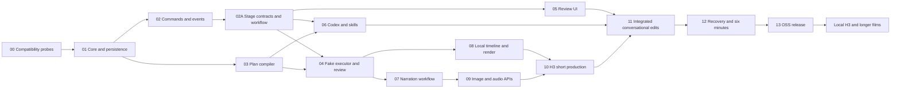

# OpenSlate — Development Plan

**Version:** 0.19 · September 12, 2026
**Status:** Local native setup, conversation/review, canonical narration, owned uploads and local rendering are integrated. A six-minute synthetic render, a 60-shot fake workflow with scoped reuse/restart, and a native question-answer continuation passed. The single-process launcher has exclusive local installation ownership. Opt-in image/H3 execution, human spending/budget review, exact PNG ingestion, recoverable video normalization and automatic real local assembly are integrated. The full injected-provider-to-render path and no-key built browser setup passed. The complete checkout passes 842 tests. Default generation remains fake; live media validation is pending. See [current implementation status](../implementation/STATUS.md) for limits and remaining work.

This plan follows the [detailed component designs](../technical/README.md). The [architecture overview](README.md) remains the product direction.

## 1. Confirmed release scope

Single-user, single-machine local application; user-configured model/credential profiles; up to 360 seconds of resolved output; uploaded or conversationally developed/generated narration; scene/shot plans and debug records; human-reviewed conditioning keyframes for every video shot; user-directed creative regeneration; bounded technical recovery; conversational creative edits and visual review/playback. Initial production integrations are Codex, GPT Image 2, H3 cloud and selected speech/transcription profiles. Same-machine Python H3 inference, ten/thirty-minute releases and a direct timeline editor follow later. V0 keeps the app, SQLite, media, workers and native Codex on one computer. Cloud providers remain external services; local deployment does not mean offline generation. Multi-host applications, remote GPU workers, distributed scheduling and shared-database deployment are outside v0.

Two production skills and six worker operation families remain the initial structure. Tool contract V1 retains five tools; V2 adds one draft-only narration tool while removing direct canonical narration writes. Each request pins an exact immutable catalog. Development skills/plugins are separate and are not dependencies of the embedded director. No implementation slice should quietly expand this product scope.

The AI proposes useful stages and missing information from user input; the application enforces registered contracts, current evidence and critical boundaries. Add one adaptable narrated-video recipe, with scope-specific progress and reusable outputs. Logical stages need not be separate model calls. T02A below introduces this workflow service before director integration; existing task IDs are preserved.

## 2. Delivery sequence and dependencies

```mermaid
flowchart LR
    T00[00 Compatibility probes] --> T01[01 Core and persistence]
    T01 --> T02[02 Commands and events]
    T01 --> T03[03 Plan compiler]
    T02 --> T02A[02A Stage contracts and workflow]
    T02A --> T04[04 Fake executor and review]
    T03 --> T04
    T02A --> T05[05 Review UI]
    T02A --> T06[06 Codex and skills]
    T03 --> T06
    T04 --> T07[07 Narration workflow]
    T04 --> T08[08 Local timeline and render]
    T05 --> T11[11 Integrated conversational edits]
    T06 --> T11
    T07 --> T09[09 Image and audio APIs]
    T08 --> T10[10 H3 short production]
    T09 --> T10
    T10 --> T11
    T11 --> T12[12 Recovery and six minutes]
    T12 --> T13[13 OSS release]
    T13 --> Later[Local H3 and longer films]
```

After shared contracts settle, UI fixture work, Codex integration and compiler/executor work can overlap with disjoint file ownership. Integrate one coherent behavior at a time. Each task below may contain several small PRs; a PR should have an independently reviewable outcome, not merely create empty modules.

## 3. T00–T04: prove the foundation before real generation

### T00 — Compatibility and toolchain probes

**Dependencies:** current skeleton. **Homes:** disposable/test fixtures initially; finalized adapters in their existing packages.

Verify Node 24 with the selected SQLite driver, Babel's TypeScript parser, the proposed JSON Schema validation path, and the installed FFmpeg feature set. Against a pinned Codex release, exercise process initialization, session resume, tool catalog, skill injection, input replies and interruption. Prove the fenced bridge/authorization epoch mechanism before trusting media tools. Record exact versions and observed capabilities; do not assume TypeScript 7 exposes the historical JavaScript compiler API.

**Exit evidence:** reproducible fixture scripts/results and a small compatibility matrix. Missing account/provider access remains a named gate. No paid media calls are needed; any live LLM smoke check uses an explicitly configured test allowance. Probes do not bypass the remaining product implementation.

### T01 — Shared contracts, identities and persistence

**Dependencies:** T00. **Homes:** `packages/core/contracts`; server persistence/migrations.

Implement IDs/revisions, money/time types, project heads and initial manifests, command idempotency, grant slots, project events, holds and migration infrastructure. Add job/review families only as T03/T04 consumers land. Establish short transactions, project ownership checks, local data layout and artifact metadata foundations.

**Exit evidence:** migration round-trip, two-connection transaction tests, duplicate command behavior, immutable purpose-bound slot consumption, and backup/restore of a minimal project. A recreated logical node cannot reuse a consumed slot.

**Design:** [Data and persistence](../technical/DATA-PERSISTENCE.md).

### T02 — Application commands, conversation records and event feed

**Dependencies:** T01. **Homes:** server application/http/events.

Build project snapshots, persisted user requests, trusted actor/authority context, prepare/apply command infrastructure, controls, strict schema errors and snapshot/SSE reconnect. Add local session/origin protections and environment credential references. Keep typed key saving unavailable until a secure backend is implemented.

**Exit evidence:** idempotent command retry, revision conflict, hold ownership, negative/ambiguous review reply rejection, old authorization epoch rejection and reconnect with deliberately lagging projections. Tests verify canonical state and events together.

**Design:** [Application API](../technical/APPLICATION-API.md).

### T02A — Production workflow and stage contracts

**Dependencies:** T02; integrate media-plan preparation with T03 when available. **Homes:** core workflow schemas/predicates, server workflow service, existing application changes/events.

Implement the narrated-video stage registry, typed stage proposals/outputs, scoped stage records, separate binding/progress versions and missing-requirement projections. Derive mandatory contracts from the actual creative/plan diff for every prepare variant. Add workflow context and proposals through the existing five tools; use fake director outputs initially. Support supplied material, provisional drafts, pending questions, batched stages and scoped revision paths without a global stage cursor.

**Exit evidence:** complete-upload versus notes-only paths; a mislabeled intake proposal cannot bypass shot/video checks; AI completion cannot grant approval; compatible completion during preparation does not force another model call; stale material bindings fail; repeated no-progress assessments stop; a same-input user-requested take remains a new authorized candidate. Restart preserves stage provenance and pending decisions.

**Design:** [Production workflow](../technical/PRODUCTION-WORKFLOW.md), [application API](../technical/APPLICATION-API.md).

### T03 — Restricted plan compiler and exact review requirements

**Dependencies:** T01; integrate with T02 when available. **Homes:** core planning modules and server preparation handler.

Implement the bounded parser, symbol-to-service-ID mapping, typed operation descriptors, source/destination roles and ordering, normalized graph, canonical source, prompt provenance, human-review descriptors and typed patches. Support pending narration timing and the six-minute final-timeline constraint. No provider calls or financial reservation in compilation.

Integrate normalized mutation footprints and prepared stage bindings with T02A. Story/scene/shot task execution stays in the workflow/director layers; do not add arbitrary LLM calls or executable workflow code to the planning DSL.

**Exit evidence:** a two-shot fake plan compiles; omitted/mismatching review gates fail; malicious/nested unsupported syntax fails; source round-trips semantically; cycles and incompatible roles fail; cue placement-only changes preserve video fingerprints; changed creative intent cannot reuse stale prompts.

**Design:** [Plan compiler](../technical/PLAN-COMPILER.md).

### T04 — Durable fake execution and human approval

**Dependencies:** T02A + T03. **Homes:** server executor/worker and review services.

Implement readiness, leases/fences, origin checks, exact approval equality, reservations, attempt phases, trusted technical retries and fake provider outcomes. Build an approval endpoint that can release exact scene members. Use controlled fake-provider barriers to exercise submission and completion races.

**Exit evidence:** two independent scene branches overlap; unapproved videos never submit; technical retry retains a candidate while user-directed replacement creates a new one; unknown submission never silently repeats; a shot edit preserves unaffected work; user pause survives patch completion. This is the first executable production-engine proof, using API/test clients if UI is not yet ready.

**Design:** [Execution engine](../technical/EXECUTION-ENGINE.md), [providers/artifacts](../technical/PROVIDERS-ARTIFACTS.md).

## 4. T05–T08: complete the fake/local product path

### T05 — Conversation and visual review workspace

**Dependencies:** T02/T02A contracts; fixture development can overlap T03/T04. **Homes:** `apps/web`.

Build conversation, narration readiness, concise scene plan, scene-grouped storyboard, member approval, shot-linked playback/chat, decision tray, progress and pause controls. Use fake media and persistent server snapshots. Detailed plans are read-only debug views. Do not build drag/drop timeline editing.

Show scope-specific stage readiness and proposed next work; distinguish hard blockers, advisory creative gaps, valid drafts and human acceptance. Existing uploads can enter the relevant review/preparation path without a forced wizard.

**Exit evidence:** browser flows for displayed subset approval, stale member refresh, conditional/negative replies, selected-shot conversation, previous-preview visibility and reconnect without restarting work. Keyboard review and bounded thumbnail loading work.

**Implemented slice:** Persistent conversations, per-project native setup, exact storyboard approval, authenticated playback, scoped demo edits and pause/resume. Browser narration now supports drafts, supplied recordings, exact acceptance and canonical review/apply; clip import and render controls use owned media routes. The browser decoded real synthetic audio/video. The automation file picker remains unverified after stalls; uploads were checked through HTTP. Broader accessibility and live production remain open.

**Design:** [Review UI](../technical/REVIEW-UI.md).

### T06 — Codex director, skill lifecycle and versioned tools

**Dependencies:** T02A + T03, informed by T00. **Homes:** `packages/director`, server supervisor and application tool handlers; two `skills/` packages.

Implement scoped context, immutable catalog/locks, the production and plan-authoring skills, fixed MCP catalog, request/activation records, director queue, pending replies and process/bridge authority fencing. Add fake second-runtime fixtures and incompatible profile/skill cases. Reconstruct project state after replacing a runtime session.

Add stage/gap assessment and focused task-prompt references, pinned with recipe/check/schema identities. Permit assessment plus related creative outputs in one turn and stop repeated reassessment without progress. Use `LocalCodexPolicy` with mode `local` and exact pinned version/configuration identity. Trust the installed runtime/sandbox; retain effective permissions/catalog checks, loopback MCP, epoch fencing and application authorization. Do not add a separate externally confined mode or make independent code-host/auth isolation a v0 prerequisite. Keep one active director turn per project on this machine; measure model calls/tokens and useful-output latency instead of assuming more stages are faster.

**Exit evidence:** a follow-up request preserves settled intent and locked skill content, produces a valid scoped plan, and cannot fabricate human approval or technical-retry authority. Interrupt/unknown-turn recovery preserves previous command effects. Measure process restart/resume overhead before optimizing the safe epoch boundary.

**September 11 progress:** instruction packages, exact locks, fresh context, five-tool bridge and durable receipts now feed a supervisor with persistent turn queue/leases, stale-epoch fencing, unknown-outcome reconciliation and question continuation. The runtime-neutral port has a scripted implementation and a pinned Codex adapter with bounded transport, exact effective permissions/catalog validation and process shutdown. The default app uses the scripted runtime. Current application requests use fresh native threads; native resume has adapter-fixture coverage only. See [implementation](../implementation/CONVERSATION-WORKSPACE.md).

**Earlier skill validation:** the [three-start allowance](../implementation/CODEX-NEXT-VALIDATION.md) is consumed. Both scoped edits passed with explicit native skill inputs and 13 durable successful tool calls. Command sandbox canaries passed; the final model declined the code-host script, so that boundary remains inconclusive. See [full evidence and timings](../implementation/CODEX-SKILL-VALIDATION.md).

**September 12 diagnostic:** corrected comparison of Codex's explicit null defaults without admitting extra permissions; the pre-decision runtime suite reached 35 tests. A separate NativeClient fixture passed command canaries, but its live model declined the code-host script. That first start left independent isolation inconclusive; the experiment initially paused with two starts unused.

**Accepted-policy verification:** the complete suite now passes 291 tests, including 36 runtime tests and a regression rejecting a non-loopback bridge before launch. This adds to the historical 290-test pre-decision baseline.

**Native supervisor result:** under the [accepted local policy](../implementation/RUNTIME-TRUST-DECISION.md), both remaining starts passed using the actual adapter, `DirectorSupervisor` and `createDirectorInput`. A conversational framing question was saved; after restarting the backend over the same SQLite database, the answer applied a shot-1 edit and matching plan while preserving shot 2, narration, story, motion and timing. The same skill lock was reactivated under a fresh epoch; the old bridge returned 403. No media attempts, artifacts, approvals or media API calls were created. This was not a native structured pending-input test. See [evidence](../implementation/CODEX-SUPERVISOR-VALIDATION.md).

**Current follow-through:** Per-project native setup and two browser turns passed, including restart and brief-only editing. Two later capability turns brought the historical total to sixteen: the enabled pinned question feature emitted a persisted native question and the model correctly described a supplied PNG. Versioned structured narration writes and explicit project guidance upgrades are now implemented; production image attachment and broader stage/gap evaluation remain next. A subsequent question continuation and an actual V2 narration read/write/read passed, bringing the historical native-start count to 18. Further bounded live Codex tests are preapproved; historical experiment caps do not block a new recorded allowance. See [native capability evidence](../implementation/CODEX-CAPABILITY-VALIDATION.md).

**Design:** [Director runtime](../technical/DIRECTOR-RUNTIME.md), [skills/tools](../technical/SKILLS-TOOLS.md).

### T07 — Narration readiness, source choices and cue propagation

**Dependencies:** T04; conversation integration uses T05/T06. **Homes:** core narration, production references and fake audio adapters.

Support absent/notes/draft/approved script independently of absent/partial/accepted audio; source choices and gaps; immutable script/audio segments; timing extraction and cue revisions; acceptance and scoped edits. Initial tests use fixtures/fake speech; user-uploaded recordings can already exercise real local media probing.

Expose actual narration readiness to the workflow service; do not duplicate it with an AI-writable completed-stage flag. Validate that provisional storyboard work can proceed while affected video dispatch waits for measured timing.

**Exit evidence:** complete upload, notes-to-script, partial audio and mixed-source cases progress without restarting the conversation. Text edits cannot falsely mutate recorded audio. A longer earlier sentence shifts later placements while preserving compatible video; changed duration/meaning renews affected review.

**Implemented slice:** Immutable script/audio/cue revisions, partial/mixed source readiness, normalization and exact human acceptance now feed a guarded canonical commit with scoped shot impact. Authenticated session/upload/review routes and the browser panel are integrated. Commit keeps holds until a matching plan applies; user-declared generated audio is not internal generation provenance. Versioned conversational draft writes now preserve independent human acceptance; ASR/TTS and transcript alignment remain next. Source recordings are capped at 360 seconds. See [narration integration](../implementation/NARRATION-INTEGRATION.md).

**Design:** [Narration](../technical/NARRATION.md).

### T08 — Local artifacts, timeline and rendering

**Dependencies:** T04; audio fixtures from T07 where needed. **Homes:** server artifact/media workers and core edit domain.

Implement durable artifact installation and quarantine, normalized derivatives, exact take/audio resolution, integer frames/samples, simple cuts, imported music/captions/overlays, frozen manifests and FFmpeg rendering. Start with supplied media. Server completion projection chooses draft selections and conditionally promotes previews.

**Exit evidence:** supplied clips render into a complete commercial; real frame/audio assertions pass; an old render cannot overwrite a new target; disk/cancel/crash recovery preserves inputs; scene previews and narration-only edits reuse media. Process-kill tests and documented filesystem synchronization guarantees are distinguished.

**Implemented slice:** Owned local imports and canonical timeline resolution now feed frozen renders, durable receipts and guarded preview publication through HTTP/browser controls. Physical durations are checked; fixture bytes cannot masquerade as real takes. A 360-second 720p synthetic render with 64 cuts/64 cues passed all decoded checks in 34.2 seconds with about 801 MiB sampled peak RSS. This is local media-layer evidence, not generated-film acceptance. Next: broader integrated edits/recovery, captions/overlays/transitions and portable export. See [media integration](../implementation/MEDIA-INTEGRATION.md).

**Design:** [Providers/artifacts](../technical/PROVIDERS-ARTIFACTS.md), [timeline/rendering](../technical/TIMELINE-RENDERING.md).

## 5. T09–T13: connect real APIs and validate the release

| Task | Dependencies | Build | Exit evidence |
|---|---|---|---|
| **T09 — Image and audio adapters** | T06–T08 | GPT Image 2, selected speech/transcription profiles, actual input transport, output ingestion and price/capability records | Bounded live fixtures; conditioning normalized before review; timing support verified per model; no hidden SDK submit retries |
| **T10 — H3 short production** | T04, T08, T09 | H3 cloud adapter and 30–60-second full sequence | Every clip uses exact reviewed image; receipts/unknown states retained; no cancellation/delete race; playable export and one user-requested replacement |
| **T11 — Integrated conversational revisions** | T05–T10 | End-to-end narration/story/frame/take/trim edits, impact summaries, renewed gates and old-preview retention | Mid-run edit, take reuse, project-only stale-plan hold, delayed old result, same-setup new take, no unauthorized quality regeneration |
| **T12 — Recovery and six-minute acceptance** | T11 | Recovery hardening, 150-second boots example, six-minute workload, diagnostics/performance tuning | Restart at every effect boundary; exact cue/video/export timing; bounded memory/disk/review load; measured latency/cost/reuse and no duplicate simulated accepts |
| **T13 — Open-source release packaging** | T12 | Production local launcher/assets, supported credential backend, clean install, migrations/export/import, examples and contributor docs | Fake demo without keys, cloud setup with own keys, documented OS/runtime matrix, restore starts paused, CI and release criteria pass |

Real tests use explicit allowance and the user's configured credentials. A live test failure can alter an integration choice, but does not authorize switching models, opening public tunnels or increasing budget silently. The fake path stays available to contributors throughout.

### Current integration order

The GPT Image 2 and MiniMax H3 transports have offline protocol/fault tests. Engine uses an immutable adapter registry, preserves historical fake/v1 requests, pins profiles into attempts, renews provider-call leases and defaults external admission to denied. The image bridge validates exact owned PNG inputs, persists one dispatch marker before POST, saves redacted output/usage evidence and recovers owned bytes without resubmitting. Video derivation preserves raw output identity separately from measured normalized footage and recovers completed local work before transcoding again. The launcher now composes these components behind explicit per-provider enablement, credential readiness and exact human spending allowances.

H3 application mapping, exact reviewed first-frame transfer, durable polling cooldown and protected download/normalization pass offline restart/fault tests. Human allowances pin exact candidates and full profiles; admission atomically consumes start and configured-estimate caps. The browser saves installed model choices and displays backend credential readiness and project compatibility. The integrated Engine now automatically produces a real six-second local export from an injected generated take and human-accepted supplied narration.

Authenticated human allowance HTTP/UI, safe historical model/work display and independent audited budget changes pass actual browser and database checks. New enabled H3 projects pin real local assembly; immutable timeline/render intents, completion receipts and fresh cache bindings preserve restart recovery and scoped content reuse. The full injected-provider pipeline and no-key built browser activation checks passed. Synchronous images retain null vendor task IDs; H3 locators remain protected receipts until downloaded and measured. Spending limits distinguish configured estimates from actual provider billing, and known/unknown paid outcomes cannot borrow a new allowance or repeat a POST. Next complete broader native stage/question evaluations and local backup/recovery release work while deferring live media prerequisites.

Versioned narration tools, explicit human guidance upgrades, the owned PNG library and actual browser image discussion are implemented. The launcher, installation guard and backed-up database migrations are verified. The next release slice is [offline same-root installation backup and recovery](../implementation/INSTALLATION-RECOVERY.md): a private verified media bundle, read-only recovery review, permanent fences on imported spending authority and separate human release while projects remain paused. Portable relocation needs a later logical-path/provenance design; clean-install work also remains. Complete independent local and injected-transport checks before requesting live prerequisites. Live H3 stays deferred; other real media needs an explicit test allowance.

## 6. Later extensions

**Same-machine H3 worker:** after v0 and after the provider boundary works, add an authenticated versioned loopback Python job API, weights/capability reporting, warm inference, GPU admission, durable receipts and transferable artifacts. Keep SQLite, human approval, budgeting and hybrid-stage composition in TypeScript. Validate cloud/local feature differences independently. Remote GPU hosting and multi-host deployment require a separate future design; they are not part of this extension or v0 acceptance.

**Ten and thirty minutes:** raise duration only with separate 600/1,800-second acceptance fixtures and measured context/review/queue/storage/render behavior. Reuse scene summaries, cue revisions and paged review; do not feed the whole film into every director request.

**Direct timeline editor:** reuse the existing typed change/selection services. Add UI editing after conversational behavior and conflict handling are proven.

## 7. Review and implementation rules

For each task create a bounded implementation brief that references the relevant documents, files, behavior and exit tests. Implement one vertical slice, run the appropriate checks, request an independent diff review, resolve actionable findings and record evidence. Use native Codex/GPT-6 initially; a full workflow plugin is optional and should be evaluated against repeated actual problems.

Shared schema/identity changes have one integration owner. Agents can author disjoint adapters, fixtures or reviews after interfaces settle; they must not independently change core grant/revision/error semantics. Any contract revision updates the relevant design and tests in the same PR.

Current `pnpm check` builds, runs the Node test suite and typechecks. Use the status page to distinguish implemented foundations from complete task exit criteria. Documentation review is not a completed runtime compatibility, provider-access or six-minute quality test.

## 8. Decisions still resolved by implementation evidence

The selected direction is firm. Remaining probes choose exact dependency versions, supported OS/keychain packaging, pinned Codex compatibility, precise provider limits/access/pricing, useful speech/transcription profiles, and measured performance thresholds. Native turn steering of authority-changing requests is deferred until attribution/fencing can be proven. The v0 boundary is one trusted local installation with pinned native runtime configuration. Local process leases and restart reconciliation remain necessary; choosing one machine does not remove uncertain-turn or uncertain-provider outcomes.
