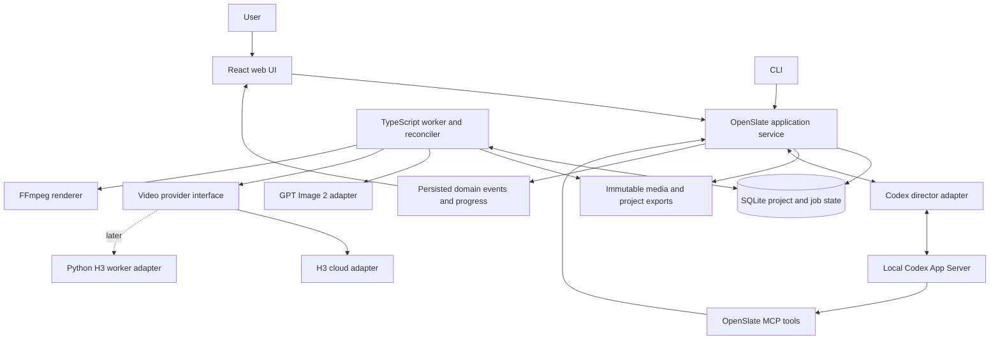

# OpenSlate — Technical Design

**Status:** architecture proposal; the repository currently contains an initial application skeleton.
**Version:** 0.1 · September 8, 2026
**Purpose:** define the architecture, core production logic, component boundaries, and implementation sequence for an open-source agent that creates and revises multi-scene videos.

Start here for the overall design. Continue with [Component Design](COMPONENT-DESIGN.md) for subsystem behavior, [Implementation Plan](IMPLEMENTATION-PLAN.md) for delivery phases and unresolved decisions, and [Review Notes](REVIEW-NOTES.md) for review findings and validation limits.

## 1. Product and scope

OpenSlate turns a creative brief into an editable video project and a finished export. It develops a story and production plan, creates reusable visual references, writes generation prompts, produces shot takes, assembles an audio/video timeline, and renders the result. Users can review the work, change a decision, or replace an individual shot while preserving unaffected material.

“Long video” means a coherent sequence of many generated shots. The project model must support multi-minute outputs without putting the full project, every frame, or every generation response into one model context. Continuous single-shot generation is an optional technique within a scene, not a prerequisite for producing a long film.

### Confirmed decisions

| Decision | Rationale |
|---|---|
| TypeScript for the application and production engine | Shared contracts across UI, service, tools, jobs, and provider adapters |
| Codex as the first director runtime | Reuse its agent loop, conversational iteration, skills, and tool integration |
| MiniMax H3 cloud API first | Start with an operational generation service before operating GPU inference |
| GPT Image 2 as the initial image provider | Generate and edit reference assets and shot keyframes |
| Optional Python H3 workers later | Keep local model dependencies and GPU execution behind the provider boundary |
| Open-source distribution | Make project formats, core behavior, and extension interfaces inspectable |

### Working assumptions awaiting product confirmation

These are provisional product defaults. They can change without replacing the core architecture.

| Topic | Proposed initial default | Consequence if changed |
|---|---|---|
| Distribution | Single-user local web app; user supplies provider credentials | Multi-user hosting adds identity, access control, worker isolation, and shared storage |
| First acceptance example | Narrated 2–5 minute video, first proven with a 30–60 second slice | Dialogue films prioritize speech continuity; music videos prioritize beat and section timing |
| Autonomy | Review the production plan and canonical references; then execute within an approved scope and budget | Fully automatic mode uses a standing policy; per-shot review adds more pauses |
| Initial audio | Import narration/music; optionally retain generated shot audio | Integrated speech/music generation requires additional provider selection |
| First output profile | Landscape, fixed project frame rate, MP4 video and editable project export | Other ratios/profiles become configuration, with reference-fit validation |
| Initial platform | macOS/Linux for cloud use | Windows support requires an explicit installation and runtime compatibility pass |

The first version includes planning, reference generation, shot generation, take selection, basic timeline controls, audio mixing, captions, and reliable export. A full nonlinear editor, hosted multi-user product, automatic feature-length quality guarantees, model training, and local GPU inference are outside the first release.

## 2. Architecture decision

Use a **modular TypeScript application with a separate worker process**, a Codex director adapter, and explicit provider adapters. Keep project state and paid operations under OpenSlate’s control. Codex receives project context and calls validated tools; it does not own the authoritative database or submit generation requests outside the job system.



### Recommended implementation stack

| Area | Starting choice | Boundary |
|---|---|---|
| Workspace | pnpm workspace, TypeScript, supported Node LTS pinned during setup | No Python requirement for cloud users |
| UI | React + Vite | Storyboard, review, conversation, simple timeline |
| HTTP service | Fastify; REST commands and server-sent events | Local browser/CLI access and reconnectable progress |
| Contracts | Zod schemas, versioned JSON payloads, generated API/tool schemas where practical | Validate all external and agent inputs |
| Persistence | SQLite with migrations and transactional repositories | Local metadata, jobs, reservations, approvals, events |
| Storage | Local immutable media files with database metadata | Optional staging/object storage adapter for provider transfers |
| Agent integration | Codex App Server over local stdio; MCP for domain tools | Pin and validate the supported protocol subset |
| Execution | TypeScript worker with durable database jobs and leases | No Redis or distributed workflow platform in v0 |
| Rendering | FFmpeg and ffprobe invoked with validated arguments | Frozen timeline in, validated render out |

Fastify is a proposed implementation choice, not an architectural dependency; its official documentation covers the server framework. [Fastify documentation](https://fastify.dev/docs/latest/)

Codex’s documentation distinguishes programmatic SDK runs from App Server integration for applications with conversation history, approvals, and streamed events. That makes App Server the proposed interactive path. Use default local stdio; avoid depending on experimental dynamic tools, remote Code Mode, or WebSocket transport. A pinned-release compatibility spike is a prerequisite, and the simpler SDK remains a fallback for bounded runs. [Codex SDK](https://learn.chatgpt.com/docs/codex-sdk), [Codex App Server](https://learn.chatgpt.com/docs/app-server)

## 3. Ownership and source of truth

| Information or action | Owner | Durable record |
|---|---|---|
| Creative intent and director proposals | Director runtime | Accepted plan revisions plus conversation references |
| Project entities and changes | Application/domain service | SQLite entities and immutable revisions |
| User authorization and review policy | Application/domain service | Policy, approval scope, inputs, and revision references |
| Paid generation admission and recovery | Job engine | Job, attempt, reservation, provider receipt |
| Reference and output bytes | Artifact service | Local files, checksums, provenance metadata |
| Chosen takes and editing decisions | Timeline service | Timeline revision with exact artifact references |
| Export execution | Render worker | Render job, recipe, tool versions, output artifact |
| Provider-specific limits and translation | Provider adapter | Versioned capability descriptor and execution specification |

Conversation history is a useful interaction record. The project can be reconstructed and edited without that conversation. Markdown plans and JSON exports are readable projections of committed state; editing them creates an explicit import proposal rather than silently changing the database.

## 4. Production logic, step by step

1. **Capture the brief.** Establish audience, format, approximate duration, story intent, style, aspect ratio, audio approach, supplied assets, and spending policy. Record missing creative details as assumptions.
2. **Develop the story and production bible.** Define the narrative arc, characters, locations, wardrobe/props, visual rules, and pronunciation or dialogue notes. Produce stable entity IDs for reuse.
3. **Plan scenes and shots.** Each scene has a narrative purpose and duration target. Each shot specifies action, framing, motion, continuity inputs/outputs, reference needs, audio intent, and edit duration. Split shots when provider limits or complexity require it.
4. **Review the plan and estimate.** Validate duration coverage, dependency cycles, provider compatibility, reference count, and estimated work. Freeze an execution scope when the applicable policy authorizes it.
5. **Generate canonical references.** Create/select character and location references, then derive shot keyframes as needed. Review canonical references before propagating them across many shots under the default policy.
6. **Compile and execute shot requests.** Resolve exact input revisions, write a provider-suitable prompt, validate the conditioning mode, reserve budget, and enqueue durable jobs. Run independent shots concurrently within provider and user limits; wait for real dependencies.
7. **Ingest and review takes.** Download output, verify technical properties, create proxies/contact sheets, and evaluate adherence. Keep every take’s lineage. Automatic checks advise the director; retry and revision loops remain bounded.
8. **Assemble the timeline.** Select takes, set trims and order, place narration/music/native audio, apply transitions and captions, and identify missing coverage. Review a rough cut before costly refinements.
9. **Render and finish.** Normalize media to the project profile, compile the frozen timeline into an FFmpeg recipe, mix audio, render, verify output, and publish an artifact atomically.
10. **Revise selectively.** A user request becomes a scoped patch. Mark affected dependents for review, reuse valid assets/takes, generate only approved changes, and create a new timeline/export revision.

This is a recommended production sequence, not a second agent framework. The director may move between stages. Application preconditions ensure that generation and rendering always have valid inputs and authorization.

## 5. Fundamental project model

```text
Project
  Brief revision + Production bible revision + Execution policy
  Scenes → Shot revisions → Generation attempts → Takes
  Asset revisions → References and generated media
  Timeline revisions → Selected takes + trims + audio + captions
  Render jobs → Export artifacts
  Director runs + Approvals + Budget ledger + Domain events
```

A **shot** is an intended cinematic moment. A **take** is a generated candidate for that shot. A **timeline clip** is an editorial use of a take, potentially trimmed or reused. These are separate objects so regeneration does not erase editing decisions.

Every generated artifact records its exact prompt, input asset revisions, provider/model identity, generation settings, and job. Reusing a seed is useful metadata, not a guarantee of identical future generation. A render records the timeline, source checksums, output settings, and rendering toolchain.

Changing a reference creates a new revision. Existing takes remain available and become outdated only along recorded dependency edges. Late results attach to the revision that produced them; they never automatically replace a newer selection.

## 6. Reliability and autonomy

- Persist and authorize work before external submission. Treat an accepted request with a lost response as an **unknown submission**; never blindly repeat a potentially paid call.
- A remote success becomes a usable take only after its media is stored and verified locally.
- Enforce budgets, retry limits, and review policy in application tools. Instructions in a skill do not grant spending authority.
- Bind approvals to revisions and action scope. A material change requires renewed authorization only when it falls outside the standing policy or existing approval.
- Let job monitoring and rendering continue without an active Codex turn. Restarted directors rebuild context from project state.
- Preserve prior outputs. A targeted revision or failed render must not require rerunning the whole project.

The [component design](COMPONENT-DESIGN.md) specifies state transitions, budget treatment, worker ownership, timeline validation, and the failure recovery paths behind these rules.

## 7. Cloud now, local later

Both H3 cloud and a later local worker implement a semantic video-provider contract: describe capabilities, prepare a request, submit, inspect status, and retrieve outputs; cancellation and reconciliation are optional capabilities. The planner validates what each provider actually supports.

The Python worker owns model loading, GPU placement, inference, and model-specific preprocessing. TypeScript retains project state, scheduling, authorization, asset identity, and timeline/render logic. Requests use transferable artifact references, not filesystem paths assumed to exist on another machine.

The published H3 stack has Python dependencies. Its released base model is not the complete hosted pipeline: Context-IR and Regenerate-2K are described as outside the open-source release. Local capability and quality parity must therefore be evaluated rather than assumed. [H3 repository](https://github.com/MiniMax-AI/MiniMax-H3), [H3 dependencies](https://github.com/MiniMax-AI/MiniMax-H3/blob/main/requirements.txt)

## 8. Delivery strategy

Prove the runtime/tool boundary first. Then build one complete short video path, prove restart and one-shot replacement, and expand to the multi-minute acceptance case. Introduce local H3 only after the provider contract works against both a fake asynchronous provider and cloud H3.

The first implementation should optimize for a small, understandable contributor setup and inspectable project state. Additional orchestration frameworks, multi-agent director hierarchies, distributed queues, and a full editor need demonstrated requirements before introduction.

See the [implementation plan](IMPLEMENTATION-PLAN.md) for milestones, exit criteria, unresolved choices, and the first engineering tasks.
