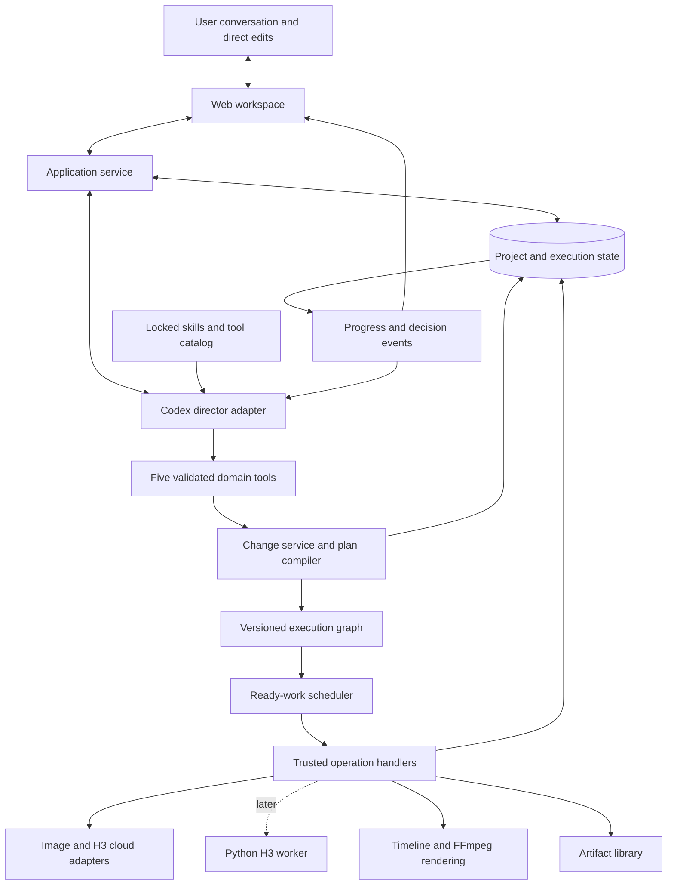

# OpenSlate — Technical Design

**Version:** 0.2 · September 10, 2026
**Status:** architecture proposal; implementation remains an initial TypeScript skeleton.

OpenSlate turns a creative brief into an editable film: story and shot planning, reference assets, generated takes, timeline assembly, and finishing. Its first director uses Codex, image assets use GPT Image 2, and video generation starts with H3 cloud. A later Python H3 worker implements the same provider boundary.

## 1. Direction

The application should be fast to execute and easy to revise. Once the intent and current project state are clear for a requested scope, the director writes an execution plan in a small TypeScript planning language. OpenSlate compiles it into a durable dependency graph and executes ready operations directly. The user can intervene during production; the director translates the request into a scoped change rather than rebuilding the film.

| Decision | Purpose |
|---|---|
| TypeScript application, React UI, Fastify service | Share contracts across the product and execution engine |
| Codex behind a director adapter | Reuse conversation and reasoning while OpenSlate owns project state |
| Two initial skills; five agent-facing tools | Prove extensibility and lifecycle before adding specialist features |
| Code-authored plan, compiled dependency graph | Batch decisions and remove the agent from routine dispatch/polling |
| Versioned project and scoped atomic patches | Change one shot while preserving valid completed and running work |
| SQLite, local artifacts, separate TypeScript worker | Straightforward local installation and durable progress |
| GPT Image 2 and H3 cloud adapters | Keep provider-specific behavior outside the project model |
| Optional Python H3 worker later | Isolate model/GPU dependencies from cloud users |

The two skills are `production` and `plan-authoring`. Continuity and asset direction begin as guidance inside `production`, with references loaded when relevant. They can become separate skills when real usage justifies the split.

## 2. Overall architecture

The director makes creative decisions and authors plans. The compiler validates those plans. The scheduler and workers execute them. Only decisions needing reasoning return to the director; task completion and provider polling do not inherently require a model call.

## 3. Four durable artifacts

| Artifact | What it preserves |
|---|---|
| **Project revision** | Brief, story/bible, scenes/shots, accepted references, selected takes, editorial intent |
| **Plan revision** | Readable plan source, normalized operation graph, exact input bindings, execution policy and version lock |
| **Execution records** | Service-owned generation intent/candidate IDs, attempts, receipts, cost reservations, node progress |
| **Media and timeline revisions** | Immutable outputs/provenance, exact edit selections, render recipes and finished exports |

These records survive conversation resets. Skill loading and conversation summaries are context management, not the production database. A shot is an intended moment, a take is a generated candidate, and a timeline clip is an editorial use of an exact take.

## 4. Main execution loop

1. **Understand the request.** Read current project state and clarify only missing decisions that affect the requested work.
2. **Author the creative change.** Develop the initial story/shot plan, or identify a local revision with any continuity consequences.
3. **Write plan code.** Describe operations, dependencies, reference bindings, and review gates for that scope.
4. **Prepare and inspect.** Compile without side effects. Return a proposed project/plan diff, reused work, new work, holds, and estimated cost/time impact.
5. **Commit under policy.** Apply the approved or already-authorized change atomically. Admit new work only within the active policy and budget.
6. **Execute ready work.** Dispatch independent branches in parallel; ingest outputs and advance dependencies without routine agent turns.
7. **Guide at decision points.** Surface reference choices, quality failures, material edit impacts, or exhausted budgets. Resume only the branches requiring that decision.
8. **Finish or revise.** Resolve an editable timeline, render a preview/export, and accept further scoped changes at any time.

“Finalizing intent” applies to the scope being executed. It does not require locking the whole project against future changes or waiting for every scene before useful work can start.

## 5. What must be built first

| Build the framework now | Keep the initial content small |
|---|---|
| Skill discovery, compatibility checks, immutable version locks, request activation | Production guidance and plan authoring |
| Tool registry, schemas, permissions, idempotency, shared handlers | Read context, prepare change, apply change, control execution, inspect artifact |
| Plan compiler, dependency scheduler, stable identities, revision comparison | Image generation, video generation, timeline assembly, rendering |
| Scoped edit protocol, stale-result protection, progress events | Single-shot replacement, trim/reorder, reference selection |

The first executable proof should use fake media operations, demonstrate parallel work and editing a running plan, and then connect real providers. Avoid building a large skill library or a professional timeline editor before those behaviors work.

## 6. Provisional product defaults

Distribution remains a single-user local web app with user-supplied credentials. The initial acceptance example is a narrated 2–5 minute film, first proven with a short sequence; imported narration/music and optional native shot audio are sufficient initially. The default policy reviews the production plan and important references, then permits execution within a bounded budget. These defaults remain open for product discussion.

Fast execution does not mean unbounded concurrency or speculative paid takes. Optimize the critical path, overlap independent work, cache valid artifacts, and batch reasoning. Measure time to first useful preview and time to apply a shot edit, not only total job throughput.

## 7. Reading map

| Document | Read for |
|---|---|
| [Component design](COMPONENT-DESIGN.md) | Architecture diagrams, component ownership, and high-level execution algorithms |
| [Skills and tools](SKILLS-AND-TOOLS.md) | Loading, versioning, multi-request lifecycle, extension rules, and minimal initial surface |
| [Execution and editing](EXECUTION-AND-EDITING.md) | Code plan example, scheduler logic, incremental changes, and user intervention |
| [Implementation plan](IMPLEMENTATION-PLAN.md) | Milestones and acceptance criteria |
| [Review notes](REVIEW-NOTES.md) | Design review findings and unresolved validation gates |

## 8. Runtime and provider boundaries

Use a locally scoped Codex App Server adapter over stdio and OpenSlate MCP tools, subject to a pinned-release compatibility test. The official documentation covers session integration and skill activation; OpenSlate's version locks, tool policies, and plan execution are application features. [Codex App Server](https://learn.chatgpt.com/docs/app-server), [Codex skills](https://learn.chatgpt.com/docs/build-skills)

Providers expose their actual conditioning modes and limits. Cloud success is not local completion until media is copied and validated. Preserve ambiguous submissions without blindly repeating paid requests. H3 cloud and local Base must remain separate capability profiles. Python owns local inference, while TypeScript retains scheduling, policy, plans, and editing; any hybrid hosted stages are explicit TypeScript jobs. Local H3 inference alone does not make the Codex director or image generation offline.
