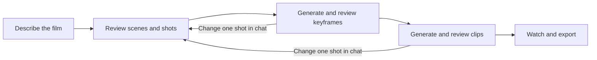

# A quieter studio and a clearer video flow

September 26, 2026. Refinement of the existing Precision design for a single-user local creative tool.

## Ideal experience

| Stage | Your decision | OpenSlate's work |
|---|---|---|
| Brief | Audience, style, duration, references; upload narration or develop it in conversation | Find gaps, offer choices, save the agreed brief and narration |
| Storyboard | Review scene order, shot purpose and timing | Keep the detailed plan, prompts and dependencies; apply scoped edits |
| Keyframes | Choose shots, review cost, inspect the proposed look | Generate images and stop for review |
| Clips | Approve exact frames and motion, review video cost | Generate only approved work; retain earlier takes |
| Final video | Watch picture and sound, ask for targeted changes, download | Assemble and export; keep unaffected work |

The user should be deciding creative intent and spending, not learning edit holds, execution nodes or grant identities. A stopped conversation resumes from saved work. Selecting a shot narrows a conversational edit; it does not restart the whole film.

## Implemented in this refinement

- Close, refresh, clear, settings and disconnect utilities use icons with accessible names and hover labels. Supplementary help uses an information icon supporting hover, focus and tap. Primary actions retain text, especially paid approval and destructive/cancellation decisions.
- Storyboard is the main review surface. It has one Generation & costs entry point. Shot search/filter controls appear for longer shot lists or active filters. Frame approval appears only after selection.
- One compact conversation status replaces explanatory status paragraphs. Unfinished edits are grouped in one disclosure with their individual scopes and existing explicit continuation commands; no authority is silently merged.
- Assets is a read-only collection of saved images and videos, including historical takes and uploads. Filtering occurs before bounded pagination. Selecting an item loads its preview; the list does not download all original media. Upload tools are collapsed. Generation, spending, narration and rendering are not library content.
- Narration stays under Brief & narration. Export controls and render recovery stay under Preview. Pending upload and spending commands retain their existing durable retry identities.
- The in-app “How to make your film” guide explains five stages without pretending to infer a completed stage or running a new workflow.

## Existing protocol versus ideal flow

Today generation still has two distinct application steps: permit the director to plan selected generation, then approve a saved cost proposal. Frame/motion approval is also separate and intentional. Both generation steps now live beside the storyboard. This UI refinement does not claim they have become a single transactional Generate button.

A future improvement can present one guided generation review that gathers selected shots and shows the prepared cost before the final start. It must preserve exact saved proposals, freshness, one-use permissions, uncertain-submission recovery and separate frame approval. Arbitrarily removing these checks would hide real decisions rather than simplify them.

## Visual and interaction rules

Preserve the existing white/light-blue Precision palette, typography and spacing. Use blue for primary actions and selected views, muted text for metadata, and warning color only for an actual blocked/recovery state. Keep the film and its media above explanatory UI. Existing font stack remains authoritative in the application styles.

Desktop retains conversation plus workspace. At narrow widths use the existing Director/Workspace switch; asset filters wrap, controls remain reachable, and the five-stage guide becomes vertical. Forms retain visible labels. Paid costs, errors, fixture status and upload constraints remain visible at their decision points; they are not tooltip-only disclosures.

## Validation scope

Check utility names and icon rendering, settings keyboard focus/close, hover/focus/tap help, collapsed edit details, conditional approval controls, asset type/source/search filtering, empty results, selected media inspection, upload disclosure, and desktop/narrow layout. The isolated browser data is explicitly a demo fixture. No paid generation is required for this UI validation.

Validated September 26: full checks passed (1,990 passed, zero failures, one optional native test skipped). Focused coverage includes asset pagination, filtering, authentication and project isolation. Browser checks covered the live IB layout on desktop and 390px mobile, help placement and Escape dismissal, plus isolated fixture filtering, video inspection, upload disclosure and conditional frame approval. No paid provider requests or creative approvals were issued. The IB project retains its three unfinished edits; grouping them does not resolve their underlying ownership.
