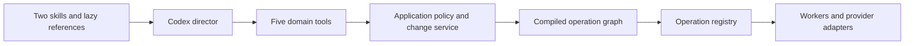
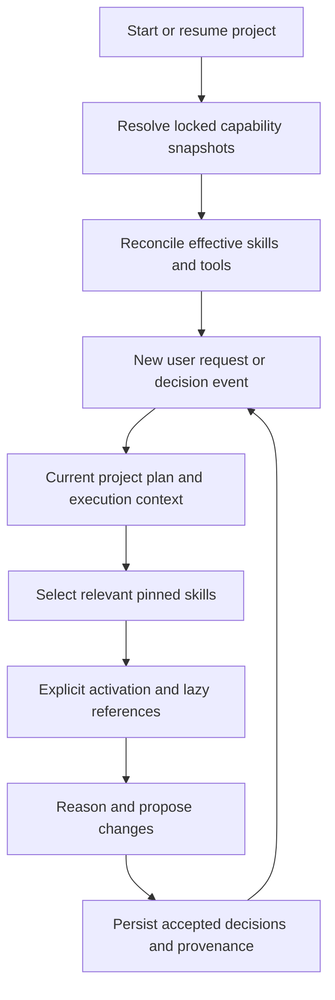

# OpenSlate — Skill and Tool Framework

**Version:** 0.3 · September 10, 2026
**Status:** proposed framework; no skills or tool implementations are added by this document.

## 1. Responsibilities and minimum scope

A **skill** supplies creative methods and plan-writing guidance. A **tool** is a validated application command available to the director. An **operation** is a trusted unit executed by a worker from a compiled plan. Keeping these distinct allows a small model-facing surface to drive many media jobs efficiently.

### Two initial skills

| Skill | Trigger | Responsibility | Output |
|---|---|---|---|
| `production` | New brief, creative discussion, review, or edit | Clarify intent/narration gaps, develop the script and film, reuse assets, maintain basic continuity, and explain revisions | Structured creative proposal and decisions |
| `plan-authoring` | Enough intent/state is settled to execute or revise a scope | Write code against the planning language; describe dependencies, gates, and local patches | Plan source or a scoped plan patch |

Keep a short runtime instruction sheet always present: read current state, preserve prior decisions, use the application interfaces, and identify which skill to activate. Do not turn this into a third large skill. The two skills may be activated in the same request; they are instructions for one director, not separate agents.

Story conventions, narration readiness and gap-closing dialogue, shot grammar, continuity checks, image recipes, provider-specific prompt guidance, human keyframe review, and conversational editing examples start as lazy references under these skills. Add a separate skill only when it has a distinct reusable trigger and output contract that no longer fits a reference.

### Continuity and asset examples

A film shows Maya arriving at a train station in a red coat with a suitcase in her left hand.

- **Continuity direction** checks that the next shot preserves her appearance, prop state, location/time, and movement direction unless the story intentionally changes them. It might record that shot 8 directly continues shot 7 and therefore needs an accepted predecessor frame. If the user changes the coat to blue, it identifies related shots for review instead of changing every shot blindly.
- **Asset direction** decides that the project can reuse Maya's approved portrait, needs a station reference, and needs a shot-specific keyframe with the right coat, suitcase, camera angle, and output ratio. It selects generation versus reuse and records the resulting reference relationships.

Basic versions of both functions are necessary for multi-shot production. Separate specialist skills are **not required for the first release**. Start with a minimal bible, reference reuse, recorded constraints, and human review of important references. Advanced identity scoring, elaborate style systems, and automated continuity repair can follow later.

## 2. What Codex provides and what OpenSlate must own

Codex discovers skill metadata, loads full instructions when selected, and can use references as needed. App Server provides skill listing and explicit skill inputs; changes to the listing do not establish immutable version locking or replacement of previously injected context. [Codex skills](https://learn.chatgpt.com/docs/build-skills), [Codex App Server](https://learn.chatgpt.com/docs/app-server)

| Native runtime responsibility | OpenSlate responsibility |
|---|---|
| Discover/inject supported skill packages | Choose trusted packages and pin exact contents |
| Run the model/tool interaction loop | Persist project state and govern all mutations |
| Expose runtime conversation/events | Build fresh scoped context for each request |
| Connect to an MCP server | Register a controlled tool catalog with stable contracts |

A dedicated runtime state directory does not by itself exclude user, repository-ancestor, admin, or system skills. The adapter verifies effective discovery against the allowed catalog and rejects conflicting names or unexpected enabled skills. Exact provisioning/enablement behavior must be tested with the pinned Codex release. [Codex skill discovery](https://learn.chatgpt.com/docs/build-skills)

## 3. Skill package, registry, and versioning

A package contains `SKILL.md`, its referenced guidance/examples, and an OpenSlate manifest describing its identity and compatibility. Use the native `SKILL.md` baseline; optional runtime-specific metadata is an adapter concern. Initial packages contain instructions and examples, not arbitrary executable scripts.

The **registry** maps a unique skill ID to an entry path, human-readable version, full-package digest, compatible planning/tool contract versions, and declared requirements. Hash the complete package, including references. Changing a reference is a content change even when `SKILL.md` stays the same. A version label explains compatibility; the digest identifies exact bytes.

The **project capability lock** records the resolved skill packages, tool/operation versions and handler build identities, planning-language/compiler version, and relevant runtime/provider profiles. This is an OpenSlate artifact, not a promised Codex feature. Store immutable package snapshots for active projects/runs so a Git checkout update cannot silently change their instructions.

There are three different records:

| Record | Lifetime | Meaning |
|---|---|---|
| Catalog | Application release/configuration | Available trusted capabilities |
| Capability lock | Project production run and its revisions | Exact capabilities selected for this production |
| Request activation record | Each user/automatic director request | Skill IDs/digests explicitly supplied, context revisions, and returned decisions |

Record what was selected/injected, not an unobservable claim that the model fully read every reference or followed every instruction. The project state and validators carry correctness.

## 4. Loading and use across multiple requests

**Startup algorithm:** discover configured packages; validate names, manifests, digests, and compatibility; reconcile the effective runtime catalog; provision the fixed MCP bridge; create or reopen the production lock. A missing required package is a clear compatibility error. A skill's declared dependency cannot authorize installation or expand permissions.

**Request algorithm:** read the latest user instruction as a change to the ongoing project; retrieve settled intent, selected scope, neighboring constraints, current plan, active jobs, and pending decisions; select `production`, `plan-authoring`, or both; explicitly activate the pinned entry paths; load detailed references only when relevant; persist accepted changes and activation provenance.

**Resume algorithm:** reconstruct context from project records and the same lock. A long conversation or prior activation is not proof that instructions survived compaction. The adapter can reinject required entry instructions at request boundaries and re-read references by digest. File/package caching saves repeated disk work; model prompt caching is an optimization, never a correctness dependency.

Keep context scoped. Editing shot 7 normally needs its current intent, references, neighbors, relevant execution state, and dependency summary—not the full film transcript or every image. A scene summary points to exact objects that can be retrieved when needed.

### Upgrade rules

New projects can select a new approved catalog. Existing production runs keep their lock through follow-up requests. A lock may include multiple approved model profiles; a scoped switch among them changes input bindings, not the lock, and renews affected human review. Selecting an unlocked profile, new runtime, skill version, or handler version requires an explicit successor lock and production-run/plan boundary: hold affected new dispatch, validate compatibility, recompile/rebind new work, and recreate the runtime conversation when needed. Broader runtime/tool changes may require a broader dispatch hold. Existing jobs continue under their old lock and are not resubmitted. Reconstruct state rather than replaying production side effects; this boundary need not wait for every old provider job to finish.

Running jobs keep their operation/provider implementation identity. Preserve the supported implementation until they finish, or pause dispatch and use an explicit compatible migration. A skill update alone never invalidates completed media. Only a resulting change to creative intent, effective inputs, or operation behavior can require new work.

## 5. Five initial agent-facing tools

| Tool | Main behavior | Boundary |
|---|---|---|
| `read_context` | Fetch scoped project/plan state, progress, constraints, and capability information | Structured read; no external generation |
| `prepare_change` | Prepare a project-only creative change, new plan, or plan patch; return a change ID, validation results, impact, and estimates | No paid side effects; an existing edit hold stays active |
| `apply_change` | Commit a prepared creative/plan change; admit work only for an executable plan under policy | Checks base revision, scope, decisions, work identities, and budget |
| `control_execution` | Hold/resume a scope, pause director automation or dispatch, inspect control state | Cannot erase accepted provider work or silently release liabilities |
| `inspect_artifact` | Return preview frames, media properties, and review evidence for known artifacts | Read-only inspection; actual modality support is validated |

The UI uses the same change/control services. V0 creative changes go through conversation; playback, shot selection for chat, review decisions, and pause controls are UI interactions. Every shot video needs human approval of its keyframe and current intent/settings; scene-level batch approval records exact coverage. A skill or autonomous quality check cannot grant this approval or authorize quality-driven regeneration. User approval, policy configuration, uploads, and setup are application routes; they need not all become model tools. The agent can ask for a decision but cannot call a tool to approve its own spending.

Project-only changes persist settled intent before any execution plan exists, with no generation intents or paid side effects. If such a change affects a running plan, hold/invalidate its affected work until prompt/spec freshness is restored; do not resume stale instructions. Pure discussion notes and unrelated metadata do not invalidate production.

Candidate admission checks origin as well as budget: an initial authorized plan slot, a recorded user request for the scoped creative change, or an eligible technical-failure record supplied by trusted execution code. The model cannot mint extra same-input candidates merely because approval and budget remain, or self-classify a quality defect as an error to get an automatic retry.

An agent control can release only an edit hold it owns or a pause the user has explicitly authorized it to clear. It cannot override a user pause, another edit, or a remaining review gate. All applicable controls must permit dispatch.

These tools use explicit typed variants for supported changes; `apply_change` is not arbitrary database mutation and `control_execution` is not a shell executor. A larger operation plan fits in one prepare/apply exchange without one tool call per shot.

## 6. Tool and operation registry lifecycle

Each registered handler has a stable ID, contract version, input/output schema, permission scope, side-effect category, and execution/retry policy. Media operations additionally declare how inputs bind to artifacts and how their effects participate in dependency analysis. The six initial operation families are image generation, video generation, speech synthesis, transcription/alignment, timeline assembly, and rendering. The added narration paths use the existing five tools and production references; they do not require a new specialist skill or an agent tool for every API.

**Registration algorithm:** validate trusted descriptors at application startup; resolve compatibility with the capability lock; generate the MCP catalog and compiler operation catalog from those descriptors; verify that required handlers exist; expose only the project/action-allowed tool subset. The scheduler calls operation handlers directly through the registry.

**Invocation algorithm:** resolve the pinned handler; validate input; check project scope, policy, revision, and stable work identity; execute or enqueue as appropriate; validate/normalize output; record an event and provenance. Reads, plan preparation, database commits, and external generation have different retry semantics.

Keep the MCP catalog stable for a runtime session. Loading a skill selects instructions; it does not install servers or hot-add tool names. A tool/schema upgrade uses a controlled session boundary. MCP allowlists and startup behavior are documented by Codex; handler versioning and admission remain OpenSlate responsibilities. [Codex MCP](https://learn.chatgpt.com/docs/extend/mcp)

### Adding capabilities later

A new skill needs an ID, manifest, references, compatibility declaration, and focused examples/evaluations. A new operation needs schemas, handler, dependency/effect rules, capability checks, and recovery tests. Add a model-facing tool only when an operation cannot sensibly fit the existing bounded interface. No plugin marketplace, remote auto-installation, or dynamic arbitrary-code execution is needed in v0.

## 7. Framework acceptance cases

- A second request edits a shot while retaining settled intent and the same skill lock.
- Compaction/session replacement reactivates the pinned skills without rerunning completed operations.
- Editing a source skill reference does not affect a running locked production.
- A catalog conflict, missing handler, or incompatible version fails before paid work.
- Replayed requests with fresh model tool-call IDs cannot duplicate service-owned generation intents.
- Adding one test skill and one fake operation needs registration, not changes scattered across the director and scheduler.
- Uploaded, partial, and generated narration use the same durable project context across requests.
- Model-profile swaps preserve capability/review constraints; another runtime can use the same domain contracts.
- A skill suggesting better visual quality cannot trigger a new paid take without user instruction.
- Unexpected external skills/tools cannot override the project's effective catalog or permissions.

The first implementation should prove these cases with fake media before expanding the skill library.
