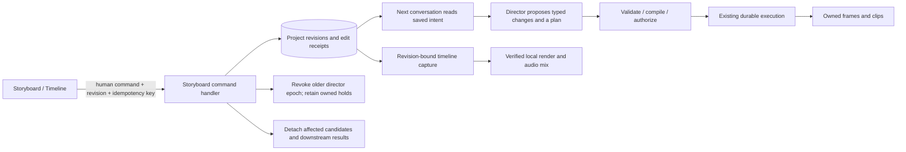

# Storyboard studio

Implemented September 28, 2026, from the approved First Light prototype. This page supersedes the older Film plan screen arrangement in [Simplified video flow](SIMPLIFIED-VIDEO-FLOW.md); the import and authorization contracts remain unchanged.

## User flow

1. Start in conversation or bring a text/Markdown brief. The director proposes an interpretation; the user confirms it before it becomes the saved film.
2. Review the **treatment → scenes → shots** in one storyboard. Edit text in place, add shots, drag their numbered handles, or delete with the corner cross. Alt+Left/Right provides keyboard ordering. Undo restores the most recent edit only while its revision is still current.
3. Set narration per shot: no narration, generated speech script, or uploaded recording. The card stores writing intent; audio setup opens the existing recording, timing and acceptance workflow with that shot as the mapping target.
4. Continue in conversation to update affected prompts and the execution plan. Direct edits do not launch paid work. Generation permissions and spending remain available behind the treatment settings icon.
5. Review each actual keyframe and its exact motion plan using the card's check. Video generation still needs its human grant and budget. The generated clip replaces the frame in that card and supports playback, including muted hover preview.
6. Inspect the light **Timeline**, select optional owned background music, then render and review the export. Assets remains the library of uploaded and generated media. The chat + button opens media import.

## Component and authority boundaries

`POST /api/projects/:id/storyboard` supports treatment, scene, addScene, shot, addShot, deleteShot, moveShot, narration, soundtrack and undo. It authenticates the local human, rejects stale revisions and pending imports, writes a revision and receipt atomically, and emits the normal SSE event. Unknown fields, foreign identities and duration limits fail before publication. No model-authored code is evaluated.

Shot IDs survive reorder and undo. A direct-edit request may continue the preceding direct-edit request's holds; unrelated conversation holds retain their owners. The next covering chat request explicitly sends the saved edit's continuation ID. Direct-edit audit records stay available to debugging and director context without filling the conversation with mechanical messages.

Edits retain attempts and provider receipts. Changed image/video intent detaches the corresponding current candidates and downstream outputs; a camera-motion-only edit keeps the keyframe. Late completion is retained as historical evidence, not republished into the changed slot. Topology and music changes invalidate assembly. Undo restores creative data, not spent grants or old approval authority. A matching plan must be applied before held work resumes.

### Narration

Optional `shot.narration = {mode, text, voice}` is **writing intent**, not a second canonical audio system. Existing accepted sections, recordings, cue identities and measured timings remain authoritative for export. A no-narration choice with a saved cue is shown as a pending removal until explicit narration review. Existing projects need no migration.

The dialog currently reuses the detailed narration acceptance controls; shot selection limits which mappings it submits, while the underlying narration document remains project-wide. It is not yet a one-click voice workflow. Personal voice enrollment and generation are **not connected**: selecting that preference records intent and the dialog blocks stock-voice generation as a substitute. Provider choice/access is still required.

### Timeline and soundtrack

The light timeline displays scene groups, current takes/keyframes, a playhead and a narration-script lane. It is a picture preview, not a waveform/trim editor. Sound is reviewed in the rendered export. Missing footage is explicit; generated fixture footage is labeled.

Optional `project.soundtrack = {audioId, gainMilliDb}` selects an owned imported recording, with gain from -60 to 0 dB. Timeline capture resolves its measured source and incorporates it into the revision-bound render target. FFmpeg mixes it from time zero, truncating to the shorter of the recording and film. No loop, fade, ducking or generated-music provider is implied. Existing source verification, rendering limits and stale-publication checks remain in force.

## Verification

Full `pnpm check`: 2,026 passed, zero failed, one optional native probe skipped; builds and typechecks passed.

- Backend tests cover authenticated commands, stale revision rejection, idempotency, epoch fencing, stopped projects, stable shot identity, delete/undo, unaffected candidate preservation, unrelated hold ownership, late provider completion, and soundtrack ownership/gain rejection.
- An actual synthetic FFmpeg render verifies soundtrack inclusion, gain and duration in the frozen render manifest and successfully publishes the export, with no paid provider calls.
- Disposable integrated browser checks cover inline edit/reload, Escape cancellation, adding a shot, reorder, deletion/undo, per-shot narration persistence, missing-media states, import/audio dialog and the light timeline. Pointer drag moved shot 1.2 ahead of 1.1; the single-card review check saved approval. At 390px, document width remained 390px. The fixture studio never loads the user's production database or paid provider configuration.
- A bounded native Codex 0.153.4 / gpt-6-astra read-only rehearsal completed against a three-scene, six-shot project: one completed turn, zero grants, zero media attempts. It correctly read the storyboard and described shot narration intent and edit/recompile boundaries. The tool sandbox blocked initial setup; the authorized native run outside it passed.

These checks do not establish a complete real-provider film, personal voice cloning, interactive audio mixing, touch drag support, or user quality acceptance. See [current status](../implementation/STATUS.md) for release gates.

## Reproduce

Build with Node 24 and pnpm 10.33.0. `node scripts/storyboard-review.mjs` serves a disposable six-shot integration studio on port 5173 and prints a short-lived pairing URL. `--fixtures` adds labeled FakeProvider keyframes. `--native` performs one read-only native director turn using existing sign-in; supply `OPENSLATE_CODEX_BINARY` if automatic discovery does not find the pinned runtime. Do not combine the modes when measuring zero-media native evidence. FFmpeg/ffprobe must be available at the paths configured in that harness.

For the regular installation, run `./start.sh --restart` to load the rebuilt app. Existing projects, artifacts and credentials remain in their existing local data directory.

### App-wide typography

`apps/web/src/typography.css`, loaded after component skins, owns the shared system sans-serif hierarchy. Page headings use 28px, section headings 24px, subsections/scenes 20px, cards/shots 18px, and minor section labels 16px, all bold (700). Body copy and field values use 14px/400; supporting labels use 12px. Phone section headings use 22px. Form labels and navigation use 600; ordinary checkbox/radio option text stays regular. Code retains a monospace family.

Treatment, Scene 01 and Shot 1.1 are headings. Briefs, scene purpose, shot purpose, motion and scripts are descriptive content; editable multiline fields wrap rather than clipping. Legacy 7–11px CSS declarations now use the shared caption token. New UI should use semantic headings and these tokens rather than new local type scales. Native timeline tracks may truncate long names because their widths represent duration; full names are available on hover, with shot identity accessible to keyboard users.

Verification: web build/typecheck and 126 existing web tests passed. Source audit covered every web component stylesheet, including recovery and transcript review. Live browser inspection covered storyboard/chat, assets and asset detail, timeline/export, all settings tabs, image/video/audio import, generation controls and new-project setup. At 390px, storyboard, assets, timeline, account settings, audio import and expanded project creation were inspected; page and modal widths had no unintended horizontal overflow. Long storyboard text had no vertical clipping. Existing IB state was preserved; no new grants, model calls or media jobs were created. Data-dependent paid approval, recovery and populated transcript states received source review, not a new live end-to-end test.
