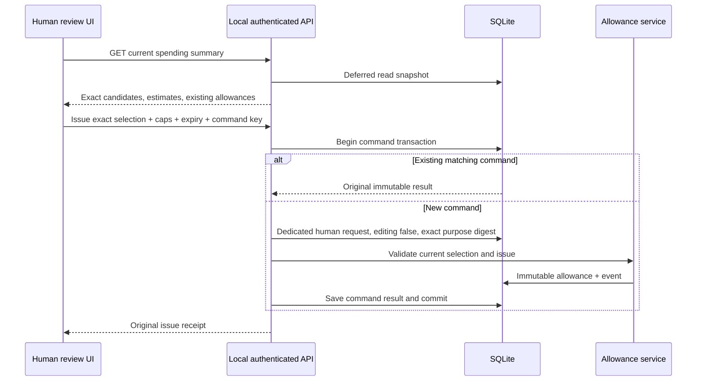

# Human spending approval API

The local application can explicitly install spending review routes. They expose current selected work, configured estimates and durable allowance history, and let the authenticated human issue or revoke bounded allowances. They do not activate providers, resolve credentials, start the director, grant creative generation, approve keyframes or change the project budget.

`createApp({ service, localToken, allowanceRoutes: { service, allowances } })` installs the routes. The service must be the application's service, and the allowance service must share its Store. An application that omits this option has no spending routes. The standard loopback Host, allowed Origin and local-session bearer checks apply; a director bridge token cannot call these paths.



## HTTP contract

| Route | Input | Result |
|---|---|---|
| `GET /api/projects/:projectId/spending` | Optional `candidateOffset` and `allowanceOffset`, nonnegative decimal strings | Current project/plan identity, independent project budget, paged candidates and allowance history |
| `POST /api/projects/:projectId/spending/allowances` | Exact issue payload below; required `Idempotency-Key` | `{ requestId, allowance }` |
| `POST /api/projects/:projectId/spending/allowances/:allowanceId/revoke` | Empty `{}` body; required `Idempotency-Key` | `{ requestId, revocation }` |
| `POST /api/projects/:projectId/spending/budget` | Exact expected revision/cap and new cap; required `Idempotency-Key` | `{ requestId, revision }`; see [budget revisions](PROJECT-BUDGET.md) |

```ts
type Issue = {
  profileDigest: string;
  profileDefinitionDigest: string;
  selections: Array<{ candidateId: string; nodeId: string; specDigest: string }>;
  maxAttempts: number;
  maxEstimatedMicros: string;
  expiresAt: string;
};
```

The existing [allowance contract](EXTERNAL-SPENDING-ALLOWANCES.md) validates complete profile definitions, unique candidate selections, bounds and thirty-day maximum expiry. All selected nodes must belong to the same exact profile identity. Amounts are decimal USD micros; they represent configured estimates, not guaranteed provider bills. Unknown fields, client-supplied actors/requests/context and write query parameters are rejected. A write key is required and must contain one to 160 characters.

The issue command is scoped by local human, project and operation. Its digest binds the complete body. Revocation binds the allowance ID from the path. Within the same command transaction, a new command mints a project-scoped human request with `editing: false` and the exact issue/revoke purpose digest. The request, allowance/revocation, events and command receipt all commit or roll back together. Generic discussion authority is never borrowed. Neither operation creates holds, revokes epochs or changes canonical state, grants, keyframe approvals or director turns.

A repeated key and payload returns the original result before checking today's selection, catalog or expiry. This survives SQLite reopen and later plan/profile changes. Reusing a key for a different payload returns `IDEMPOTENCY_CONFLICT`; another project has a separate namespace. A failed command creates no request/receipt, so the same exact command can be retried. The browser should retain the detached original key/body until it has an authoritative result. A new edit to that body requires a new explicit human action and key.

## Read projection

`projectSpendingProjection` uses a deferred read transaction for one consistent SQLite snapshot. It mints no application request and writes no record. It reuses `currentAllowanceSelection` and `allowanceUsage` from admission, rather than inventing another definition of current selection or consumption. Only external candidate work is listed; fake operations have no spending allowance requirement.

The response is version 1 and includes:

- Project ID, canonical revision/head version, active plan ID and `projectBudget: { revision, capMicros, committedMicros, currency }`.
- Candidate ID, node ID, specification digest, shot/alias/operation, profile ID/revision, execution-profile digest, full definition digest and configured estimate per attempt.
- `selectionCurrent` and `unavailableCode`, plus `workState` (`unattempted`, `in_progress`, `uncertain`, `failed`, `completed`) and the latest attempt's ID/phase/ordinal/retry permission.
- `suggestedForIssue`, which identifies current unattempted or technically retryable work. This is advisory: pause, holds, creative grants, exact frame review, provider readiness, budget and admission checks still apply.
- `matchingAllowanceCount`, computed against **all** allowance history, independent of pagination. An allowance counts only when its exact selection/profile is current, it is unexpired/unrevoked, and it has count and estimate capacity for one attempt. Capacity is shared across its selections; this field never promises a dedicated reservation. It helps the UI avoid accidentally offering a duplicate approval.
- Original immutable allowance fields, consumed/remaining starts and estimates, revocation/expiry, `currentSelectionCount`, `suggestedSelectionCount`, and status (`open`, `revoked`, `expired`, `start_limit_reached`, `estimate_limit_reached`, `no_current_work`). An `open` allowance remains an accounting fact and does not mean a candidate can run now. Uncertain work is never offered as a fresh start.

Candidate pages contain at most 100 rows; allowance pages contain at most 40, newest first. `coverage.candidates` and `coverage.allowances` each contain `{ offset, returned, total, nextOffset }`; null `nextOffset` means the end. Offsets describe a current snapshot, not a frozen multi-request cursor. The UI should reload the first page after relevant events, preserve detached pending commands, deduplicate accumulated rows by identity, and treat stale issue rejection as a refresh requirement. The GET response uses `Cache-Control: private, no-store`.

The independent project budget remains binding. An allowance larger than that cap does not raise it. The separate [authenticated budget command](PROJECT-BUDGET.md) binds the displayed budget revision/cap and records an immutable human audit without creative holds. It does not issue candidate allowances or activate providers.

## Verification and integration limits

All **14 HTTP tests** passed with synthetic projects and injected offline adapters. The server build and combined **63-test** allowance/API/provider-catalog regression run also passed. They exercise default-disabled routes, authentication/Origin/Host checks, exact purpose-bound authority, no read-side mutations, failed-command rollback, same-key replay after catalog/plan/expiry changes and database reopen, cross-project command isolation, unknown-attempt consumption, 101-candidate/41-allowance pagination, matching coverage outside the first history page, revoked/expired/underfunded/exhausted allowances and independent project-cap preservation. Two adapter starts are exercised in the unknown-work test and one in the cap test; these are in-process fixtures with no network, credentials or paid media calls.

Sources: `apps/server/src/application/allowance-routes.ts`, `allowance-projection.ts`, the optional registration in `app.ts`, and `apps/server/test/allowance-routes.test.mjs`. Browser controls and launcher wiring are a separate integration slice. Registration alone never installs external admission or paid execution adapters.
