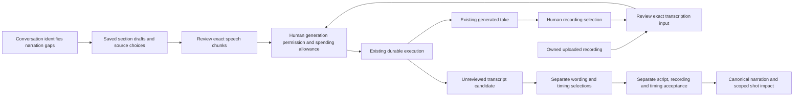

# Audio activation and narration planning

September 12, 2026. **Slice 1 implemented and verified offline; ordinary audio creation remains planned.** The speech/transcription bridges and unreviewed transcript publication are implemented offline. Human recording attachment is implemented; [transcript review/adoption](TRANSCRIPT-REVIEW-ADOPTION.md) is implemented and verified offline. This sequence connects those components to ordinary local use without requiring media API keys during development.

## End-to-end paths

Uploading a recording must be sufficient to propose transcription. Requiring the human to invent a script and accept timing first would defeat the audio-first workflow. Conversely, recognized words or a successful speech job do not accept narration. Keep existing recording selection, transcript selection and exact acceptance boundaries.

The director identifies the next useful operation from saved readiness and the user's request. Application code derives the executable proposal from exact saved inputs, checks supported options and explains any gaps. The human can revise one section without recreating successful work elsewhere. No stage-complete flag or model-generated executable JavaScript is introduced.

## Implementation slices

### 1. Explicit local audio configuration — implemented

The implementation extends the installed provider catalog and runtime composition with independently disabled-by-default speech and transcription switches. Reuse the existing backend `openai-media` credential reference and fixed version-one adapter contracts. Add no credentials to project locks, events, browser payloads or backups. A configured profile, registered adapter, available local tools, present key, human generation grant and spending allowance remain distinct facts.

The first supported profiles must match the implemented transports exactly: the speech model/voice/options exported by the pinned provider package, and `whisper-1` with word timestamps for transcription. Unsupported settings fail during configuration or proposal review, before consuming an allowance. Estimates are explicitly supplied by the host and remain estimates; do not label them verified prices.

Compose speech with complete audio ingestion and transcription with owned derivative preparation and transcript-candidate ingestion. Preserve fake defaults and old saved profile definitions. Configuration changes never rewrite existing capability locks. Recovery of retained outputs must not require a new provider call or an active current node binding.

Extend the existing spending projection and browser eligibility rules as part of activation: they currently describe image/video work only. Audio needs safe model, voice/language, operation and estimate summaries, including historical unavailable-profile handling. Catalog registration alone would otherwise advertise work the normal review UI cannot authorize. Configuration support can land independently with switches off, but ordinary audio generation is incomplete until generation review and owned-source planning are connected.

### 2. Resume local preparation without repeating paid submission — next

Follow the reviewed [preparation waiting protocol](AUDIO-PREPARATION-WAITING.md) to resolve shared-normalizer contention before enabling concurrent narration batches. The current transcription bridge records a definite `not_dispatched` failure for a busy preparation worker, consuming that attempt's start allowance. That behavior is documented; it must not silently become an uncertain provider outcome.

Add a narrow application-owned pre-submit waiting protocol, with explicit durable evidence that no dispatch marker or provider result exists. Resume the same admitted attempt and reservation under a fresh original lease; consume no second allowance start and create no additional generation grant. A crash, expired lease or missing proof cannot be interpreted as permission to repeat a POST. Ordinary provider `lookup` remains read-only and never submits. Restored attempts retain their permanent first-submission fence.

Bound wakeups and preserve project pause, request holds and obsolete-plan fences. Recheck the exact current binding and relevant selected draft input when claiming resumed work and immediately before its first dispatch marker. Existing lease renewal and the transcription bridge's historical-admission check do not themselves enforce these conditions; this is part of the new protocol. Return promptly when the worker is busy. Once the marker exists, the existing uncertain-submission and completed-output recovery protocols take over. Test replacement workers, cancellation, contention, restart, later user edits and restoration before relying on this for batching.

### 3. Trusted planning against owned draft recordings

Add a versioned application proposal for an exact uploaded or generated recording, even before canonical narration exists. Bind the owned source record and complete descriptor/hash, selected narration version/section where applicable, pinned transcription profile, language decision and explicit word timing. Verify the installed input before publication and again at the existing execution boundary.

The compiler currently resolves `p.asset()` only from canonical project artifacts, and Engine resolution also requires a saved artifact row. A draft upload has neither until canonical publication. Do not insert unaccepted draft recordings into canonical state merely to make them visible. Connect a verified owned recording through input artifact installation, bounded transcription-only compiler binding and Engine source resolution; validate every consumer. An unaccepted recording must not become timeline narration through this new path. Preserve existing compiler fingerprints when the new binding is absent. The application persists the exact source binding beside the prepared plan, and rechecks it after asynchronous compilation and when applying that same request's proposal.

Use the existing plan, candidate, grant, allowance and attempt machinery. Do not create an independent audio queue or let a prepared proposal authorize spending. Detailed operation inputs remain available for debugging; the human review shows the selected recording, requested recognition, model and bounded estimate. A later user recording replacement invalidates only dependent unstarted work; late completed results remain history for their original take.

Add a purpose-bound authenticated human generation-review command. The current ordinary conversation and spending-allowance routes do not issue the creative grants required for a new audio node; only the demo HTTP path presently reaches grant creation. Review must bind exact proposed work before creating the needed grant, then use the existing separate finite spending allowance. Neither a model proposal nor an allowance substitutes for that grant.

An applied plan replaces the active graph and retires omitted nodes. A scoped audio proposal therefore must compose with retained work, preserving unrelated aliases, node specifications, candidates, outputs and pending approvals. Installing a standalone one-node graph into a production project would violate the no-start-over requirement. Verify both a new audio-only project and a section edit inside an existing video plan.

### 4. Explicit narration chunks and conversational entry points

Start with one saved section per speech operation when it fits the pinned transport limit. Longer sections need a visible chunk proposal with exact section revision, ordered text spans, unchanged text, voice/instructions and profile identity. Never split or rewrite text inside the provider bridge after approval. Duration estimates cannot guarantee a six-minute result; measured source durations and the final timeline cap remain authoritative.

A small versioned planning helper can propose deterministic text boundaries, with the human reviewing the result before generation. Do not hide missing punctuation, ambiguous breaks or an oversized unsplittable span. Stable chunk identities allow an edit to replace affected chunks while keeping compatible completed takes. Keep audio stitching and measured placement explicit; do not claim fixed-duration synthesis or automatic script alignment.

Expose preparation through a deliberate new tool-contract version, with an explicit project guidance upgrade, rather than adding hidden fields to the locked V2 tool. The human generation review remains the authority boundary. Context pages report the implemented workflow and bounded chunk/source summaries; they do not contain full transcripts or infer host readiness from profile names.

## Verification and release boundary

Use injected HTTP with actual application admission, normalization, derivative creation, candidate publication and human review. Cover uploaded audio with no script, generated narration from saved drafts, mixed source sections, missing setup, unchanged input reuse, a scoped text edit, original-request cancellation and restart. Verify no new paid call on ambiguous submission or completed recovery, and no automatic acceptance, quality retry or hold release.

Run the built local app with synthetic media and keys removed. Add bounded live Codex checks only when new tool or workflow behavior warrants them; those checks are already approved for this task. H3 validation remains deferred until its API key is supplied. Any real speech, transcription or image validation still requires an explicit finite test allowance. None of these prerequisites blocks implementing or verifying the local application flow with injected providers.

## Implemented configuration contracts and evidence

`OPENSLATE_ENABLE_SPEECH_GENERATION` and `OPENSLATE_ENABLE_TRANSCRIPTION` are independent strict 0/1 switches. Both default off. Profiles use `configuration:{model,settings:{}}`, no video frame bounds and the existing `openai-media` credential reference. The pinned speech package currently supports its exported dated model plus the matching alias; transcription is `whisper-1` with word timing. Supported speech text/voice/instructions and byte bounds come from that local transport contract, not inferred vendor pricing or token counts.

The shared `audio-preflight` module copies bounded plain data without invoking accessors, validates the complete profile definition and exact compiled arguments, and reuses the same speech/transcription option kernels as the final bridge. The runtime invokes it in the admission transaction before durable allowance authorization. It performs no source IO, arity/ownership validation, key read or authority write; existing compiler, Engine and bridge checks retain those responsibilities.

The complete checkout passes **1,347 tests**, including 41 additions, with all builds/typechecks and the installed no-turn Codex probe. All 316 captured source/test/configuration/style files remained unchanged during verification. Focused suites include eight runtime integration/recovery checks, 64 preflight/bridge checks, 22 receipt/backup-adjacent checks, 32 configuration/catalog/selector checks and 23 spending checks; these counts overlap. Independent reviews found no correctness blockers.

Actual runtime tests used injected speech/transcription HTTP with real local normalization and derivative creation. Two exact allowances led to two succeeded attempts and one unreviewed transcript candidate, with no narration acceptance; reopen repeated no HTTP or conversion. A retained speech spool also recovered after synthetic local contention without a second POST or consumed start. Unsupported speech options or transcription granularity failed before consuming their allowances.

The built browser displayed both audio operation summaries, saved one bounded synthetic speech allowance, selected both audio profiles for a new project and preserved the choices/history across a real server restart and page reload. Keys were absent and all generation switches were off; no native or media API calls occurred. The post-reopen console was clear and the narrow layout remained readable. An independent 25-check audit confirmed exact read-only snapshots, one purpose-bound spending request/allowance, unchanged existing content and authority, exact new-project model locks and all four SQL tables unchanged after restart. Both owned launcher runs exited cleanly. These checks do not establish real speech quality, recognition accuracy, vendor billing or the ordinary conversational creation path. See [sanitized evidence](audio-activation-evidence.json).
