# Resume audio preparation before paid submission

September 13, 2026. **Implemented; verification results below.** Audio configuration, pure option preflight and runtime composition are implemented. The launcher now uses this protocol to preserve an admitted transcription when the shared local normalizer is busy. It does not retry uncertain provider calls or create new generation permission.

## Boundary and state flow

The Engine owns admission, current work selection, leases and spending. A narrow application-owned preparation port owns local transcription preparation and the transition to the first provider dispatch. Generic provider lookup remains observation-only.

```mermaid
stateDiagram-v2
  [*] --> submitting: One existing admission and reservation
  submitting --> preparing: Save immutable preparation intent before local await
  preparing --> preparing: Busy or paused; retain same consumed start
  preparing --> submitting: Unique dispatch marker commits
  submitting --> submission_unknown: Dispatch outcome uncertain
  submitting --> ingesting: Exact completed response retained
  submission_unknown --> ingesting: Recover retained outcome
  ingesting --> succeeded: Existing verified publication
  preparing --> failed: Proven pre-marker obsolete-work cancellation
```

The first `submitting` phase remains the existing admission state. A crash before the explicit preparation protocol is installed retains existing unknown-submission behavior. Absence of a dispatch marker alone is never permission to submit. Once an immutable protocol intent is installed, the `preparing` phase is positive evidence that this attempt entered enforced local preparation.

## Application port and durable evidence

Use a trusted `SubmissionPreparationPort`, initially restricted to `openai-transcription/1`, with explicit `start` and `resume` methods. Its outcome is an existing execution outcome or a typed `preparation_deferred` result carrying the saved intent ID and digest. Do not broaden ordinary `ExecutionProvider.lookup()` into a submission path. A direct provider `submit()` cannot bypass a previously installed protocol intent.

An immutable `transcription_preparation_intent`, keyed by attempt ID, pins the protocol version, exact request digest, candidate, reserved liability, allowance consumption, retained full profile and exact source record/descriptor. Install it transactionally under the captured original lease and change `submitting` to `preparing` before the first asynchronous preparation operation. Keep bounded wakeup metadata on the attempt, rather than appending immutable history for each busy cycle.

When preparation is busy, retain the same attempt, ordinal, reservation and consumed allowance start. Set a capped next eligible time and release the lease. A dedicated claim path revalidates the saved proof, claims an incremented lease and invokes `resume`. No admission, grant or allowance consumption is repeated. One scheduler cycle attempts at most one resume per waiting attempt; a capped 500 ms–5 s backoff returns control promptly.

Keep the phase `preparing` throughout resumed local work. The exact first-dispatch marker transaction rechecks eligibility and changes it to `submitting`. Only the marker's winner may POST. A saved marker/result routes to existing observation/output recovery, never to preparation resubmission. Missing or conflicting protocol evidence fails closed. Imported attempts retain their permanent first-submission fence after restore and human recovery release.

Use a dedicated observation wrapper for this port. The existing generic provider wrapper maps thrown errors and cancellation to an unknown submission; that must not convert proven pre-marker local work into `submission_unknown`. Deferral, temporary holds and lost ownership preserve `preparing` unless the exact current owner can prove and settle a terminal local outcome. Once the marker changes the phase, renewal returns to ordinary provider observation rules so a later pause or edit cannot discard actual provider evidence.

The implemented metadata is `preparation:{intentId,intentDigest,waitCount,nextEligibleAt}`. The wait count saturates at 1,000,000; the eligible time is a bounded integer timestamp. Intent identity never changes, and all preparation metadata remains unchanged after leaving this phase. The initial transition emits one state event. Repeated waits update only the attempt row. The Engine snapshots the port identity and methods, and each call captures the original cancellation signal and lease owner/epoch.

A classified invalid input before proof installation retains the existing definite local `not_dispatched` result under the original submitting lease. Database, proof, ownership or restore failures cannot be reclassified as input rejection. A retained local result after proof installation is recovered through ordinary lookup and settled without another preparation call. Missing marker/result by itself still cannot authorize a first POST.

## Current eligibility and cancellation

The Engine provides a captured synchronous eligibility check to the preparation port. Invoke it at resumed claim, relevant preparation checkpoints and pre-submit lease renewal, and inside the final marker transaction after asynchronous byte verification. It checks:

- Original active lease and immutable request identity; exact reserved liability and consumed approval.
- Permanent restore fence; active binding and same candidate/specification with no selected output.
- Exact binding node against the active compiled plan; project pause and transitive request-owned holds.
- Complete ordered current input artifact identities and effective fingerprint, including artifact IDs when bytes are identical.
- Exact retained source record and complete descriptor.

Do not bind eligibility to the whole project head or original plan ID. A successor plan may preserve this exact work while changing an unrelated shot. The later draft-source planning slice must add its explicit section/source-selection pin; current operation requests do not yet carry enough evidence to infer that selection safely.

A temporary pause or hold keeps waiting work intact. Obsolete work can settle as a proven pre-marker cancellation, releasing reserved liability while preserving permanently consumed-start history. This settlement requires the original lease, intact protocol evidence and absence of any marker/result; it does not require an obsolete node to become current again. Without cancellation, obsolete waiting work could occupy provider capacity indefinitely.

Existing allowance expiry/revocation semantics remain: they prevent future admissions, not already consumed work. Pause/holds control this new waiting period. After the dispatch marker, a later edit or pause must not discard a real provider observation; the marker is the point where authorization to submit becomes final.

Store checks bind the exact owned input artifact reference as well as the source descriptor. It forbids stripping metadata, installing preparation on uncertain work, changing proof identity or re-entering preparation after dispatch/settlement. Backup verification checks complete source bytes, historical closure and committed reservation state. Recovery review displays validated restored preparations separately from uncertain provider jobs; malformed proof stays uncertain. The additive count is absent for legacy/zero cases, preserving their existing review digests. Displaying a preparation never releases its permanent imported first-submission fence.

## Ownership and acceptance

Keep shared contracts, Store validation and backup closure explicit. Engine owns the new phase, dedicated claim/wakeup path, eligibility and cancellation settlement. The transcription bridge reuses existing mapping, byte preparation, credentials and one-use marker; the local preparation service accepts only its exact authorized protocol phase. Restore preserves evidence while prohibiting imported first POSTs.

Verify two admitted transcriptions contending on the real shared worker, repeated busy cycles with one consumption each, two-Store claim races, crashes before and after the marker, original cancellation, pause/holds and recording replacement during preparation, identical-byte replacement artifacts, unrelated plan edits retaining eligible work, missing proof and actual same-root restore. Ordinary lookup must invoke neither preparation nor credentials. Use injected provider responses and real local conversions; no API key is required for this implementation.

See [audio activation sequence](AUDIO-ACTIVATION.md), [current transcription bridge](OPENAI-TRANSCRIPTION-EXECUTION.md), [owned derivative preparation](TRANSCRIPTION-AUDIO-PREPARATION.md) and [durable spending allowances](EXTERNAL-SPENDING-ALLOWANCES.md).

## Verification and source navigation

The complete checkout passes **1,397 tests**, including **50 additions**, with zero failures, cancellations or skips, all builds/typechecks and the installed no-turn Codex probe. All 336 captured authored source/test/configuration/style files remained unchanged during the run. Focused checks overlap with that total:

| Check | Result |
|---|---|
| Engine waiting, competing stores, original cancellation, edits and restart | 21/21 |
| Preparation port plus existing bridge/service boundaries | 57/57, including 16 new port checks |
| Storage, actual same-root restore and existing recovery/HTTP/startup | 26/26, including 11 new checks |
| Browser recovery model | 4/4, including one added command-authority check |
| Actual configured audio runtime and local conversion | 9/9, including one added shared-worker/reopen check |

The shared-worker check uses one synthesized fixture recording and two admitted transcription nodes. Their first recipe requests are synchronized, then the actual local worker supplies contention. One attempt succeeds while the other retains `preparing`, its reserved estimate and its original consumption. Reopening the configured runtime resumes that attempt under a new lease. The result is two completed transcriptions, two unreviewed candidates, one POST and one derivative per transcription, unchanged proof/candidate/grant/consumption records and no narration acceptance. A further reopen with unavailable keys repeats no work.

The restore check exports, inspects and restores the actual installation at the same root. It preserves exact source bytes and immutable proof, admission and attempt records. Quarantine blocks reconciliation; human release keeps execution paused and permanently fences imported first submissions, including an explicitly replaced lease. Recovery summary reads create no state. Corrupt or missing proof, stripped metadata, changed source provenance, absent bytes and a committed half-settlement are rejected by backup verification.

Independent review covered Engine eligibility/observation handling and Store/backup closure. It closed two follow-ups before the final check: definite input rejection before proof installation, and truthful recovery disclosure. The initial build found two nullable reservation lookup type errors, which were fixed; early focused runs also corrected fixture expectations around deliberately missing output ingestion and an intentionally foreign lease. No native model turn or live media request occurred. Real vendor access, billing and recognition quality remain unverified. Ordinary draft-recording planning, exact human generation review and conversational activation remain the next slices.

Source: [Engine](../../apps/server/src/execution/engine.ts), [port contracts](../../apps/server/src/execution/submission-preparation.ts), [immutable proof](../../apps/server/src/execution/transcription-preparation.ts), [transcription bridge](../../apps/server/src/execution/openai-transcription-execution.ts), [Store state validation](../../apps/server/src/persistence/transcription-preparation-state.ts), [runtime composition](../../apps/server/src/application/media-execution-runtime.ts). See [sanitized evidence](preparation-waiting-evidence.json).
