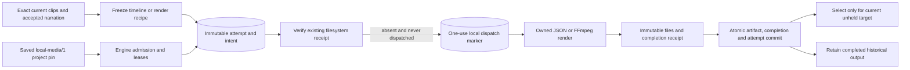

# Automatic local assembly

The optional `LocalMediaExecutor` connects real owned clips and accepted narration to Engine timeline/render jobs. It implements an application-owned local port, separate from generated-media providers. Registration is a trusted host choice. The launcher installs it when local media tools are available; new externally configured video projects receive its saved identity when H3 is explicitly enabled. Default demo and historical project behavior remain pinned.

## Identity and authority

The saved project lock, compiled node and installed local port must all select `local-media/1`. Missing or mismatched explicit local configuration cannot fall back to fixture generation. Historical nodes with no local identity retain their existing behavior. Local work has no generated-media candidate, reservation, allowance consumption or vendor task ID. Plan authorization, pause and relevant edit holds remain owned by the application.

Preparation resolves a full SQL capture. A timeline recipe includes ordered measured source descriptors, exact frame ranges/fit, all canonical narration sample ranges/placements/gain and normalization identities. A render additionally verifies the selected timeline document's canonical bytes, hash, size and managed path, then freezes output geometry and rendering toolchain. Preparation writes no media generation authority.

Work identity combines the node/input fingerprint with the complete content recipe. Publication-only revision and head fields remain in the captured target; they do not force a new render when content is unchanged. A binding selected from a cached result saves its **new** current capture separately from the original immutable attempt. Read-side filtering and readiness invalidation prevent a stale populated binding from bypassing the current-target check.

Timeline content is the SHA-256 of the full canonical document, distinct from its internal recipe digest. Render content includes the full manifest except its target revision and manifest digest. Cache lookup requires the same project, logical node, local identity and content/input fingerprint. Shared validation requires a complete capture and canonical recipe equality, including the exact source descriptors and placements; arbitrary JSON cannot stand in for a timeline.

The work key uniquely identifies an admission, while the fingerprint identifies reusable content. Its first-ordinal form stays unchanged. If every prior attempt for that content failed as `LOCAL_EXECUTION_STALE`, has no dispatch or completion, and captured a different target, a fresh admission uses the next ordinal in its work key. This permits repeated edits before initial dispatch without altering old intents or the historical unique-work database index. Any dispatched or otherwise failed predecessor still prevents automatic replacement.

## Execution and recovery

Engine inserts a local attempt and its exact intent together. The intent pins the capability lock, complete prepared inputs, request digest and stable output artifact ID. A shared SQLite lease admits one unexpired owned local assembly attempt. The local media service also enforces its existing process-level exclusivity with imports and normalization; this is a single-machine design, not a distributed worker protocol.

Recovery verifies owned filesystem receipts before any execution. The one-use dispatch record precedes timeline materialization or FFmpeg rendering. An interrupted dispatched job with no completion does not automatically render again. A completed file survives SQL publication failure and is recoverable without rerendering. Missing/corrupt evidence remains actionable; it never becomes permission to substitute a fixture or different media recipe.

The worker captures the original lease and cancellation signal, validates the immutable intent before and after asynchronous work, and checks measured output frames, geometry and audio against the frozen manifest. Engine separately streams and hashes the managed output before committing its artifact, local completion and attempt status in one transaction. It selects the result only if the current complete target still matches and relevant execution is unheld. Otherwise the verified result remains history. Succeeded-cache recovery is read-only and does not acquire authority to render again.

Recovery and byte verification renew the original attempt lease. Output files must be regular owned files beneath the artifact directory, with final symlinks rejected and exact streamed length/hash checked. Timeline JSON is capped at 1 MiB; render bytes use the installed host limit, never above 1 GiB. Artifact, receipt or current-selection transaction failure leaves the attempt recoverable. A dispatched job with no recoverable receipt reports `LOCAL_EXECUTION_INTERRUPTED`; explicit local retry remains a later feature.

Both Engine cycles wait for all child operations they started to settle before propagating an unexpected error. A failed sibling cannot make launcher shutdown close SQLite while another sibling still owns ingestion or publication work. Existing domain errors continue to appear as blocked work.

Limits retain the existing media contract: up to six minutes, 64 clips, 64 audio placements, eight audio sources/lanes, even output dimensions no larger than 1920 per side and 1920×1080 pixels, and configured byte/process bounds. Cancellation awaits the existing process cleanup. Separate worker instances can overlap process cleanup after lease expiry; this lease count is not a strict OS process-count guarantee. The production launcher retains exclusive installation ownership and one shared media instance. A hard backend crash has not established a stronger guarantee about a detached native child.

## Verification

Six real local integration cases passed using the actual human clip-import, narration acceptance/canonical commit and plan prepare/apply services. The automatic engine produced a two-second 160×90 export with 60 decoded frames: red followed by blue. Its accepted narration retained a nonzero source trim, sample placement and leading/trailing silence. All output hashes and measured picture/audio checks passed.

The same suite reopened the actual database after an injected artifact-publication failure, prohibited a second renderer call and recovered the saved output. It exercised late completion during pause and a human edit, reuse after a brief-only replan, reordered clips, and a one-sample canonical narration timing change. No media provider submission, candidate, grant, reservation or allowance consumption was created. These are synthetic local media tests, not a model-generated commercial or live H3 validation.

The server build and combined **20 focused checks passed**: six real integrations above, 12 controlled local execution tests and two execution-cycle draining tests. Controlled cases cover two pre-dispatch replans followed by restart and one execution, complete recipe/capture validation, stale-output filtering, missing runtime, two SQLite workers, lease theft, holds, corrupt results and separate artifact/receipt/selection rollback. Independent review also reran the corrected pre-dispatch scenario through the real worker and found no remaining blocker.

The complete checkout passed **842 tests with zero failures/skips**, all builds/typechecks and the installed no-turn Codex probe. A further integration test used the actual opt-in factory: injected image output → exact human keyframe approval → injected H3 completion → real normalization → automatic timeline/render. It decoded 180 blue frames and audible human-accepted synthetic tone audio in a six-second export. Two allowances were consumed, two local jobs had no paid candidates/reservations, and restart repeated no provider or render call. This establishes composition, not creative quality or live API compatibility.

Source: `execution/local-execution.ts`, `execution/local-media-executor.ts`, `execution/engine.ts`, `persistence/store.ts`, `test/local-execution.test.mjs`, `test/execution-cycle.test.mjs`, `test/local-media-executor.test.mjs` and `test/media-production-pipeline.test.mjs`. See [timeline storage](LOCAL-TIMELINE-DOCUMENT.md), [project pins](PROJECT-LOCAL-EXECUTION.md), and [cancellation/recovery](LOCAL-MEDIA-RECOVERY.md).
