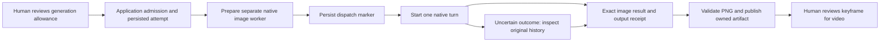

# Automatic Codex image provider

The `codex-image/1` adapter adds an automatic image route using the pinned local Codex runtime and ChatGPT authentication. It is separate from `openai-image/1`, which uses an OpenAI API key. Existing image execution records and the conversation director's tool policy retain their identities.

## Execution boundary

Admission pins the full installed profile, current candidate and exact consumed human allowance. The image bridge checks the original lease, edit holds, current prompt and ordered owned references before recording dispatch. Worker preparation validates the pinned runtime and ChatGPT authentication without a model turn. After the dispatch marker, uncertainty is reconciled against the original native thread; it does not authorize a replacement turn or API fallback.

The dedicated worker enables the native image tool while keeping inherited application tools disabled. The ordinary director still cannot directly generate media. Native turn requests include the saved prompt and ordered reference images. Requested 1024-square dimensions are preferences; the actual returned PNG is decoded and validated before publication. The provider-managed revised prompt is provenance, not proof that an internal image prompt stayed verbatim.

This first route supports shot keyframes. Standalone project-level image nodes are rejected before allowance consumption.

The first profile supports runtime `0.153.4`, orchestration model `gpt-6-astra`, one concurrent admission and no automatic retry. `codex-image-generation` names the managed image capability; it is not an exact image model or snapshot selector.

## Durable records and recovery

Four separate record families retain mapping, dispatch, observed native run and final result. Completed results bind the exact native image item to its output receipt, winning spool and published artifact. Equal image bytes in a different receipt do not substitute for this lineage. Engine recovery, image ingestion, storage validation and backup validation apply the same closure.

A completed image is retained locally for normal review and restart recovery. Uncertain native work uses read-only original-history lookup; absent or ambiguous evidence remains uncertain. Restored installations retain the existing recovery fence on new submissions.

## Usage and limits

A finite allowance caps admitted start permissions. One attempt can start at most one native turn; the native interface does not provide a hard limit on internal image-tool calls or expose a reliable quota estimate. Preparation can fail after allowance consumption but before starting a model turn. The UI therefore distinguishes used start permissions from verified billed turns or credits.

`unitCostMicros: "0"` means no direct image API dollar accounting. Codex subscription usage still applies. Authentication, current account eligibility and actual generated-media behavior require manual live validation; configured readiness is not that proof.

See the [manual live guide](MANUAL-LIVE-PRODUCTION.md) for both image choices and independent director authentication options. No automatic fallback changes the chosen provider or billing route.

## Verification

The final full suite passes 1,903 tests with zero skips, plus builds/typechecks. It includes 26 native-protocol checks and 23 server bridge/recovery checks. An actual connection-only worker probe and read-only known-history probe passed without any new model or image turn. First real image capture remains a manual-validation gate. See [sanitized evidence](codex-image-evidence.json).
