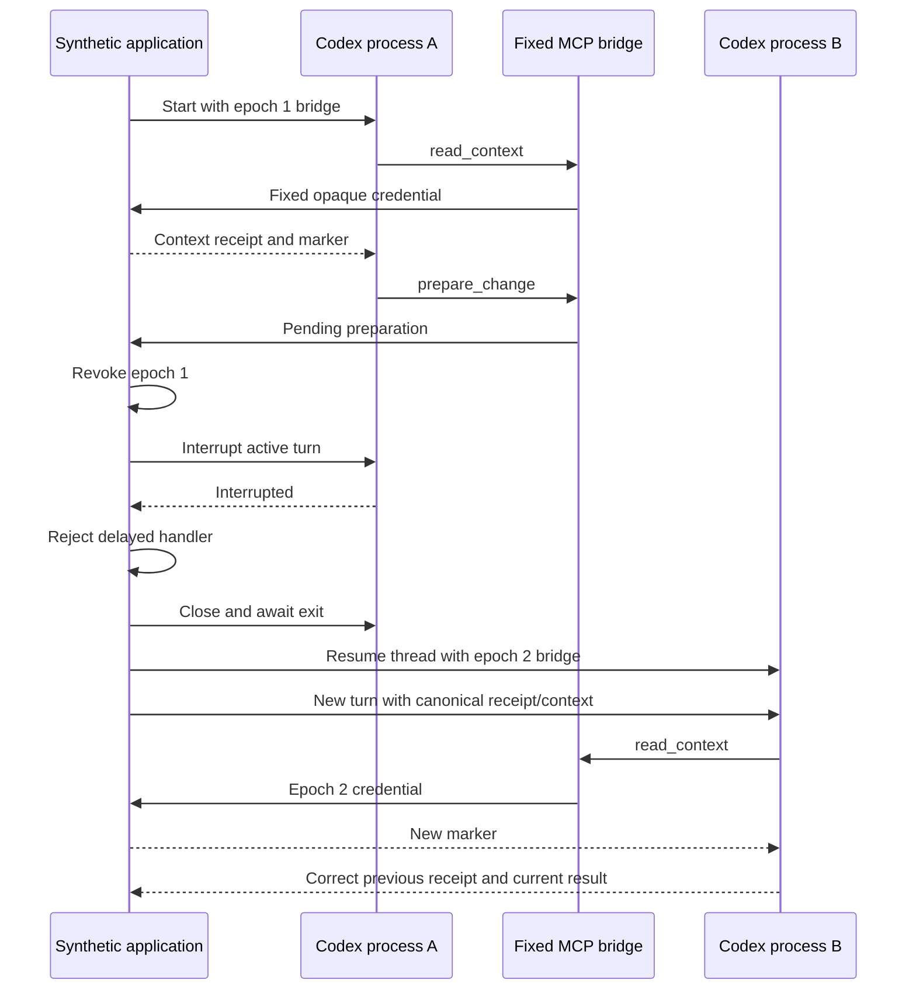

# Codex MCP and restart follow-up

Observed September 11, 2026 PDT (September 12 UTC), with `codex-cli 0.153.4`, Node 24.15.0 and GPT-6 Astra at low reasoning effort. The user approved up to three additional turn starts after the [first experiment](CODEX-LIVE-PROBE.md). Exactly three additional starts were used, six across both allowances. No image/video APIs or production project mutations occurred.

**Result:** live MCP dispatch, active interruption, late-call rejection, replacement-process resume and actual model continuation from application context passed. This establishes the planned MCP transport as a demonstrated integration path; production runtime isolation and skill injection remain separate gates.

A subsequent [native skills validation](CODEX-SKILL-VALIDATION.md) used a separate three-start allowance: two actual application-backed edits passed and command restrictions were verified; the code-host canary turn was inconclusive. This page preserves the historical MCP experiment.

## Results

| Additional start | Result |
|---|---|
| 1 | The native tool host and five-tool catalog loaded, but MCP calls were rejected before dispatch: native approval policy was `never` and the tools required approval. No fixture call arrived. |
| 2 | With only the synthetic `read_context` and `prepare_change` tools explicitly approved, Codex completed a context read and invoked preparation. The host revoked epoch 1, interrupted the turn, and released the held handler. Its stale credential was rejected. |
| 3 | After confirmed process exit and replacement, Codex resumed the same thread, received a canonical application receipt/context snapshot, called `read_context` under epoch 2, and returned both the prior receipt marker and new tool marker correctly. |

The successful sequence used explicit legacy history mode and a fixed stdio MCP catalog. It did not use experimental dynamic tools. The replacement process had a distinct PID, and both processes exited cleanly. The fixture also rejected a request using the old credential after replacement. Every synthetic thread created during preflight/live work was archived.

## Configuration and authority

Before each live process, no-turn checks verified the pinned binary, configured native authentication, required native tool host, exactly one connected synthetic MCP server, the five expected tool names, no enabled discovered skills and disabled shell/apps/browser/media tools. Arrays and forged credentials were rejected by the fixture.

The first start exposed another required configuration distinction: tool availability does not imply dispatch permission. For the next two starts, only the two harmless fixture tools received explicit per-tool `approval_mode: "approve"` overrides. All other settings stayed restricted. No personal configuration file was modified. The [official MCP guide](https://learn.chatgpt.com/docs/extend/mcp) describes per-tool approval controls; the [App Server reference](https://learn.chatgpt.com/docs/app-server) describes interruption and resume.

For OpenSlate, permission to call an application tool must remain separate from approval of a keyframe, budget admission or authorization of another candidate. The service checks those conditions even when its MCP tools are preapproved. Native approval settings are not a substitute for immutable request credentials and commit-time application checks.

## What this does and does not prove

- The model continued after restart **with application-supplied context**. It was deliberately given the prior receipt. This does not establish native recall without reconstruction, nor lossless native tool-history hydration.
- Epoch rejection was exercised in a synthetic handler. The application database tests separately cover durable authority, receipts and candidate admission.
- Native authentication reused the configured ChatGPT account without reading or copying its credentials. Production credential/state isolation has not been demonstrated.
- No explicit production skill injection, vision, pending-input reply or adversarial filesystem/network isolation test was performed.
- `turn/start` is the allowance unit. A single turn can make several model inference steps while using tools.

The [sanitized machine-readable summary](codex-mcp-followup-evidence.json) contains measured outcomes without native session paths, credentials or account identifiers. All six authorized starts are exhausted; any further live turns need another allowance. Offline implementation and tests continue independently.
