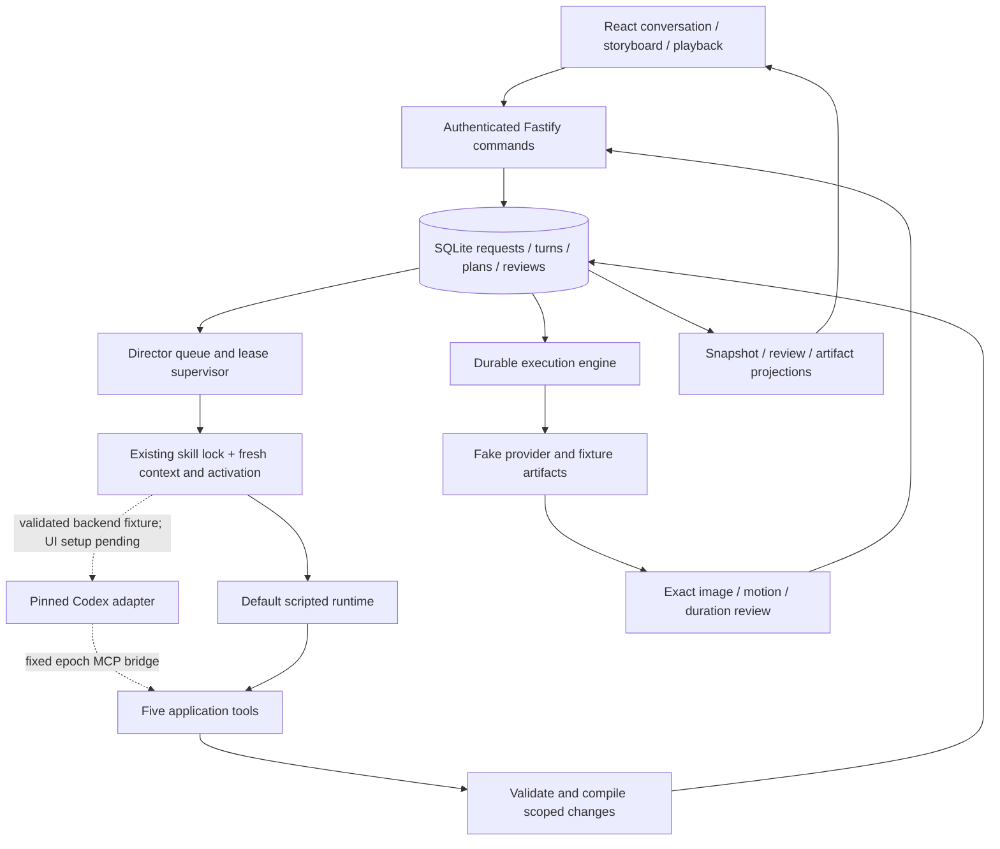
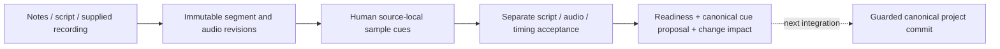

# Conversation workspace, supervised director and local services

September 12, 2026. This describes implemented code after foundation commit `e9f9c46`. The new slice is local working-tree work. Its default application and tests use fake model/media adapters; the separate native diagnostic and successful actual supervisor fixture are recorded below.

## What a user can do now

Run `pnpm dev`, connect with the local session token and create a project. **Create 2-shot demo** submits a recorded human demo request, installs synthetic source material and grants bounded fake generation. The scripted director produces a validated plan through the same prepare/apply tool handlers used by the native runtime. Two keyframes appear for review. The user inspects and selects exact frames before approving their sample videos.

Selecting **Discuss** on a shot supplies conversation scope. The demo's **Close-up** and **Wide** choices apply scripted creative changes. A changed shot gets a new frame and needs new approval; the other shot keeps its compatible artifacts. The last successful preview stays visible while its replacement is pending. Ordinary free-text chat is persisted but receives canned guidance; this is not yet general AI conversation.

V0 runs for one user on one computer: UI, API, SQLite, media files, supervisor, operation workers and native Codex stay on that machine. Cloud LLM and media services are still initial production dependencies, so local deployment is not offline generation. Multi-host deployments, remote GPU workers and shared databases are outside this scope.

## Connected architecture



The local narration and FFmpeg services below are separate modules awaiting integration with this flow. Their tests use real synthetic audio/video; they do not turn the browser's fake preview into a production render.

## Components and execution logic

| Component | Responsibility and contract |
|---|---|
| `apps/web/src` | Project list, conversation, narration summary, scene plan, storyboard, playback, decisions and controls. Fetch protected media as blobs, verify SHA-256 and release object URLs. Keep token only in memory. |
| `app.ts` | Authenticate human commands; persist idempotency results; enqueue requests; serve exact review descriptors and project-owned verified artifact bytes. Only the dedicated fake demo endpoint creates fake allowances. |
| `director-supervisor.ts` | Own durable turn admission, one active turn per project, lease renewal, stale-epoch fencing, question continuation, output attribution and outcome reconciliation. Different projects may progress concurrently. |
| `director-input.ts` | Load two trusted skill packages once, verify/reuse a project's immutable lock, and capture current application state with a new activation/read record for each request. |
| `packages/director/src/runtime` | Normalize fake/native runtime events, enforce bounded transport and lifecycle, and keep native protocol details outside application services. |
| `tool-invocations.ts` | Persist before dispatch, return known receipts on retry, and reconcile revoked-epoch outcomes from matching application evidence without replay. |

### Requests, interruption and recovery

```mermaid
stateDiagram-v2
  [*] --> queued: authenticated request
  queued --> running: claim lease and persist intent
  queued --> interrupted: superseded before dispatch
  running --> completed: matching terminal result
  running --> waiting_user: persisted question
  running --> interrupted: confirmed interruption
  running --> unknown: lost owner or uncertain outcome
  running --> failed: known failure
  waiting_user --> [*]: reply creates a new request
  unknown --> [*]: reconcile records; do not auto-repeat
```

1. The human command records its request and optional scoped hold. The supervisor queues that request exactly once.
2. A short transaction claims one project turn. It persists dispatch intent before calling the runtime. Native bridge credentials remain in memory; only authority records/hashes and sanitized output are saved.
3. Context contains current project evidence, canonical plan access and receipt summaries. Existing skill snapshots are verified, not silently upgraded. A first read-only conversation can bootstrap its application-selected lock without acquiring editing authority.
4. The runtime emits events bound to project/request/epoch/turn. Mismatched or stale output cannot become the current response. A newer edit revokes the old epoch before replacement; pause aborts active reasoning and blocks queued work.
5. A lost supervisor lease on this machine becomes `unknown`. An unacknowledged abort stays unknown rather than claiming successful interruption. The application never automatically starts the same uncertain model turn again.
6. Reconciliation checks saved preparation/domain-command evidence. It adds an immutable `tool_reconciliation` record without rewriting the original transport outcome or repeating the operation. Missing evidence remains a follow-up requirement.

Questions persist as `director_question` records exposed in the snapshot. An authenticated answer identifies the pending question and explicitly continues its originating request. It creates a new request/epoch and records hold transfer. A stale question cannot borrow authority after a newer edit. The adapter denies native interactive requests, surfaces supported question data, then stops the old run; it does not retain an old native request for a later privileged reply.

### Runtime and skill boundary

The implemented port is `DirectorRuntime.start(input, { signal, onEvent })`. The application supplies current context, explicit skill entry references and an immutable bridge configuration. The runtime returns a known or unknown result plus whether it attempted `turn/start`.

`CodexDirectorRuntime` is pinned to 0.153.4 and uses local stdio App Server. It verifies version, effective named permissions, exact MCP tools and selected skills; bounds process output/event delivery/time; and terminates its process group on shutdown. Mismatching checked configuration, catalogs or instruction sources fail setup. Unexpected interactive approval requests during a run are denied. These checks do not enumerate or prove isolation of every native capability. Protocol choices follow the official [App Server documentation](https://learn.chatgpt.com/docs/app-server), with exact shapes tested against the pinned fixtures.

The accepted policy requires `LocalCodexPolicy` with mode `local`, an exact pinned runtime version and configuration identity. V0 trusts the installed native runtime and its sandbox; it does not expose a separate externally confined mode or require an independent code-host/authentication isolation assertion. Those boundaries remain unverified, and a trust decision does not prove them. Effective permissions, exact MCP/skill catalogs, loopback transport, immutable epochs and application authorization remain enforced. The actual supervisor/native backend fixture has passed; the default app still constructs only `FakeWorkflowDirector` while local runtime configuration and browser wiring are completed. See the [accepted boundary](RUNTIME-TRUST-DECISION.md).

Each dispatched application request reconstructs context. When connected to the native adapter, it will start a fresh native thread/process; the default scripted app starts none. Optional `resumeThreadId` is supported by the adapter and fixture tests, but the application does not supply it. Logical project continuity comes from SQLite, not native recall. Actual supervisor-driven conversational continuation passed across a backend restart with this reconstruction. Native structured user-input handling and vision still need live validation.

The input builder locks production and plan-authoring packages and reads four focused entry/reference files per request. All stage-prompt identities are locked; selecting the appropriate stage-specific guidance from actual model proposals remains further integration work. Current bindings cover runtime port identity, recipe/stage contracts and tool catalog; they do not hash every implementation binary or freeze hosted model weights. Updating installed package bytes cannot silently alter an existing project's lock.

### Review and browser persistence

- Selection is tied to a server review snapshot, exact conditioning bytes, motion prompt, duration and profile. The image must finish loading before selection. Changed review identity clears old selection.
- Approving a subset releases only that subset. Stale or mismatched approval is rejected by application services even if the browser is outdated.
- Protected content checks project ownership, immutable SHA-256, allowed MIME type, file boundaries and size. The browser additionally verifies the bytes before displaying them.
- Previous previews come from successful render attempts, so updating a stable node binding cannot erase preview history.
- The browser polls with bounded backoff and refreshes review only when its cursor changes. Durable SSE exists on the server; browser SSE consumption is deferred. Reload restores project/conversation state after reconnecting with the local token.

## Narration draft service — T07 slice

`apps/server/src/narration` provides a programmatic `NarrationService` over the existing production authority and local media services.



The mutable `narration_state` points to immutable revisions, segment selections and acceptance IDs. Script, audio and timing readiness are independent. A generated-source choice records pending intent; a supplied recording marked generated is a human-declared origin, not provider evidence. No synthesis/transcription is performed.

Imports preserve originals and normalize audio to 48 kHz. Source-local cue endpoints remain separate from timeline placement. Authority is checked before expensive media I/O and again against the original request before committing results. Human acceptance binds exact subjects; an edit cannot recycle stale acceptance or mutate recorded audio to match new text.

Projection reports readiness and per-segment visual/render impact. Placement alone changes rendering while preserving relative visual duration; source-frame coverage is calculated separately to avoid subframe rounding causing unnecessary regeneration. Equal normalized audio bytes may be reused even if descriptor identities differ. Meaning or relative duration changes require visual replanning.

Every projection explicitly reports `canonicalApplied: false`. Even `readyForCanonicalCommit: true` does not write canonical project cues, acquire/release execution holds, update shots or authorize paid generation. The next integration must atomically compare the draft/project versions and apply the projection through normal scoped changes. UI uploads, five-tool commands, ASR/TTS and provider provenance remain open. Sources and coordinates are capped at 360 seconds; trimming a later range from a longer recording is not supported yet.

## Supplied-media renderer — T08 slice

`apps/server/src/media` provides `LocalMediaService` with application-owned roots, explicit allowed input roots and absolute FFmpeg/ffprobe paths.

1. Import only supported local files. Reject remote URLs, symlinks, outside-root files, unsupported containers and excessive bytes/duration. Preserve original bytes and normalize video to silent 30 fps MP4 or audio to stereo 48 kHz WAV.
2. Resolve service-issued sources into a frozen manifest of ordered visual cuts and sample-based audio placements. Validate actual measured source ranges, dimensions, contain/cover fit and total duration. Do not loop or silently truncate short media.
3. Verify source and executable digests, then run bounded child processes with argument arrays, fixed allowed protocols and an explicit environment. Model text never becomes a shell command.
4. Verify rendered output, install immutable files and write a completion receipt. A trusted synchronous publication callback must compare target revision and register/select the artifact in one application transaction. Stale output remains historical.
5. If publication fails after output installation, recover from the verified receipt. Cancellation waits for child exit and cleans temporary work. Retain originals.

Current limits are 360 seconds, 64 clips, eight audio tracks, one active render per service instance, fixed gain and simple cuts. Embedded video audio is discarded; import audio separately. Captions, overlays, fades, transitions, ducking, full disk accounting and canonical timeline resolution remain pending. The worker's bounds are not an OS memory sandbox or power-loss guarantee. Project/source authorization and the final publication transaction belong to its future application caller. Its files are not yet registered with executor/browser artifact routes.

## Verification and review

Node 24.15.0 / pnpm 10.33.0: `pnpm check` with the opt-in installed Codex **no-turn** probe passed **287 tests, zero failed/skipped**, all builds and all typechecks. The new suites include 32 runtime, 14 supervisor, six workspace API, 16 browser-model, 11 narration and 13 real local-media tests. The remaining tests retain the earlier foundation coverage. No model/media API calls were made.

Manual browser verification covered connection, creating a project, the two-shot demo, reviewing both keyframes, video/preview playback, one-shot reframing, unchanged approval on the other shot, prior preview visibility, reload/reconnect persistence, pause/resume and a first read-only conversation. This is a developer smoke test, not a complete accessibility audit or user acceptance study.

Parallel implementation and independent review corrected exact permission equality, first read-only skill initialization, uncertain abort classification, preview-history lookup, repeat project/control commands and narration placement rounding. All received regression coverage. Linux CI has not been observed for this unpushed work.

September 12 follow-up: [native validation](CODEX-SUPERVISOR-VALIDATION.md) found the permission null-serialization mismatch, now fixed with three further regressions; the pre-decision complete suite reached 290 passing tests. The separate NativeClient live code-host diagnostic was declined, leaving independent isolation inconclusive. At that point ten native starts had been used overall and two remained in the latest allowance. The [runtime trust decision](RUNTIME-TRUST-DECISION.md) now accepts the single-machine local boundary and trust in the pinned installed runtime/sandbox; this changes the integration prerequisite, not the diagnostic evidence. The default app remains scripted while local native configuration and browser setup are completed.

The accepted local policy, its exact configuration checks and an added non-loopback launch regression subsequently passed the full suite: **291 tests**, including **36 runtime tests**, with all builds/typechecks and the installed no-turn probe.

The two remaining starts then passed using the actual `CodexDirectorRuntime`, `DirectorSupervisor` and `createDirectorInput`. First, a conversational framing question was saved. After backend restart over the same SQLite database, its answer applied a shot-1 edit with a matching plan. Shot-2 bindings/node/output/candidate state stayed unchanged, as did narration, story, motion and timing. The project reused its skill lock with a fresh activation and epoch; the old bridge returned 403. No media attempts, artifacts, approvals or media API calls were created. This was ordinary conversational question handling, not native structured pending-input. Native threads were archived and processes closed.

Observed question and answer/edit durations were approximately 6.4 and 31.3 seconds, including native setup/cleanup. Twelve native starts have now been used overall and the latest allowance is exhausted at three of three. The 291-test offline baseline is unchanged. Native structured questions, vision and broader stage/gap behavior remain unverified.

Next: local native runtime configuration/browser wiring and stage/gap/vision evaluations, alongside guarded narration/canonical-render integration. Real adapters, a short production and the larger commercial/six-minute acceptance workloads follow. The [status page](STATUS.md) remains the task ledger.
