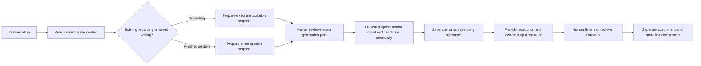

# Conversational audio preparation and review

## Boundary

V3 adds two director tools: `prepare_recording_transcription` and `prepare_narration_speech`. They create immutable, ungranted proposals. The application loads the actual owned recording or saved narration section; the director cannot substitute words or file paths in a speech request. Native conversation, human generation review, spending permission and acceptance of finished narration remain separate steps.

## Skills and tools

Fresh director contexts use the immutable V3 catalog and skill packages. V1/V2 catalogs and skill files remain unchanged; existing projects retain their locked version until explicit upgrade. Old epochs retain their original lock. The context identifies actual tool availability separately from host media readiness.

`audio_operations` provides bounded current section and recording identities, installed profile options and saved proposal history. The director uses those identifiers, asks about missing intent and prepares only the selected operation. Long writing must be explicitly split into saved sections; preparation does not secretly rewrite or split the text.

Each tool invocation retains its original actor, request, epoch, signal and stable command key. Lost responses resolve the exact durable receipt. A superseded request cannot acquire fresh authority while recovering a historical result.

## Saved-section speech

A proposal pins the section revision and digest, exact text, voice, delivery instructions, profile, base project/plan, capability lock, stage versions and composed operation graph. A saved voice/profile choice must agree with the requested choice. The first adapter uses built-in voices and the existing conservative request byte limits.

The restricted composer appends one speech operation and retains the complete existing plan and logical IDs. It runs in the same bounded isolated planning worker as recording transcription composition. No arbitrary TypeScript execution is added.

Human review checks the current proposal and atomically publishes one purpose-bound grant, prepared plan, candidate and exact application receipt. Execution admission and the first provider marker validate that chain and the current section. Editing the selected section blocks an unstarted old request; unrelated section changes do not rewrite its words. After dispatch, recovery follows the original attempt and saved evidence.

## Persistence and review UI

Proposal, review and application records are immutable. Store validation checks the exact application/attempt relationship. Backup inspection independently recomposes saved source and validates the closure. Restore preserves historical review evidence while permanently fencing imported authority from a fresh start.

The narration workspace displays exact words, voice, instructions, model and configured estimate. It supports preparation, stale-plan feedback, history and direct navigation to the matching spending review. Reloading and uncertain responses reuse the existing action identity. The generated recording still requires listening review and explicit attachment; generated text/timing does not become accepted narration automatically.

## Validation and remaining work

Automated verification covers composition, legacy catalog compatibility, actual tool routing, cancellation/replay, human-only approval, section changes, atomic rollback, admission/dispatch fences, bounded projections, authenticated HTTP and real same-root backup/restore. Provider HTTP in these tests is injected; it does not establish voice quality, transcription accuracy, vendor billing or live service compatibility.

Follow [manual audio testing](MANUAL-AUDIO-TESTING.md) before real production validation. Browser recording upload and the overall conversational usability need the user's manual confirmation. All media workers stay disabled for that rehearsal. Live Viggle remains explicitly on hold; release work also waits.

## Native conversation evidence

One bounded native Codex 0.153.4 turn passed 18 checks in 28.451 seconds. Through the actual controller and HTTP tool route, it made four successful context reads and one `prepare_narration_speech` call. The resulting ungranted proposal preserved the exact saved words, selected voice and empty delivery instructions. No grant, spending allowance, media call, plan replacement, narration acceptance or attachment occurred. Exact message replay made no second start; a read-only reopen retained the proposal. Native processes exited and the test thread was archived.

A separate no-turn setup run passed 11 checks. The bundled app binary had updated to 0.154.0-alpha.6.2 and correctly failed the existing compatibility pin. Validation used an isolated official npm installation of `@openai/codex@0.153.4`; no global installation, project dependency or runtime pin changed. The manual guide includes that same separate-install approach.
