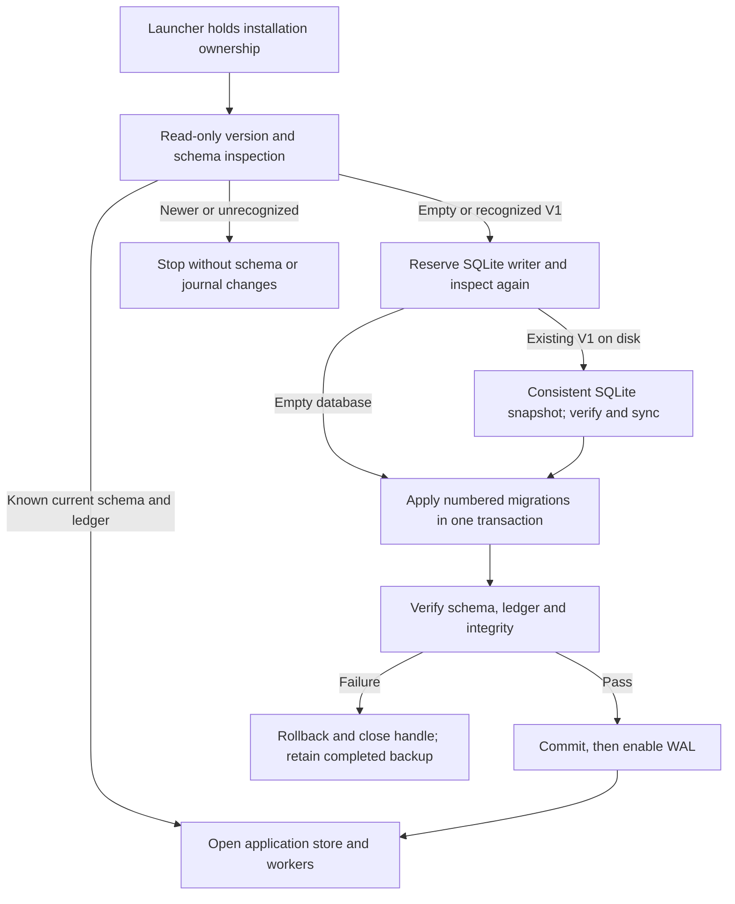

# Local database migrations

OpenSlate now opens local project databases through numbered, checksummed schema migrations. Schema V2 adds a migration ledger and an execution-evidence lookup index. It does not rewrite project records, commands, events, receipts, or their JSON strings. This is a database migration and backup foundation; media-inclusive exports, imported-installation ownership and restore-starts-paused behavior remain separate release work.

The launcher already takes exclusive installation ownership before it constructs `Store`, starts workers or recovers execution. Direct service harnesses do not take that launcher lock; the migration runner also takes `BEGIN IMMEDIATE` and rechecks the schema after obtaining its writer reservation. If another process completed the upgrade while it waited, it uses the completed schema without another backup or migration.

## Schema and compatibility

| Component | Responsibility |
|---|---|
| `persistence/schema.ts` | Frozen migration definitions, SHA-256 checksums, supported version and read-only compatibility/integrity checks |
| `persistence/migrations.ts` | Upgrade transaction, pre-upgrade snapshot, ledger insertion, validation and rollback |
| `persistence/database-snapshot.ts` | Private, exclusively created SQLite snapshots, committed-WAL consistency, validation and filesystem sync |
| `persistence/store.ts` | Initialization and handle cleanup; the existing backup, check and restore entry points |

The V1 definition captures the historical four-table schema and its known indexes. Earlier V1 builds added indexes without changing `user_version`, so V1 compatibility accepts missing known indexes, including the director request/running indexes. Required tables and every present schema definition must match. The upgrade creates missing indexes inside the migration transaction; if legacy duplicate records violate an index, it fails without deleting or changing those records. Unrecognized tables, indexes, views or triggers are rejected.

V2 records each migration's version, name, checksum, application timestamp and mode. A new database records both migrations as `applied`. An existing recognized V1 records its baseline as `adopted`: this acknowledges validated historical structure without claiming that the new runner executed its old DDL. The V2 ledger/index migration is `applied`. Subsequent opens verify the exact schema and ledger and leave their timestamps unchanged. A newer version, missing required definition, or altered checksum/history fails before a writable connection changes persistent journal settings.

Checksums cover the numbered migration's version, name and exact SQL text. Shipped definitions are immutable; future schema changes add a new numbered migration and extend compatibility validation. This version implements only empty-database initialization and V1-to-V2 upgrade, with no downgrade or destructive conversion path.

## Backup and restore

Before changing an on-disk V1 database, the runner creates a uniquely named backup at `<database-path>.migration-backups/v1-to-v2-<uuid>.sqlite`. The source holds its writer reservation while a separate read-only connection creates the snapshot with SQLite `VACUUM INTO`. It includes committed data still in the WAL. The backup must pass supported-schema, SQLite integrity and foreign-key checks, then file and directory sync, before any migration DDL executes. New backup directories are private and their directory entries are synced; snapshot files are created exclusively with mode `0600`.

A backup failure prevents the upgrade. A later migration failure rolls back all schema/ledger changes and retains the completed backup for inspection. Backups are not deleted automatically. Fresh databases do not need pre-upgrade backups. Initialization failures close the database handle, allowing a corrected installation or legacy-data issue to be retried.

`Store.backup` keeps the asynchronous SQLite online-backup API, verifies the result and syncs it before reporting success. `Store.restore` now creates a verified SQLite snapshot of the source into a new destination, rather than copying only the main database file. This preserves committed WAL content and excludes another connection's uncommitted writes. Restore preserves the source schema version; opening a restored V1 database through `Store` performs the normal backed-up migration. Existing destinations, source aliases and dangling destination links cannot be overwritten. A failed copy removes only the destination file this operation exclusively created.

These snapshots contain the installation database, not referenced image/video/audio bytes or external credentials. A consistent database snapshot alone is not a complete project export or permission to activate a second dispatcher. Automated checks use disposable synthetic fixtures only; no user's database was migrated for validation.

## Verification

Nine migration tests plus the five existing persistence tests pass. They cover fresh/in-memory/current opens, unchanged ledger on reopen, historical V1 missing indexes, exact saved JSON and row identity, WAL snapshots, private backup permissions, two real processes racing one upgrade, real uniqueness-failure rollback, interrupted first initialization, failed-handle cleanup, newer/unknown/checksum rejection without database-file mutation, backup failure and non-overwriting restore. The fixture contains literal historical DDL independent of the migration manifest. Exception rollback is tested; power-loss testing and a packaged clean-install/restore campaign remain pending.
