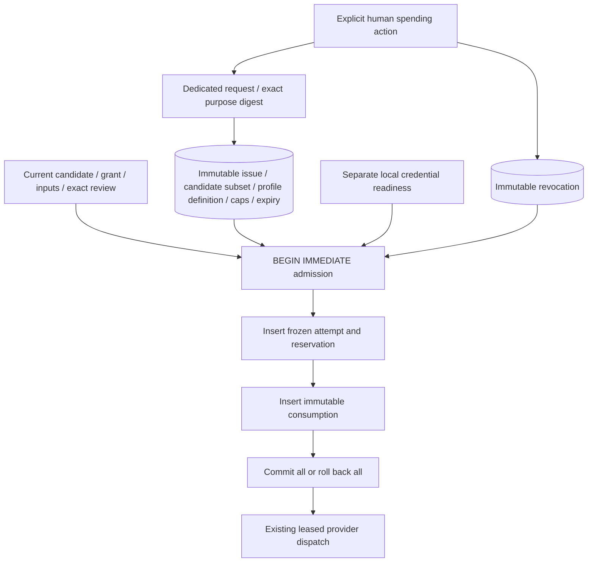

# External spending allowances

OpenSlate now has an opt-in durable admission policy for external providers. It is exercised with offline adapters and synthetic inputs. The launcher remains fake-only; this component adds no HTTP endpoint, credential configuration, real provider activation or model call.

An allowance bounds **attempt starts and configured cost estimates** for an exact set of candidates. Its micros cap is not a guarantee about the provider's eventual bill. The absolute start cap remains binding even when an estimate is inaccurate. Credentials, creative grants and spending permission are separate requirements.



## Human authority without creative side effects

`ExternalAllowanceService` is an application boundary intended only for an authenticated human handler. It is not a director tool. The eventual handler must mint a dedicated human request whose `contextDigest` is produced by `allowanceIssueContextDigest(projectId, payload)` or `allowanceRevokeContextDigest(projectId, payload)`. Each digest contains an exact purpose tag, contract version, project and complete payload. Generic read-only discussion, a different payload, another principal/project, a director actor or a superseded request cannot authorize spending.

The request may use `editing: false`. Issuing or revoking an allowance does not open a request, revoke a director epoch, create/release creative holds, grant generation, approve frames, change the canonical project or compile a plan. The service checks that the supplied request is active and scoped to the selected shots/scenes, or to the whole project. Revocation requires project scope. The HTTP handler that will create these purpose-bound requests remains separate work.

The issue payload is bounded data:

```ts
{
  profileDigest: string;
  profileDefinitionDigest: string;
  selections: Array<{ candidateId: string; nodeId: string; specDigest: string }>;
  maxAttempts: number;
  maxEstimatedMicros: string;
  expiresAt: string;
}
```

`profileDigest` is the execution/model/settings identity already frozen into compiled nodes. `profileDefinitionDigest` is the digest of the **entire pinned ProviderProfile**, including price and limits; it matches the catalog's definition digest. These identities deliberately serve different purposes. A changed price, concurrency limit or retry policy cannot reuse an old allowance merely because its execution configuration is unchanged. Existing immutable capability locks already prevent edits to a lock; the full definition digest also preserves this contract if a future catalog workflow selects another lock.

Selections must be unique, contain one to 800 current unfinished nodes and match their immutable candidates, exact specification digests, active plan bindings and pinned profile. A new take gets a new candidate and needs new spending authority even if its creative instructions are identical. Scoped plan updates may retain unchanged candidates and their existing allowance. The count cap is an integer from one to 10,000; estimates are nonnegative decimal USD micros within SQLite integer bounds. Expiry must be a canonical UTC ISO timestamp in the future and at most thirty days after issue.

One issue is stored under its human request ID. Replaying the same request/payload returns that exact receipt, including after work has advanced; it never creates additional capacity. Revocation is stored once under the allowance ID and cannot be undone. Increasing a cap, extending expiry, changing a profile or changing the selected candidates requires another explicit human issue.

## Atomic admission and permanent consumption

`DurableExternalAdmission` implements the optional trusted `ExternalExecutionAdmission` policy. Its constructor receives the same `Store` used by Engine and a synchronous local readiness check. The check may inspect the fixed credential alias selected by the trusted host, but must not perform network work or persist/return credentials. Adapters still resolve credentials at use time because availability can change after admission.

Engine's existing transaction first checks current work, grant origin, holds/pause, exact keyframe review and timing for video, retry eligibility, capacity and project budget. `authorize` then re-reads the exact current candidate and full profile definition, checks readiness, and chooses an unexpired/unrevoked allowance with sufficient remaining count and estimate. Matching allowances are ordered by issue time and ID. One allowance must cover the whole attempt; several insufficient allowances are never pooled.

The returned allowance ID enters the immutable attempt request. After inserting the attempt and reservation, Engine invokes the optional synchronous `recordAdmission(attempt)` hook before committing. The durable policy rechecks the selection, full profile definition and allowance, then inserts a consumption whose ID is the attempt ID. A missing credential, failed cap check, changed selection, failed consumption insert or asynchronous hook rolls back the whole admission. There is no partial attempt without its consumption when this policy is installed. Both methods require the Engine transaction; separate SQLite workers serialize admission using the existing writer lock.

Every committed admission permanently consumes one start and its configured estimate. Cancellation, rejection, local failure, provider failure, missing output, successful output and uncertain submission do not refund this capacity. Even a crash after admitted intent but before HTTP retains consumption. A confirmed rejection may release the existing project reservation according to Engine rules, while allowance consumption remains intact. A permitted technical retry is another attempt and consumes another start and estimate. The component adds no retry permission or quality-based retry.

Expiry and revocation block **future admission**. They do not cancel an already admitted provider request, erase a liability, invalidate an observation or prevent reconciliation. Existing admitted work uses its frozen request and lease; reconciliation does not invoke the allowance policy or consume again. Actual provider charges remain distinct from these estimates.

## Durable records and projections

| Record family | Immutable identity and reference checks |
|---|---|
| `external_allowance` | Issue request ID, same-project human request/context, principal, both profile digests, selected candidates/nodes/specs, count/estimate caps, currency and timestamps |
| `external_allowance_revocation` | Allowance ID, exact same-project allowance and purpose-bound human request, principal and timestamp |
| `external_allowance_consumption` | Attempt ID, same-project allowance/attempt/reservation, candidate/node/spec, both profile digests, full admitted request digest, configured estimate and timestamp |

Store validates exact field sets, bounds, reference ownership and consumption identity. The service and policy enforce current human authority, selection state and caps; Store does not grant spending authority to callers. Record publication is append-only. This uses existing generic entity storage and requires no schema migration.

The human project projection reports issued limits, consumed/remaining starts and estimates, expiry and revocation. Remaining amounts are accounting values, not usable permission when the allowance is expired/revoked, the selection is stale, or another Engine gate blocks work. Receipts contain no credentials, host paths, vendor request bodies or actual-billing claims.

## Verification and integration limits

All **22 allowance tests** passed. The combined allowance, routing, execution and image-bridge regression run passed **69 tests**, with zero failures/skips, after successful provider/server builds. Tests cover hold-free human issuance, purpose/scope rejection, exact selection/profile binding, thirty-day expiry, deterministic matching without pooling, count and estimate limits, missing readiness, asynchronous-hook rejection, atomic rollback after attempt insertion, permanent consumption on rejection/unknown, technical retries, restart before dispatch, video review, immutable references, future catalog definition changes, and two independent SQLite workers racing the final permitted start.

Sources: `apps/server/src/application/external-allowances.ts`, `apps/server/src/execution/durable-external-admission.ts`, `external-allowance-records.ts`, the optional Engine admission hook and Store record checks. Tests: `apps/server/test/external-allowances.test.mjs`.

Remaining integration work is an authenticated human issue/revoke flow, explicit profile selection, credential readiness wiring, launcher activation and separately authorized live media validation. The default Engine behavior remains external-denied unless a host deliberately installs a policy. Existing offline fixture policies remain compatible with the optional recording hook; their correlation IDs do not represent these durable human allowances.
