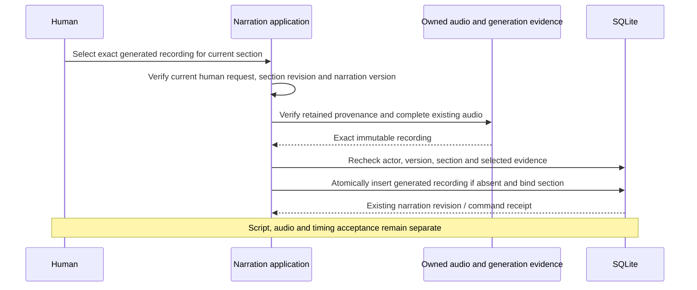

# Attach generated audio to narration

September 12, 2026. **Next implementation slice.** Speech execution, generated-audio ingestion and unreviewed transcription candidates are implemented through explicit host composition. This slice lets a human select an existing generated recording for a draft narration section. It does not generate new audio, accept script/audio/timing, adopt transcript words or activate paid audio workers.

## Identity and compatibility

Preserve historical `NarrationAudio` records exactly: `{id,projectId,media,declaredOrigin,requestId}` describes a human-supplied recording. Its `declaredOrigin:"generated"` remains a human label for audio made elsewhere. Do not add defaults to old serialized records or reinterpret that label as OpenSlate provider evidence.

Add a separate verified-generated variant whose `id` equals the existing generated artifact ID and whose `media` is the unchanged normalized source descriptor. It carries a versioned generation-evidence object instead of a declared origin or upload request. The first verifier supports exact completed `openai-speech/1` evidence; additional adapters can later supply explicit versioned validators. A generic `origin:"generated_audio"` label alone is insufficient.

The evidence pins artifact ID/digest, attempt/full request identity, exact speech mapping/dispatch/result, winning raw receipt/spool, normalization intent/receipt and normalized source. Require a succeeded attempt whose `outputs.audio` equals the selected artifact, and a `charged` reservation. The output need not remain the active node binding; historical takes are eligible. Reuse the existing consumed-approval and speech-output lineage validators. Verify both actual managed audio bytes and the frozen normalized descriptor before attachment. A proposed filename, current default model or an earlier conversation cannot substitute this evidence.

Keeping the existing artifact ID preserves narration's `audioId == media.artifactId` invariant and the existing keyed transcription source lookup. Equivalent `media_source` and `narration_audio` records can coexist without replacing an already pinned provenance reference. No copying, renaming, new normalization or regenerated descriptor is needed to turn an existing generated artifact into a selectable recording.

## Human action and durable selection

The input binds expected narration version, section ID and exact section revision, artifact ID/digest and generation-evidence digest, plus the existing idempotency key. Capture the original actor, input and cancellation signal before awaited verification. Check authority before reading media and again in the transaction; reject a superseded request, changed section/version or cancelled operation rather than selecting against a newer request.

After checking the applicable actor/recovery fence, resolve an already successful exact request-scoped command before new asynchronous verification or current-version checks. A lost response can then replay its original result after a later narration edit without making a second selection. Reject key reuse with a different input digest. A first publication still repeats current actor/version/evidence checks inside its transaction; elapsed time or an earlier request cannot grant fresh authority.

Use the existing narration mutation/command mechanism to publish the generated recording and binding atomically. The immutable narration revision retains the selecting request; the request-scoped command digest binds the exact action/input/version. Include the small selected IDs/digests in the new action event for audit. A separate attachment-receipt family is unnecessary. Later human selections reuse the same immutable recording and receive their own existing narration revision/command receipts.

The section must already choose generated audio as its source. Preserve its wording, meaning, placement and future voice/profile preferences. The existing readiness rule reports missing synthesis preferences only while the section lacks audio; retain that behavior when a verified recording is attached. Do not silently rewrite draft preferences to match the selected take. Existing supplied-recording behavior remains unchanged.

Changing the selected audio clears only that section's audio/timing acceptance and cue, using the existing binding semantics. It does not accept anything or change canonical narration, shots, plans, holds, grants, allowances or other sections. Human script/audio/timing review and canonical prepare/apply remain the later steps. Historical generated output remains eligible for fresh human selection after installation recovery release; its old request/allowance never acquires fresh submission authority.

The existing synchronous `bindAudio` method accepts director actors and its HTTP binding route serves the saved-recording dropdown. That path must reject the new verified-generated variant, or explicitly delegate to the new human-only asynchronous action with its full frozen input. A previously attached generated recording must not bypass evidence, byte or authority checks merely because it is already in the library. Keep ordinary supplied-recording behavior unchanged and have the UI choose the correct action from the record's explicit variant.

## Components and rollout

| Component | Change |
|---|---|
| Narration types and origin helpers | Add the verified-generated union variant and bounded summaries; preserve legacy JSON and meaning |
| Generation-evidence verifier | Resolve exact completed speech/normalization lineage and verify existing bytes without provider calls or current media binaries |
| Narration service | Human-only asynchronous exact attachment, with current version/section and original-signal checks before atomic selection |
| Canonical narration | Retain generated provenance in a distinct branch; reuse the existing generated artifact unchanged and revalidate its evidence at prepare/apply |
| Store and backup | Validate the new variant and references; require complete generated source closure; retain legacy source and canonical hashes |
| HTTP and review workspace | Bounded list of eligible generated recordings, exact identity-bound attach action, truthful origin labels and existing playback/review controls |
| Director context | Summarize verified OpenSlate generation separately from a human-declared external recording; preserve explicit capability facts |

Implement contracts/verifier/service/canonical persistence first, then the authenticated HTTP and browser selection surface. No V2 tool-catalog expansion is required for an initially human-only attachment action. The director's existing draft-only narration tool keeps its current locked schema and acceptance boundary. A later conversation-mediated selection proposal needs its own typed contract and confirmation semantics; do not expose a new mutation by silently changing a pinned tool.

Canonical provenance must preserve the old `human_declared_supplied_recording` branch byte-for-byte. The new verified-generation branch carries the exact evidence and independent acceptance IDs. Canonical application verifies the already installed generated artifact, retaining its attempt, spool and derivation fields; it must not relabel it as a supplied narration artifact.

## Verification and subsequent work

Use actual Engine/injected speech/real normalized audio fixtures. Cover forged or missing generation/derivation evidence, cross-project selection, wrong artifact hash, stale section/version/request, original cancellation during verification, SQL rollback, exact command replay and repeated selection. Check that only the selected section's intended fields change, legacy imported records/canonical digests remain unchanged, and no provider call/conversion or implicit acceptance occurs.

Exercise exact human script/audio/timing acceptance followed by canonical application, scoped shot impact and backup/restore. Include a restored historical output selected by a fresh request while imported submission permissions remain unusable. Verify the HTTP actor/session boundary, recording origin labels and playable exact audio in the built browser. Media bytes and private evidence stay outside Git.

After this slice, add paged transcript review and explicit human selection of words/ranges, then audio profile activation and narration chunk planning. Preserve unreviewed candidate history; transcription is evidence about audio, not forced alignment or proof that a chosen script was spoken.
