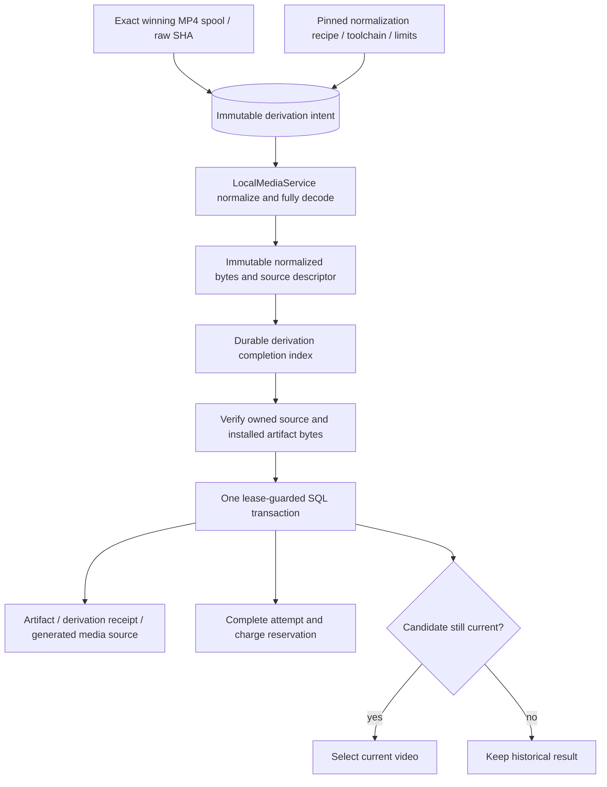

# Generated-video derivation

September 12, 2026. `SpoolVideoIngestor` is an optional trusted MP4 ingestion hook. It turns an already owned V2 output spool into measured, silent, 30-fps H.264 footage usable by the existing local renderer. It performs no provider request, resolves no credentials, and is not selected by the application launcher. Real transport/profile integration is separate work.

## Identity and ownership



Raw and normalized SHA-256 values name different files. The V2 output receipt and winning slot keep the exact provider bytes and full admitted request digest. Normalization never rewrites that evidence or substitutes a local task ID for the vendor task. The artifact names the normalized bytes; its derivation links back to the original receipt/spool.

The ingester accepts no caller-selected source path. `ExecutionOutputStore.resolveOutput` checks the exact project, attempt, winning slot and descriptor and returns the owned raw path. `LocalMediaService` snapshots that path from an explicitly configured root, verifies raw identity again through its returned descriptor, normalizes and fully decodes it, and installs immutable files. Engine separately streams the final managed artifact to check its normalized hash and byte count under the lease.

The derivation is keyed by project/attempt/video slot; its artifact ID is deterministic from that derivation identity. A refreshed provider locator cannot create a new normalization identity or replace the first winning output.

## Durable records

| Record | Important fields and purpose |
| --- | --- |
| `video_derivation_intent` | Version, project/attempt, complete request digest, winning slot and spool IDs, raw SHA/length, deterministic artifact ID, required frames, derivation recipe, normalization recipe/toolchain/limits. Written before source decoding/transcoding. |
| Private completion index | The validated `VideoDerivationReceipt` stored at a derived filename. Written with a bounded canonical JSON payload, file/directory sync and exclusive immutable publication after normalized files exist and before application SQL publication. |
| `video_derivation_receipt` | Version, project/attempt, intent digest, exact service-issued normalized source descriptor. Inserted only when the video is usable and its artifact is published. |
| `artifact` | Normalized SHA/length, measured duration, generated origin, attempt, raw receipt/spool IDs, derivation ID and normalized source descriptor ID. |
| `media_source` | Same exact normalized source, generated origin, attempt and derivation ID. It has no invented human-upload request ID. |

The normalized source retains both original and normalized hashes/lengths, measured video properties and the toolchain digest. The store checks same-project references and immutable identities. Artifact, derivation receipt, generated source, completed attempt, reservation charge and conditional current selection are published within Engine's existing short transaction. A failure midway rolls them all back; the private completed files remain recoverable.

## Execution and recovery

1. Snapshot the input and original cancellation signal. Require the current, unexpired ingestion lease and exact owned MP4 spool. Reject oversized input before toolchain probing or transcoding.
2. Reuse an existing derivation intent, or obtain the worker's read-only normalization identity and persist an intent. The identity call may run tool version probes; it does not decode source media.
3. Read the bounded private completion index. If one exists, validate its identity and measured facts and reuse its exact source. A completed derivation needs no FFmpeg/version probe to recover; missing or changed normalized bytes fail integrity checks.
4. Without an index, require the pinned recipe, toolchain and limits to match the current worker. Normalize locally, verify raw/source identity, then publish the immutable completion index.
5. Require decoded frames to cover the admitted shot. Verify the normalized source descriptor and bytes, install the exact normalized file inside the application artifact root, and return an explicitly tagged `normalized_video` result.
6. Engine snapshots and validates the tagged result, verifies final file bytes, and publishes it under the current lease. Source metadata, raw provenance, artifact identity and physical duration must agree before the transaction can finish.

A crash before the completion index may repeat incomplete **local normalization**. A crash or SQL failure after the index reuses the completed normalized source. Neither case resubmits generation, polls a provider when a usable durable completion exists, changes a paid attempt, or switches its raw output.

Physically short footage is a local ingestion failure. Its measured normalization is still retained in the private completion index, so reconciliation reports `VIDEO_TOO_SHORT` without repeatedly transcoding the same take. It does not publish a usable artifact/source or spend again. Existing unresolved liability is retained. Resolving poor-quality/short provider output through a new human-authorized take is separate workflow work; this hook does not make that decision.

An incomplete intent cannot silently choose a new toolchain after restart. A changed recipe produces `VIDEO_DERIVATION_RECIPE_CHANGED`; a completed index may be reused without the old tools, provided its recorded descriptor and immutable bytes still verify. Deleted or corrupt completion metadata is not treated as permission to overwrite completed history.

Lease renewal covers normalization and file verification. Losing ownership aborts cooperative work and prevents publication. Bounded file publication/cleanup is awaited rather than detached; files completed just before cancellation remain recovery evidence. One active derivation per configured root is allowed in this process. Cross-process safety depends on the local installation ownership boundary and attempt leases; this is not a distributed worker design.

## Limits and exact-PNG compatibility

- Raw output storage supports MP4 up to 256 MiB. This initial normalizer supports **at most 128 MiB input**, using the existing media import limit, and rejects larger input with `VIDEO_NORMALIZATION_INPUT_LIMIT`. Lower configured bounds are respected. General uploads are unchanged.
- Normalized output is at most 256 MiB; metadata indexes are at most 32 KiB. Existing worker duration, timeout and dimension bounds apply, with at most 10,800 frames. These are input/work bounds, not a peak-memory or disk-quota guarantee.
- Normalization removes embedded audio and metadata, converts to 30 fps, and fully decodes the result. It rejects footage with fewer measured frames than the admitted request; it does not loop, stretch or silently pad time. Longer takes retain their full measured source for later trims.
- Only the explicit `normalized_video` tag permits Engine to compare the artifact against the derived hash. An ordinary `ArtifactRecord` still must match the raw completion hash/length. `SpoolImageIngestor` remains an independent PNG-only hook that preserves exact encoded bytes.
- This hook does not handle PNG, inline fixtures, speech or local render nodes. A host that uses multiple kinds must configure a deliberate ingestion router. Default ingestion remains fixture-only.

## Verification

Nine new offline integration tests pass using locally generated six-second and two-second MP4 files. The six-second fixture starts with 24-fps video, audio and metadata; its normalized source is measured at 180 frames, silent and 30 fps, and the renderer produces an exact 90-frame trim. No real provider API or native model calls are made.

The tests also cover pre-transcode intent ordering, raw/normalized identities, atomic SQL rollback, completion-index recovery with no toolchain/transcode call, explicit lease theft after durable completion, short-footage recovery without repeat transcoding, the 128-MiB admission bound, incomplete-recipe drift, corrupted index/bytes, contradictory source duration/provenance, untagged hash rejection and retired-binding history.

```sh
pnpm --filter @openslate/server build
node --test apps/server/test/video-derivation.test.mjs
```

Source: `execution/video-derivation.ts` contains the pure contract checks; `execution/spool-video-ingester.ts` owns local derivation/recovery; `execution/engine.ts` verifies and publishes the tagged result; `media/local-media.ts` remains responsible for actual normalization/decoding/rendering; the store owns immutable record/reference checks.
