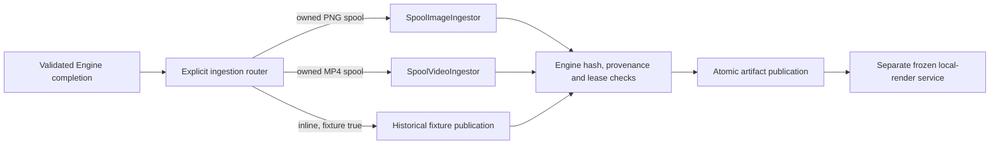

# Explicit media ingestion composition

`ExecutionIngestionRouter` lets a trusted host combine exact PNG ingestion, generated-video normalization and historical fixture publication in one Engine. It adds no provider, credentials, spending permission or launcher activation.

The constructor captures optional image/video handlers. Missing handlers fail with `OUTPUT_INGESTION_UNSUPPORTED`; an image cannot fall through to the video handler or a fixture. Nonfixture inline media also fails: this composition requires an owned spool for real images/videos. Future audio/data ingestion needs its own explicit contract.

The router detaches attempt/output data before delegation and preserves the original cancellation signal. It returns the handler's exact artifact or tagged video derivation for Engine's existing independent verification. It cannot skip same-project receipt checks, exact PNG validation, measured video frames or the publication lease.

Historical fixture publication is extracted without changing its byte validation, file naming, generated artifact IDs or physical one-second duration label. The default Engine still uses that fixture-only behavior. Hosts may configure the router with either, both or neither real-media handler; no route is inferred from an API key or selected LLM.

The combined offline test uses locally generated PNG/MP4 bytes returned by a simulated provider. One Engine publishes the exact PNG, waits for explicit keyframe review, derives a six-second 30-fps take, and retains fixture labels on its legacy timeline/render operations. The separate `MediaApplicationService` then freezes the actual generated take and publishes a real six-second local render. This verifies the generated-source path into the renderer without claiming that Engine's existing assembly operations now render real footage automatically.

Server build and **38 related checks passed**, including three new composition tests and the existing provider/execution regressions. They cover the combined path, review gating, missing-handler failure with retained liability/spool, input/handler capture, original signal and unsupported inline media. No live provider or model calls occurred. General rendering/normalization limits and recovery guarantees remain those of their component services.

Remaining launcher work must compose handlers deliberately and choose the actual local-render service for production assembly. It must also display fixture status from saved artifact metadata. The router alone does not activate that product flow.
