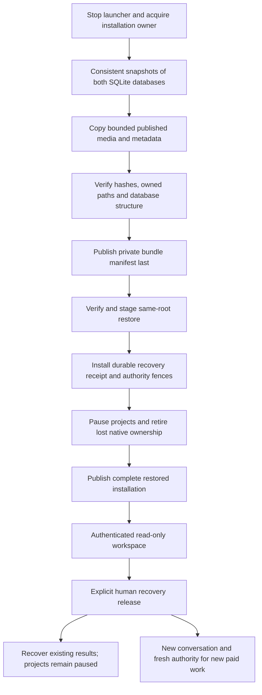

# Local installation backup and recovery

Status: implemented and verified offline, September 12, 2026. Private backup/inspection, interrupted same-root restore, V3 quarantine, permanent imported-authority fences and the browser recovery/release flow are integrated. The full checkout passed 899 tests, zero failures/skips, all builds/typechecks and the installed no-turn Codex probe. The final conversation-scroll correction passed a web build/typecheck and all 45 web tests. See the [synthetic browser campaign](INSTALLATION-RECOVERY-VALIDATION.md) for exact evidence and limits.

## Scope and defaults

This is **offline same-root installation recovery**, not portable project import/export. Stop OpenSlate before backing up or restoring. Restore only to the original canonical local data path, with no existing installation data. Never overwrite or merge another installation. The bundle is private operational data for one user on one computer; it is not a shareable project package.

Preserve project, candidate, attempt, task, request, artifact, spool-storage, tool/skill lock and receipt identities. Raw provider footage and normalized footage remain separate content identities. Several artifact records and immutable completion receipts contain absolute paths. Rewriting those paths would alter receipt identity; leaving them unchanged after relocation would fail managed-path checks. Relocation requires a later logical-path/provenance design, and is deliberately rejected here.

Use a directory bundle initially, avoiding a general archive extractor. File hashes detect corruption and incomplete copying; they are not a signature proving who created a bundle. Neither export nor restore performs model calls, provider requests, downloads, media normalization or native setup.



## Bundle and file boundary

The backup writer and reader share this versioned data contract. All paths are bundle-relative, normalized POSIX paths derived by the exporter, never arbitrary read/write destinations supplied by a model or browser.

```ts
type BackupFileKind = "application_db" | "fixture_db" | "owned_media" | "owned_metadata";
interface InstallationBackupManifest {
  version: 1;
  backupId: string;
  createdAt: string;
  originalDataRoot: string;
  applicationSchemaVersion: number;
  fixtureSchema: { tag: 1; userVersion: 0 };
  files: Array<{
    path: string;
    sha256: string;
    byteLength: number;
    kind: BackupFileKind;
    mode: number; // bounded permitted permission bits; never ownership or special bits
  }>;
}
```

Required published namespaces are:

| Namespace | Purpose |
|---|---|
| `openslate.sqlite` | Canonical projects, history, requests, authority, attempts and receipts |
| `fake-provider.sqlite` | Fixture acceptance history; preserve it rather than silently resetting demo recovery |
| `artifacts/` | Owned image, audio, video and local timeline output, including generated and historical output |
| `fixture-imports/` | Demo reference SVG and narration WAV still referenced by live artifact records |
| `media/blobs`, `sources`, `manifests`, `completions` | Original/normalized media, exact measured descriptors and local render recovery |
| `execution-output/identity.json`, `blobs`, `manifests`, `slots` | Raw output storage identity and exact winning-slot recovery |
| `video-derivations/completions` | Normalization receipts durable before SQL publication |
| `skill-snapshots/<digest>` | Exact locked skill package snapshots |
| `native/<project>/workspace/.agents/skills/<digest>` | Native director's locked skill package snapshots |
| `native/<project>/workspace/image-attachments/<request-digest>` | Owned discussion thumbnails referenced by request projections |

Copy the complete permitted published namespaces, including receipts/files produced just before a SQL publication failure. A walk limited to currently selected SQL artifacts would lose recovery evidence. Validate the owned metadata/reference closure, including current and historical artifact paths, source descriptors, receipt identities and hashes. A required file outside the allowed installation roots or a missing required published file is an explicit verification error, never a silent omission. An unknown result with no completed file is valid unresolved state.

Exclude staging/temporary directories, transient uploads, arbitrary native workspace files, native runtime state/logs, external Codex homes/auth, local session tokens, installation lock files and SQLite WAL/SHM sidecars. Do not collect environment variables or external provider configuration/credentials. Skill snapshots retain the read-only file/directory modes required by their existing verifier. Private parent directories prevent making those files publicly accessible.

Protected provider locators can exist in immutable SQL receipts and must remain intact; do not call the bundle credential-free. No locator is fetched during copying. Expired locators remain historical evidence and do not become permission to regenerate.

Initial host bounds are 256 GiB total, 100,000 files, 8 GiB per file, a 32 MiB manifest, depth 16 and 1 MiB streaming buffers. These are supported-copy limits, not an assertion that every installation fits. Use bounded streaming, at most two copy workers, disk-space preflight plus continuing byte limits, and explicit errors for excess size. Buffer no whole media file. Reject absolute, parent-traversal, duplicate, special, FIFO or symlink entries; do not preserve source hardlinks as links in the bundle. Never recurse into migration-backup directories. Manifest entries are sorted by their relative path.

## Export and restore ordering

Export acquires `acquireInstallationOwner` for the source before inspecting mutable application data and retains it through verification. It must fail if a launcher owns that installation. The v0 contract assumes all normal writers use this owner; it does not claim to stop an arbitrary independent process editing files.

Use read-only SQLite connections and snapshots that include committed WAL pages. `Store.backup`/`snapshotDatabase` already implement application-database verification and syncing. The fixture database has a different schema and needs a narrow read-only verifier/snapshot helper; do not pass it through the application schema verifier or open `FakeProvider` merely to inspect it. Export must not upgrade the source database.

Create a new private staging bundle, snapshot both databases while the source is quiescent, copy and verify published namespaces, sync files and directories, then publish its manifest/completion last. Cancellation owns and removes only this operation's incomplete staging; never delete a previously published backup.

Restore validates the manifest and both database snapshots before opening application services. The requested destination must equal `originalDataRoot`, and no installation data may exist there. Acquire the destination installation-owner lock without replacing/unlinking its inode. Stage on the destination filesystem, verify every copied file, open only the staged application database for supported migrations and quarantine installation, verify again, then publish the data files while retaining ownership. A non-authoritative filesystem progress/completion marker makes a half-published restore fail closed before `Store` is opened on normal startup. The database, not that marker, owns quarantine and release authority.

Do not replace an existing destination directory atomically over its owner lock. Publication into the exclusively owned empty destination may move verified staged entries; startup must refuse an incomplete marker. Failures retain the marker, stage and any published entries for exact retry. A subsequent copying retry can remove only the validated stage owned by this restore; published entries are never cleaned up or overwritten automatically. A completed restore records both the immutable source snapshot identity and the authored restoration transition. Its working database naturally differs from the source snapshot after migration, pauses and fences.

With `OPENSLATE_LOCAL_TOKEN` unset, generate a new local session token on subsequent launcher startup. An explicitly configured environment token remains honored; backup never copies the previous token file. Do not import external credentials, inherit another running native process or remove local holds.

The implemented `installation-restore.json` marker binds the exact bundle and original root through `copying`, `publishing` and `complete`. Staging lives in this restore's private destination subtree. A copying retry can discard only that validated incomplete subtree. Publication moves complete top-level namespaces; a retry hashes already published content and refuses differences, duplicates or extras rather than replacing it. A torn first marker write can be discarded only before any staging or publication exists. Normal startup checks completion and the matching database receipt after acquiring ownership, before opening Store or creating a token.

The exclusively staged database is checkpointed and switched to DELETE journal mode before hashing and publication, avoiding new WAL/SHM files during read-only verification. Ordinary Store startup later restores normal WAL operation. Source and bundle databases are not changed. Supported migration diagnostics remain private in the restored installation and are excluded from subsequent exports. A completed marker is also excluded from re-export; durable database receipts and all previous authority fences remain included. A repeated completed restore returns `already_restored` without reverting newer application work.

Use `pnpm installation export --data-dir PATH --output PATH`, `pnpm installation inspect --backup PATH`, or `pnpm installation restore --backup PATH --data-dir ORIGINAL_PATH` after building. These commands return bounded JSON summaries and never start application workers. Copying is serial with one 1 MiB buffer; publication inventory lookup uses precomputed path sets. Accepted file-count/byte ceilings are not a measured maximum-size performance guarantee.

## Durable recovery state

Add a small schema V3 migration for global installation recovery state. A global record must not be represented by a fabricated project, and release must not depend on an independently editable filesystem authority flag. Preserve historical V1/V2 migration definitions and JSON bytes.

The new `installation_recoveries` table has a monotonic generation, unique restore ID, immutable canonical receipt, and a nullable canonical release receipt. The latest generation is active. Release is one-time compare-and-set from null; repeated identical commands replay the recorded result and conflicting commands fail. Store methods enforce immutability. Earlier generations and their fences remain permanently effective for imported authority, even after another backup/restore.

```ts
interface VerifiedRecoveryOrigin {
  restoreId: string;
  backupId: string;
  backupManifestSha256: string;
  sourceDatabaseSha256: string;
  originalDataRoot: string;
  backupCreatedAt: string;
  restoredAt: string;
}
type ImportedAuthorityKind =
  | "message" | "prepared" | "epoch" | "director_turn"
  | "grant" | "candidate" | "external_allowance" | "attempt";
interface RecoveryFence {
  id: string; projectId: string; restoreId: string; version: 1;
  kind: ImportedAuthorityKind; recordId: string;
  originalBodySha256: string;
  // Exact stored JSON for a native turn, null for other kinds.
  originalBody: string | null;
}
interface RecoveryReceipt extends VerifiedRecoveryOrigin {
  version: 1;
  generation: number;
  projectIds: string[];
  fenceDigest: string;
}
interface RecoveryReleaseInput {
  restoreId: string;
  expectedReceiptDigest: string;
  expectedSummaryDigest: string;
}
interface RecoveryReleaseReceipt extends RecoveryReleaseInput {
  version: 1;
  commandId: string;
  principalId: string;
  releasedAt: string;
}
```

Use the existing per-project entity mechanism for immutable `installation_recovery_fence` rows. Their IDs derive from restore ID, project, original kind and record ID. Capture original row hashes before any restoration transitions; mutable attempts may subsequently change through permitted recovery, so the original hash is provenance, not a requirement that mutable state remain frozen forever. Preserve exact original queued/running native turn bodies in immutable restoration evidence as well as their hashes. The source database snapshot remains unmodified in the backup.

`installRecoveryQuarantine(store, origin)` is a trusted, offline-only operation called by the verified restore writer. It snapshots imported authority, writes all fences and the global receipt, and pauses all restored projects in one transaction. It revokes imported director epochs and records explicit native ownership loss: queued turns become `interrupted`; running turns become `unknown`; their leases clear. Preserve native IDs, outputs and uncertainty. Do not manufacture `failed` outcomes or change already completed/waiting/unknown historical turns. This transition also clears the existing unique running-turn slot so a later fresh conversation can start.

## Minimal shared APIs and ownership

These interfaces are the seam between independently implemented backup, guard and HTTP work. Final names may change together during implementation; neither consumer should independently invent a second restoration policy.

```ts
interface RecoverySnapshot {
  state: "ordinary" | "quarantined" | "released";
  receipt: RecoveryReceipt | null;
  receiptDigest: string | null;
  summaryDigest: string | null;
  // Safe bounded counts/categories; detailed rows use pagination.
  counts: { projects: number; knownJobs: number; unknownJobs: number;
    nativeRequests: number; unusedAllowances: number };
}
class InstallationRecoveryGuard {
  constructor(store: Store);
  snapshot(): RecoverySnapshot;
  isQuarantined(): boolean;
  isImported(projectId: string, kind: ImportedAuthorityKind, id: string): boolean;
  assertWritable(projectId?: string, requestId?: string): void;
  assertFreshAuthority(projectId: string, kind: ImportedAuthorityKind, id: string): void;
  assertFirstSubmit(projectId: string, attemptId: string): void;
  recoveryMode(projectId: string, attemptId: string):
    "blocked" | "existing_results_only" | "ordinary";
  directorEligible(projectId: string, turnId: string, requestId: string): boolean;
}
function installRecoveryQuarantine(store: Store, origin: VerifiedRecoveryOrigin): RecoveryReceipt;
function releaseRecovery(store: Store, input: RecoveryReleaseInput,
  authority: { principalId: string; commandId: string }): RecoveryReleaseReceipt;

// Backup module owns source locking and verified file I/O; no injected
// generic quiescence callback or online drain contract in this slice.
function createInstallationBackup(options: {
  sourceRoot: string; destination: string; signal?: AbortSignal;
  limits?: Partial<InstallationBackupLimits>;
}): Promise<VerifiedInstallationBackup>;
function inspectInstallationBackup(options: {
  directory: string; expectedSourceRoot?: string; signal?: AbortSignal;
  limits?: Partial<InstallationBackupLimits>;
}): Promise<VerifiedInstallationBackup>;
interface VerifiedInstallationBackup {
  directory: string;
  manifest: InstallationBackupManifest;
  manifestSha256: string;
}

// Engine: existing reviewSnapshot keeps its persisted-ID contract.
// This inspection variant shares calculation, but has no Store writes.
type ReviewInspection = Omit<ReviewSnapshot, "id">;
// engine.inspectReview(projectId: string, gateId?: string): ReviewInspection
```

`VerifiedRecoveryOrigin` comes only from the verified backend copy path. The release authority is supplied only by the authenticated human HTTP handler; it is not taken from request-body claims, exported history or an agent tool. The guard is synchronous and reads current SQLite state inside relevant transactions. Default construction for an ordinary database is inert; a restored database cannot lose protection because a caller forgot an optional flag. No model-authored plan fields choose or release recovery mode.

| Owner | Proposed files and responsibility |
|---|---|
| Backup implementation | `persistence/installation-backup.ts`, fixture snapshot helper, CLI and tests; bundle inspection, bounded copying, same-root publication; calls `installRecoveryQuarantine` only after verification |
| Recovery persistence/guard | `persistence/schema.ts`, Store's new narrow recovery methods/families, `application/installation-recovery.ts` and tests; V3, receipts, fences, release CAS and common policy |
| Execution safeguard integration | Narrow Engine, service, director and external bridge hooks consuming the guard; no archive code or HTTP authentication |
| HTTP/UI integration | Authenticated recovery GET/release POST, pure review inspection, write guard and recovery banner; uses the common snapshot/release contracts |

## Required enforcement sites

| Site | Required behavior |
|---|---|
| Launcher, before factory/director construction | Reject partial restore markers or mismatched canonical root; load recovery state before workers can run |
| `Engine.runReady`, `reconcile`, admission and local dispatch | Quarantine starts nothing, including polls/normalization. After release, imported attempts may recover existing results only. No imported attempt acquires a new remote dispatch or repeats local dispatch |
| `Engine.installPlan` and external admission | Imported unused grants cannot create new candidates; imported candidates/allowances cannot fund initial starts or technical retries. Existing selected output and exact review history remain readable |
| `DurableExternalAdmission.authorize`/`recordAdmission` | Recheck fresh allowance/candidate authority inside the same transaction as attempt/reservation consumption |
| Image/H3 `submit` and `dispatchable` | Enforce quarantine and imported-attempt first-POST denial before credential resolution/preparation and again immediately before the durable dispatch marker; replay of an existing marker is recovery, never another POST |
| Image/H3 lookup/poll/replay | Quarantine performs no network; after release permit only existing owned results or exact known task/output receipts. Unknown task identity never becomes a guessed lookup or new task |
| `ProductionService.assertActor(..., mutating=true)`, request/epoch creation, non-editing human command roots | Block quarantine writes and imported request authority; ordinary read-only context stays readable. Also cover approval, pause/resume, spending, budget and setup paths that intentionally use non-editing human requests |
| `DirectorSupervisor.enqueue`, claim/tick and question reply; native pre-start reservation | Old requests/turns cannot start again or answer an imported waiting question to borrow authority. Fresh post-release requests may start under normal project pause/hold rules |
| HTTP `preHandler`, after authentication | While quarantined, permit public assets/health and explicitly audited authenticated read routes; reject mutations and all internal agent tools except the dedicated human release endpoint. Audit project snapshot, runtime settings/tools and narration/media/image listings rather than assuming GET is pure. Enforce before upload writes where the route's streaming lifecycle requires an earlier authenticated hook |
| Review GET | Split calculation from persistence. Quarantine returns inspection data with no actionable approval snapshot ID and does not append review rows |

Checks at scheduling alone are insufficient: direct application/bridge calls must also fail closed. Checks at HTTP alone are insufficient: restart schedulers run without an HTTP request. Existing lease owner/epoch fences remain mandatory and are not replaced by recovery policy.

## Release behavior

Release is a dedicated human action, not project Resume. Its review binds the exact restore receipt and current safe summary. It explains that existing results can be recovered, restored requests/spending permissions do not restart, and projects remain paused. Reject stale restore ID, receipt or summary digests before writing a release. Successful release changes no project pause, grant, candidate, allowance consumption, budget, review decision or held scope. Use an independently authenticated global human command and idempotency identity; do not call `beginRequest` while quarantined or reuse an imported request as release authority.

| Restored state | While quarantined | After human release |
|---|---|---|
| Existing image/video/audio and review history | Read/preview allowed | Unchanged |
| Durable spool or completed local/normalized receipt | No worker writes | Recover and verify without generation or repeat render |
| Exact accepted remote task | No network | Poll/download that task under existing cooldown/lease rules |
| Unknown submission without authoritative task | Preserve uncertainty/liability | Inspect/recover local evidence; never resubmit, infer rejection, invent task ID or refund |
| Admitted attempt without a dispatch marker | No execution | Historical imported intent cannot obtain its first paid dispatch |
| Unused imported grant/candidate/allowance or technical retry permission | No use | Permanently ineligible for new paid effects, across later restore generations |
| Imported queued/running native turn | Explicit interrupted/unknown ownership-loss record | Fresh conversation required; original native IDs remain history |
| Imported waiting question or prepared change | Read history only | Old authority cannot resume/apply; start a fresh request |
| New work created after release | Not applicable | Normal fresh conversation, generation authority, exact review and new spending allowance; projects/holds must separately permit execution |

An imported candidate cannot be made new by issuing another allowance against it. Explicit creation of a new take/candidate is required. This matters when an old backup predates a spend that occurred in the source installation: restoring that backup must not reuse the old request as though it had never started. Keep all recorded charges/reservations and unknown liability; do not claim the backup includes later source activity it never captured.

Expose imported unfinished work as requiring a fresh take/request in the safe work/readiness projection. Preserve its exact historical labels and receipts rather than hiding it or presenting its old unused allowance as currently spendable.

The spending projection now sets `selectionCurrent` and `suggestedForIssue` false for an imported candidate or its imported grant, with `RESTORED_AUTHORITY_REQUIRES_NEW`. An imported allowance retains its usage, expiry, exact historical work and model descriptor, but has `restoredHistory: true` and `status: "restored_history"` unless already revoked. It contributes no current selection or matching coverage. Fresh human revocation remains available, including for expired restored history; a newly approved take receives its own independent allowance. The UI preserves completed/uncertain work labels and explains that restored permissions cannot start new work. Three new projection/UI regressions passed with the **22-check** spending suite and web typecheck; no execution or recovery contract changed for this follow-through.

Release does not resume all projects, transfer old edit holds, execute a native turn or create any generation authority. A fresh human continuation may explicitly transfer applicable old holds through the existing continuation protocol. A read-only history fence must not block that authorized fresh continuation.

## Verification and implementation order

1. Review and commit this brief and shared interfaces before adding production hooks.
2. Implement V3, immutable recovery records/fences and pure guard behavior. Cover migration snapshot/rollback, historical V1/V2 JSON integrity, ordinary-database compatibility, repeated restore generations, one-time release CAS and two-connection races.
3. In parallel, implement the offline bundle reader/writer against the agreed quarantine callback. Cover committed WAL in both databases, ownership contention, original-root/non-overwrite rules, file bounds, disk failure, cancellation, path traversal/symlinks/FIFOs, required media closure, immutable skill modes, protected locator retention and filesystem-only completion recovery.
4. Add Engine/service/director/provider hooks, proving zero provider/native calls while quarantined, no imported first POST after release, no old allowance/candidate retry, fresh authority after release, original lease fencing and exact known-task recovery with no extra generation. Preserve successful history and unknown liabilities.
5. Add authenticated read-only UI/review and release flow. Verify media playback, no read-side review mutation, stale/retried release behavior, old token rejection, ordinary Resume failing to release quarantine, and continued pause/hold ownership after release.
6. Run an end-to-end synthetic export/restore campaign in disposable paths, including a SQL-publication crash receipt, then independent review and full checks. No user's live installation is restored for these tests.

No user decision is required to implement these defaults. Relocation, overwrite-in-place, online backup, merge/import, encrypted sharing and multi-host activation are separate future work. This brief authorizes no live media calls, destructive replacement or secret collection.

### Guard implementation evidence

The V3 migration adds only the recovery table/index and checked ledger entry. A V2 upgrade regression retains the original project/entity/command/event JSON and prior ledger rows, verifies the private V2 backup, and interrupts V3 creation to prove schema/data rollback. The historical V1 migration tests remain intact and now verify the complete current migration chain.

The recovery review counts a pending job as known only when the retained attempt task ID and accepted evidence contain exactly one distinct task ID. Conflicting accepted IDs remain uncertain even when an attempt already has a task ID; computing this summary performs no provider query or state mutation. Synchronous completions without a task ID may remain in the uncertain counter until reconciliation verifies and publishes their saved bytes. These counts describe saved task identity, not a new billing or retry decision.

`InstallationRecoveryGuard` is constructed from Store by Engine, external admission and both external bridges. It validates the complete fence set across restore generations and caches that imported identity set; `isQuarantined()` avoids rebuilding work summaries on every authenticated media request. Snapshot work counting reads evidence and allowance consumption once per project. Recovery installation bounds the fence inventory before adding each row and saves native original-body evidence before its explicit ownership-loss transitions.

Application mutation roots check quarantine and the supplied request before idempotent receipt replay, including budget/allowance actions, read-only director discussions, attachment selection, skill provenance, media rendering and tools. Fresh conversation continuation may transfer the saved request's holds, but imported grants are excluded from its planning selection. An imported question retains its exact stored history and receives `canAnswer: false` only in the display projection; answering that old question remains prohibited at the backend. `Engine.inspectReview()` verifies current inputs without creating a persisted approval snapshot, including valid plans with no review gates.

Focused new regressions cover the restoration protocol and these boundaries. The main focused run passed **107 checks**, including both injected provider bridges, director/context/attachment behavior and six real local assembly tests. An earlier **85-check** recovery/migration/service/supervisor/budget/allowance run also passed; these sets overlap. The subsequent task-conflict summary and restored-spending follow-through passed a **32-check** recovery/spending/UI-model run plus web typecheck. Provider tests used only injected offline responses. They demonstrate no credential resolution or first POST for imported pre-dispatch attempts, exact synchronous PNG receipt reuse, known H3 task polling with its retained cooldown, no imported technical retry, and no reservation refund. No live media request was made.
