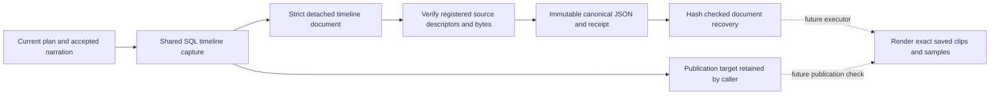

# Immutable local timeline document

This foundation records the exact ordered cuts and narration that a future local executor can consume. It provides validation and managed immutable JSON storage. It does not create Engine attempts, grant authority, publish project artifacts or activate automatic assembly.

## Contracts

`apps/server/src/media/local-timeline.ts` exports:

- `LocalTimelineInput`: exactly `projectId`, ordered `clips` and ordered `audio`. The caller selects these three fields from `captureTimeline(...).input`.
- `createLocalTimelineDocument(input)`: copies data synchronously, validates it and returns a deeply frozen `LocalTimelineDocument`.
- `parseLocalTimelineDocument(value)`: validates an existing document and requires its exact canonical fields and recipe digest. It does not silently add omitted gain to a saved document.
- `LocalTimelineStore({rootDir, media})`: trusted private host storage and a source verifier compatible with `LocalMediaService.verifiedSource`.
- `put(document, {signal?})`: verifies registered descriptors and normalized source bytes, then installs canonical JSON and returns `{document, receipt, path}`.
- `read(receipt, {signal?})`: recovers exactly the immutable document bytes without selecting or rebuilding a timeline from current project state.

The document contains `version: 1`, `localExecution: {adapter: "local-media", version: "1"}`, project ownership, cut transition, 30 fps, 48 kHz, total frames, complete ordered source descriptors, clip start/duration/fit, and narration start/duration/placement/gain. A missing input gain becomes an explicit zero before hashing. Sources retain original and normalized hashes/sizes, measured probes, artifact IDs, descriptor IDs and normalization toolchain digests. Every descriptor ID must match its complete body digest.

`recipeDigest` hashes the canonical document body excluding the digest itself. The receipt is `{recipeDigest, sha256, byteLength}`; `sha256` hashes the serialized complete document and therefore differs from the recipe digest. The receipt and document contain no storage path. The returned `path` is host-only.

Publication revision, head version, plan ID, node IDs, canonical narration record ID, attempts and leases are absent from the recipe. Output dimensions and render toolchain identity belong to the later render manifest. The project ID remains part of the recipe, so identical clips in another project do not share recipe identity. A publication-only revision change keeps the recipe stable; changing clip order, sample range, placement, gain or a source descriptor changes it.

## Validation and storage algorithm

The synchronous snapshot accepts bounded plain JSON data only. It rejects accessors without invoking them, hidden/symbol fields, unexpected fields, sparse arrays and nonfinite numbers. The contract supports one to 64 clips, up to 64 audio placements, eight distinct audio streams, eight simultaneous audio lanes and at most 10,800 frames. Sources must describe silent even-dimension H264 at 30 fps or measured stereo PCM at 48 kHz. Selected ranges cannot exceed measured frames/samples or the timeline boundary. Fixed gain is limited to -60 to +12 dB. One artifact ID cannot name conflicting descriptors.

`put` captures the complete document and original abort signal before its first await. It verifies each unique descriptor through the trusted media service, including exact normalized bytes, and checks that the verifier returns the same descriptor. It writes at most 1 MiB into an owned temporary directory, synchronizes the file, then publishes by hard link to `documents/<sha256>.json`. Concurrent identical writers reuse the existing document; no writer replaces an existing file. Readback verifies exact canonical bytes, recipe digest, file SHA and length. The containing directory is synchronized, and only the caller's temporary directory is cleaned.

Recovery opens the derived filename with no-follow and nonblocking flags, checks a regular file and the expected bounded length, reads at most expected length plus one byte, and verifies hashes/canonical JSON. Symlinks, FIFOs, oversized records, changed bytes, wrong receipts and noncanonical JSON fail. No caller-selected path enters either operation.

Cancellation is checked around source verification, immediately before publication and after awaited cleanup. Cancellation racing completed publication may leave an unreferenced reusable immutable document; it never returns a successful descriptor or deletes shared bytes. `read` also captures the original signal and receipt before opening the file. Source verification itself receives that original signal.

## Responsibility boundary

The storage root and verifier are trusted installation configuration. The caller still owns SQL project membership, current target/binding checks, holds, pause state, leases, attempts, artifact registration and final atomic publication. A valid source descriptor is not project authorization. The future executor must persist its own attempt-to-document mapping and place this store under managed artifact storage.

Document recovery verifies the saved recipe bytes without checking today's source files. This preserves exact historical intent even if source storage later fails. Rendering must verify those precise sources at use time and consume the saved document; it must not substitute a fresh capture merely because video or audio hashes match. Current `LocalMediaService.freezeManifest` accepts the saved clips/audio with explicit render geometry and target, while existing human rendering remains unchanged.

## Evidence

Sixteen focused tests use synthetic media, real local normalization and SQLite capture. They cover full identity/ordering, publication-independent reuse, normalized probes and source bounds, malicious/invalid data shapes, registered-source verification, source corruption, same-document concurrent writers, exact reopen recovery, corrupted/symlinked/FIFO/oversized/noncanonical records, captured inputs/signals, pre-cancellation and late cancellation with reusable output. They also show that SQL capture and document materialization add no application authority or provider acceptance. No model or media API calls occur.

Automatic Engine assembly and production activation are separate work. These tests do not prove those integrations or a generated commercial.
