# H3 application execution bridge

September 12, 2026. `MiniMaxH3Execution` connects the registered execution contract to the standalone H3 transport, protected downloader and owned output spool. It is an **explicitly constructed host component**, tested with injected HTTP and local synthetic media. It adds no default profile, launcher activation, credential setting, remote cancellation or live H3 request.

## Request and dispatch boundary

```mermaid
flowchart LR
  Plan[Reviewed video and pinned profile] --> Admit[Engine grant / allowance / reservation / attempt]
  Admit --> Frame[Verify exact original PNG]
  Frame --> Map[(Immutable application-to-transport mapping)]
  Map --> Fence[Original caller lease and one POST marker]
  Fence --> POST[H3 submit once]
  POST --> Receipt[(Durable accepted / rejected / unknown observation)]
  Receipt --> Schedule[Durable known-task polling cooldown]
  Schedule --> Query[At most one query GET per due poll]
  Query --> Locator[(Protected output receipt)]
  Locator --> Download[Allowed HTTPS output GET]
  Download --> Spool[Exact raw MP4 spool]
  Spool --> Derive[Separate video derivation and guarded publication]
```



The frozen execution identity is `minimax-h3/1`. Configuration is exactly `{model, settings: {resolution}}`: `MiniMax-H3` permits 768P/2K and 4–15 seconds; `MiniMax-H3-Max` permits 480P/768P and 5–15 seconds. Duration comes from the immutable request's integer `durationFrames / 30`, with a 30/1 frame rate. Per-shot settings must be empty; no second source of creative overrides is accepted.

The current compiler exposes one reviewed first frame. This bridge accepts exactly that one image and checks the retained approval fingerprint, same-project immutable artifact identity, nonfixture PNG format/validation record, managed-root containment, a no-follow file open, exact length/hash and stored header dimensions. It embeds the unchanged PNG in a data URL. It does not resize, normalize after approval, upload it elsewhere or substitute a model URL. H3's first-frame limits apply: at most 30,000,000 bytes, each dimension 256–5760 and aspect ratio 0.4–2.5. Last-frame and reference-media modes remain outside this bridge even though the standalone transport has a broader first/last-frame subset.

`describeMiniMaxH3Request` exposes two different identities without credentials or I/O:

- A reproducible metadata digest binds transport version, model, exact prompt, duration, resolution, adaptive ratio and frame metadata. Its serialization survives canonical database key ordering.
- An exact body SHA-256 binds the actual serialized POST, including the full data URL. The transport rechecks this expected SHA immediately before dispatch. The Store checks its reference and format; **it cannot reconstruct that body hash from the artifact SHA alone**.

The mapping also retains the complete application request digest, profile digest, allowance correlation and first-frame artifact ID. Neither encoded image bytes nor a credential is saved in it. Credentials resolve through the fixed backend `minimax-video` alias only when a first submit or due known-task query needs them.

First submission requires `ExecutionCallOptions.expectedLease`, captured by Engine before calling the provider. The bridge checks that original owner/epoch against the current unexpired `submitting` attempt and reserved liability, including after awaited input preparation. A replacement worker's lease cannot be borrowed. In one short transaction, the winner records an immutable dispatch marker; only that winner calls POST. A prior marker permanently prevents another POST for that attempt, even if no response was recorded.

## Durable records and recovery

| Record | Purpose |
| --- | --- |
| `h3_execution_mapping` | Full admitted request/profile/allowance correlation plus metadata and exact body digests. Immutable. |
| `h3_execution_dispatch` | Mapping/body digest, allowance and timestamp immediately before the only POST. Immutable. |
| `h3_execution_submit` | Redacted accepted task, documented rejection, unknown result or definite local non-dispatch. Immutable. |
| `h3_execution_observation` | Deduplicated known-task polling evidence, first observed timestamp, mapping/dispatch references and protected output-receipt ID. Immutable. No URL. |
| `h3_poll_schedule` | Accepted task and immutable trusted polling policy, monotonic poll count, next eligible time, temporary claim token and last observation pointer. Mutable scheduling state. |

`submit` replay and `lookup` perform local recovery only. They never POST or guess a task from a prompt. A marker without a valid task remains unknown. If accepted-task persistence fails after HTTP, the bridge still returns the validated accepted observation; Engine can retain it even after lease loss. After restart, Engine restores the exact task and the bridge reconstructs its missing receipt from immutable accepted evidence. This is not acceptance inferred from missing history or an arbitrary unknown observation.

`poll` requires the exact admitted request and its known task. It checks that identity even when a local completed spool exists. A complete owned winning spool is recovered before any credential read, query or download. Otherwise, a due poll queries only that accepted task. A succeeded query saves its protected locator receipt and redacted polling observation together before starting the output GET. Refreshed locators can be obtained by a later due query after download failure; the existing output store still enforces the first winning byte identity.

The bridge returns a V2 completion only after owned raw bytes exist. The separately configured [video ingester](GENERATED-VIDEO-DERIVATION.md) then preserves raw versus normalized identity, fully decodes video and publishes the artifact/source/derivation atomically under Engine's lease. Stored MP4 can be up to 256 MiB; the initial normalizer still accepts at most 128 MiB. A larger stored response is not automatically renderable.

## Polling and late observations

The launcher may reconcile every 500 ms. This does not result in a query every pass: the schedule initially waits two seconds, then completed polling operations use delays of 2, 4, 8 and at most 15 seconds. Trusted host configuration can adjust these bounded values; models and profiles cannot. Known-task auth, quota and throttling observations honor a numeric `Retry-After` up to the pinned policy cap (24 hours by default). No internal sleep, polling loop or HTTP retry is added.

A due poll first persists a unique claim and a temporary delay covering the configured query deadline plus the downloader's five-minute bound and one second of headroom. A process crash therefore does not immediately reopen a query every 500 ms. The policy is retained across restart; a later host with a larger query timeout is clamped to the original claim's query bound. Normal completion replaces the temporary delay with backoff measured from completion. A late worker can retain evidence but cannot shorten a replacement claim's cooldown.

Terminal failed/cancelled evidence is recoverable even when the process stops before updating the mutable last-observation pointer. Local output recovery takes precedence when verified completed bytes already exist. Polling claims and Engine leases coordinate this local installation; they are not a guarantee of an exact number of outstanding OS sockets. The [downloader](VIDEO-DOWNLOAD.md) documents deferred DNS/socket cleanup and the output store's cancellation behavior.

## Outcomes, liability and limits

| Observation | Application behavior |
| --- | --- |
| Invalid local input, missing use-time credential, or cancellation before dispatch | Record definite non-dispatch; release only that reservation. No automatic retry authority. |
| Intact documented provider rejection | Record definite rejection and release the reservation. |
| Lost/malformed/contradictory submit result | Keep uncertain liability and the irreversible marker. Never resubmit automatically. |
| Accepted/queued/running task | Retain exact task and reservation; monitor using the durable schedule. |
| Known-task auth/quota/throttling, missing/expired query history | Retain task/observation, wait for the bounded cooldown, and keep liability unresolved. |
| Confirmed failed or cancelled task | Record terminal failure, conservatively charge the reserved estimate, `technical:false`, `retryAllowed:false`. |
| Successful query but unusable download/normalization | Keep receipts/raw evidence and liability; recover local work or query the same task when due. Never create a replacement take automatically. |

Reported duration/resolution/usage are retained as provider observations. They do not substitute for decoded duration, approve quality, establish actual billing, imply a refund, or change the conservative reserved estimate. The user remains responsible for creative quality decisions. Remote cancellation/deletion, global provider throttling, price reconciliation and multi-host operation remain separate work.

Signed locators stay in protected `execution_output_receipt` data. Ordinary H3 receipts, Engine evidence and errors contain no locator, encoded PNG, credential or raw provider response text. The downloader receives no API key and accepts only exact configured HTTPS hosts with a pinned public IPv4 destination. Live hostnames, CDN behavior, embedded-image acceptance, account access and H3 output quality remain unverified.

## Verification

Provider/server builds passed. **19 bridge tests and 32 transport tests passed**, including the actual database-reopen recovery check. A broader run of **136 execution, image, spool, download, derivation and H3 tests** also passed before the final restart-test refinement and pinned-timeout clamp; the final 19 bridge checks passed afterward. These are focused results, not a claim about the later full-checkout integration run.

The offline bridge tests cover exact PNG and wire-body mapping, original lease fencing, one-POST races, marker-only database reopen, late acceptance plus receipt-write failure, actual Engine evidence recovery, durable polling/backoff and Retry-After, cross-instance claims, late pending/terminal/unknown observations, failed download and locator refresh, immutable metadata, terminal liability and raw-spool-to-normalized-video publication. Two new transport conformance tests protect the metadata/body digest distinction and pre-POST digest check. All HTTP responses and CDN streams are injected; actual FFmpeg work uses synthetic media only.

```sh
pnpm --filter @openslate/providers build
pnpm --filter @openslate/server build
node --test packages/providers/test/minimax-h3.test.mjs apps/server/test/minimax-h3-execution.test.mjs
```
