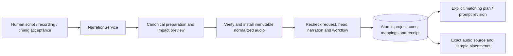

# Canonical narration integration

September 12, 2026. This document covers the implemented narration commit adapter. It does not claim that speech generation, transcription, conversational narration tools or the complete browser flow are connected.

## Responsibility and flow

`NarrationService` owns editable segment drafts, supplied recordings, human cue boundaries and separate human acceptances for script, recording and timing. `NarrationCanonicalService` installs a reviewed, accepted projection into the canonical project and records the exact audio placements needed by local rendering. It creates no generation requests, plans, approvals or paid attempts.



The adapter uses a narrow trusted transaction rather than a general creative patch. The existing creative patch cannot install cue records, recording metadata or a shot's `cueId`; changing `narrationScript` through that path invalidates all cue acceptances. The adapter derives these fields exclusively from saved narration records and human decisions. A caller cannot supply a replacement project, cue or acceptance in its input.

## Application interface

```ts
const canonical = new NarrationCanonicalService(narration);

const prepared = canonical.prepare(projectId, actor, {
  expectedHeadVersion,
  expectedNarrationVersion,
  shotMappings: [{ shotId, segmentId }], // null explicitly detaches
  key: commandKey,
});
// Show prepared.shotImpact and the accepted narration before committing.
const receipt = await canonical.apply(projectId, actor, prepared.id);
const saved = canonical.current(projectId, actor);
```

Both preparation and application require a current editing request that includes project scope. Director calls additionally require their active epoch. Preparation is owned by its exact principal, request and epoch; another request cannot adopt it. Script/audio/timing acceptance remains human-only in `NarrationService`, regardless of who prepares the canonical change.

Preparation returns the frozen source projection, proposed project and per-shot impact. Its command key replays the same result and rejects different input. Application has an intrinsic replay key, the preparation ID. A lost response can be recovered after reopening SQLite without advancing the project again. A revoked actor cannot replay a mutation under obsolete authority.

Authenticated host code may call `narration.workspaceSnapshot(projectId)` and `canonical.workspaceCurrent(projectId)` to populate browser views. These trusted reads create no requests, epochs, holds or events. Model access must use the actor-checked `snapshot` and `current` methods. HTTP composition must enforce the local application's authentication boundary before calling the host methods.

## What is persisted

| Record | Purpose |
| --- | --- |
| `narration_prepared` | Immutable expected project/narration fingerprints, source projection, mappings, impact and workflow binding versions. |
| `narration_canonical` | Immutable selected script, origin declaration, canonical cue records, exact audio placements, human acceptance IDs and request provenance. |
| `narration_canonical_head` | Project pointer to the selected immutable canonical record. |
| `narration_commit_receipt` | Immutable replay result, canonical/project identities, impact and active-plan status; ID equals the preparation ID. |
| `artifact` | Verified normalized WAV reference and internal path, `fixture: false`, `attemptId: null`, `origin: "narration_audio"`. |
| Project / revision / stage records | Canonical script, source, cues, artifacts, affected shot bindings and updated workflow inputs. |

Each canonical segment carries this rendering contract:

```ts
{
  segmentId, segmentRevisionId,
  cue: { id, meaning, durationFrames, placementFrames,
         audio: { artifactId, sha256, kind: "audio" },
         accepted: true, measured: true },
  frameCoverage: { startFrame, endFrame },
  audioPlacement: {
    source,             // frozen SuppliedMedia descriptor
    startSample,        // local to source, never a project offset
    durationSamples,
    atSample,           // position in the project
    gainMilliDb: 0
  },
  provenance: {
    audioId, declaredOrigin,
    originEvidence: "human_declared_supplied_recording",
    scriptAcceptanceId, audioAcceptanceId, timingAcceptanceId,
    originalSha256, toolchainDigest
  }
}
```

Audio is normalized to measured 48 kHz stereo PCM. All source trims and placement positions remain integer samples. Video uses 30 fps, or 1,600 samples per frame. The cue's relative duration rounds the segment length alone; frame coverage rounds each absolute endpoint. Coverage can differ by one frame from placement plus relative duration, so the renderer must use exact `audioPlacement` samples, not reconstruct audio from frame values.

A project may combine uploaded recordings with supplied recordings that the human declares were generated elsewhere. Its canonical source is `uploaded`, `generated` or `mixed`. A declared generated origin is not evidence that OpenSlate called a speech provider; provenance explicitly records this distinction.

## Granular updates and execution safety

The first commit takes explicit shot-to-segment mappings. Later commits inherit earlier mappings unless explicitly changed. Removing a segment still bound to a shot requires an explicit remap or detachment. Unknown shots, unknown segments, duplicate mappings and malformed input are rejected. Cues owned by prior canonical narration are replaced as a set; unrelated cues and artifact references are retained, and identity collisions fail closed.

A mapped shot inherits the accepted cue's relative duration. The adapter compares the old and new consumed video intent using `shotIntentDigest`:

- Changed meaning or relative duration clears that shot's video prompt binding. Its existing prompt text remains available for explicit reauthoring or confirmation. Its image prompt binding stays intact.
- Changed audio bytes, cue identity or absolute placement do not invalidate a video prompt whose consumed meaning and duration are unchanged.
- Only changed shot records receive new revision IDs. Placement-only changes preserve every shot record.
- Removed cue bindings invalidate only the detached shot's consumed video intent.

No plan is installed by this adapter. Existing plans, candidates, node outputs, human review decisions, attempts and budget reservations remain intact, including `submission_unknown` liability. Active edit holds remain owned by their request and are never released here. Existing matching holds are reused. A later explicit matching-plan operation performs normal compilation, prompt freshness checks, grant selection and hold handling. `requiresMatchingPlan` in the receipt indicates that an existing active plan remains installed; an initially unplanned project still needs its first plan.

## Transaction and file ordering

Preparation is a short SQLite command. Application first checks the exact project and narration snapshots, then verifies service-issued media descriptors and their bytes outside any SQLite transaction. Audio copies are bounded and hashed while streaming into a temporary file. The file is synced and installed by an exclusive same-filesystem hard link under the project artifact directory; an existing destination is hash-checked instead of overwritten. The destination directory is synced before metadata can become usable.

The final short transaction rechecks request/epoch authority, project head and digest, narration version and digest, accepted subjects, the canonical head, capability lock and workflow binding versions. Only then does it install artifact metadata, the new project revision, canonical record, pointer and receipt. An intervening edit or revocation rolls back the entire SQL change. Verified unreferenced files may remain after a stale commit; they are not usable artifacts and do not justify changing project state.

The current local storage policy trusts the installed application and same-machine filesystem. This adapter does not claim hostile-host isolation. Atomic installation and sync behavior rely on the supported local filesystem, as in the existing media service.

## Verification and remaining integration

The focused verification passed 24 tests: 13 canonical integration tests and 11 existing narration-domain tests. The server TypeScript build also passed. The dedicated canonical suite exercises mixed source provenance and exact trims; lost-response replay after reopening SQLite; placement-only reuse; single-shot meaning/duration invalidation; preservation of an uncertain paid fake attempt and its reservations; explicit detach/remap; human-only acceptance; stale project/narration and epoch fences during asynchronous file work; corrupt bytes; metadata conflicts; malformed input and read-only workspace views. Existing narration-domain tests cover readiness, sample rounding and acceptance invalidation independently. All media used by these tests is synthetic local audio; no vendor or model API is called.

This adapter is a working application library. HTTP/browser composition, model-facing narration proposal tools and the render-job bridge are separate integration work. Speech synthesis and transcription adapters remain future work; no model can manufacture the human decisions required to make a projection canonical.
