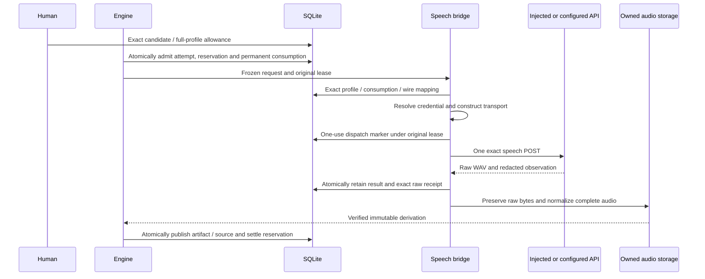

# OpenAI speech application execution

September 12, 2026. Implemented as an explicitly constructed, offline-tested execution bridge. The launcher and director do not yet expose built-in narration generation. No live media API has been called. The fixtures use synthetic audio and configured test estimates, not verified provider prices.

`OpenAISpeechExecution` connects the [speech transport](OPENAI-AUDIO-TRANSPORTS.md), durable human allowances and [generated-audio ingestion](GENERATED-AUDIO-INGESTION.md). A successful attempt publishes complete, unadopted audio. It does not accept script, attach narration, set timing or change the film.

## Approved request and profile

The first configuration is `{ model, settings: {} }`; the operation also requires empty settings. Text, voice and instructions are transmitted unchanged. Fixed WAV output, speed one and audio streaming format belong to the versioned transport contract. Unsupported settings fail explicitly. There is no automatic splitting, rewriting, voice fallback or model substitution. Long narration will need separate, explicitly planned chunks.

The bridge requires the persisted attempt, matching candidate/grant/reservation, human allowance issue evidence and actual `external_allowance_consumption`. An allowance ID by itself is insufficient. The profile's full definition, consumption estimate and reservation amount must agree. The transport profile digest alone omits policy fields such as cost and concurrency, so it cannot establish this agreement.

The consumed allowance does not record its originating capability-lock ID. The bridge finds a retained lock with the exact approved profile definition and pins that lock ID/digest and full profile in the mapping. This proves matching retained definition evidence, not original-lock provenance. It prefers the current exact match; initial historical search permits at most 128 locks, 64 KiB per lock before JSON decoding and 64 profiles per lock. Replay reads only the pinned records. Changing current profiles, revoking unused allowance capacity or passing the allowance's admission expiry does not rewrite already consumed work.

## Durable records and execution

| Immutable record | Exact binding |
|---|---|
| `speech_execution_mapping` | Project/attempt/request; full profile and retained lock; allowance and consumption digests; estimate; semantic transport description and exact JSON-body hash/length |
| `speech_execution_dispatch` | Mapping digest, transport digest, body hash, allowance and creation time |
| `speech_execution_result` | Mapping/dispatch digests, bounded sanitized observation and exact raw returned-byte receipt |

The original owner/epoch and cancellation signal are captured before preparation. The marker transaction repeats same-project admission checks, reserved liability, unexpired submitting lease and installation-recovery fences. Only the winning marker writer can submit, once. Local preparation or credential failures can become final `not_dispatched` observations only while that original lease remains valid. A stale local failure cannot preempt a replacement worker.

Actual observations after a POST may be saved even after lease loss; they are evidence, not current publication authority. A completed result and its raw receipt commit together before spooling. Raw audio uses at most 32 MiB and writes chunks no larger than 1 MiB. Synchronous completion has `vendorTaskId: null`; diagnostic request IDs never become pollable tasks. Successful recovery requires the winning completion's exact receipt ID as well as identical bytes. An unrelated receipt with equal audio cannot replace the result's provenance.

`lookup` recovers local records and bytes without credentials or HTTP. `poll` performs no HTTP. A marker without a durable response, or a completed observation whose bytes were lost, remains unknown. The bridge never automatically repeats the POST. Known rejection disables automatic retries; changing configuration cannot reopen that attempt. Reported observations are not actual billing evidence.

## Publication and recovery

The existing complete-audio normalizer separately retains raw and normalized hashes, full PCM geometry, toolchain/recipe identity and endpoint checks. Its filesystem completion is durable before SQL artifact/source publication. If that SQL transaction fails, a later owner can publish the saved derivation without another provider call or local conversion. Only Engine selects the output and settles the reservation under current authority.

Engine can recover a raw spool without invoking bridge lookup. The audio ingester therefore independently re-establishes the exact speech admission, mapping, dispatch, result and winning receipt before conversion or reuse. Store and backup derivation checks retain that same link for this adapter. The generic output store's legacy equal-byte deduplication behavior is unchanged.

Store and private backup inspection validate the new record families and their exact admission/raw-output closure. Quarantine blocks application work. After explicit recovery release, imported attempts may recover existing results; they permanently cannot create a first dispatch. Replay may inspect reserved, charged or released historical liability, while first dispatch requires reserved state.

## Evidence and remaining work

The **1,120-test full checkout passes**, with zero failures/cancellations/skips, complete builds/typechecks and the installed Codex no-turn probe. Fifty new speech checks cover real allowance admission, full-profile capture, historical replay, duplicate SQLite workers, cancellation, original-lease replacement, late observations, response/SQL/spool loss, conflicting winners, restoration fences and private backup closure. Independent review passed 24 additional boundary checks. See [sanitized evidence](speech-execution-evidence.json) and [current status](STATUS.md).

A separate six-second proof used `ProductionService`, the compiler, `ExternalAllowanceService`, `DurableExternalAdmission`, Engine and this bridge, with one injected response and one real FFmpeg normalization. It forced SQL publication failure, reopened with missing credentials and media binaries, then recovered complete audio and settled once. It checked exact wire/receipt/consumption identity, decoded tone/stereo/silence, unchanged narration and no repeated work. This is application integration evidence with synthetic tones, not speech quality, real API access or a complete narration workflow.

The proof passed 15 harness checks and 20 independent checks against the closed database and saved files. The independent decode measured six seconds at 48 kHz stereo, a 440 Hz tone and 200 ms of silence at each end. The harness seeds a trusted plan and synthetic human grant, uses real allowance issuance/admission, and manually expires the retained lease before reopen; it is not an HTTP authentication, browser approval or killed-process timing proof. Its configured 100-micro estimate is not a provider price. The first private harness attempt used unsupported expression-body plan syntax and stopped before admission or any transport call; the corrected declaration-block plan passed.

Review separately reproduced two conflicting-receipt cases. First, equal bytes under another receipt could satisfy bridge recovery. Second, after that check was corrected, generic Engine spool recovery could still publish the alternate receipt without calling the bridge. The final bridge, ingestion and derivation-closure checks enforce the exact result receipt across both paths. These controlled cases are distinct from the single-receipt pipeline proof.

Next: the transcription bridge's exact recording-to-upload-to-result mapping, unreviewed transcript ingestion, explicit generated-narration adoption and opt-in application/UI activation. See the [audio bridge plan](AUDIO-APPLICATION-BRIDGES.md).

Source: `apps/server/src/execution/openai-speech-execution.ts`, `audio-execution-authority.ts`, `audio-execution-receipts.ts`; focused tests: `openai-speech-execution.test.mjs`, `speech-execution-records.test.mjs`.
