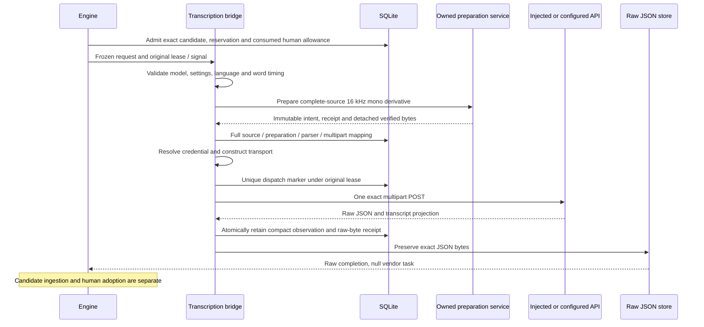

# OpenAI transcription application execution

September 12, 2026. This component connects an already admitted audio-transcription attempt to an exact owned upload and recoverable raw response. It does not publish a transcript candidate, accept wording/timing, alter narration or activate a user-facing transcription workflow. Validation uses injected HTTP and synthetic audio; no live media API call is authorized by constructing the bridge.

## Input contract

`OpenAITranscriptionExecution` requires the actual persisted allowance consumption, full approved profile, candidate/grant/reservation and same-project human issue evidence. It uses the same retained matching-lock policy and original-lease boundaries as [speech execution](OPENAI-SPEECH-EXECUTION.md). Already consumed work is historical authority; current defaults, later allowance revocation and admission expiry do not rewrite it.

The initial profile is `{model:"whisper-1",settings:{}}`. The operation takes exactly one owned audio input, empty settings and explicit `timing:"word"`. Existing `language:"auto"` maps explicitly to the transport's `null`; an explicit supported language remains explicit. The compiler's historical segment-timing default is unchanged and fails this adapter's validation before local conversion. Unsupported options are never silently ignored.

The [preparation service](TRANSCRIPTION-AUDIO-PREPARATION.md) binds the complete original 48 kHz stereo recording and creates a measured 16 kHz mono derivative. `TranscriptionAudioStore.readUpload` reads its canonical private blob with no-follow access, complete PCM verification, bounded detached bytes, exact hash/EOF and before/after file checks. It rejects measured bad endpoints and checks the original cancellation signal through file cleanup. The maximum is the smaller saved recipe limit and 25,000,000 bytes. Only the trusted host receives `{receipt,bytes}`; the method returns no file path.

First submission may prepare missing audio only under its original submitting lease and installation fences. A draft imported recording is not automatically a compiler-visible project artifact. The first Engine integration uses generated speech output or canonical accepted audio; later application work will expose appropriate draft-recording selection.

## Immutable mapping and response

| Record | Exact binding |
|---|---|
| `transcription_execution_mapping` | Complete request, consumed allowance/full profile/retained lock; preparation intent and receipt IDs/digests; original source record/descriptor/hash/full sample range; measured derivative; exact multipart description; parser version/limits |
| `transcription_execution_dispatch` | Mapping, semantic transport and body hashes, allowance and creation time; one per attempt |
| `transcription_execution_result` | Mapping/dispatch digests, bounded sanitized observation, raw JSON receipt/hash/length, result digest and compact projection summary |

The parser contract pins version 1, a 4 MiB raw response limit, 256 KiB transcript-text limit, 8,192 words and 1,024 bytes per word. The bridge retains reported model/language/duration/usage and counts; it does not copy thousands of words into metadata. Full projection is later reconstructed by parsing exact raw JSON with those pinned limits. Usage and configured allowance estimates are not verified provider billing.

The request descriptor binds the derivative's internal correlation ID, hash, complete waveform geometry and deterministic multipart body hash/length/content type. That derivative ID does not replace the canonical recording's artifact ID. Structural Store checks verify the saved semantic description; actual body-hash recomputation requires derivative bytes. Preparation computes it before submission, the transport checks both expected hashes, and backup inspection recomputes it from owned media.

Response metadata and the raw-byte receipt commit together before spooling. Raw JSON is preserved unchanged in chunks at most 1 MiB. The completion must reference the exact observation's receipt, including when another receipt contains identical bytes. Synchronous request headers remain diagnostic evidence; the vendor task ID is null.

## Failure and recovery

The mapping and dispatch transactions repeat original ownership, unexpired lease, reserved liability, exact consumption and preparation checks. The explicit waiting port remains `preparing` until its marker is inserted and the phase changes to `submitting` in the same transaction; it also checks current Engine eligibility. The standalone legacy path requires the original submitting lease. Only the unique marker winner can call the provider. Local pre-marker failure publication also requires the original lease; a stale worker cannot close its replacement's work.

The standalone legacy submit path retains definite `not_dispatched` results for owned local failures. The configured runtime now uses the explicit [preparation waiting protocol](AUDIO-PREPARATION-WAITING.md): busy, paused, held or cancelled local work retains its admitted attempt and consumed start. Proven obsolete unsubmitted work releases its reservation without restoring consumed-start capacity. Classified invalid input and missing credentials can still settle as definite local failures; no automatic technical retry is granted. Unknown reconciliation never manufactures permission for a missing derivative.

After the irreversible marker, missing responses or failed observation persistence remain unknown. Actual late responses may be retained after lease loss as evidence, while Engine still controls current publication. A completed response whose raw bytes were lost cannot trigger another POST. Malformed response bytes are not exposed by the existing transport; the bridge does not claim to retain them.

`lookup` verifies keyed pinned admission/preparation metadata and recovers the exact raw spool. It does not call preparation, probe media binaries, resolve credentials or send HTTP. Source WAV files are not reopened merely to report raw JSON availability; that report does not establish a usable candidate. Backup closure and subsequent candidate ingestion must verify the required source/derivative files and exact response chain. `poll` performs no HTTP.

Quarantine blocks application operations. Explicit release permits recovery of existing local results, while imported attempts permanently cannot make a first POST or create missing pre-submit preparation. Backup retains unresolved response metadata and conflicting raw winners as evidence; it does not turn them into publishable candidates. When the observation's exact raw spool exists, inspection reparses it and compares the compact result.

## Verification scope and next work

Maintained checks cover bounded upload reads, original-signal cancellation, exact source/multipart identity, consumed authority, duplicate workers, lease replacement, local/remote failure boundaries, raw-response SQL/spool recovery and immutable backup closure. The focused transport/parser/bridge run passed 63 checks; independent review passed 10 selected bridge boundaries and 12 receipt/backup checks. The upload reader separately passed 14 checks independently. The duplicate-dispatch test overlaps callers after the first marker exists; it does not claim coalescing of concurrent missing-derivative preparation. Final complete-checkout results are recorded in [current status](STATUS.md).

A separate two-node Engine proof passed 11 checks and a read-only independent audit passed 24. It issued two exact human allowances with configured fixture estimates of 100 and 50 micros, generated six seconds of synthetic audio through injected speech HTTP, normalized it once, prepared one complete derivative and uploaded those exact bytes through injected transcription HTTP. It forced raw-spool SQL failure, reopened with preparation, credentials and media tools unavailable, and recovered the unchanged response. No live API or model call occurred. The transcript retained an out-of-source timing issue even though rounding landed on the final source sample. Canonical state and human acceptance remained unchanged; the raw output stayed unprocessed with reserved liability.

Private export and inspection of that combined proof preserved every domain row/event and all required managed files. The initial harness passed nine checks and failed a directory-equality assertion because backup creates an ownership file plus SQLite sidecars. Nine supplemental checks confirmed both database hashes against the earlier audit, fourteen managed files against the exported manifest and both synthetic responses against their recorded hashes. The failed assertion and added runtime files remain preserved. This is export/inspection evidence, not an actual restore or a claim that the source directory is byte-for-byte untouched.

Engine may recover raw spools before provider lookup. The subsequently implemented [candidate ingester](TRANSCRIPT-CANDIDATES.md) independently verifies exact mapping, dispatch, result, derivative and winning receipt before publishing a raw data artifact and unreviewed candidate atomically. The earlier audio-only fixture described above explicitly rejects raw transcription output and retains its liability; the later candidate pipeline uses the separate explicit transcription handler. Wording, source-local timestamps and timing issues do not create human acceptance.

Source: `apps/server/src/execution/openai-transcription-execution.ts`, `transcription-execution-authority.ts`, `transcription-execution-receipts.ts`, and `media/transcription-audio-store.ts`.

The final complete checkout check passed **1,173 tests with zero failures, cancellations or skips**, plus all builds/typechecks and the installed no-turn Codex probe. This milestone made no native model turns or live media calls.
