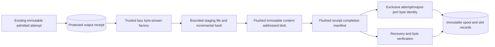

# Durable provider output storage

September 12, 2026. `apps/server/src/execution/output-store.ts` implements an application-owned output spool. It stores small immutable receipts in SQLite and byte streams in private files. Engine can explicitly consume its [V2 completions and exact PNG ingestion](SPOOL-COMPLETIONS.md); the launcher has not enabled that optional path. Real providers remain disabled and unregistered. No provider or downloader is called by this component.

## Boundary and records



`recordReceipt(projectId, input)` requires an existing attempt and the exact digest of its entire persisted application request. The service derives execution identity from that request, including the explicit fake/v1 interpretation for historical requests. It verifies output role/format and any already recorded vendor task identity. The receipt ID is derived by the service from the complete observation; replaying identical metadata returns the same receipt.

The API distinguishes an application receipt ID from nullable vendor task ID and diagnostic request ID. It does not manufacture a remote task for synchronous image responses. A source is either an exact expected SHA-256/byte length for returned bytes, or a **protected opaque locator** with nullable expiry. Locators are evidence only: the store neither interprets them as URLs nor fetches them.

Three immutable record families have same-project reference checks:

| Record | Identity and responsibility |
| --- | --- |
| `execution_output_receipt` | One provider observation, bound to an existing immutable attempt request. Holds protected locator/diagnostic metadata. |
| `execution_output_spool` | One completed byte identity per receipt: storage UUID, SHA-256, measured byte length, and derived blob key. |
| `execution_output_slot` | The first completed byte identity for a particular attempt/output port. References an owned spool. |

A refreshed locator creates a new receipt. Matching bytes can reuse the same blob while preserving each receipt's provenance. Different bytes cannot replace the first completed attempt/port binding; the conflicting receipt and durable files remain evidence, and the operation reports a conflict. This binding is not a selected project artifact or a settled execution result.

Receipt methods are trusted host APIs. They are not available through model tools or browser routes. A future provider bridge must construct them from validated transport observations; a caller-provided hash or locator alone is not application authority. None of these operations changes an attempt phase, reservation, grant, hold, human approval, or active plan.

## Bytes and publication

`spool(projectId, receiptId, factory, {signal})` opens a trusted byte-stream factory lazily. An already verified completion returns without reopening it. The store copies each bounded chunk, updates SHA-256 incrementally, and writes it to its own unique staging file. It verifies any expected hash/length, flushes the bytes, and publishes through an exclusive hard link without overwriting an existing blob.

The receipt manifest is flushed before its completion is recorded in SQLite. A separate exclusive slot manifest preserves the first winning byte identity across process interruption. The database transaction then verifies the original attempt/receipt relationship and installs immutable spool/slot records. Filesystem operations remain outside SQLite transactions.

Paths are derived internally from service-issued receipt IDs and validated hashes. A persistent storage UUID binds descriptors to their storage root without persisting absolute paths. Preexisting symlink storage directories are rejected, metadata and blobs are opened without following final symlinks, and recovery rechecks file type, size, and streamed SHA-256. Normal failures remove only that operation's temporary directory; published files are never deleted as error cleanup because another receipt may already use them.

`resolveOwned` returns a verified descriptor and an internal host path. These are still **unvalidated media bytes**. The subsequent image/video ingester must fully decode/probe them and create an artifact before any human review or timeline use. `LocalImageStore` can perform the image validation; it is not called automatically here.

## Recovery

| Durable state | Recovery behavior |
| --- | --- |
| Receipt only | Return not-ready. No generation or download is attempted. |
| Interrupted staging file | A fresh explicit spool operation can consume a new stream. Crash-left temporary files remain for future owned cleanup. |
| Blob without manifest, expected response hash known | Locate the exact hash-derived blob, verify its bytes, and complete its manifest/database records. |
| Blob without manifest, locator has no expected hash | Remain not-ready; do not guess which orphaned blob belongs to that receipt. |
| Manifest/slot durable, database transaction missing | Verify the files and reconstruct the immutable records. |
| Earlier matching receipt won the slot before its database write | Recover that receipt first, then record the later matching observation. |
| Corrupt, missing, conflicting, or wrong-storage files | Fail explicitly; retain evidence and leave generation liability unchanged. |

If a synchronous image response is lost before any bytes become durable, this component cannot recover it from a diagnostic request ID. Unknown submission/output liability must remain unresolved above this layer; recovery must not blindly regenerate it. An expired H3 locator similarly requires observation of the already accepted vendor task through a future bridge, not a new generation request.

## Limits and operational scope

- Images: 32 MiB; videos: 256 MiB. Only PNG/video-MP4 receipt profiles are supported here, without claiming their bytes decode successfully.
- Metadata: 16 KiB per manifest/receipt; opaque locator: 8 KiB; each supplied chunk: at most 1 MiB.
- At most two active spool/recovery operations per canonical storage root **within one application process**, shared across store instances. Single-installation startup ownership is handled separately.
- A write checks free disk space against its expected size, or the kind's maximum, plus 16 MiB headroom. This is a preflight, not reserved disk capacity or a quota guarantee; other writers/processes can consume space afterward.
- A spool operation has a ten-minute default deadline, configurable only downward. It aborts stalled source opening/reads and checks cancellation throughout hashing/publication. Native filesystem operations and cleanup are awaited rather than abandoned; this is not a hard preemption guarantee for a hung filesystem. Direct recovery accepts cancellation and bounded file sizes, without claiming a separate hard wall-clock timeout.
- Source factories receive cancellation and must cooperate. Late-resolving factories are closed best-effort; a malicious or noncooperative host implementation is outside this in-process trust boundary.

Cancellation binds to the original signal even if a caller later replaces its options object. A successful spool result is returned only after owned file handles and temporary cleanup have settled and cancellation is checked again. If cancellation arrives after immutable publication, the call reports cancellation while preserving recoverable blobs and records. Recovery retains its writer slot until its filesystem work settles; a timeout does not release that ownership early.

No network downloader, credential handling, background cleanup, project export/restore, decoded-media pipeline, or storage quota subsystem was added. Locators are protected operational data: do not include these receipt records in ordinary event, browser, or director projections. Existing backup code copies SQLite only; a future portable project export must include referenced blobs/manifests.

## Verification

Node 24 server compilation passed. **25 focused tests passed, zero failed/skipped:** 20 output-store tests plus five existing persistence tests. They use synthetic local bytes and no provider/network calls. Tests cover immutable identity, ownership, limits, cancellation after durable publication and late source cleanup, shared concurrency through cancelled recovery, exclusive output selection, symlinks/corruption, and interruption recovery before manifest/SQLite publication.

The large-file fixture streamed **65 MiB** through one-MiB chunks and verified the final SHA-256. Its receipt, spool, and slot each occupied fewer than 2,048 SQLite text characters, with no Base64 payload. This verifies the storage boundary beyond the executor's temporary 64-MiB inline limit; it is not a real-video decode or measured peak-memory benchmark.

```sh
pnpm --filter @openslate/server build
node --test apps/server/test/output-store.test.mjs apps/server/test/persistence.test.mjs
```

The [additive V2 completion boundary](SPOOL-COMPLETIONS.md) now distinguishes application receipts from nullable vendor tasks and consumes the exact winning slot, with legacy evidence preserved. Real model/profile activation, safe downloading, generated-video normalization, and paid-call allowances remain separate work.
