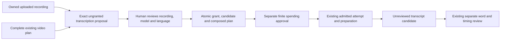

# Transcribe an owned draft recording

September 13, 2026. **Compiler, exact proposals, human application review and owned-input execution are implemented. Browser/conversation entry points remain next.** The configured transcription runtime and durable local preparation waiting are implemented. This sequence connects an uploaded recording to reviewed transcription without requiring a script, cue or canonical narration acceptance first.

## User and authority flow



Preparing an operation does not issue a creative grant or consume a spending allowance. Exact human review creates and consumes the needed grant atomically with the candidate and plan. The existing separate allowance then bounds execution. A model, a generic read-only message or an earlier allowance cannot stand in for that review.

## 1. Compiler and owned-file foundation

**Implemented boundary:** `composeTranscriptionPlanIsolated` validates the complete saved source, recompiles it against the current project, and appends one bound operation within a single five-second worker deadline. Its plain-data capture is limited to 16 MiB, 400,000 values and depth 128; existing compiler limits still apply. The compact input catalog permits at most 64 bindings and 64 KiB of canonical metadata. Application callers must use the isolated API. The synchronous function exists for the fixed worker and focused tests.

```ts
// Trusted host context contains the exact recording binding; the source cannot mint it.
definePlan({ baseRevision: "current-project-revision" }, p => {
  return p.transcription("recording-transcript", {
    profile: "locked-transcription-profile",
    audio: p.transcriptionInput("application-issued-binding-id"),
    language: "en",
    timing: "word",
    settings: {}
  });
});
```

The reference above is available only to `recording-transcript`. Its binding ID/digest participates in the symbolic specification and effective execution fingerprint. The caller's catalog is detached before an allocator callback or worker can run. Legacy nodes omit the new metadata entirely and preserve their previous serialized bytes and hashes. The Engine now requires the exact human review/application chain before installation and admission; a successfully compiled source is not an executable approval.

Add a trusted bounded `CompileContext.transcriptionInputs` catalog. Each entry contains an opaque binding ID/digest, one consumer alias and an exact audio artifact reference. The application will later derive these entries from verified immutable recording bindings; the planning language cannot create them. `p.transcriptionInput(id)` returns an internal reference that only the named transcription operation can consume. Images, video, timeline narration, rendering and other transcription aliases must reject it. Ordinary `p.asset()` remains limited to canonical project artifacts.

The new node has an optional `applicationInput` link with the fixed `owned_transcription` kind and exact binding ID/digest. Keep it outside provider operation arguments. Include it conditionally in both symbolic node identity and the effective execution fingerprint; absence preserves legacy node and request hashes. Snapshot bounded plain data without executing accessors, preserve the snapshot across the compiler worker and reject duplicate identities, malformed audio references or unbounded inputs.

Use the existing restricted AST printer to compose one new transcription declaration into the complete existing source. Update only the base revision and insert the application-owned declaration before the final return, preserving existing returned outputs. All declared operations already belong to the execution graph, so the new transcription need not replace the existing render output. For a project without a plan, return the single transcription operation. Recompile the rewritten baseline and result in a bounded worker, then verify every unrelated node and review gate remains exactly identical. Reject conflicting aliases, invalid historical graph/source pairs or an existing plan that no longer compiles against current canonical state. Never concatenate compiled graphs while claiming unrelated source as the executable plan.

This first foundation supports appending one operation. Stable replacement of an existing section operation will receive an explicit composition contract before conversational edits depend on it. Preserve old outputs and history; do not silently retire omitted video work. Compilation is not publication or permission. Engine installation and admission now require the exact application binding/review chain for nodes containing this field.

Reuse the existing exact narration artifact installer and byte format, with additive original-signal cancellation. Keep the saved artifact identity compatible with later canonical application. Do not add the draft recording to `project.artifacts`, narration cues or acceptance records merely to make it available for transcription.

## 2. Exact recording proposal and human application

**Implemented preparation slice:** [Ungranted recording proposals](OWNED-TRANSCRIPTION-PROPOSALS.md) now retain exact owned source/target, model, full composed plan and historical project evidence without creating authority or changing the active plan. Store and backup closure are implemented. The [human application and execution slice](OWNED-TRANSCRIPTION-REVIEW.md) is also implemented; the paragraphs below retain its intended boundaries.

A narrow application service captures the original request, project head, current capability lock, full selected profile/options, source-record digest and complete owned source descriptor/range. Its target is explicit: an independent recording, or a named narration section with exact selected section revision/audio. Never infer a section from matching bytes.

After asynchronous byte installation and bounded compilation, recheck the original signal/request, source and project/section versions before storing the immutable source binding and ungranted proposal. Detailed source and compiled-plan records remain available for debugging; human review can show concise recording, recognition, model and configured-estimate summaries. Proposal replay returns the retained result rather than creating a new plan or authority.

The current general preparation service requires unused grants before it can save a prepared change. Refactor a shared synchronous finalization/apply kernel for the exact human review path; do not issue a broad unused grant before asynchronous compilation, and do not forge a prepared row that skips footprint, stage, capability-lock or request checks. Apply revalidates the displayed proposal and creates the grant, candidate, full composed plan and immutable review receipt in one command transaction. Restore must not revive an imported proposal's ability to mint fresh authority.

Keep record dependencies acyclic: the source binding pins its originating request, exact source/target and consumer alias; the proposal references that binding and compiled result. Activation will use two immutable review records in the same transaction. A human review keyed by its newly created grant pins the exact proposal, source and proposed operation/plan before installation. An application receipt keyed by the resulting candidate then links that review to the installed plan and applied revision. This lets installation check exact human review before creating a candidate, while admission requires the completed application receipt. Neither record is a generic bypass flag, and any final failure rolls back the grant and complete publication. A source-binding digest does not itself claim human approval.

Reviewed grants must not enter the ordinary pool of unused generation grants or be consumed by a different plan/node. Retained owned nodes require their previous candidate, byte-identical node and historical application receipt. Check literal artifact inputs separately from historical output resolution: a current canonical reference or the exact reviewed owned transcription input is required. Dropping the application-input link or renaming the operation cannot turn a noncanonical recording into an ordinary authorized input. Admission resolves review from the exact candidate/grant chain, not an unrelated review of the same recording.

Choose the authenticated review request deliberately. Existing generic creative mutation requires an active editing request, while existing spending review uses a purpose-bound non-editing request. The specialized transcription review must not silently turn a read-only message into general creative authority or release another request's holds. If it uses the editing path initially, retain the current request/epoch and exact hold ownership rules. Any narrower non-editing review path needs its own exact context-digest authorization and shared validation, rather than weakening general `assertActor` behavior.

## 3. Execution, persistence and review integration

Before activation, Engine must validate every noncanonical recording consumer, including callers that bypass the compiler. Pin the source-binding link in immutable admission metadata and check its exact section/source selection at admission, preparation resume and the final first-dispatch marker. An unrelated narration-section edit must not invalidate this work; replacement of its selected recording must. Historical result recovery checks the retained binding rather than requiring the old section to remain current.

Extend Store and media-inclusive backup closure for the source binding, proposal and human review. Retain the same candidate/attempt/reservation/allowance machinery. Transcript publication remains unreviewed; the existing human word/timing adoption and independent narration acceptance paths are unchanged.

General future plan edits must be able to retain already reviewed application-owned transcription nodes. Supply only their validated historical bindings through the trusted compiler context; otherwise a video edit would fail to recompile the saved source or drop the recording operation. Retention is not permission to change that operation: changed profile, language, source or candidate still requires exact new review. Validate unchanged-node reuse and a separate unrelated shot edit before activating this path for normal projects.

After the backend path passes, add authenticated recording-generation review routes and a browser action. Keep the current V2 director contract unchanged. The later conversational entry point needs an explicit new tool version and guidance upgrade, alongside the planned speech-section/chunk flow. Correct the existing unconditional `fixtureOnly` context claim before advertising real generated work through that entry point.

## Verified foundation and remaining acceptance

**Foundation verification:** all 1,459 checkout tests passed (62 additions), with builds/typechecks and the installed no-turn Codex probe. The 26 compiler, 11 composition, 16 installer and nine activation-gate checks cover the new boundary. A 60-shot six-minute fixture retained all 122 old operations and 60 review gates; isolated composition took 101.0 ms in its focused run and 107.2 ms during the full suite. These are fixture observations, not a production latency guarantee. All 342 authored source/test/configuration/style files were unchanged through the full check. Independent review found no remaining correctness issues. No model or media calls occurred. See [sanitized evidence](owned-recording-foundation-evidence.json).

All backend items below are now verified by the subsequent [proposal](OWNED-TRANSCRIPTION-PROPOSALS.md) and [human review/execution](OWNED-TRANSCRIPTION-REVIEW.md) milestones. Browser and conversational entry points remain next.

- Pure and isolated compilation: exact bound audio input, wrong-consumer rejection, detached caller data, bounded parsing and unchanged legacy identities.
- Full-plan composition: audio-only project plus an existing reviewed multi-shot plan, preserving unrelated aliases, node bytes, review gates and returned render outputs.
- Owned file installation: original cancellation throughout reads/publication and exact compatibility with current canonical artifacts.
- Backend upload-first path: no script/cues/acceptance required; proposal creates no grant, then exact human apply and a separate allowance lead through injected HTTP and real local conversion to one unreviewed candidate.
- Request/version/source replacement during each await, explicit section identity, unchanged unrelated sections, replay and changed-body rejection, restore fencing and no repeated provider POST.

No live media API is needed to implement these slices. See [activation sequence](AUDIO-ACTIVATION.md), [implemented waiting](AUDIO-PREPARATION-WAITING.md), [human transcript review](TRANSCRIPT-REVIEW-ADOPTION.md) and [development status](STATUS.md).
