# Ungranted recording proposals

September 13, 2026. The backend can prepare and retain one exact transcription operation for an owned uploaded or previously generated recording. This slice creates no generation permission. Human generation review, execution activation and ordinary browser/conversation entry points remain the next integration.

```mermaid
flowchart LR
    Request[Active project request] --> Capture[Capture recording, target, plan and model]
    Capture --> Verify[Verify owned audio and install immutable copy]
    Verify --> Compose[Append operation in bounded compiler worker]
    Compose --> Recheck[Recheck original request and exact current inputs]
    Recheck --> Save[(Atomic source binding and ungranted proposal)]
    Save -. next slice .-> Review[Human reviews exact proposal]
    Review -. separate step .-> Spend[Finite spending allowance]
```

## Application boundary

`OwnedTranscriptionService.prepare` requires an active editing request with project scope. Human and director requests can prepare a proposal; neither obtains authority to generate from this method. A read-only request, revoked director epoch or imported request is rejected. The current V2 tool catalog does not expose this method.

Input names an exact `narration_audio` row and digest, locked transcription profile, language, expected project head and explicit target. The target is either an independent recording or one current section revision with that exact audio ID. Matching bytes never infer a section. A recording requires no script, cue, acceptance or canonical narration first.

Unsupported profile/options fail before reading media. The service captures the original actor, input, cancellation signal and artifact directory. It verifies the actual owned source, and additionally verifies retained speech/normalization provenance for a generated recording. It reuses the existing immutable artifact installer. An existing generated artifact retains its original provider provenance; it is never overwritten with an upload label.

After file verification and isolated composition, the service rechecks the original request, complete project, capability lock, source-record digest and selected section. An unrelated section edit may remain valid because the selected section's revision/audio are unchanged. Any canonical project change requires a fresh proposal against that head. Stage binding versions are also checked immediately before saving. No write transaction spans file work or compilation.

The final command transaction publishes a previously absent artifact row, source binding, proposal, event and replay result together. It does not add the audio to canonical `project.artifacts`, change the active plan/global aliases, release holds, create narration acceptances, create a grant/candidate/attempt or consume an allowance. An interrupted or stale operation may leave a reusable immutable file cache without publishing any proposal records.

## Immutable records

| Record | Retained identity and purpose |
|---|---|
| `owned_transcription_source` | Original request/principal/epoch, consumer alias, exact audio-row digest, complete source descriptor and sample range, installed artifact-row digest, and explicit target. A section also references its historical narration revision. |
| `owned_transcription_proposal` | Original request and input digest, historical project/head/base plan, exact capability lock and full profile, source-binding digest, operation, complete compiled plan, proposed logical IDs, derived impact/stages and captured stage versions. Its immutable creation state is `ungranted`. |

The source never references a future proposal, review, grant or candidate. The proposal references the source. This keeps history acyclic. `ungranted` records describe preparation; a future human approval/application will be recorded separately rather than mutating this evidence.

Keyed validators check same-project historical references and strict bounded plain data. Source metadata is limited to 64 KiB, proposals to 16 MiB, and the compiler input catalog to 64 entries. Catalog construction reads only bindings used by the exact base plan. Historical extra aliases remain snapshots; they do not reserve global identities or authorize work. The new transcription node, inputs, specification and graph must match the recorded operation; all prior nodes and review gates remain identical.

Exact command replay returns the retained result before requiring today's files or project head. Original actor and restoration fences still apply first. Changed input under the same key is rejected. Concurrent preparation can converge on one retained command result without creating duplicate proposal history.

## Restore and execution boundary

Store writes validate source/proposal closure and make both families immutable. Backup verifies the descriptor, original upload, normalized PCM and installed artifact. It also independently recomposes the proposal in the bounded compiler worker from the pinned historical project, plan, model lock and input bindings, then compares the full result and proposed IDs. Saved graph digests alone do not substitute for this source check.

An actual same-root restore retains those records and bytes. Imported proposals receive a permanent authority fence: releasing restoration quarantine does not make them fresh approvals. Their source evidence can still support a new request. The Engine's application-input rejection remains enabled for this milestone; no new transcription can be admitted through this proposal API.

## Shared publication and truthful context

The existing production service now has private synchronous assessment, finalization and publication helpers. Its public prepare/apply behavior, grants, actor/epoch ownership, stage/head checks, record shapes, replay and hold ownership are preserved. These helpers will support the exact human approval transaction without issuing an unused grant before asynchronous work.

Director context now derives current-output provenance from exact artifact references and matching same-project records. It reports fixture, nonfixture and unknown counts for the active plan. `fixtureOnly` is true only when every current output is proven fixture, false when any current output is proven nonfixture, and null for no outputs or otherwise unknown evidence. Its explicit scope is current outputs; it does not predict which provider will execute future work. Reads create no state and aggregate complete current output counts without loading entire artifact histories. The speech profile selector is labelled “Narration model.”

## Verification

**Full checkout:** 1,523 tests passed, zero failures/cancellations/skips, with all builds/typechecks and the installed no-turn Codex probe. The 64 additions passed alongside existing coverage. All 351 authored source/test/configuration/style files were unchanged during this check. See [sanitized evidence](owned-transcription-proposal-evidence.json).

Focused checks cover 26 service cases, 12 persistence/restore cases, 11 context cases and 15 publication cases. The publication cases also passed against the pre-refactor build, followed by all 18 existing production-service tests. Service fixtures use real local import of a synthetic recording; the generated-recording case reuses injected provider history. No live media or model calls are made.

Verified boundaries include full two-shot plan preservation; replay after file loss/later state; original input/signal/root capture; request/head/lock/source/section/artifact/stage changes during awaits; actual compiler-result interruption; equal-byte recording replacement; unchanged unrelated sections; transaction failures at final events/command receipts; backup source-text tampering; missing required bytes; and permanent imported-proposal fencing.

The initial build exposed one TypeScript narrowing error, corrected before verification. Early focused failures were test assumptions about event field names, appended-node order, generated fixture revision history, Buffer comparison and recovery snapshot shape; those fixtures/assertions were corrected. No production assertion was weakened to make them pass.

This is backend verification. No browser proposal/approval flow exists yet, and provider access, billing and recognition quality remain unverified. See [overall recording sequence](OWNED-RECORDING-TRANSCRIPTION.md), [compiler foundation](owned-recording-foundation-evidence.json), [preparation waiting](AUDIO-PREPARATION-WAITING.md) and [implementation status](STATUS.md).
