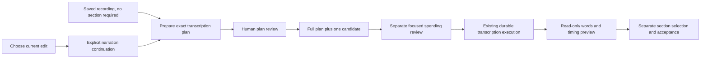

# Recording transcription in the local workspace

September 13, 2026. Implemented HTTP and browser entry points connect the exact [recording review backend](OWNED-TRANSCRIPTION-REVIEW.md) to an upload-first workflow. Automated verification passes; full browser generation/reopen verification remains pending after the browser permission policy denied the synthetic file upload.

## Components and execution

The narration panel offers an independent recording transcript before any script section exists. An uploaded recording carries its complete source-record digest. A generated take becomes eligible after the existing verified attachment path saves its narration recording. The human chooses a saved transcription profile, language and either the independent recording or one exact bound section. Preparation saves an immutable proposal; it creates no grant, acceptance or paid attempt.

The review shows the exact recording identity, duration, origin evidence, model, language, destination, estimate and number of preserved operations. Existing pending-command handling retains the same request body/key during uncertain HTTP outcomes. Successful POST responses contain immutable results; separate GET projections show current eligibility. Checking or failed refresh disables approval, as do changed selected section/audio/revision and stale sessions.

Human plan approval uses the existing atomic review/publication service. The resulting candidate ID opens its exact spending page, including candidates beyond the first 100 rows. This navigation only selects eligible work for review; it cannot issue an allowance. Human spending confirmation remains a separate command and purpose-bound request. The spending projection checks current owned input before offering new approval.

A read-only transcript viewer is reusable outside a narration section. It displays retained recognized words and source timing. Writing adoption, timing selection and script/audio/timing acceptance remain independent human actions. No empty section, cue or accepted narration is synthesized by this flow.

## HTTP and request ownership

| Route beneath `/api/projects/:projectId/narration` | Contract |
|---|---|
| `GET /transcription-options` | Supported profiles from the saved project lock and languages from the existing provider validator; local planning configuration is distinct from provider readiness. |
| `GET /transcription-proposals` | Digest-bound paged history with explicit unavailable rows and coverage. |
| `GET /transcription-proposals/:proposalId` | Exact safe proposal summary, current review eligibility, applied receipt and exact candidate execution status. |
| `POST /transcription-proposals` | Active narration session, exact source digest/head/profile/language/target and header command key; original disconnect signal reaches preparation. |
| `POST /transcription-reviews` | Active human session, exact proposal ID/digest and header command key; original disconnect signal reaches atomic review. |

All routes inherit local authentication and Host/Origin checks and return private, no-store responses. Strict schemas reject invented authority, paths and extra fields. Replay retains original session and body identity. Reads create no request, hold, authority or media work. Historical read routes remain available during restore quarantine; mutations stay blocked.

The narration workspace can display the current human project edit for explicit continuation. Starting a session transfers only the request named by the user action. It does not silently clear other narration or conversation holds. An existing stale narration session must also be acknowledged by its exact ID. Session replay returns its original identity even after another request becomes active.

## Bounded and truthful history

One projection request shares a 32 MiB historical-record read budget, charges each body before hydration, limits each record to 16 MiB and the response to 128 KiB, and caches repeated closure reads. History pages scan at most 20 proposal rows. Malformed or oversized identities and evidence become bounded, nonactionable unavailable rows; page coverage remains explicit. Projection uses a consistent read transaction and performs no media-file verification or repair.

Execution belongs to the exact applied candidate. Before first submission, paused execution, project editing holds, changed selected input, retired candidates and restore fences are visible. Preparing work requires its saved non-dispatch proof. Once a dispatch marker/result or historical post-submit state exists, later editing does not mislabel the actual recorded outcome. Missing or conflicting application/attempt evidence fails closed.

Application capability facts advance to version 4: human browser transcription is implemented, but the locked V1/V2 director tools cannot prepare or approve it. Host readiness is not inferred. Speech creation remains separate pending work.

## Verification and limitations

The complete checkout passed **1,653 tests**, zero failures/cancellations/skips, all builds/typechecks and the installed no-turn Codex probe. All **365** authored source/test/configuration/style files stayed unchanged through this check. The 60 additions comprise 23 HTTP, 21 projection, 13 browser-model and three focused-spending tests. Focused runs additionally verified 64 adjacent HTTP/context/recovery regressions and 45 combined web-model checks; these counts overlap the full suite.

HTTP tests cover actual original-client disconnects, atomic rollback/replay, explicit named request continuation and selected-section spending freshness. Projection tests include real local derivative conversion with one injected provider response, actual same-root restore/release, bounded malformed history and preserved historical completion. No live media calls or native model turns occurred.

The built browser connected, showed the sectionless recording-first workspace and explicitly continued the named conversation in narration. Its synthetic recording upload was denied by browser permission policy. The test did not retry through another browser, HTTP upload, or fixture seeding. Consequently this milestone does **not** claim browser plan approval, spending confirmation, transcript preview or reopen completion. The owned test server and tab were closed. Those manual checks remain pending; automated domain/HTTP/UI-model checks are separate evidence. The focused harness also omitted unrelated image/clip routes, whose unavailable notices are not a production-launcher finding.

See [sanitized evidence](owned-transcription-browser-evidence.json). Next implement the user-selected Viggle H3 integration, then versioned conversational recording preparation and explicit speech chunks. V1/V2 catalog locks and human review/spending boundaries remain intact.

## Source navigation

- Server: `narration/owned-transcription-routes.ts`, `owned-transcription-projection.ts`, `narration/routes.ts`.
- Spending: `application/allowance-projection.ts`, `allowance-routes.ts`.
- Browser: `OwnedTranscriptionPanel.tsx`, `owned-transcription-model.ts`, `NarrationPanel.tsx`, `TranscriptReviewPanel.tsx`, `SpendingPanel.tsx`.
