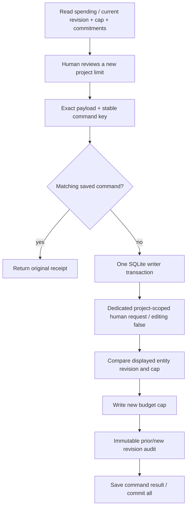

# Explicit project budget revisions

The authenticated local human can change the project's configured-estimate cap through a dedicated command. This cap is independent of candidate spending allowances. Changing it creates no allowance, creative grant, frame approval, director turn or provider call. Amounts use integer USD micros and do not guarantee a vendor's actual bill.



## Application and HTTP contract

The existing opt-in spending route registration adds `POST /api/projects/:projectId/spending/budget`. It requires the local-session bearer token, permitted Host/Origin and an `Idempotency-Key`. It rejects unknown fields and query parameters. The body is:

```ts
{
  expectedRevision: number;
  expectedCapMicros: string;
  capMicros: string;
}
```

The revision is a nonnegative safe integer below `Number.MAX_SAFE_INTEGER`. Both amounts are canonical nonnegative decimal strings bounded by SQLite's signed 64-bit maximum. Zero is permitted. There is no implicit increase: only this exact authenticated payload can change the cap through the application route.

`GET /api/projects/:projectId/spending` exposes `projectBudget: { revision, capMicros, committedMicros, currency: "USD" }`. The projection does not create an initial budget row. Revision zero means Engine is using its configured default because no saved row exists. Otherwise revision is the existing SQLite entity version, not the canonical project's head version. A later initial-plan write or internal host `Engine.setBudget` call changes this revision even if the semantic cap stays equal. Both the displayed revision and cap must match, so a cap that changes and returns to its original value still invalidates a stale dialog.

The application service requires an active, project-scoped human request with `editing: false`, matching principal and exact `projectBudgetContextDigest(projectId, input)`. The digest contains purpose `project_budget.revise`, version 1, project and the complete payload. Generic conversation, a director actor, an editing request, another scope, another principal or another purpose cannot authorize this operation.

For a new command, the HTTP handler creates that request inside the same Store command transaction as the budget update and audit. A failed comparison or audit insert rolls back the cap, entity version, request, events and command receipt together. Separate SQLite workers serialize through the writer lock; only one can apply a given displayed revision. Allowance issuance does not call this service or change its behavior.

The response is `{ requestId, revision }`, where `revision` is the immutable audit:

```ts
{
  id: string; projectId: string; version: 1;
  requestId: string; principalId: string; contextDigest: string;
  createdAt: string; currency: "USD";
  priorRevision: number; priorCapMicros: string;
  revision: number; capMicros: string;
}
```

Audit identity equals the request ID. Store validates same-project request ownership, read-only request type, exact context, prior/new revision relationship, amounts and canonical timestamp, and prevents later edits. Static audit validation remains valid after later budget changes or request supersession. `Engine.setBudget` remains a trusted internal host method; it does not invent human audit records. The application path is the audited boundary.

Repeated key/body returns the original result before rechecking today's cap or project state. It survives later changes and database reopen. A changed body under the same key conflicts. Keys are scoped by local human, project and budget operation, independently from allowance issue/revoke commands. Clients should preserve their exact detached key/body while the command outcome is uncertain.

## Lower limits and existing liabilities

The human may lower the cap below already committed estimates. The command changes only the budget and audit; it never releases reservations, refunds allowance consumption, cancels admitted work or changes attempts. Subsequent admission still runs Engine's existing project-budget check. Reconciliation of an already admitted job continues, including when its original submission was uncertain. Raising the project cap likewise does not supply missing allowances, grants, keyframe review or credentials.

## Verification

The server build and **11 new budget tests** passed, including two independent SQLite workers competing for one displayed revision. The combined budget, allowance, HTTP/API and persistence regression run passed **63 tests** with no failures or skips. Checks cover the unsaved default, exact dedicated authority, HTTP authentication/schema bounds, unchanged creative/execution state, stale cap/version and host ABA, full rollback after audit failure, restart replay, cross-project command keys, immutable audit validation, and lowering to zero while an uncertain reservation remains recorded and later reconciles. The uncertainty case uses the existing in-process fake provider; no network, real media or native model calls were made.

Sources: `apps/server/src/application/project-budget.ts`, budget registration in `allowance-routes.ts`, the spending projection, narrow Store audit checks, and `apps/server/test/project-budget.test.mjs`. Browser review is a separate UI integration. The command itself does not activate paid adapters or credential lookup.
