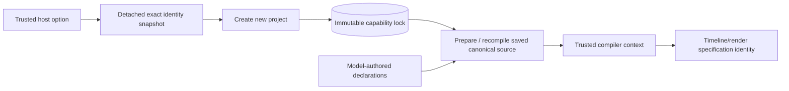

# Pinned project local execution

The trusted application host can select the exact local assembly identity for **new projects** when constructing `ProductionService`:

```ts
new ProductionService(store, engine, profiles, {
  newProjectLocalExecution: { adapter: "local-media", version: "1" },
});
```

This option pins identity only. The shipped launcher still omits it. It does not register or activate a local executor, create attempts or authority, configure paths or executables, or alter image/video provider selection. Dispatch, cache reuse and publication must verify the identity when real assembly is implemented.



## Lock and compilation boundary

The constructor validates and snapshots the optional value with core's `snapshotLocalExecution`. Only `{ adapter: "local-media", version: "1" }` is supported. Later mutation of the caller's value cannot change newly created projects. The selected identity is saved as `capability_lock.localExecution` alongside the existing workflow and provider pins. Human-selected installed provider profiles and their provenance remain independent fields.

Omission, including an undefined optional constructor value, adds no field to the lock and preserves the exact legacy lock body. Existing project locks are never upgraded or rewritten by this option. A service with the option enabled still compiles a legacy project without local execution; a service with no option still retains an opted-in project's saved identity after restart.

Preparation verifies that the capability lock belongs to the project and retains its supported workflow contracts. If `localExecution` is present, it must pass strict core validation; null, undefined, malformed or unsupported saved values fail with `LOCAL_EXECUTION_UNSUPPORTED`. Only an absent field means legacy behavior. The host constructor default is never a fallback for a saved project.

The captured saved value enters `CompileContext.localExecution`, separately from model-authored source. Timeline/render nodes receive the exact pin before their specification and graph digests are computed. Generated media nodes and human review gates retain their existing identities. Canonical source still contains only planning declarations; recompilation obtains its local identity from the same immutable project lock. Existing prepared-change capability digests also bind this field at apply time.

The HTTP create-project schema, change proposals and planning language expose no local-execution selector. A human/model payload cannot replace the pin, and Store's existing capability-lock immutability prevents modifying or removing it in place. This slice introduces no migration or user-database rewrite.

## Verification and remaining work

The server build and **52 combined regression checks** passed, including **nine new project pinning tests**, existing application workflow/provider catalog tests and the core identity checks. Tests use synthetic projects and the existing fake provider, with no provider dispatch in the new pinning tests. They cover exact legacy lock/compiled-plan compatibility; detached constructor and lock snapshots; only new projects inheriting the host choice; immutable pin retention across apply, creative edits, database reopen and canonical recompile; unchanged media/review identities; malformed saved pins; accessor rejection; API/DSL/proposal override rejection; and independent provider-selection provenance without authority creation. No real media or native model calls were made.

The compiler identity foundation is documented in [trusted local assembly identity](LOCAL-EXECUTION-IDENTITY.md). Real execution still requires the local executor registry, complete source/sample/toolchain identity, durable timeline/render receipts and Engine dispatch/reuse/publication checks. [Shared timeline capture](TIMELINE-CAPTURE.md) supplies the current owned input snapshot; this project option does not by itself run it.

Sources: `apps/server/src/application/service.ts`, `apps/server/test/project-local-execution.test.mjs`, and the existing core local execution contract/compiler.
