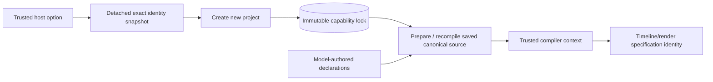

# Pinned project local execution

The trusted application host can select the exact local assembly identity for **new projects** when constructing `ProductionService`:

```ts
new ProductionService(store, engine, profiles, {
  newProjectLocalExecution: { adapter: "local-media", version: "1" },
});
```

This option pins identity only. The shipped launcher still omits it. It does not register or activate a local executor, create attempts or authority, configure paths or executables, or alter image/video provider selection. Dispatch, cache reuse and publication independently verify the saved identity.

A host preparing external video execution can restrict this choice to new projects whose resolved trusted profiles include an external video adapter:

```ts
new ProductionService(store, engine, profiles, {
  newProjectLocalExecution: { adapter: "local-media", version: "1" },
  newProjectLocalExecutionFor: "external-video",
});
```

The only supported scopes are `all` and `external-video`. An omitted or undefined scope means `all`, preserving the existing opt-in behavior. `external-video` requires a valid explicit identity and pins only when a resolved profile has `kind: "video"` and `adapter` other than `fake`. Installed selections come from the validated catalog; a plain client-created selection object is rejected. Trusted constructor profile defaults apply when no installed selection is supplied. Default demo profiles, explicitly selected fake video, and external image with fake video retain the exact legacy lock and compiler behavior. Neither selection nor this scope grants generation or spending authority.



## Lock and compilation boundary

The constructor validates and snapshots the optional identity with core's `snapshotLocalExecution` and captures the validated scope. Only `{ adapter: "local-media", version: "1" }` is supported. Later mutation of the caller's identity or scope option cannot change newly created projects. A matching project's identity is saved as `capability_lock.localExecution` alongside the existing workflow and provider pins. The host selection rule itself is not persisted as project authority. Human-selected installed provider profiles and their provenance remain independent fields.

Omission, including an undefined optional constructor value, adds no field to the lock and preserves the exact legacy lock body. Existing project locks are never upgraded or rewritten by this option. A service with the option enabled still compiles a legacy project without local execution; a service with no option still retains an opted-in project's saved identity after restart.

Preparation verifies that the capability lock belongs to the project and retains its supported workflow contracts. If `localExecution` is present, it must pass strict core validation; null, undefined, malformed or unsupported saved values fail with `LOCAL_EXECUTION_UNSUPPORTED`. Only an absent field means legacy behavior. The host constructor default is never a fallback for a saved project.

The captured saved value enters `CompileContext.localExecution`, separately from model-authored source. Timeline/render nodes receive the exact pin before their specification and graph digests are computed. Generated media nodes and human review gates retain their existing identities. Canonical source still contains only planning declarations; recompilation obtains its local identity from the same immutable project lock. Existing prepared-change capability digests also bind this field at apply time.

The HTTP create-project schema, change proposals and planning language expose neither local-execution identity nor scope selectors. A human/model payload cannot replace the pin, and Store's existing capability-lock immutability prevents modifying or removing it in place. Changing the host rule affects new projects only; it neither upgrades old legacy projects nor removes existing pins. This slice introduces no migration or user-database rewrite.

## Verification and remaining work

The server build and **35 focused regression checks** passed: **13 project pinning tests**, 16 provider catalog tests and six real local-executor tests. Project tests cover exact legacy lock/compiled-plan compatibility; detached constructor identity/scope and lock snapshots; conditional external-video selection; only new projects inheriting the host choice; immutable pin retention across apply, creative edits, database reopen and canonical recompile; unchanged media/review identities; malformed saved pins; invalid scopes; accessor rejection; API/DSL/proposal override rejection; and independent provider-selection provenance without authority creation. Executor tests use synthetic supplied media with local FFmpeg. No media API or native model calls were made.

The compiler identity foundation is documented in [trusted local assembly identity](LOCAL-EXECUTION-IDENTITY.md). [Automatic local assembly](AUTOMATIC-LOCAL-ASSEMBLY.md) uses the separately configured local executor, complete source/sample/toolchain identity, durable timeline/render receipts and Engine dispatch/reuse/publication checks. [Shared timeline capture](TIMELINE-CAPTURE.md) supplies the current owned input snapshot; this project option does not by itself run it. Launcher activation remains separate work.

Sources: `apps/server/src/application/service.ts`, `apps/server/test/project-local-execution.test.mjs`, and the existing core local execution contract/compiler.
