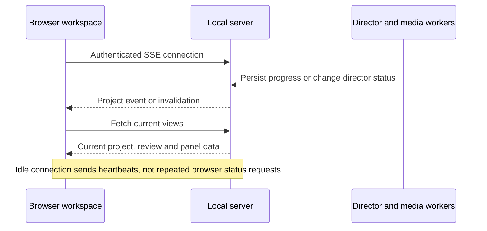

# Project settings and live workspace updates

Project settings is available in the workspace header and sidebar. It contains Models & usage, Director, and Setup & accounts. Credentials remain server-side; the browser displays setup and billing information, not secret values.

## Changing media models

1. Open **Project settings → Models & usage** and choose installed profiles.
2. Choose unfinished work or a selected shot scope, then **Preview changes**.
3. Inspect changed work and preserved results, active jobs, reviewed audio and their dependencies.
4. Apply the captured preview. A project/catalog change requires a fresh preview.
5. Continue in conversation when ready to prepare the next plan and review its generation requirements.

Saving models creates a new project configuration and retains the old definitions needed by history and existing jobs. It does not call a model, regenerate an asset, grant generation approval or approve spending. Changed unfinished work must pass the normal planning and generation boundaries. Previously submitted or uncertain jobs retain their original provider identity.

Director changes apply to a future conversation turn. Active work is not silently interrupted. Local executable/account paths are under advanced setup. An older demo plan without the required local processing configuration cannot be silently converted into an H3 plan; incompatible pending changes are rejected before publication.

## Workspace updates

One stream serves the active project and its panels. Browser actions still send their normal API commands and refresh on completion. SSE covers later background progress, changes from other clients and reopening the page. Stream messages invalidate views; they do not grant execution authority.

Events carry replay cursors. Reconnection refreshes current state, and gaps or oversized history trigger a snapshot resync. Hidden tabs disconnect and resume when visible. If streaming fails, the UI displays **Periodic updates** and uses a 30-second fallback while reconnecting. Normal operation displays **Live updates**.

The server shares a lightweight database/status watcher across active streams. It stops when no clients remain. Provider-side job polling is separate and remains necessary where the provider API does not push completion.

## Manual check without media spending

- Open an existing project and locate **Project settings** in the header.
- Change a model, inspect the preview, and apply. Confirm no media generation begins automatically.
- Reload and confirm the saved selection persists. Completed results should remain visible.
- Open Director and Setup & accounts; check plain-language usage labels and collapsed advanced paths.
- Keep the page idle: the browser should keep one event stream, with no recurring per-panel status requests while connected.
- Disconnect/reconnect the local server: verify recovery to current state without replaying a mutation.
- Switch away and back to Story & narration with an unsaved draft; confirm it remains intact.
- Verify keyboard focus stays inside settings, Escape closes when idle, and focus returns to the opener.

Automated and browser validation evidence is recorded in STATUS.md. This feature does not validate real media API quality or account access.
