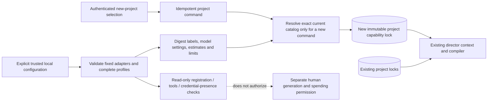

# Installed provider catalog and project selection

Built-browser validation (September 12, 2026): the shipped local launcher loaded the example catalog with media credential variables removed. The browser selected its image/H3 profiles, showed configured estimates and missing keys, and retained the exact project/lock after a server restart. That project had no requests, holds, grants, candidates, attempts, approvals or allowances. A separate default project completed two human frame approvals and six fake operations; its enlarged keyframe and decoded one-second 160×90 video retained fixture labels. Console checks were clear before the deliberate shutdown; refresh restored connectivity afterward. Read-only database reopen verified both projects and their saved choices. No model/media API calls or native file-picker interaction occurred. The complete checkout check passed 704 tests with builds/typechecks and the no-turn installed-Codex probe.

The backend has an immutable installed-provider catalog, local readiness views and explicit provider selection **when creating a new project**. This component performs no network checks and does not enable real generation. Selecting a model creates no creative request, hold, grant, allowance, candidate, attempt or director turn. The launcher and interface are separate composition work.

## Configuration and identities

`InstalledProviderCatalog` accepts an optional trusted configuration value with the exact shape `{version: 1, profiles: [{label, profile}]}`. With no configuration, the catalog consists of the four unchanged built-in fake profiles. Additional entries may use the compiled-in `openai-image/1`, `minimax-h3/1`, `openai-speech/1` and `openai-transcription/1` mappings. They cannot redefine reserved fake profile IDs, choose arbitrary adapter code, or supply transport endpoints, keys or file paths. The trusted adapter table owns fixed credential aliases; an H3 download-host allowlist remains separate host transport configuration.

Each external `profile` explicitly supplies its ID, revision, operation kind, adapter and execution version, model/settings, concurrency limit, retry limit and `unitCostMicros`. Image settings must include supported width, height and quality. H3 settings contain only resolution, with explicit supported whole-second `minFrames`/`maxFrames` for the selected H3 or H3-Max model. Audio profiles use the exact model contract and empty settings, without frame limits. Speech voice/instructions are operation arguments; transcription requires explicit word timing at operation preflight. The catalog validates these concrete combinations without making a provider request.

Configured prices are **host-entered estimates**, not discovered or verified vendor charges. The public view labels their basis `host_configured`, uses USD decimal micros and marks `actualVendorPriceVerified: false`. Fake amounts retain the `fixture` label. No API prices or default real-media estimates are guessed.

The full catalog digest covers every installed definition, including labels, prices, concurrency/retry/duration limits and model/settings. This is distinct from the execution profile digest, which binds the provider mapping and creative configuration. A cost-only change must invalidate a new selection from an old catalog view even when the underlying image-generation payload would be identical.

`readInstalledProviderConfiguration(path)` is an optional host helper for an explicitly selected local file. It reads at most 64 KiB through no-follow regular-file access, rejects size changes and malformed/unknown configuration, and returns sanitized errors without the file path or body. There is no automatic path lookup, browser configuration upload, arbitrary environment alias or remote config loader. As with any trusted configuration, labels and ordinary values must not be used to store credentials; known credential/location fields are rejected rather than projected.

## Local readiness

Authenticated endpoints:

| Endpoint | Result |
|---|---|
| `GET /api/providers` | Current catalog digest, default fake IDs, installed definitions and local readiness |
| `GET /api/projects/:projectId/providers` | The project's exact saved profiles/provenance, compared with the current installed definitions |
| `POST /api/projects` | Existing name-only creation, or explicit paired `expectedCatalogDigest` and `profileIds` |

Each provider row reports configuration validity, current adapter registration, explicit host enablement, required media tools, local credential presence/backend availability, and whether spending permission is still required. Credential presence is format/presence information from the fixed environment backend: `apiValidated` remains false. Missing keys can be shown without preventing the user from planning a project with that model. `realExecutionEnabled` requires all local prerequisites; it does not authorize spending. Registration alone cannot imply host enablement.

Project responses additionally expose read-only `projectExecution` compatibility. An H3 profile in a historical lock without the exact local assembly pin remains incompatible even when the provider itself is ready. The UI explains that a new compatible project is currently required. Installation readiness remains separate, and the project aggregate excludes incompatible rows. These projections never modify a lock or grant authority.

Readiness is recalculated when read and does not change the catalog digest. No readiness read writes project state or contacts a model/media API. A removed installation definition does not replace an existing project's saved configuration. A malformed or unsupported saved profile is shown as unavailable with no raw configuration projection.

## New-project selection and replay

Selection requires both `expectedCatalogDigest` and `profileIds`, with one to four distinct installed IDs and at most one selected profile per generated operation kind. A selected profile replaces that kind's fake default; omitted kinds retain their explicit fake defaults. Thus an image-only selection still leaves video, speech and transcription labeled as demo providers.

The catalog mints an opaque trusted selection. `ProductionService.createProject(name, selection?)` accepts that object and copies the selected full profile definitions plus `providerSelection: {catalogDigest, profileIds}` into the new capability lock in the existing creation transaction. Arbitrary raw profile definitions cannot be passed through the HTTP creation body or forged as a trusted selection. Name-only creation preserves the exact historical capability-lock shape and existing constructor defaults, with no extra provenance fields.

The route resolves the catalog selection **inside** the idempotent command callback. A completed command replay returns its original project before consulting today's catalog, including after the selected profile has been removed. A new command with a stale digest or invalid selection fails before project creation. Changing the payload under an existing command key remains an idempotency conflict.

The existing context projection and plan preparation already use `capability_lock.profiles`, so selected configurations reach the director and compiler without modifying skill/tool contracts. Existing project locks, prepared plans and admitted requests are not upgraded. There is no provider-change endpoint for an existing project in this slice.

The current demo director uses hardcoded fake image/video profile IDs. The demo command therefore rejects a project containing real profiles before seeding media or creating demo grants. A separate default project remains the demo path. This guard prevents the demo from being mistaken for real generation setup.

## Verification and remaining work

Server build passed. The combined catalog, API, service, context, demo and credential regression run passed **60 tests with zero failures/skips**, including 15 new catalog tests. The API event-stream test required normal loopback-listener permissions. All providers were synthetic; no live model/media API was contacted.

The new focused suite covers exact default-lock compatibility, full-definition digests and defensive copies, invalid settings/keys/URLs/adapter fields, H3 model capabilities, paired selection schemas, one-profile-per-kind selection, opaque trust, local readiness separation, credential changes, zero authority from selection, stale-catalog rejection, replay after catalog replacement, retained old profiles, demo isolation and bounded file loading.

A subsequent loader review added nonblocking open before the regular-file check, so a configured FIFO cannot wait indefinitely for a writer. Its bounded child-process regression brings the catalog suite to **16 tests**. The follow-up catalog, HTTP, artifact-display and browser-model run passed **48 tests with zero failures/skips**; server build, browser typecheck and browser build also passed. Display metadata follows the exact saved artifact, including previous previews; missing metadata stays neutral and does not change review identity or approval payloads.

Source: `apps/server/src/application/provider-catalog.ts`, `ProductionService.createProject`, and provider/project routes in `apps/server/src/app.ts`. Tests: `apps/server/test/provider-catalog.test.mjs`.

The launcher loads `OPENSLATE_PROVIDER_CONFIG` when explicitly configured; the new-project form and saved-model summary use this catalog. [Opt-in execution](MEDIA-EXECUTION-LAUNCHER.md) now composes the bridges, ingestion, real local assembly and human allowances with use-time readiness checks. Installing a profile still does not enable that path. Artifact provenance determines whether an output is a fixture. Live model validation, actual prices, existing-project provider migration and automatic fallback remain outside this component.

## Audio follow-through

The browser now offers all four operation kinds, preserving other selections when one kind changes. Default and historical partial image/video selections retain their prior meaning. Audio local tools and host enablement are independently reported, with the existing shared OpenAI credential and no API-readiness inference. Actual browser selection retained both exact audio profiles and unchanged fake image/video profiles across restart, without creating generation authority. See [audio activation evidence](audio-activation-evidence.json).
