# Registered provider execution boundary

September 12, 2026. The executor consumes registered application execution contracts instead of the concrete `FakeProvider` class. An additive [provider-routing boundary](PROVIDER-ROUTING.md) supports multiple frozen adapter identities and separate profile revisions. **The launcher still registers only fake/v1**, and external admission defaults to denied. The standalone MiniMax H3 and OpenAI image transports remain disconnected from launcher dispatch.

## Components and authority

```mermaid
flowchart LR
  Plan[Current compiled plan and exact review] --> Admission[Engine admission transaction]
  Admission --> Intent[(Immutable attempt request and reservation)]
  Intent --> Registration[Trusted host registration]
  Registration --> Provider[ExecutionProvider submit / poll / lookup]
  Provider --> Normalize[Validate and copy normalized observation]
  Normalize --> Evidence[(Immutable execution evidence)]
  Evidence --> Fence[Current lease and accepted-task checks]
  Fence --> Ingest[Trusted output ingestion hook]
  Ingest --> Verify[Project / attempt / role / hash / bytes checks]
  Verify --> Publish[Guarded artifact and current output publication]
```



`packages/providers/src/execution.ts` owns the normalized request/output/outcome interfaces, trusted registration checks, and observation validation. `FakeProvider` implements this interface and registers its existing fake/v1 contract when constructed. Existing `FakeRequest`, `FakeOutput`, and `FakeOutcome` exports remain available for callers.

Registration is an in-process host operation backed by a private registry. Matching methods or a provider-supplied label alone do not authorize execution. The installation catalog rejects duplicate adapter/version identities; a selected profile resolves its separately pinned execution version, and an existing attempt resolves only its frozen request. Historical fake defaults remain unchanged. External admission requires a separate synchronous application spending/readiness policy. Registration does not grant a candidate, release a hold, approve a keyframe, or reserve spending.

The provider object and injected ingestion hook are trusted application code. This interface is not a plugin sandbox and cannot prevent a contributor from writing unrelated network code. No browser/model endpoint can register an implementation.

## Request and receipt identity

The existing request fields remain: attempt ID, node ID, operation kind, effective fingerprint, exact arguments, and ordered artifact inputs. New attempts persist `request.execution: {adapter, version}`; new explicit profiles also carry a frozen model/configuration snapshot and digest, with an allowance correlation for external admission. The request is protected by the store's immutable attempt-field checks, so its identity cannot change after dispatch. Submit/poll/lookup receive detached request data; adapter mutation cannot alter the engine's in-memory attempt or persisted request.

Historical requests without `execution` explicitly mean fake/v1. No database migration rewrites them. Historical completed evidence keeps its original shape and digest and can finish ingestion without contacting the provider. Historical failed attempts retain their already recorded retry decision; their evidence is not rewritten or retroactively reclassified.

`submit` is one new submission. `poll` observes a known task. `lookup` reconciles an attempt with unknown acceptance and must never submit or treat missing history as proof of absence. The contract does not invent vendor idempotency or guarantee that every future provider can perform lookup; an unsupported lookup must return unknown.

Observations are copied and validated before storage. Completion output roles must match the operation (`image`, `video`, `audio`, `cues`, or `timeline`), with exactly one output for the currently supported contract. Invalid shapes become an unknown observation. A syntactically valid task receipt is retained even when its returned outputs are unusable, allowing later polling without resubmission.

A known task ID cannot be replaced by a later conflicting receipt. Contradictory evidence remains recorded, but it cannot publish an output, release a reservation, or mark the accepted task failed. Recovery ignores completed evidence for a different known task and continues polling the accepted identity.

## Failure and recovery rules

| Observation | Engine treatment |
| --- | --- |
| Accepted task | Retain the task ID and reservation; monitor independently of director activity. |
| Unknown outcome | Keep liability reserved; reuse the known task ID if available, otherwise call lookup. Never resubmit automatically. |
| Confirmed rejection before acceptance | Record failure and release that reservation. A rejection contradicting an already accepted task remains unknown. |
| Confirmed task failure | Record failure and conservatively charge the reservation. |
| Completed output | Save evidence, enter ingestion, then verify and publish under the current lease. |
| Ingestion failure/crash | Retain completion evidence and liability; recovery retries ingestion, not generation. |

Neither failure nor rejection automatically grants a technical retry. A new attempt on the same candidate requires both `technical === true` and `retryAllowed === true` from the registered adapter, the pinned profile's retry limit, and unchanged creative inputs. Missing retry permission means false. `FakeProvider` now explicitly supplies the classification for its injected technical faults. Its historical failure-source label remains `fake_provider`.

Provider calls now renew their leases and receive an abort signal on deadline or lost ownership; their late observations remain evidence. This does not add remote task cancellation, refunds, settled billing, provider scheduling/backoff, or real-provider retry classifications. A provider's HTTP error code alone must not be promoted into trusted retry authority by a future bridge.

## Output ingestion

`Engine` accepts an optional trusted `ExecutionOutputIngestor` through constructor options. It receives a copy of the attempt/output plus the application artifact directory and returns a durable `ArtifactRecord`, or an explicit `normalized_video` result with a validated derivation and generated media source. The hook must decode/probe media, verify format and physical measurements, and publish immutable bytes before returning. A live implementation still needs explicit configuration and profile admission.

The default materializer remains the portable fixture implementation. It accepts **only `fixture: true`**, canonical Base64, the existing fixture extensions, matching SHA-256, and at most two million decoded bytes. It cannot silently process an output marked `fixture: false`.

Regardless of which hook runs, the engine checks project ownership, attempt identity, artifact identity/hash/kind, MIME, fixture flag, physical-duration metadata, file existence/type/size, and the actual file hash before inserting an artifact or selecting it. The canonical path must remain under the owned artifact directory; the final file is opened without following a symlink, matching authenticated artifact playback. Output role/kind validation happens before invoking the hook. Publication events and output snapshots use the stored artifact's fixture flag.

The engine renews its owned lease while awaiting ingestion. A lost lease aborts the hook's signal and fences publication; a hook must cooperate with cancellation and must not launch detached work. Renewal never revives an expired lease or takes ownership from another worker. Completion evidence remains available for recovery.

The shared inline output contract retains its Base64-equivalent 64-MiB limit and historical SQLite evidence. The additive [V2 spool completion boundary](SPOOL-COMPLETIONS.md) instead references owned bytes, preserves nullable vendor task IDs, and verifies installed PNG/MP4 files incrementally under the ingestion lease, with 32/256-MiB limits respectively. An optional exact-PNG ingester is implemented; the default materializer remains fixture-only. A separate [generated-video ingester](GENERATED-VIDEO-DERIVATION.md) normalizes MP4 under a pinned durable derivation, with a 128-MiB input cap and 256-MiB normalized output cap. Only its explicit tagged result allows a normalized hash to differ from the raw receipt; artifact/source/derivation publication is atomic with the attempt. These bounds do not establish peak memory: legacy JSON/Base64, image decoding, input verification, and preview copies still have memory costs. Engine hash verification does not replace full media decoding. Transport bridges, downloads, real profile admission and live generation remain separate work.

Local timeline/render nodes retain the existing fixture producer and cache behavior. The separately implemented real local-render service is not connected to this execution port by this change.

## Verification

The initial boundary validation recorded **36 focused tests passed, zero failed/skipped:** 16 provider-boundary tests, 19 existing execution tests, and the existing durable fake-provider test. The later [routing validation](PROVIDER-ROUTING.md) records the expanded 120-test subset. All used local synthetic data and zero API requests.

Those original tests cover registration without concrete-class coupling, immutable request identity, explicit retry permission, malformed and contradictory observations, retained task IDs on unusable completion, fixture-only defaults, injected artifact identity/byte/path checks, asynchronous lease renewal/loss, output roles, stored fixture flags, and historical completed/failed records. Later [routing checks](PROVIDER-ROUTING.md) add default-denied external admission and frozen multi-adapter recovery. Existing tests retain coverage for exact human review, holds/pauses, stale leases, restart reconciliation, spending races, scoped reuse, and bounded retries.

```sh
pnpm --filter @openslate/providers build
pnpm --filter @openslate/server build
node --test apps/server/test/execution-provider.test.mjs apps/server/test/execution.test.mjs packages/providers/test/fake.test.mjs
```

Before live activation, the remaining bridge must pin real profile/model identities, resolve backend credentials, bind approved artifacts to transport requests, reserve a reviewed allowance, map transport outcomes conservatively, ingest measured media, and verify bounded live behavior. The standalone transport classes cannot simply be passed to `Engine`.
