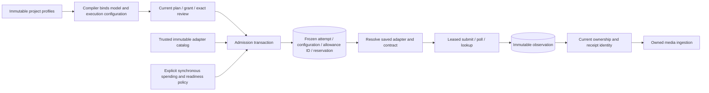

# Frozen provider routing

The executor supports an installation-owned catalog of execution adapters. The launcher still constructs only `FakeProvider`; no image/video transport is registered or enabled by this slice. External adapter registration is availability, and external admission defaults to denied.



## Contracts and ownership

`ProviderProfile.revision` identifies the profile's model/settings/limits/pricing revision. `executionVersion` separately identifies the registered application mapping contract. For example, profile revision `profile-2026-09` can use execution `{adapter: "openai-image", version: "1"}`. A vendor transport's own version label is a separate implementation detail. Changing a default does not reroute an already admitted attempt.

New explicit profiles contain `configuration: {model, settings?}`. Configuration is bounded plain JSON: a model identifier, optional settings, structural/encoded-byte limits and no known credential, endpoint, path or environment fields. It is not a general host configuration object. Actual provider wrappers must additionally validate their supported model/settings combinations before dispatch. The generic validator cannot discover a secret that trusted host code incorrectly places in an ordinary setting value; credentials must never be supplied here.

The compiler includes `executionVersion`, `profileConfiguration` and `profileDigest` in new node arguments, so a changed model or mapping participates in effective review/cache identity. The digest covers profile ID, revision, operation kind, execution adapter/version and configuration. Historical fake profiles keep exactly their existing arguments and default values.

An admitted explicit request contains:

```ts
execution: { adapter: string; version: string };
profile: {
  id: string;
  revision: string;
  configuration: { model: string; settings?: JsonObject };
  digest: string;
};
externalAllowanceId?: string;
```

`ExecutionRegistry.forRequest` verifies the frozen profile against its original arguments and execution identity. It never reads today's project profile to reconstruct a submitted request. Historical requests with no `execution` still mean fake/v1 during interpretation only; no fields or receipts are backfilled. Default fake requests also retain absent `profile` and `externalAllowanceId` fields.

`ExecutionRegistry` is constructed from registered implementations, rejects duplicate adapter/version identities and offers no mutation method. The old `Engine(store, provider, options)` constructor wraps a single provider automatically. Host code can instead pass a registry. Missing routes have no fallback. Lock validation checks structure separately from adapter availability, so an unavailable video adapter does not prevent another valid selected profile from running. Capacity is scoped by adapter/version and profile ID/revision.

## Admission and effects

External admission calls a trusted synchronous `externalAdmission.authorize` policy inside the same SQLite transaction as the attempt and reservation. Its input includes the allocated attempt ID, project/node/candidate, a detached profile and estimated cost. It returns an application allowance ID. The policy can check local credential readiness and consume an allowance transactionally; throwing rolls back its writes as well. It must not perform network work or return a promise. There is no production allowance implementation in this slice: the default is denial, and tests inject offline policies. The returned ID is a correlation bound into the admitted request, not an independent bearer credential or proof that another service may dispatch.

Existing grant origin, holds, exact keyframe review, timing, retry, capacity and budget checks remain required. Registration or the presence of a key cannot allocate a paid attempt. Actual wrappers resolve credentials at use time as well and accept only an exact already persisted admitted request.

`submit(request, options)`, `poll(taskId, request, options)` and `lookup(attemptId, request, options)` receive detached request data, the engine's original operation `signal`, and a frozen `expectedLease: {owner, epoch}` captured from that call's attempt. These optional arguments preserve existing fake implementations. External bridges require the caller's lease fence before a first POST; they compare it with the current unexpired submitting attempt and reserved liability. Receipt replay remains independent of dispatch authority. The ephemeral fence never enters saved request/evidence digests. Normal engine takeover also changes submitting work to unknown; the explicit fence strengthens the contract for direct and future callers. The request context lets one wrapper select the correct frozen model even when polling a task. A task ID is interpreted only within that saved adapter contract and attempt; the same string from two vendors is valid and cannot choose the route.

Provider calls renew the current lease while awaiting I/O. Ownership loss or the configured deadline aborts the signal and stops renewal; renewal cannot revive an expired or foreign lease. The default deadline is ten minutes and can be lowered. Registered adapters must cooperate with cancellation and settle their bounded operation. The engine awaits the actual observation after abort so late acceptance is retained; the lease helper is not a process kill mechanism for noncooperative application code.

Every returned observation still passes normalization and immutable evidence publication before the ownership fence. A late receipt cannot update the active attempt or publish media under a lost lease. On recovery, one unambiguous accepted task ID with a valid saved digest can repair an unknown task identity without lookup; conflicting accepted IDs remain unknown. An already recorded task remains authoritative, and completion evidence must match it. Unsupported routes are reported before claiming a lease, preserving pending state and reservations while other attempts continue.

## Verification and limits

Core/provider/server builds passed. The combined compiler, registry, routing, provider-boundary, execution and spool suite passed **120 tests, zero failures or skips**.

The focused offline suite covers registry identity conflicts, separate profile/contract revisions, unchanged legacy arguments/evidence, immutable configuration, denied external admission, policy rollback, colliding vendor task IDs, restart with changed defaults, missing adapter isolation, capacity separation, unknown lookup without resubmission, long submit/poll renewal, explicit takeover, late acceptance replay, corrupted/conflicting receipt evidence and cooperative deadlines. Existing compiler, execution and spool tests remain part of the check.

All fixtures are local and synthetic. This slice does not configure credentials, implement a live allowance, map image/video transport requests, activate real generation, introduce automatic fallback or change quality-based retry policy.
