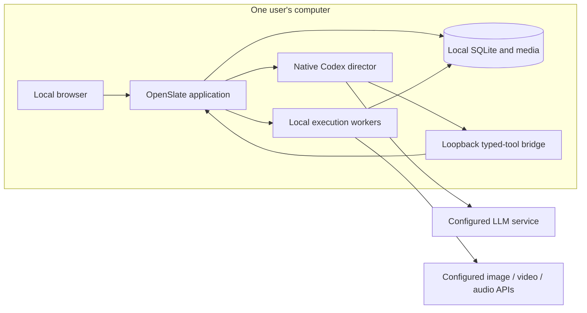

# Accepted decision: single-machine local v0

September 12, 2026. User decision: “for v0 let's only support local only mode. don't need to deploy to a multi-hosts env.”

## Deployment and trust boundary

V0 runs for one user on one computer. The browser, application server, SQLite database, media files, director subprocess and execution workers are local. Separate processes on that computer remain supported; their leases, epoch fences and restart recovery are still necessary. There is no remote-worker registration, shared database across hosts, public service or distributed deployment requirement.

**Local deployment does not mean offline generation.** User-configured H3, image, speech/transcription and LLM cloud APIs remain the planned production integrations. They are provider services reached by local adapters, not additional OpenSlate hosts. H3 cloud comes first; a same-machine Python inference worker can follow later. Multi-host workers and hosted operation require a future design decision.

OpenSlate trusts the pinned native Codex runtime and its built-in sandbox as local infrastructure. It independently enforces project mutations, human review, generation grants, budget admission and provider submissions in application services. Independent code-host and authentication isolation remain unverified. Accepting this trust assumption does not turn the earlier model refusal into enforcement evidence.

## Why the trust assumption is explicit

The previous native adapter required a deployment assertion covering command sandbox, code host and credential isolation before launch. The direct command tests passed. The model-facing host has no equivalent public no-model execution method in the inspected pinned App Server schema, and a model correctly declining prohibited operations cannot prove enforcement. Repeating those prompts is not a useful compatibility gate.

Codex distinguishes sandbox restrictions and approval policy; its named permission profiles are documented as beta. That is a runtime dependency OpenSlate must pin and test, not an independent guarantee we can manufacture from a few model turns. See the official [permissions documentation](https://learn.chatgpt.com/docs/permissions) and the [actual validation evidence](CODEX-SUPERVISOR-VALIDATION.md).

## Runtime policy and application enforcement

- `LocalCodexPolicy` selects `mode: "local"`, an exact native version and a named permission configuration. Other modes are rejected. There is no separate confinement-mode framework in v0.
- Trust the native runtime's execution boundary. Retain exact tool/skill catalogs, known-default-normalized permission equality, a read-only projection workspace, denied application/media/credential paths for native commands, disabled unrelated capabilities and a complete explicit launch environment. Any observed extra capability or permission still fails setup. The typed-tool bridge accepts only loopback endpoints.
- Keep database writes and image/video/audio provider credentials in OpenSlate services. The model can propose changes through the five typed tools; it cannot supply human approval, invent a grant, or replay an uncertain submission. Existing epoch fencing, scoped holds, exact keyframe review and provider admission remain mandatory.
- Keep credential handling out of model input and audit output. Native authentication stays owned by the configured Codex runtime; do not copy personal credentials into test fixtures. Protect each bridge credential with its immutable project/request/epoch scope and revoke it when the run ends. This is application authorization, not a claim of independent in-process secret isolation.
- Test permitted host capabilities and real supervisor behavior in synthetic projects. A capability inventory is compatibility evidence; direct enforcement tests are labeled separately. Validate persistent questions and a replacement request without enabling media workers.
- Retain local process cleanup, durable receipts, restart recovery and bounded concurrency. One computer can still experience crashes, overlapping processes, stale results and ambiguous cloud submissions.

## Development consequences

Remove multi-host deployment and independent confinement proof from v0 exit criteria. Keep the actual configuration checks and supported-OS compatibility tests. The default app remains scripted until the supervised native conversation path is validated and local runtime configuration is wired.

The two remaining starts in the existing three-start allowance were used for a successful synthetic supervised question and authenticated answer with a scoped edit. This accepted decision replaced that experiment's independent-isolation prerequisite; the old result stays inconclusive. Each start was reserved before dispatch; the allowance is now exhausted. No media worker ran. The saved question was ordinary conversation and does not demonstrate native structured-question support. See [validation results](CODEX-SUPERVISOR-VALIDATION.md).

This scope decision does not authorize media spending, credential movement, installations, commits or pushes. Provider integrations still require their own profiles, credentials and bounded live allowances.
