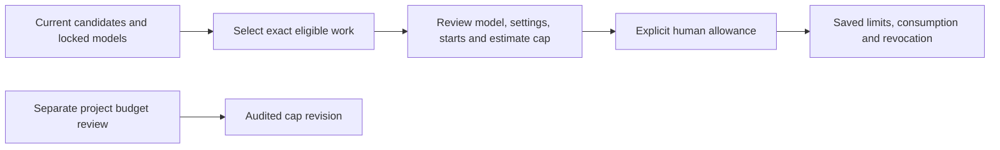

# Human spending review

The local browser exposes exact external-work allowances and a separate project budget editor. These controls call authenticated application routes; they do not start a director turn, edit the film, create a generation grant or activate a provider. The launcher defaults to fake execution; external providers require independent [opt-in setup](MEDIA-EXECUTION-LAUNCHER.md).

The user selects eligible work for one exact profile at a time. A review freezes the candidate, node and specification identities, full profile digest, one allowed start per selected candidate, the sum of configured estimates and a 24-hour expiry. Approval is disabled when the exact model descriptor is unavailable or the displayed selection has changed. The server revalidates the command against current state. Configured estimates are not verified provider prices or guarantees about the vendor bill.

The projection displays a validated model ID, supported settings and profile revision. Historical allowances resolve their original model and work from retained project locks/plans; missing historical evidence is shown as unavailable. It never substitutes today's shot purpose or exposes credential configuration. Revocation prevents future admission and does not undo consumed work. Matching allowance counts include the complete history, even when only one history page is displayed; shared allowance capacity is not reserved separately for each candidate.

The project budget has an independent review showing the old and new USD cap. Decimal input is parsed as exact integer micros. Saving compares both the displayed revision and old cap; issuing an allowance cannot raise the project limit. Lowering a cap below already committed estimates blocks future admission without cancelling jobs or refunding existing commitments.

Commands retain their exact idempotency key and body while a response is uncertain. Manual retry sends that same command. Pending commands survive project/component remounts within the same connected API session. Hard reload or disconnect does not retain the browser's pending command object; server receipts remain durable. No automatic approval, retry or budget increase occurs.

Candidate/history pagination exposes coverage and retains backward navigation when a later refresh shrinks the result set. Pending actions remain visible when current work disappears. A valid image-only plan can open the workspace with an empty review-gate projection; this does not fabricate review authority or imply that its standalone image preview workflow is complete.

## Verification

At this component's initial milestone the complete checkout passed **768 tests, zero failures/skips**, with all builds/typechecks and the installed no-turn Codex probe. This included authenticated issue/revoke and lost-response/reopen tests, project-budget compare-and-swap and rollback tests, safe historical projections, browser model helpers, shared timeline capture and optional local compiler identity. See [current status](STATUS.md) for subsequent integration evidence.

In the actual built browser, an isolated two-keyframe project selected only its first keyframe, reviewed its exact image model/settings, issued a one-start $0.10 configured-estimate allowance, displayed and revoked that allowance, then independently reviewed and saved a $1-to-$2 project budget change. Refresh retained the records. Browser warning/error checks were empty in the corrected run.

Read-only database checks before and after server shutdown verified unchanged project, edit holds, grants, epochs and candidates; one exact revoked allowance; one budget audit; and three purpose-bound, non-editing human requests. There were **zero attempts, reservations, approvals, allowance consumptions, director turns or media dispatches**. All media credentials were absent, and paid executors were unregistered. The synthetic allowance was for application verification, not authorization for live spending. Browser lost-response and hard-reload recovery were not separately exercised in this manual flow; command replay/reopen have automated HTTP coverage.

Sources: `apps/web/src/SpendingPanel.tsx`, `spending-model.ts`, `apps/server/src/application/allowance-routes.ts`, `allowance-projection.ts`, `spending-display.ts` and `project-budget.ts`. See [allowance HTTP](ALLOWANCE-HTTP.md), [budget revisions](PROJECT-BUDGET.md) and [durable allowances](EXTERNAL-SPENDING-ALLOWANCES.md) for backend contracts.

## Audio review follow-through

Speech and transcription now use the same exact-work allowance controls. A validated speech summary shows its voice and whether delivery instructions are included; recognition shows automatic/explicit language and word timing. The payload never includes script text, instructions, paths, credentials or arbitrary settings. Both current candidates and retained allowance history use the same pure preflight, with unavailable options visible and unselectable. Review freezes each selected audio summary as well as its exact candidate/profile identities.

Eight runtime checks prove option/key/allowance failures consume no start, the actual injected speech-to-candidate path completes and retained speech output recovers without another POST. The built browser separately issued a one-start, 100-micro-USD synthetic speech allowance with all generation switches off and keys absent, then retained it and exact audio model choices across restart. This did not generate media or accept narration. See [audio evidence](audio-activation-evidence.json).
