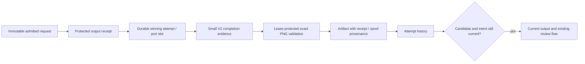

# Owned spool completion and exact PNG ingestion

September 12, 2026. Engine supports an additive version-2 completion envelope backed by the application output store. An explicitly injected `SpoolImageIngestor` fully decodes PNG output and preserves its exact encoded bytes. **The application launcher still uses fake execution; real transports are not registered or wired.** This component performs no network request and grants no generation allowance.

## Identity and compatibility



The old `{type: "completed", taskId, outputs}` envelope and inline descriptors remain unchanged. Historical requests still omit `request.execution` where they originally did. Normalization does not add a version, task identifier, retry flag, or other defaults to old evidence, and replay preserves its digest. The new envelope version does not alter the fake/v1 provider registration or capability lock.

```ts
{
  type: "completed",
  version: 2,
  receiptId: "<application output receipt SHA-256>",
  vendorTaskId: null,
  outputs: [{
    port: "image", kind: "image", mimeType: "image/png", extension: "png",
    sha256: "<exact returned bytes SHA-256>", byteLength: 12345, fixture: false,
    storage: { type: "spool", spoolId: "<same receipt ID>" }
  }]
}
```

The supported subset is one PNG image or MP4 video descriptor. The normalizer bounds metadata fields and media size, requires exact roles, and rejects mixed legacy/V2 fields, caller paths, raw byte payloads, and extra outputs. A synchronous image completion retains `Attempt.taskId === null`; its diagnostic request ID remains in protected receipt data. It is never substituted for a remote task ID.

Engine requires the matching receipt, spool, and first winning slot in the same application Store. It checks project, attempt, complete immutable request digest, execution identity, output role, exact SHA/length, and any already accepted vendor task. A schema-valid but unbound receipt is retained as observation evidence; it cannot supply a new task identity, publish an artifact, or release the reservation. An already known task cannot become null or change identity.

The output store permits refreshed observations with identical bytes, but execution uses the **first winning receipt**, not an arbitrary later observation. `assertCompletion` verifies this exact binding. `recoverCompletion` reconstructs the canonical envelope from that slot. The final artifact transaction checks the binding again.

## Recovery and execution

Reconciliation first checks compatible immutable completion evidence. Without usable evidence, it asks the output store to recover the winning slot **before** provider polling or lookup. A durable slot and manifest can restore missing SQLite spool/slot records after interruption. This path neither opens a new byte source nor generates/downloads output.

Only a winning slot identifies an automatic local completion. Receipt-only observations and orphaned bytes without a slot do not prove one. The lower output-store API can recover a known receipt separately; Engine does not guess between partial observations. Existing unknown-submission behavior remains conservative, with no automatic resubmission.

Both local recovery and artifact ingestion renew the current unexpired lease. Lease loss aborts their signal. The old worker cannot publish, reclaim the lease, or continue to provider lookup after losing recovery ownership. File operations remain outside SQLite transactions; artifact registration, attempt completion, charging the reservation, and conditional current-output selection remain one short transaction.

After ingestion, Engine streams the installed file through a one-MiB hashing buffer. It verifies canonical artifact-root containment, opens without following a final symlink, checks the exact byte length and hash, and checks cancellation through file closure. Limits remain 64 MiB for legacy inline ingestion, 32 MiB for PNG spools, and 256 MiB for MP4 spools. Artifact metadata must retain the exact receipt ID, spool ID, byte length, project, attempt, role, MIME, SHA and fixture flag.

An ingestion or integrity error retains completion evidence and unresolved reservation state. Recovery can repeat local validation; it does not regenerate for quality or substitute a different output. A result whose node was retired remains historical evidence and cannot become the current output. Existing exact keyframe review and generation grants continue to govern later video work.

## PNG ingester

`SpoolImageIngestor` resolves only the exact owned winning output, reads no more than the already verified 32-MiB PNG size, and calls `LocalImageStore` with its SHA and header dimensions. The image store validates the header, measures one decoded frame with FFprobe, fully decodes with FFmpeg, and publishes the original encoded bytes. Engine independently verifies the published file before recording it.

The ingester returns a stable artifact ID derived from project/attempt/port/spool, measured width and height, byte length, validation digest, and receipt provenance. Its configured image directory must reside inside Engine's artifact root. It does not invoke the supplied-image import service, append canonical project assets, or borrow human-upload authority.

This is an **optional PNG-only hook**, not the default materializer and not a mixed fixture/local-render ingester. Default ingestion continues to accept only the existing bounded fixture format. Injecting `SpoolImageIngestor` does not provide support for legacy inline fixtures, speech, local render outputs, or generated MP4 normalization; an unsupported input fails explicitly.

## Remaining boundaries

- MP4 descriptors can represent bounded owned bytes, but the PNG hook rejects them. The separately injected [generated-video derivation](GENERATED-VIDEO-DERIVATION.md) preserves raw and normalized SHA values, pinned recipe/toolchain, measured frames and a renderable generated `media_source`. Its initial normalization input cap is 128 MiB; it is not wired into the launcher. Engine accepts a derived hash only through that explicit tagged contract.
- The 256-MiB Engine path is streamed file-integrity verification, not video decoding or a memory benchmark. PNG validation still keeps bounded image buffers and decoder work. Existing input verification and browser previews still buffer whole files.
- A future provider bridge must persist the mapping from the complete application request digest to the transport's prepared payload digest before submission. These are different identities.
- Credential resolution, real profile admission, transport outcome mapping, downloads, allowance enforcement, and live provider verification remain separate. Protected receipt locators must stay out of ordinary UI, event and model projections.

## Verification

Node 24 provider/server builds and **83 focused tests passed, zero failures or skips**. The run includes 18 new contract/integration tests plus the existing provider, execution, output-store and image validation checks. No provider API or native model calls were made.

Offline tests cover exact PNG publication with a null task, interrupted submit returns, slot/SQLite recovery, recovery lease theft, immutable V2 and legacy evidence replay, wrong and cross-attempt receipt references, first-slot selection, task contradictions, corrupted/undecodable bytes, provenance validation, stale history, and explicit MP4 rejection.

A synthetic 65-MiB descriptor/file passes the Engine streaming integrity boundary through a deliberately injected test-only hook. Its execution evidence stays below 2,048 JSON characters. The fixture is not a decoded video or a production video ingester.

```sh
pnpm --filter @openslate/providers build
pnpm --filter @openslate/server build
node --test --test-concurrency=4 packages/providers/test/execution.test.mjs packages/providers/test/fake.test.mjs apps/server/test/execution.test.mjs apps/server/test/execution-provider.test.mjs apps/server/test/execution-spool.test.mjs apps/server/test/output-store.test.mjs apps/server/test/local-images.test.mjs
```
