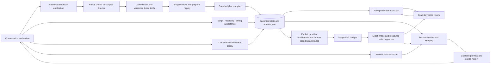

# Implementation status

September 15, 2026. This page describes working code; technical designs describe the broader target.

OpenSlate has a local conversation/review workspace, per-project native Codex setup, durable planning and fake execution, versioned conversational narration drafts, accepted narration ingestion, a PNG reference library, and application-owned local clip rendering. Native Codex has passed scoped edits across restart, browser conversations, and a small image/structured-question experiment. A synthetic six-minute render passed decoded picture/audio checks. **The app does not yet generate a real commercial.** Image and H3 application bridges, recoverable generated-video normalization and durable spending allowances are implemented offline. The browser can select installed image/video/speech/transcription profiles at creation and preview changes to eligible unfinished work in Project settings. Shared authenticated SSE drives workspace updates. The launcher now supports explicit image/H3 activation, human allowance/budget review and automatic real local assembly. Default generation stays fake. A complete injected-provider pipeline passed through real rendering; no live media API has been validated.

V0 runs for one user on one computer. Cloud model/media APIs remain part of the architecture. The accepted [runtime trust decision](RUNTIME-TRUST-DECISION.md) trusts the pinned installed runtime/sandbox while retaining application authority; independent code-host/authentication isolation remains unverified. The user authorizes local milestone commits and bounded live Codex tests. Live Viggle H3 testing is explicitly on hold, even if its key is configured. Other real media calls require a test allowance; pushing is not authorized.

## Current delivery checkpoints

| Stage | State | Next action |
|---|---|---|
| 1. Offline Viggle integration | Complete; local commit `1452803` | Live API tests remain on hold |
| 2. Conversational audio preparation/review | Complete; offline and bounded native checks pass | User manual rehearsal |
| 3. Real production validation | Automatic Codex/API image choices and live guide prepared; live validation pending | User runs the one-shot live walkthrough |
| 4. Release | Not started | Waits for production validation and a release decision |

The [manual rehearsal](MANUAL-AUDIO-TESTING.md) covers exact speech plans, scoped edits, recording upload/transcription planning and restart with every media API disabled. Native conversation uses a separate pinned Codex 0.153.4 installation because the bundled app binary has updated. No media API key is needed for this checkpoint.

The [manual live production guide](MANUAL-LIVE-PRODUCTION.md) covers independent director billing choices, automatic Codex or OpenAI API images, real recording acceptance, one Viggle take and export/restart checks. Codex images consume subscription usage and need ChatGPT login; the API image/audio routes and Viggle retain separate keys. The automatic worker is described in [Codex image execution](CODEX-IMAGE-PROVIDER.md). Live media validation remains user-led; unattended development stays paused.

## Latest evidence

**Latest implementation:** Project settings now supports media-model impact previews, unfinished/selected-shot scope, exact application and next-turn director changes. Completed results, reviewed audio, active/unknown provider jobs and required inputs retain their identities. Changed pending work needs fresh ordinary planning/generation permission and separate usage approval; settings starts no generation. Shared authenticated SSE replaces browser panel polling, with hidden-tab suspension, replay/resync and a slow failure fallback. Workspace activity, next actions, setup/billing guidance and pause/review copy are clearer. See [feature and manual checks](PROJECT-SETTINGS-AND-UPDATES.md).

**Verification:** Builds and all package typechecks pass; all new feature tests pass. Focused evidence includes 34 compiler/director/model-setting checks, 25 streaming/browser/API compatibility checks, five UI command checks and five activity checks (some existing tests are included in those focused groups). The isolated browser passed model preview/apply, desktop/390px layout, keyboard dismissal, restart/reload persistence and automatic reconnection. One healthy stream remained open with no new requests for an observed 38.4-second idle interval. Its installation recorded zero model turns, provider attempts or allowances.

**Full-run limitation:** The first complete run passed 1,955/1,964 tests, with nine existing media timeouts/cancellations. All 56 tests in the affected suites then passed in isolation without source changes. A complete rerun passed 1,963/1,964; one generated-narration test stalled for approximately 30 minutes and cancelled. Its entire 16-test suite then passed in 10.2 seconds. All 436 source/test/configuration/style files stayed unchanged across verification. These results do not constitute a clean complete-suite pass. Independent review fixes include approval freshness, idle history scans, dependent plan fingerprints and bounded plan hydration. No live model or media call was made. See [sanitized evidence](project-settings-sse-evidence.json).

**Previous completed milestone:** Automatic Codex image execution and manual live-validation preparation pass **1,903 tests** (70 additions), zero failures/skips, all builds/typechecks and the installed pinned no-turn Codex probe. All 418 captured source/test/configuration/style files stayed unchanged throughout the final check. The new route uses separate ChatGPT-authenticated image turns, exact native-item/output lineage, finite start permissions and no API fallback. Offline checks include large PNG decoding, cancellation/shutdown, uncertain acknowledgement, same-root backup/restore and recovery without native access. Independent review fixed large-output chunking, bounded callback waiting, shutdown setup races and overly broad legacy artifact checks before the green final run.

The actual dedicated worker passed a connection-only check with Codex 0.153.4 and ChatGPT authentication. A separate nine-check read-only probe retrieved a known prior completed director turn through legacy history. Both started zero model/image turns. **Actual Codex image generation, image-history recovery, OpenAI media and Viggle calls remain unverified and reserved for the user's manual run.** See [the live guide](MANUAL-LIVE-PRODUCTION.md), [provider design](CODEX-IMAGE-PROVIDER.md) and [sanitized evidence](codex-image-evidence.json).

**Previous completed milestone:** Conversational audio preparation/review passes **1,833 tests** (108 additions), all builds/typechecks and the installed pinned no-turn Codex probe. All 401 captured source/test/configuration/style files were unchanged during the final check. V3 tools preserve V1/V2 catalog identities; exact saved-section speech composes the existing plan, requires human generation review and separate spending, and enforces current-section boundaries before dispatch. Checks cover bounded history/context, authenticated HTTP, replay/cancellation, atomic rollback, changed-section spending feedback, actual FFmpeg recovery after SQL failure and same-root backup/restore. An independent review found and fixed projection paging/state issues and backup row identity validation; negative controls reproduced the storage gap. One prior full run had a stale capability-version test expectation, corrected before this green final run.

One actual native Codex 0.153.4 turn passed **18 checks in 28.451 seconds**, preparing one exact ungranted speech proposal through the real controller/tool HTTP path. It made no media call or spending/acceptance change; replay and reopen preserved the result without another start. An isolated official npm installation supplied the pinned runtime because the bundled app binary updated to 0.154.0-alpha.6.2. See [conversational audio](CONVERSATIONAL-AUDIO.md), [sanitized evidence](conversational-audio-evidence.json) and the [manual rehearsal](MANUAL-AUDIO-TESTING.md).

**Previous completed milestone:** Offline Viggle integration passes **1,725 tests** (72 additions), all builds/typechecks and the installed no-turn Codex probe. All 376 captured source/test/configuration/style files were unchanged throughout verification. Focused checks cover exact multipart transport, reviewed frame and consumed allowance, original lease/edit fences, durable polling and signed-URL refresh, exact output lineage, actual normalization and same-root backup/restore. The PNG chunk-name finding and historical human-review command closure were fixed and independently reviewed. See [Viggle integration](VIGGLE-H3.md).

**Live Viggle H3 API testing remains explicitly on hold, even if a key is configured.** The earlier $1 total ceiling does not authorize testing until the user resumes it. No live media calls have run.

**Current scope:** (1) offline Viggle integration and (2) conversational audio preparation/review are complete. Automatic Codex image integration and a manual live guide prepare (3), but do not constitute live production validation. Wait for the user to run the real-media checks and share feedback before (4) release. No unattended live media testing.

- Authenticated recording-plan preparation/review, bounded exact history, focused spending navigation and sectionless transcript-view components now pass **1,653 tests**, including 60 additions, with builds/typechecks and the installed no-turn Codex probe. HTTP/projection checks cover cancellation, current-section changes, actual local preparation and restore. The built browser reached upload-first narration and explicit conversation continuation; its file upload was denied by browser permission policy, so full browser generation/reopen remains unverified. No native or live media calls. See [workspace contracts and limits](OWNED-TRANSCRIPTION-WORKSPACE.md) and [evidence](owned-transcription-browser-evidence.json).

- Exact human review now publishes one recording grant, full plan and candidate/application receipt atomically. **1,593 tests pass**, including 70 additions, with builds/typechecks and the installed no-turn Codex probe. Actual synthetic upload→review→separate allowance→injected transcription→unreviewed candidate passed, including interrupted preparation, late result/reopen recovery, ordinary shot-edit reuse and actual backup/restore. Independent review found no remaining issues. No native or live media calls. Normal browser/conversation entry points remain next. See [implemented review and execution](OWNED-TRANSCRIPTION-REVIEW.md) and [sanitized evidence](owned-transcription-review-evidence.json).

- Exact owned-recording proposals now persist without a script, cue, acceptance or generation grant. **1,523 tests pass**, including 64 additions, with builds/typechecks and the installed no-turn Codex probe. Tests preserve a full existing plan and verify original-request/cancellation fences, scoped section changes, generated artifact provenance, atomic rollback and actual backup/restore with permanent imported-proposal fencing. The production publication kernel retains its prior public behavior, and director context now reports evidence-based current-output provenance. No native or live media calls. Human generation review/admission and normal browser/conversation entry points remain next. See [implemented proposals](OWNED-TRANSCRIPTION-PROPOSALS.md) and [sanitized evidence](owned-transcription-proposal-evidence.json).

- Owned recording compiler/file foundations now preserve the full existing video plan while appending one exact transcription consumer. **1,459 tests pass**, including 62 additions, with builds/typechecks and the installed no-turn Codex probe. The six-minute fixture kept 122 operations and 60 review gates; original cancellation and unchanged legacy fingerprints also passed independent review. Execution deliberately rejects these inputs until exact recording proposals and human review are connected. No native or live media calls. See [implemented foundation and next backend sequence](OWNED-RECORDING-TRANSCRIPTION.md) and [sanitized evidence](owned-recording-foundation-evidence.json).

- Admitted transcription now waits for local preparation on the same attempt and consumed allowance, with original-lease/current-input checks before its one-use provider marker. **1,397 tests pass**, including 50 additions, with all builds/typechecks and the installed no-turn Codex probe. Actual shared-worker contention and reopen produced two unreviewed candidates with one simulated POST per transcription. Actual same-root restore preserved evidence and blocked imported first submissions; recovery review now separates unsubmitted preparation from uncertain jobs. Independent review closed pre-proof local-failure and recovery-disclosure gaps. No native or live media calls. Next: owned draft-recording planning and exact human generation review. See [implemented protocol](AUDIO-PREPARATION-WAITING.md) and [sanitized evidence](preparation-waiting-evidence.json).

- Audio profiles now have independent default-off switches, runtime composition and browser selection. Shared pure preflight rejects unsupported options before spending consumption; cost review shows exact speech voice or transcription language/timing, including retained history. **1,347 tests pass**, including 41 additions, with builds/typechecks and the installed no-turn Codex probe. Eight runtime checks cover actual synthetic speech-to-candidate publication and recovery without repeat calls. The built browser saved a one-start synthetic allowance and both audio model choices across restart, with 25 independent audit checks and no generation. Ordinary conversational audio creation remains pending. Next: [durable pre-submit preparation waiting](AUDIO-PREPARATION-WAITING.md). See [activation contracts](AUDIO-ACTIVATION.md) and [sanitized evidence](audio-activation-evidence.json).

- Human transcript review now offers separate recognized-word and suggested-timing actions, preserving immutable candidate history and exact canonical provenance. **1,306 tests pass**, including 46 additions; builds/typechecks and the installed no-turn Codex probe pass. The built browser exercised writing, valid partial timing, separate acceptance, a true no-op, canonical application and two restarts. Independent audits passed 35 initial and seven final-reopen checks; seven HTTP replay/rejection checks and two final state/playback-byte checks passed. No native or live media calls. Next: [audio configuration, preparation waiting and owned-source planning](AUDIO-ACTIVATION.md). See [implemented review contracts](TRANSCRIPT-REVIEW-ADOPTION.md) and [sanitized evidence](transcript-review-evidence.json).

- Human generated-recording selection now verifies exact historical speech/normalization evidence and owned bytes, reuses the existing take and preserves separate script/audio/timing acceptance. **1,260 tests pass**, including 43 additions; all builds/typechecks and the installed no-turn Codex probe pass. The built browser previewed, attached, accepted and applied a synthetic six-second recording, with 21 independent audit checks, three HTTP replay checks and six reopen checks. Independent review closed generated-canonical geometry/acceptance gaps; the clip library now excludes audio. No native or live media calls. Next: [transcript review/adoption](TRANSCRIPT-REVIEW-ADOPTION.md). See [implemented attachment](GENERATED-NARRATION-ATTACHMENT.md) and [sanitized evidence](generated-narration-evidence.json).

- Unreviewed transcript candidates now publish atomically with their exact raw JSON artifact after original source, derivative, multipart, response and winning-receipt verification. **1,217 tests pass**, including 44 added candidate/ingestion/backup/Engine checks. The actual two-node pipeline passed 14 checks plus 29 independent checks; a separate actual same-root restore passed 27 checks plus 23 audit checks, with no repeated provider or conversion work. Candidates retain timing issues and create no narration acceptance. Next: human attachment of generated recordings and transcript review/adoption. See [candidate implementation](TRANSCRIPT-CANDIDATES.md), [sanitized evidence](transcript-candidate-evidence.json) and [attachment plan](GENERATED-NARRATION-ATTACHMENT.md).

- The explicit transcription bridge now binds consumed approval to the exact owned derivative and one-use multipart submission, then recovers raw JSON without another provider call. **1,173 tests pass**, including 53 new upload-reader, mapping/backup, bridge and option-validation checks. An actual two-node Engine/synthetic HTTP/FFmpeg pipeline passed 11 checks and 24 independent checks; backup export/inspection passed with a preserved directory-inventory discrepancy explained in the evidence. Transcript candidate publication, human adoption and audio activation remain next. See [transcription execution](OPENAI-TRANSCRIPTION-EXECUTION.md) and [sanitized evidence](transcription-execution-evidence.json).

- The explicitly constructed speech bridge now connects real human allowance consumption, exact full-profile/wire identity, one-use dispatch and complete audio ingestion. **1,120 tests pass**, including 50 speech/lineage checks and the six image/H3 race regressions. A six-second actual Engine/injected-HTTP/FFmpeg recovery proof passed 15 checks and 20 independent checks; separate independent review passed 24 boundary checks and closed both conflicting-receipt recovery paths. No live media calls or narration adoption. Next: transcription bridge and unreviewed candidates. See [speech execution](OPENAI-SPEECH-EXECUTION.md) and [sanitized evidence](speech-execution-evidence.json).

- Review found and fixed an image-worker race: an obsolete worker could persist a terminal local input/credential failure after its replacement took over. Six added image/H3 regressions and both bridge suites pass **49/49**, independently repeated after builds; H3 already enforced this boundary. Actual late provider observations remain durable. No media calls. See [image execution](OPENAI-IMAGE-EXECUTION.md).

- Owned transcription preparation now creates and recovers a complete 16 kHz mono upload derivative without changing narration. The **1,064-test full checkout passes**, including 52 added worker, storage, backup, parser and timing checks. An actual six-minute source/derivative proof passed 13 checks plus 23 independent checks; exact multipart upload bytes and raw/parser identities agreed using injected HTTP. Original cancellation and restored-authority fences remain enforced. Next: speech execution bridge, transcription mapping and unreviewed candidates. See [preparation evidence](TRANSCRIPTION-AUDIO-PREPARATION.md) and [bridge plan](AUDIO-APPLICATION-BRIDGES.md).

- Generated-audio ingestion now preserves exact raw WAV/JSON spools, verifies complete PCM, publishes separate normalized audio provenance and recovers after SQL failure or same-root backup restore. The **1,012-test full checkout passes**, including 64 added tests. Two- and 360-second synthetic audio proofs each passed 12 checks with one local conversion and no replay; independent audits added 23 and 26 checks. No media calls, paid audio activation or narration adoption. Next: owned 16 kHz transcription derivatives, then unreviewed transcript candidates. See [audio ingestion](GENERATED-AUDIO-INGESTION.md) and [next preparation slice](TRANSCRIPTION-AUDIO-PREPARATION.md).

- A separate native capability follow-up correctly explained that built-in narration synthesis/transcription remain unconnected and offered human recording or externally produced audio without inventing host readiness. It completed in **21.118 seconds**, passed 20/20 harness and 28/28 independent checks, and preserved all narration/authority. The exact thread and processes closed cleanly. Historical native starts total **24**; no media calls. See [capability follow-up](CODEX-NARRATION-CAPABILITY-VALIDATION.md).

- Standalone speech and word-timestamp transcription transports now pass **45 focused injected-HTTP tests**. They bind exact semantic/wire identities, enforce bounded single submissions, preserve uncertain outcomes and return raw WAV or unreviewed transcript evidence. Independent review fixed a final cancellation handoff race. They are not yet connected to narration execution; the director continues to report those application workflows unavailable. See [audio contracts and verification](OPENAI-AUDIO-TRANSPORTS.md).

- Fresh source/dependency installation passed on macOS: 86 locked packages downloaded into an empty package cache, all 389 source files unchanged, complete build, documented launcher checks and fake review/edit/restart demo. The default launcher also passed with media tools unavailable. Fourteen audit checks passed; no model/media calls. Existing Python/Xcode/Node tooling was present, so this is not a bare-OS or remote-clone claim. See [checkout evidence](CLEAN-CHECKOUT-VALIDATION.md).

- Two bounded native narration stage/gap turns completed in **16.887 and 27.734 seconds**, passing 18/18 and 21/21 harness checks plus 37 independent checks. The director preserved accepted content, chose a useful next question and changed only the requested closing. Semantic review found insufficient disclosure of missing built-in speech generation. Explicit application capability facts now accompany every context page, with 29 focused checks passing independently. At that milestone historical native starts totaled **23**, with zero media API calls. See [stage/gap evidence](CODEX-STAGE-GAP-VALIDATION.md).

- Offline same-root installation recovery is integrated: private media-inclusive backup/inspection, crash-resumable publication, V3 quarantine, permanent imported-authority fences and exact human release. Twenty backup and ten restore tests passed; independent review ran 31 checks including real killed-process recovery and incomplete-launcher refusal. The built browser restored a 31-file demo, decoded saved previews read-only, released while still paused, then completed a fresh scoped edit/approval preserving shot two. No native or media calls. See [contracts](INSTALLATION-RECOVERY.md) and [browser campaign](INSTALLATION-RECOVERY-VALIDATION.md).
- Latest complete checkout check: **1,653 tests passed, zero failures/cancellations/skips**, all builds/typechecks passed, installed no-turn Codex probe enabled. This includes independent audio configuration/catalog/selection, pure pre-admission audio option checks, exact spending summaries and runtime composition/recovery, separate human transcript writing/timing selection, bounded review pages, immutable selection and canonical/backup provenance, true no-op acceptance preservation, verified human generated-recording selection, exact canonical provenance and legacy compatibility, video-only clip projection, immutable unreviewed transcript candidates and atomic/raw/backup recovery, exact transcription preparation/upload/dispatch/raw-result recovery, speech approval/dispatch/ingestion lineage, image local-failure fencing, owned transcription derivatives, reusable transcript parsing/sample mapping, generated-audio storage/normalization/recovery, explicit director capability projection, standalone audio transports, installation backup, interrupted restore and recovery authority/UI checks. The final conversation-scroll correction also passed web build/typecheck and all 45 web tests. This adds real automatic timeline/render, opt-in provider composition, project compatibility status and normalization-contention recovery to the earlier 768-test spending/capture baseline. The runner bounds test-file concurrency to four; protocol fixture deadlines allow child startup headroom without changing production deadlines. A heartbeat-disabled negative control fails the lease-renewal regression as intended.
- Automatic local assembly passed controlled recovery/lease/replan tests and six actual FFmpeg integrations. The full runtime factory generated an injected PNG, enforced exact human review and two spending allowances, ingested one injected H3 task, then automatically rendered six seconds of decoded picture and human-accepted synthetic tone audio. Restart repeated no provider/render call. Local work had no paid candidate/reservation. See [automatic assembly](AUTOMATIC-LOCAL-ASSEMBLY.md).
- Opt-in startup defaults off and keeps provider readiness distinct from project compatibility. The built browser, with both media keys removed, displayed missing setup, explained an incompatible historical H3 project, created a newly pinned production project and retained default demo behavior across restart. Read-only checks found no requests, authority, attempts or model/media calls. See [launcher evidence](MEDIA-EXECUTION-LAUNCHER.md).
- Concurrent completed video spools now defer promptly when the shared normalizer is busy, without waiting for a 30-second lease or calling the vendor again. The replacement-owner fence and reopen recovery passed. The installation ownership fixture now retains its handle through forced garbage collection, matching production lifetime.
- The built browser issued and revoked one exact keyframe allowance, displayed the saved model/settings, and independently reviewed a project-budget revision. Database checks preserved the film, holds, grants and candidates; no attempts, reservations, approvals, consumption or model/media calls occurred. The corrected browser console was clear. See [spending review](SPENDING-REVIEW.md).
- Shared SQL timeline capture preserves full source/sample/gain identity and the existing human-render shape. Optional trusted compiler identity affects only local assembly nodes; independent comparison against the pre-change compiler confirmed exact legacy bytes. These foundations are now consumed by the real local executor described above. See [capture](TIMELINE-CAPTURE.md) and [identity](LOCAL-EXECUTION-IDENTITY.md).
- H3's **19 bridge tests** cover exact reviewed PNG/body identity, one POST, durable polling cooldown, protected downloads, normalization and restart recovery after simultaneous receipt-write failure and lease loss. Independent review fixes passed; all HTTP/CDN responses are injected. Durable spending allowances add **22 tests**, including separate SQLite workers, exact candidate/full-profile binding, expiry/revocation and permanent consumption in the admission transaction. See [H3 execution](MINIMAX-H3-EXECUTION.md) and [allowances](EXTERNAL-SPENDING-ALLOWANCES.md).
- The built browser created an image/H3-profile project, displayed configured estimates/missing keys, reopened its saved choices after server restart, and created no generation authority or attempts for that project. A separate default project completed two exact frame approvals and six fake operations; its decoded one-second preview and enlarged keyframes retained fixture labels. Browser console checks were clear before the deliberate restart; refresh restored the connection afterward. No model/media calls. See [provider selection](PROVIDER-CATALOG.md).
- A mixed-ingestion check published exact synthetic PNG bytes, waited for human frame review, normalized a six-second synthetic video and rendered that take through the existing local renderer. At that earlier milestone, Engine timeline/render operations remained fixtures and the export used the explicit media service; the subsequent factory proof above now covers automatic real assembly. See [ingestion composition](INGESTION-COMPOSITION.md).
- The image bridge's **20 new tests** cover exact application/transport identity, ordered input bytes, one-POST concurrency, original caller lease fences, unknown restart, local spool recovery and actual Engine-to-PNG publication with injected HTTP. Nine generated-video checks cover real local normalization, measured trims, SQL rollback, lease loss, corruption, short outputs and recovery without repeat transcoding. Independent review found and fixed the downloader's late-cancellation bug and strengthened the explicit caller lease contract. No real media API calls. See [image execution](OPENAI-IMAGE-EXECUTION.md), [routing](PROVIDER-ROUTING.md) and [video derivation](GENERATED-VIDEO-DERIVATION.md).
- The protected-video downloader passed **14 focused tests**, including two durable output-store integrations and delayed socket-cleanup cancellation/deadline checks. It pins an explicitly allowed HTTPS hostname to validated IPv4 and bounds streams; completed spool replay makes no second GET. DNS/network responses are injected. The store's writer limit does not bound outstanding cancelled socket cleanup. See [download boundaries](VIDEO-DOWNLOAD.md).
- The earlier spool-consumption slice passed **83 focused tests**, including 18 new contract/integration checks. It preserves legacy evidence, recovers winning output slots before provider calls, keeps synchronous task IDs null, fully decodes exact PNG bytes, and aborts publication on lease loss. That earlier proof used the default fake launcher. See [spool completions](SPOOL-COMPLETIONS.md).
- Nine migration checks and five existing persistence tests passed, including historical JSON preservation, verified pre-upgrade backup, real uniqueness-failure rollback, two-process migration and committed-WAL restore. Twelve attachment tests cover exact ordered selections, bounded thumbnails, immutable receipts, corruption/restart and original-signal cancellation before native dispatch. See [migrations](DATABASE-MIGRATIONS.md) and [image attachments](DIRECTOR-IMAGE-ATTACHMENTS.md).
- Two native browser turns took 14.7 and 20.5 seconds, including restart and a persisted brief-only edit. The second made four successful application tool calls. No media attempts/grants/approvals. See [browser evidence](CODEX-BROWSER-VALIDATION.md).
- Two subsequent capability turns described a synthetic image and persisted a native question after enabling the pinned feature. One later service-level continuation recognized the exact answer `Warm`, completed in **8.633 seconds**, and preserved canonical state. That brought the historical native-start count to **17**; zero media API calls. The later positive browser/HTTP answer proof is recorded below. See [capability evidence](CODEX-CAPABILITY-VALIDATION.md) and [question continuation](CODEX-QUESTION-CONTINUATION.md).
- One subsequent native V2 narration request passed **22 checks** in **27.853 seconds**, using narration read → one draft edit → read after an explicit V1 upgrade. It preserved the accepted opening, canonical project and holds, and left two new sections unaccepted. Native start count is now **18**; zero media calls, native thread archived and all processes cleaned up. This is a short explicitly directed request, not general stage-selection evidence. See [native V2 validation](CODEX-NARRATION-V2-VALIDATION.md).
- A subsequent actual browser **Attach and discuss** request passed **23 checks** in **9.914 seconds**. Codex correctly described the undisclosed synthetic image layout; the original preview and response survived refresh, with unchanged project, narration, hold and generation authority. Native starts now total **19**; no media calls, all native/application processes closed and the thread archived. See [browser image validation](CODEX-IMAGE-ATTACHMENT-VALIDATION.md).
- Two later native turns passed the actual browser question/answer path across application reopen: the structured question took **5.556 seconds** and the answer **4.484 seconds**. All **22 continuation checks** and **14 independent audit checks** passed; exact answer replay started no extra turn. The answer survived page reload, with no canonical or media-authority changes. At that milestone, historical native starts totaled **21**, with zero media API calls. The initial strict-label harness failure, model's extra follow-up question and focused browser fixture limits remain documented. Both threads were archived and all processes closed. See [browser question validation](CODEX-QUESTION-BROWSER-VALIDATION.md).
- The 360-second 720p synthetic render covered 10,800 frames, 64 cuts and 64 narration placements, including reversed source ranges. All decoded pictures, cue identities and silence gaps passed. Render/validate/install took **34.2 seconds**, with about **801 MiB** peak sampled process-tree RSS. This is one workload, not a memory guarantee or model-generation benchmark. See [media implementation](MEDIA-INTEGRATION.md).
- A separate **60-shot, 360-second fake workflow** passed all 122 operations, four exact review batches, a scoped edit preserving the other 59 shots, and restart reconciliation with zero duplicate fake accepts. Initial/scoped plan preparation took **510/445 ms**. It uses one-second fixture video bytes and simulated acceptance; physical timing is covered by the render check above. See [workflow evidence](SIX-MINUTE-WORKFLOW.md).
- Browser narration review created a section, attached a test recording, accepted exact script/audio/timing, reviewed and applied canonical narration. The browser decoded the six-second recording and imported 640×360 clip with no media errors. Files were submitted through the authenticated HTTP harness after the automation file picker stalled; the picker action remains unverified. No model/media API calls. See [browser evidence](NARRATION-BROWSER-VALIDATION.md).

Local milestones include `54303be` versioned narration, PNG references and durable output storage; `03f5db8` six-minute fake workflow; `c89d413` owned completion recovery; `d4050de` database migrations and exact request image attachments; `bb2c443` browser image discussion evidence; and `60f8fce`/`4c814c6` protected downloading and its reviewed cancellation fix. Earlier foundations and the latest provider-integration milestone are recorded in Git history and their component evidence. Nothing has been pushed during these milestones.

- The built browser upgraded an existing V1 project to V2 without altering canonical state or creating creative authority. It also displayed a supplied 320×180 PNG, retained the preview after refresh and passed exact-byte API/reopen checks. No browser warnings/errors or model/media calls. File selection used the HTTP harness; native file-picker automation remains unverified. See [guidance upgrades](DIRECTOR-TOOLS-UPGRADE.md) and [PNG library](PNG-REFERENCE-IMPORT.md).

## What runs



`pnpm demo:headless` remains an offline two-shot boots proof with simulated human review, scoped replacement and unknown-submission reconciliation. Its one-second fixture playback is distinct from the physical rendering acceptance test. It contacts no model/vendor.

## Task evidence and remaining work

| Task | Implemented and exercised | Remaining exit work |
|---|---|---|
| T00 compatibility | Node/SQLite/compiler/FFmpeg; pinned native setup, MCP, scoped edits, restart, browser conversation, small image/question experiment | Broader stage/gap and vision evaluations |
| T01 persistence | WAL/FULL sync, immutable records, transactions/replay, two-connection races, checksummed migrations through V3, private media-inclusive backup, crash-resumable same-root restore, quarantine and exact human release | Portable project import/relocation and broader platform/filesystem coverage |
| T02 commands/API | Local authentication, persisted requests, request-bound tools, prepare/apply, snapshots/SSE, exact review, native setup, explicit guidance upgrades, image/upload/narration/render routes; backend environment credential resolver | Credential settings/wiring, broader decision inbox and release contracts |
| T02A workflow | Nine scoped contracts, mutation-derived checks, prompt freshness, versioned identities, advisory gaps, bounded no-progress handling, explicit continuation | Broader stage/gap evaluations beyond the validated narration examples |
| T03 compiler | Restricted declarations, worker bounds, ordered roles, imported/generated keyframes, exact review, stable aliases, canonical source, cue-aware scoped reuse, duration cap; measured 60-shot compilation and source round-trip | Richer timeline operations and broader large-plan performance coverage |
| T04 fake execution | Immutable adapter registry, frozen profile/request identity, durable candidate/profile spending allowances and atomic consumption, leased provider calls, late-acceptance recovery, spool and exact PNG/generated-video ingestion, grants/candidates/reservations and scoped reuse | Broader crash/filesystem and real-provider recovery tests |
| T05 workspace | Conversation/native setup, storyboard approval, playback, scoped demo edits, pause/resume, narration review, PNG/clip libraries, render controls, saved model selection, human spending/budget review and artifact-based fixture labels | File-picker verification, broader accessibility/error UX, real generation |
| T06 skills/tools/runtime | Two skill families, immutable V1/V2 locks/fresh activation, explicit upgrades, versioned MCP and draft narration tool, paged context, durable supervisor/epochs/questions, explicit PNG attachment and browser question continuation across reopen | Wider behavior/latency tests |
| T07 narration | Immutable drafts/recordings/cues, exact independent acceptance, partial/mixed sources, normalization, guarded canonical commit, scoped shot impact, HTTP/browser review, versioned conversational draft writes and verified generated-recording attachment/canonical provenance, bounded transcript review and separate human word/timing adoption | Ordinary audio generation review/planning and transcript alignment |
| T08 media/render | Owned imports, physical duration checks, frozen plan/cue resolution, automatic real local timeline/render, exact cuts/audio, immutable receipts, scoped content reuse, cancellation/recovery, guarded previews and HTTP/browser playback | Captions/overlays/transitions, broader revision/recovery campaign, explicit interrupted-local-work retry and streaming large media |
| T09 image/audio APIs | GPT Image 2 transport and optional Engine bridge; exact input/profile/lease binding, one-use dispatch marker, redacted result/usage, spool recovery and exact PNG publication; backend credential resolver and saved project profiles; standalone speech/timestamp transports; durable raw audio/data storage, normalized generated-audio provenance and owned transcription derivatives/parser/mapping; explicit speech and transcription bridges with exact consumed authority, wire identity and output lineage; immutable transcript candidate ingestion with atomic settlement/restore and human generated-recording attachment and transcript adoption; independent audio configuration, preflight, spending views and runtime composition | Ordinary generation review/planning and allowed live tests |
| T10 H3 cloud | Separate Viggle H3 transport/first-frame bridge with exact multipart/review/allowance/recovery/backup checks; H3/H3-Max transport and application bridge, exact reviewed first-frame transfer, one POST, durable bounded polling, protected download/spool and measured normalization with restart tests | Keyed short production and validated account-specific CDN configuration |
| T11 integrated revisions | Scoped execution reuse, scripted browser edits, native scoped planning, narration impact and stale-render protection | Real end-to-end narration/story/frame/take/trim revision campaign |
| T12 six-minute acceptance | Synthetic 720p six-minute render, 64 cuts/cues, reversed ranges, decoded content and sampled resources; 60-shot fake workflow, batch review, scoped reuse and uncertain-job restart | Real 150-second boots commercial, generated six-minute workload, cost/latency/recovery campaign |
| T13 release packaging | Built single-process local launcher, exclusive installation ownership, bounded static serving, clean event-stream shutdown, backend environment credentials, backed-up upgrades and offline installation recovery CLI/UI | Credential configuration, portable project import/export and clean-OS/platform packaging verification |

These are implemented slices, not completion of every task's eventual exit criteria. The director mode and media fixture labels are separate: previews use saved artifact metadata. The launcher defaults to fake/v1 and registers image/H3 only through explicit host switches. Human allowances and budget revisions do not change provider configuration. New enabled H3 projects pin real local assembly; historical locks are preserved and incompatibility is visible. Injected HTTP responses verify integration; profile selection and bridge construction do not grant spending permission.

## Reproduce validation

Use Node 24 and pnpm 10.33.0:

```sh
pnpm install --frozen-lockfile
pnpm check
pnpm demo:headless
pnpm probe:toolchain
pnpm probe:workflow
OPENSLATE_CODEX_PROBE_BINARY=/absolute/path/to/codex pnpm check
```

Tests use synthetic media and no credentials. Full coverage needs loopback listeners and FFmpeg; the last command also checks installed Codex without a model turn. Environment denials are blocked checks, not passes. The six-minute resource probe is separate from the normal suite; see [media implementation](MEDIA-INTEGRATION.md).

Verified: macOS arm64, Node 24.15.0, pnpm 10.33.0, TypeScript 7.0.2, Babel parser 8.0.5, Ajv 8.20.0, better-sqlite3 13.0.3 / SQLite 3.53.4, FFmpeg 8.1.1, Codex 0.153.4. Linux CI has not been observed for these unpushed changes.

## Key boundaries and limits

- Codex proposes validated data. OpenSlate owns state, authority, review, budgets, execution and artifact selection. Model-authored JavaScript is never evaluated.
- New edits fence old epochs. Holds belong to their request; only explicit human continuation transfers them. A compatible plan releases only its request's holds. Global user pause is separate.
- Tool and native-start intents persist before dispatch. Unknown outcomes are not automatically repeated. Context is reconstructed in a fresh native thread; a question answer receives fresh application authority.
- Native setup pins runtime/model/catalog and checks the question feature. Explicitly selected supplied PNGs receive request-bound, hash-verified JPEG thumbnails within four-file/512-KiB limits. The library's discussion action is read-only and does not transfer earlier edit holds. Later requests do not automatically receive those image bytes. Artifact inspection exposes sanitized metadata only.
- Paged context includes owned assets, canonical cues, draft narration, explicit coverage and digest-bound application capability facts. Version 4 distinguishes implemented human browser transcription from unconnected director preparation and speech creation, existing transcript review/adoption, verified generated-recording attachment and human-supplied recordings without inferring host readiness from saved profiles. Draft text is advisory, not acceptance or a media grant. Canonical commit verifies exact script/audio/timing, versions and authority; it retains holds until a matching plan. A user-declared externally generated recording is not proof of an OpenSlate generation job.
- Local rendering requires registered real sources and physical durations. Fake footage cannot masquerade as a longer take. Limits: 360 seconds, 64 cuts/64 audio placements, eight distinct audio inputs and eight simultaneous audio lanes. Embedded video audio is removed. No limiter/automatic ducking is claimed.
- Immutable outputs and completion receipts retain stale results as history. Current previews require the frozen target to remain current. Leases coordinate this machine, not a distributed deployment.
- General media uploads are bounded to 128 MiB; PNG uploads to 32 MiB. Playback verifies full content before creating a browser blob; audio is capped at 80 MiB and general artifacts at 256 MiB. Full-buffer verification has memory costs and no range streaming yet.
- Transports do not grant authority, guarantee provider idempotency, settle billing or replace ingestion. The registry resolves exact saved adapter/profile identities; external admission defaults to denied. Image/H3 bridges persist a single dispatch marker and never repeat an unknown POST. Allowances cap starts and configured estimates, not actual vendor bills; admission consumes those caps permanently. Legacy inline evidence remains bounded to 64 MiB. The durable store supports 32-MiB PNG/256-MiB MP4 streams; PNG ingestion preserves original bytes, while generated-video derivation retains separate raw and normalized hashes with measured frames. Initial video normalization accepts at most 128 MiB input. Human allowances and opt-in workers are integrated; live media access remains unverified. See [routing](PROVIDER-ROUTING.md), [image execution](OPENAI-IMAGE-EXECUTION.md), [H3 execution](MINIMAX-H3-EXECUTION.md), [video derivation](GENERATED-VIDEO-DERIVATION.md) and [spool completions](SPOOL-COMPLETIONS.md).
- Tokens stay in tab memory. Pending browser requests survive project remounts within one API session; page reload/disconnect does not persist upload bytes or tokens. Server command receipts remain durable.
- Schema migrations through V3 validate historical definitions, sync a verified pre-upgrade database snapshot and preserve domain JSON. Automatic migration snapshots remain metadata-only. The separate installation backup bundles owned media and restores to the same root with durable quarantine and human release. Portable project export/import, disk quotas and physical power-loss guarantees remain release work.

## Next development sequence

The user selected **Viggle as the H3 API provider** on September 13. The current MiniMax-direct adapter is not compatible with a Viggle key. Prioritize a separate Viggle transport/profile/credential and durable execution integration after this recording-workspace milestone; preserve historical MiniMax profiles. The user approved **$1 total** for initial Viggle live tests. Live Viggle tests are now explicitly on hold even if a key is configured; other real image/audio calls still need their own explicit allowance.

1. Narration/media integration and the native capability slice are complete for this milestone. Retain the explicit file-picker verification limit; broader browser recovery coverage continues with release work.
2. Build on both provider bridges, saved model selection, durable spending allowances and explicit ingestion composition: human allowance HTTP/UI and independent budget revisions now pass browser verification. Opt-in launcher activation and automatic real-media assembly now pass the complete injected-provider pipeline and no-key browser checks. Preserve reviewed keyframes and unresolved liabilities; wait for the appropriate key/allowance before live media calls.
3. Versioned narration tools, human upgrades and trusted image attachment are implemented. Actual V2 narration drafting and browser image discussion passed. The browser native-question continuation also passed across reopen. Two native narration stage/gap cases now pass with preserved scope and no spending. A separate one-start follow-up now validates truthful capability disclosure for that triage case. Broaden stage/gap selection with bounded Codex starts only where new behavior needs evidence.
4. Same-root installation recovery and its browser release flow are complete. Fresh-checkout install/build/launcher/demo now pass on this Mac. Audio output ingestion, both application bridges, unreviewed candidate publication and human generated-recording attachment and transcript adoption now pass offline verification. Audio configuration, preflight, spending views, runtime composition and durable preparation waiting also pass. Continue [owned-source planning, generation review and narration chunks](AUDIO-ACTIVATION.md), supplied-media editing and broader platform packaging. Portable project relocation remains separate. Finish independent work before requesting live prerequisites.
5. With keys and approved spending, verify a short real production, the 150-second boots commercial, then the generated six-minute workload.

See the [development plan](../design/IMPLEMENTATION-PLAN.md) for dependencies and [documentation index](../README.md) for component contracts and historical evidence.
