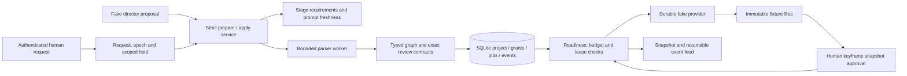

# Implementation status

September 11, 2026. This page describes working code; the technical designs describe the broader target.

The implementation includes a headless production-engine proof using fake media, versioned skill packages, a fixed MCP bridge and durable director context/tool records. It preserves the TypeScript application boundary, Codex-first direction and human review policy. Separate live fixtures verified MCP dispatch and two actual application-backed edits with explicit native skill inputs across process replacement. Browser messages are not yet connected to a live director, and the app does not yet create a real commercial.

## What runs



`pnpm demo:headless` runs a two-shot boots fixture through keyframes, exact simulated human review, video, a one-shot edit and restart reconciliation. It verifies four initial fake accepts, two for the edited shot, zero repeated accepted attempts, and unchanged candidate/artifact identities for the other shot. A deliberately lost submission response survives restart. The preview contains one-second fixture footage; its physical duration is explicitly separate from the planned twelve-second sequence. No model or vendor is contacted.

## Task evidence and remaining work

| Task | Implemented and exercised | Remaining exit work |
|---|---|---|
| T00 compatibility | Node 24, SQLite, compiler/schema and FFmpeg fixtures; pinned Codex no-turn checks; live MCP dispatch/interruption, stale-epoch rejection, two scoped edits with explicit native skill inputs across replacement, and enforced command-sandbox canaries | Code-host and authentication isolation remain unproven; pending-input replies and vision are unverified. Native history APIs omitted tool output; recovery must use application records. See [native skill validation](CODEX-SKILL-VALIDATION.md). |
| T01 persistence | Version-1 schema, WAL/FULL sync, project revisions, short transactions, events, command replay, immutable grants/candidates, SQL uniqueness, real two-connection races and verified metadata backup/restore | Future schema migrations, full portable project/media export and restore-starts-paused release flow |
| T02 commands/API | Local bearer/host/origin checks; persisted messages; request-bound director tokens; prepare/apply; snapshots/SSE reconnect; strict review targets; negative/conditional reply rejection; human pause | Live director wiring, credential backend, full question/decision inbox and visual review UI |
| T02A workflow | Nine scoped stage contracts; mutation-derived checks; typed creative patches; prompt reconfirmation; separate binding/progress versions; versioned contract identities; persisted advisory gaps; bounded no-progress assessments; explicit human continuation | Rich uploaded/partial/mixed narration records and ingestion; explicit model-authored stage/gap proposal evaluations; automatic evidence-to-stage projection and broader real conversation evaluations |
| T03 compiler | Restricted declarations, isolated worker limits, ordered input roles, imported/generated keyframes, exact review recipes, stable aliases, canonical source, scoped diffs, cue-aware fingerprints and duration cap | Imported-clip physical duration resolution in final rendering; richer timeline operations and measured large-workload performance |
| T04 fake execution | Concurrent independent work, exact approval, immutable candidate grants, same-candidate technical retry, leases/fences, reservations, unknown-submission reconciliation, history retention, scoped reuse and deterministic derivative cache | Real provider contracts, cancellation, longer artifact workloads, production crash/filesystem testing and physical rendered timing |
| T06 skills/tools | Two validated instruction packages, content-addressed snapshots, exact locks, explicit activations and read evidence; five-tool MCP bridge; paged context; persisted invocation identities/results; integrated replacement-epoch tests; two live edits with native skill inputs and exact application receipts | Production supervisor, durable model-turn dispatch/reconciliation, wakeups, pending replies and verified code-host/credential isolation. See [implementation breakdown](T06-SKILLS-TOOLS.md). |

These are implemented foundations, not a claim that every task's eventual exit criterion is complete. The fake runtime and application tests cover the boundaries needed to begin UI and director integration safely.

## Reproduce validation

Use Node 24 and the pinned pnpm version:

```sh
pnpm install --frozen-lockfile
pnpm check
pnpm demo:headless
pnpm probe:toolchain
OPENSLATE_CODEX_PROBE_BINARY=/absolute/path/to/codex pnpm check
```

Final checkout verification on September 11: **195 tests passed, zero failed, zero skipped**, with the native no-turn Codex probe explicitly enabled; all workspace builds and typechecks passed. The suite includes the fake headless demo, real child-process MCP transport, application/SQLite integration, skill locks and context pagination. This check used local-listener permission and zero model turns. The standalone toolchain probe passed in the earlier backend slice.

The [first live Codex experiment](CODEX-LIVE-PROBE.md) used three authorized turn starts. A separately authorized [MCP follow-up](CODEX-MCP-FOLLOWUP.md) used three more: one exposed native tool approval configuration; the other two verified live MCP, interruption and actual model continuation after replacement with application-supplied context. Those two allowances used six starts. The subsequent [native skill validation](CODEX-SKILL-VALIDATION.md) used three more: both application-backed edits passed, and the model declined the host canary script. Command-sandbox canaries passed separately. All three allowances are exhausted: **nine starts total**, with no image/video API calls. These synthetic tests do not establish native recall without context reconstruction or a production director integration.

The standard test suite uses no credentials. It needs loopback listeners for SSE and the fake MCP process. The last command additionally exercises the installed Codex binary with zero model turns. A sandbox that denies local listeners must grant that permission for full integration coverage; an environment denial is not a passing test. The runtime probe also reports blocked checks independently of process exit status.

Verified locally on macOS arm64: Node **24.15.0**, pnpm **10.33.0**, TypeScript **7.0.2**, Babel parser **8.0.5**, Ajv **8.20.0**, better-sqlite3 **13.0.3** / SQLite **3.53.4**, FFmpeg **8.1.1**, Codex **0.153.4**. FFmpeg encoded and probed a six-frame H.264 clip at 30 fps with AAC at 48 kHz. Linux CI is configured; it has not been observed running for this unpushed change. See [Codex probe evidence](CODEX-PROBE.md) for the exact runtime schema hash, installed launcher issue and unsupported methods.

## Code map

| Area | Implementation |
|---|---|
| Domain and schema | `packages/core/src/contracts.ts`, `common.ts`, `workflow/index.ts` |
| Compiler | `packages/core/src/planning/index.ts`, `worker.ts` |
| Application authority | `apps/server/src/application/service.ts` |
| HTTP and event streaming | `apps/server/src/app.ts` |
| Persistence and execution | `apps/server/src/persistence/store.ts`, `execution/engine.ts` |
| Fault-injectable provider | `packages/providers/src/fake.ts` |
| Codex compatibility fixture | `packages/director/src/probe/` |
| Skill loader and snapshots | `packages/director/src/skills/`, `skills/production/`, `skills/plan-authoring/` |
| Tool contracts and MCP | `packages/core/src/tools.ts`, `packages/director/src/tools/` |
| Durable director context and invocations | `apps/server/src/application/director-context.ts`, `context-projection.ts`, `tool-invocations.ts` |
| Demonstration | `apps/server/src/demo.ts` |

## Deliberate implementation limits

- Creative intents are saved before an executable plan refers to their service-issued IDs. A single proposal that creates new shots and references them in source is rejected; existing-shot edits and a replacement graph can be applied atomically.
- An active edit places a request-owned hold. Applying a new compatible graph releases only that request's holds. A project-only edit or advisory workflow assessment keeps them. A new human message can explicitly continue an earlier request; that transfer is recorded and cannot be requested through a model tool. Global user pause remains separate.
- The application pins recipe/stage/profile identities and fake provider descriptors. Production/plan-authoring packages and durable activation snapshots now exist. The live fixture accepted explicit skill name/path inputs and supplied five verified references per creative request. Complete production supervisor wiring and explicit stage/gap proposal behavior remain pending; general instruction adherence and native internal byte expansion are not established.
- Named permission profiles passed positive/negative command-sandbox tests. The code host still needs separate verification: generic `exec` ran even with `code_mode=false`, and the adversarial turn declined execution. Keep real generation authority disconnected; trusted native authentication access is not proof of model-facing credential isolation.
- Tool invocations persist before dispatch and fail closed when their outcome is unresolved. Automatic reconciliation of director invocation/turn records remains pending. Native process replacement must reconstruct canonical context rather than replay side effects.
- Paged context includes canonical source, aliases and saved grants. Pages expose guards and explicit offsets; callers must detect changed project/plan state. Read calls remain in the audit but do not invalidate their own pagination guard.
- Full source is still compiled for a change. Stable aliases and semantic hashes ensure that only affected work executes. This is incremental execution, not yet incremental parsing or a mature semantic patch editor.
- Fake pricing, playback bytes and adapter version `1` are test contracts. Current executor checks only those supported fake descriptors. Adding real providers requires the T09/T10 adapter work, not changing a model name in configuration.
- Narration readiness currently uses saved fixture cues and scripts. Application-locked video cannot submit until accepted measured timing matches the shot/request duration. Upload probing, transcription, script review and mixed-source cue editing remain T07 work.
- SQLite backup verifies database integrity and references. It does not include artifact files; retain the media directory separately. Release-quality backup/export is still pending.
- File ingestion is bounded to small fixture outputs. Native process, SQLite and lease tests do not establish power-loss guarantees or performance for six-minute production media.
- The web page is unchanged visually. Protected API routes and the headless fixture demonstrate the backend; there is no interactive creative workspace yet.

## Next development sequence

1. Close the remaining code-host/credential isolation gate with a deterministic boundary test or independently enforced execution boundary. A model refusal is insufficient. Native skill selections, two scoped edits and command restrictions now have evidence. The [three-start allowance](CODEX-NEXT-VALIDATION.md) is consumed; additional live starts require new approval. Keep fixtures synthetic and real media authority disconnected.
2. Complete T06 integration: a supervised native adapter, one active turn per project, durable dispatch and unresolved-outcome reconciliation, wakeups, pending replies and focused stage prompt activation. Use canonical context/receipts after replacement. Measure a focused context bundle and stable instruction prefix to reduce duplicated inputs while preserving commit-time checks; the two small live edits took about 24 and 30 seconds.
3. Build T05 conversation/review workspace against the fake path, and T07 narration ingestion/readiness. The user reviews keyframes and creative quality here; the agent does not automatically regenerate aesthetic misses.
4. Implement T08 real local rendering from supplied media, then connect image/audio and H3 cloud adapters with explicit credentials and spending limits. Validate a short production before the 150-second boots commercial and six-minute acceptance workload.

Independent review and regression coverage addressed cross-request authority/hold reuse, immutable review identity and uncertain submissions in the backend slice. This follow-up also fixed read-only epoch writes, missing transport IDs, oversized preparation results, incomplete resumed-edit context, file verification inside write transactions, stage binding validation and pagination invalidated by its own reads. The latest validation and independent review matched all 13 native MCP calls to durable successful receipts. The full-suite count remains 195; the new offline fixture and native runs are separate evidence. Remaining gates above stay open.
