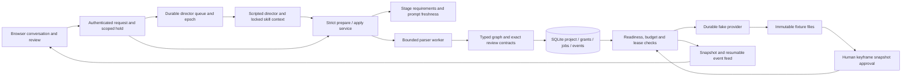

# Implementation status

September 12, 2026. This page describes working code; the technical designs describe the broader target.

The implementation now includes an interactive conversation/review workspace using a scripted director, durable director supervision, a pinned local native Codex adapter, and separately tested narration/local-rendering services. It preserves the TypeScript application boundary, Codex-first direction and human review policy. Earlier live fixtures verified MCP dispatch and scoped edits. The latest backend fixture used the actual Codex adapter, `DirectorSupervisor` and `createDirectorInput`: a saved conversational question survived a backend restart, and the answer applied a scoped shot-1 edit and matching plan. Local native configuration/browser wiring, native structured pending-input and vision remain unverified. The app does not yet generate a real commercial.

The earlier backend/skill foundation is committed locally as `e9f9c46`. The subsequent workspace/runtime/media slice is verified and ready for its component commit. See [implementation details](CONVERSATION-WORKSPACE.md).

The user has authorized local commits at component milestones and further bounded live Codex validation while they are away. Historical experiment ceilings remain part of their evidence; they do not block newly authorized validation. Defer live H3 tests until its key is available, continue independent implementation, and report status plus required user actions at each completion or pause. Other real media calls still require a test allowance; pushes are not included in the commit authorization.

The earlier September 12 diagnostic found and fixed pinned permission-profile null serialization. Its separate NativeClient fixture passed direct command checks, but the model declined the code-host canary script, so independent isolation remains inconclusive. After accepting the local policy, the two remaining starts passed the actual native supervisor fixture; the latest allowance is now exhausted. The [runtime trust decision](RUNTIME-TRUST-DECISION.md) is accepted: v0 is single-user and single-machine, with the application, SQLite, media, workers and native Codex on the same computer. Cloud LLM/image/video services remain initial providers. Native setup uses `LocalCodexPolicy` with mode `local` and an exact pinned version/configuration identity, trusting that installed runtime/sandbox. Independent code-host/authentication isolation remains unverified, but is not a mandatory independent-isolation gate or a separate deployment mode.

## What runs



`pnpm demo:headless` runs a two-shot boots fixture through keyframes, exact simulated human review, video, a one-shot edit and restart reconciliation. It verifies four initial fake accepts, two for the edited shot, zero repeated accepted attempts, and unchanged candidate/artifact identities for the other shot. A deliberately lost submission response survives restart. The preview contains one-second fixture footage; its physical duration is explicitly separate from the planned twelve-second sequence. No model or vendor is contacted.

## Task evidence and remaining work

| Task | Implemented and exercised | Remaining exit work |
|---|---|---|
| T00 compatibility | Node 24, SQLite, compiler/schema and FFmpeg fixtures; pinned Codex no-turn checks; live MCP dispatch/interruption, stale-epoch rejection, two scoped edits with explicit native skill inputs across replacement, enforced command-sandbox canaries, and an actual native supervisor conversation/restart/scoped-edit fixture | Native structured pending-input and vision validation remain open. Independent code-host and authentication isolation are unproven under the accepted local trust boundary. Native history APIs omitted tool output; recovery must use application records. See [native skill validation](CODEX-SKILL-VALIDATION.md). |
| T01 persistence | Version-1 schema, WAL/FULL sync, project revisions, short transactions, events, command replay, immutable grants/candidates, SQL uniqueness, real two-connection races and verified metadata backup/restore | Future schema migrations, full portable project/media export and restore-starts-paused release flow |
| T02 commands/API | Local bearer/host/origin checks; persisted conversation; idempotent project/message/demo/control commands; request-bound director tokens; prepare/apply; snapshots/SSE; exact review; authenticated artifact reads; persisted question replies; human pause | Live native application configuration, credential backend, broader decision inbox and release API contracts |
| T02A workflow | Nine scoped stage contracts; mutation-derived checks; typed creative patches; prompt reconfirmation; separate binding/progress versions; versioned contract identities; persisted advisory gaps; bounded no-progress assessments; explicit human continuation | Rich uploaded/partial/mixed narration records and ingestion; explicit model-authored stage/gap proposal evaluations; automatic evidence-to-stage projection and broader real conversation evaluations |
| T03 compiler | Restricted declarations, isolated worker limits, ordered input roles, imported/generated keyframes, exact review recipes, stable aliases, canonical source, scoped diffs, cue-aware fingerprints and duration cap | Imported-clip physical duration resolution in final rendering; richer timeline operations and measured large-workload performance |
| T04 fake execution | Concurrent independent work, exact approval, immutable candidate grants, same-candidate technical retry, leases/fences, reservations, unknown-submission reconciliation, history retention, scoped reuse and deterministic derivative cache | Real provider contracts, cancellation, longer artifact workloads, production crash/filesystem testing and physical rendered timing |
| T05 workspace | Project/chat persistence, scene-grouped storyboard, exact subset approval, authenticated image/video playback, shot-linked demo edits, previous-preview retention, pause/resume, keyboard review and bounded loading; verified in a browser | Native runtime setup/browser wiring, editable narration/upload flow, richer decision UX, real export and wider accessibility/user testing |
| T06 skills/tools/runtime | Two validated packages, immutable locks, fresh activations; five-tool bridge and paged context; durable turn queue/leases; stale-epoch fencing; unknown-outcome/tool reconciliation; questions resumed as new human requests; fake runtime and pinned native adapter with exact permission/catalog checks; actual native conversational question, restart and scoped edit with fresh activation/epoch and old-bridge rejection | Local native configuration/browser wiring; native structured-question/vision validation; explicit stage/gap behavior evaluations and broader latency measurements. See [runtime slice](CONVERSATION-WORKSPACE.md). |
| T07 narration | Draft revisions, independent text/audio/timing readiness, partial/mixed supplied recordings, 48 kHz normalization, exact human acceptance, cue projection and scoped visual/render impact | Guarded canonical cue commit, workflow/five-tool/browser integration, ASR/TTS and real generated-artifact provenance. Draft projections do not change engine state or holds. |
| T08 media/render | Supplied-file normalization, exact 30 fps cuts and 48 kHz audio placements, frozen manifests, immutable originals/outputs, cancellation, completion receipts and guarded publication port; decoded-frame/audio tests | Canonical timeline/executor/API integration, captions/overlays/transitions, preview/export ownership, full filesystem recovery and commercial-scale measurements |
| T09 image/audio APIs | Provider contracts and fake path available | Real image, speech/transcription profiles, pricing/input/output integration and bounded live tests |
| T10 H3 cloud | Planned | Cloud adapter and 30–60-second real production |
| T11 integrated revisions | Scoped compiler/executor reuse and scripted browser edits proven | End-to-end real narration/story/frame/take/trim edits |
| T12 six-minute acceptance | Duration limits and small recovery fixtures | 150-second boots film, six-minute workload, measured latency/cost/resource use and full recovery campaign |
| T13 release packaging | Contributor skeleton and CI configuration | Production launcher, credential backend, migrations, full export/import and clean-install verification |

These are implemented slices, not a claim that every task's eventual exit criterion is complete. Narration and real FFmpeg rendering are programmatic services; the browser demo still uses fake media.

## Reproduce validation

Use Node 24 and the pinned pnpm version:

```sh
pnpm install --frozen-lockfile
pnpm check
pnpm demo:headless
pnpm probe:toolchain
OPENSLATE_CODEX_PROBE_BINARY=/absolute/path/to/codex pnpm check
```

Final checkout verification on September 12: **291 tests passed, zero failed, zero skipped**, with the native no-turn Codex probe explicitly enabled; all workspace builds and typechecks passed. The September 11 workspace/runtime/media slice passed 287 tests; September 12 permission-normalization fixes raised that pre-decision baseline to 290. The accepted local policy and an additional non-loopback launch regression now bring the suite to 291, including 36 runtime tests. The check used local-listener permission, real synthetic FFmpeg fixtures and zero model turns. Browser verification on September 11 covered project creation, exact keyframe approval, a one-shot replacement, persistence after reload, previous-preview retention, pause/resume and a first read-only conversation. A separate allowance-ledger test also passed.

The [first live Codex experiment](CODEX-LIVE-PROBE.md) used three authorized turn starts. A separately authorized [MCP follow-up](CODEX-MCP-FOLLOWUP.md) used three more: one exposed native tool approval configuration; the other two verified live MCP, interruption and actual model continuation after replacement with application-supplied context. Those two allowances used six starts. The subsequent [native skill validation](CODEX-SKILL-VALIDATION.md) used three more: both application-backed edits passed, and the model declined the host canary script. Command-sandbox canaries passed separately. Those three allowances are exhausted: **nine starts at that point**, with no image/video API calls. These synthetic tests do not establish native recall without context reconstruction or a production director integration.

The separately approved [supervisor validation](CODEX-SUPERVISOR-VALIDATION.md) used **three additional starts on September 12: twelve overall**, exhausting that three-start allowance. Its first start was the separate NativeClient diagnostic: the model declined the prohibited operations and made zero code-host calls. That historical isolation result remains inconclusive. After the local trust decision, both remaining starts used the actual adapter, supervisor and input builder. The first saved a conversational framing question; after a backend restart using the same SQLite database, the answer applied a shot-1 edit with a matching plan. Shot-2 bindings/node/output/candidate state and narration/story/motion/timing stayed unchanged. The skill lock stayed the same, activation and epoch were fresh, and the old bridge returned 403. No media attempts, artifacts, approvals or media API calls were created.

The native question took approximately **6.4 seconds** and the answer/edit **31.3 seconds**, including native setup and cleanup. These are two synthetic backend observations, not commercial-scale performance. The question was ordinary conversation, not native structured pending-input; that capability and vision remain unverified. Native threads were archived and processes closed. This live evidence is separate from the unchanged 291-test offline suite.

The standard test suite uses no credentials. It needs loopback listeners for SSE and the fake MCP process. The last command additionally exercises the installed Codex binary with zero model turns. A sandbox that denies local listeners must grant that permission for full integration coverage; an environment denial is not a passing test. The runtime probe also reports blocked checks independently of process exit status.

Verified locally on macOS arm64: Node **24.15.0**, pnpm **10.33.0**, TypeScript **7.0.2**, Babel parser **8.0.5**, Ajv **8.20.0**, better-sqlite3 **13.0.3** / SQLite **3.53.4**, FFmpeg **8.1.1**, Codex **0.153.4**. FFmpeg encoded and probed a six-frame H.264 clip at 30 fps with AAC at 48 kHz. Linux CI is configured; it has not been observed running for this unpushed change. See [Codex probe evidence](CODEX-PROBE.md) for the exact runtime schema hash, installed launcher issue and unsupported methods.

## Code map

| Area | Implementation |
|---|---|
| Domain and schema | `packages/core/src/contracts.ts`, `common.ts`, `workflow/index.ts` |
| Compiler | `packages/core/src/planning/index.ts`, `worker.ts` |
| Application authority | `apps/server/src/application/service.ts` |
| HTTP and event streaming | `apps/server/src/app.ts` |
| Persistence and execution | `apps/server/src/persistence/store.ts`, `execution/engine.ts` |
| Fault-injectable provider | `packages/providers/src/fake.ts` |
| Codex compatibility fixture | `packages/director/src/probe/` |
| Skill loader and snapshots | `packages/director/src/skills/`, `skills/production/`, `skills/plan-authoring/` |
| Tool contracts and MCP | `packages/core/src/tools.ts`, `packages/director/src/tools/` |
| Durable director context and invocations | `apps/server/src/application/director-context.ts`, `context-projection.ts`, `tool-invocations.ts` |
| Director supervision and input | `apps/server/src/application/director-supervisor.ts`, `director-input.ts`, `fake-director.ts` |
| Runtime adapters and protocol | `packages/director/src/runtime/` |
| Conversation and visual review | `apps/web/src/App.tsx`, `api.ts`, `components.tsx`, `model.ts` |
| Narration draft and cue projection | `apps/server/src/narration/` |
| Supplied-media normalization and rendering | `apps/server/src/media/` |
| Demonstration | `apps/server/src/demo.ts` |

## Deliberate implementation limits

- Creative intents are saved before an executable plan refers to their service-issued IDs. A single proposal that creates new shots and references them in source is rejected; existing-shot edits and a replacement graph can be applied atomically.
- An active edit places a request-owned hold. Applying a new compatible graph releases only that request's holds. A project-only edit or advisory workflow assessment keeps them. A new human message can explicitly continue an earlier request; that transfer is recorded and cannot be requested through a model tool. Global user pause remains separate.
- The application pins recipe/stage/profile identities and fake provider descriptors. It loads instruction packages at startup, reuses immutable project locks and captures fresh context/activation/read evidence per request, including a first read-only request. Current runtime binding records the runtime port identity, not all implementation binary bytes. Explicit model-authored stage/gap behavior, general instruction adherence and native internal skill expansion remain unverified.
- Named permission profiles passed positive/negative command-sandbox tests. Generic `exec` ran even with `code_mode=false`, and the adversarial turn declined execution; independent code-host/authentication isolation remains unverified. V0 accepts the installed pinned runtime/sandbox as trusted under `LocalCodexPolicy`; this is a trust decision, not new isolation evidence. Exact tool/skill catalogs, loopback bridge, epoch fences and application media authority still apply. Real media integrations remain disabled pending their own adapter and allowance work.
- V0 has no multi-host application mode, remote GPU workers, distributed scheduler or shared-database deployment. Ownership leases and recovery coordinate processes on the same computer; cloud tasks can still outlive local processes.
- Tool and turn intents persist before dispatch. Turns whose prior local supervisor lease expires become unknown; matching application receipts can reconcile tool effects without replay. An unknown turn is never automatically restarted. Application requests use fresh native threads with reconstructed canonical context; optional native resume is tested only at the adapter boundary. Questions continue as new authenticated requests rather than reviving old authority.
- Paged context includes canonical source, aliases and saved grants. Pages expose guards and explicit offsets; callers must detect changed project/plan state. Read calls remain in the audit but do not invalidate their own pagination guard.
- Full source is still compiled for a change. Stable aliases and semantic hashes ensure that only affected work executes. This is incremental execution, not yet incremental parsing or a mature semantic patch editor.
- Fake pricing, playback bytes and adapter version `1` are test contracts. Current executor checks only those supported fake descriptors. Adding real providers requires the T09/T10 adapter work, not changing a model name in configuration.
- Engine narration still uses canonical fixture cues/scripts. The new draft service measures supplied recordings and supports script/audio/timing acceptance and mixed sources, but its projection explicitly says `canonicalApplied: false`. It cannot yet release video work or update canonical cues. ASR/TTS remain pending.
- SQLite backup verifies database integrity and references. It does not include artifact files; retain the media directory separately. Release-quality backup/export is still pending.
- The supplied-media service limits both source and output duration to 360 seconds, with 64 clips and eight audio tracks. Importing a short range from a longer recording is not supported. It normalizes video without embedded audio; audio must be imported separately. The service is not connected to executor jobs or browser artifact serving yet. Atomic publication and process cancellation tests do not establish power-loss guarantees, an OS memory sandbox, global disk quotas or six-minute performance.
- The workspace uses bounded polling over durable snapshots; SSE remains an API feature. Arbitrary chat receives canned guidance. Demo buttons supply explicit scripted mutations and bounded fake grants. Tokens stay in tab memory and must be re-entered on a full reload. The native adapter is deliberately not configured in the default app.

## Next development sequence

1. Wire local native runtime configuration and browser setup under the [accepted local policy](RUNTIME-TRUST-DECISION.md). The actual supervisor/backend fixture passed; the default application remains scripted until product setup is connected and verified. Preserve exact permissions/catalogs, application authority and same-machine recovery. Ground progress summaries in application state: the live model incorrectly described a released edit hold as a persistent pause; the fixture prevented media execution by running no worker.
2. Evaluate stage/gap behavior, context efficiency, native structured questions and vision. The conversational question/restart/edit fixture does not establish those capabilities. The twelve historical starts consumed their original allowances; further bounded live Codex evaluations are now preapproved. Keep a new run ledger and real media dispatch separate from runtime tests.
3. Connect narration draft projection through a guarded canonical commit and the existing five tools; integrate supplied-media rendering with owned artifacts, frozen timeline resolution and conditional preview publication. Add browser import/readiness review using those services.
4. Connect image/audio and H3 cloud adapters with explicitly chosen profiles, credentials and spending limits. Validate a short production before the 150-second boots commercial and six-minute acceptance workload.

Independent review and browser checks in the workspace slice fixed exact permission-profile comparison, first read-only skill initialization, unknown outcomes during interruption, previous-preview lookup after a shot edit, repeat project/control commands and placement-only narration rounding. September 12 review additionally verified that normalization admits only the observed optional null defaults while rejecting extra permissions. Earlier authority/review/submission regressions remain covered. Live evidence is separate from the 291-test offline suite.
