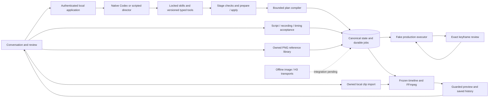

# Implementation status

September 12, 2026. This page describes working code; technical designs describe the broader target.

OpenSlate has a local conversation/review workspace, per-project native Codex setup, durable planning and fake execution, versioned conversational narration drafts, accepted narration ingestion, a PNG reference library, and application-owned local clip rendering. Native Codex has passed scoped edits across restart, browser conversations, and a small image/structured-question experiment. A synthetic six-minute render passed decoded picture/audio checks. **The app does not yet generate a real commercial.** Real provider transports are implemented offline but are not connected to application execution or credentials.

V0 runs for one user on one computer. Cloud model/media APIs remain part of the architecture. The accepted [runtime trust decision](RUNTIME-TRUST-DECISION.md) trusts the pinned installed runtime/sandbox while retaining application authority; independent code-host/authentication isolation remains unverified. The user authorizes local milestone commits and bounded live Codex tests. Defer live H3 tests until its key is available. Other real media calls require a test allowance; pushing is not authorized.

## Latest evidence

- Full checkout check: **579 tests passed, zero failures/skips**, all builds/typechecks passed, installed no-turn Codex probe enabled. This includes the output-spool consumption, migration and request-image attachment slices as well as existing runtime, review and rendering regressions. The runner bounds test-file concurrency to four; protocol fixture deadlines allow child startup headroom without changing production deadlines. A heartbeat-disabled negative control fails the lease-renewal regression as intended.
- Spool consumption also passed **83 focused tests**, including 18 new contract/integration checks. It preserves legacy evidence, recovers winning output slots before provider calls, keeps synchronous task IDs null, fully decodes exact PNG bytes, and aborts publication on lease loss. Real adapters remain disconnected. See [spool completions](SPOOL-COMPLETIONS.md).
- Nine migration checks and five existing persistence tests passed, including historical JSON preservation, verified pre-upgrade backup, real uniqueness-failure rollback, two-process migration and committed-WAL restore. Twelve attachment tests cover exact ordered selections, bounded thumbnails, immutable receipts, corruption/restart and original-signal cancellation before native dispatch. See [migrations](DATABASE-MIGRATIONS.md) and [image attachments](DIRECTOR-IMAGE-ATTACHMENTS.md).
- Two native browser turns took 14.7 and 20.5 seconds, including restart and a persisted brief-only edit. The second made four successful application tool calls. No media attempts/grants/approvals. See [browser evidence](CODEX-BROWSER-VALIDATION.md).
- Two subsequent capability turns described a synthetic image and persisted a native question after enabling the pinned feature. One later service-level continuation recognized the exact answer `Warm`, completed in **8.633 seconds**, and preserved canonical state. That brought the historical native-start count to **17**; zero media API calls. Positive browser/HTTP question answering and browser artifact attachment remain unverified. See [capability evidence](CODEX-CAPABILITY-VALIDATION.md) and [question continuation](CODEX-QUESTION-CONTINUATION.md).
- One subsequent native V2 narration request passed **22 checks** in **27.853 seconds**, using narration read → one draft edit → read after an explicit V1 upgrade. It preserved the accepted opening, canonical project and holds, and left two new sections unaccepted. Native start count is now **18**; zero media calls, native thread archived and all processes cleaned up. This is a short explicitly directed request, not general stage-selection evidence. See [native V2 validation](CODEX-NARRATION-V2-VALIDATION.md).
- The 360-second 720p synthetic render covered 10,800 frames, 64 cuts and 64 narration placements, including reversed source ranges. All decoded pictures, cue identities and silence gaps passed. Render/validate/install took **34.2 seconds**, with about **801 MiB** peak sampled process-tree RSS. This is one workload, not a memory guarantee or model-generation benchmark. See [media implementation](MEDIA-INTEGRATION.md).
- A separate **60-shot, 360-second fake workflow** passed all 122 operations, four exact review batches, a scoped edit preserving the other 59 shots, and restart reconciliation with zero duplicate fake accepts. Initial/scoped plan preparation took **510/445 ms**. It uses one-second fixture video bytes and simulated acceptance; physical timing is covered by the render check above. See [workflow evidence](SIX-MINUTE-WORKFLOW.md).
- Browser narration review created a section, attached a test recording, accepted exact script/audio/timing, reviewed and applied canonical narration. The browser decoded the six-second recording and imported 640×360 clip with no media errors. Files were submitted through the authenticated HTTP harness after the automation file picker stalled; the picker action remains unverified. No model/media API calls. See [browser evidence](NARRATION-BROWSER-VALIDATION.md).

Local milestones include `4de9d86` narration/media integration, `2b15ec3` offline image/H3 transports, `019b567` single-process launcher, `d9a0442` provider execution boundary and `9872fb4` image validation/backend credential resolver. Milestone `54303be` adds versioned narration, PNG references and durable output storage. Earlier foundations are recorded in Git history and their component evidence. Nothing has been pushed during these milestones.

- The built browser upgraded an existing V1 project to V2 without altering canonical state or creating creative authority. It also displayed a supplied 320×180 PNG, retained the preview after refresh and passed exact-byte API/reopen checks. No browser warnings/errors or model/media calls. File selection used the HTTP harness; native file-picker automation remains unverified. See [guidance upgrades](DIRECTOR-TOOLS-UPGRADE.md) and [PNG library](PNG-REFERENCE-IMPORT.md).

## What runs



`pnpm demo:headless` remains an offline two-shot boots proof with simulated human review, scoped replacement and unknown-submission reconciliation. Its one-second fixture playback is distinct from the physical rendering acceptance test. It contacts no model/vendor.

## Task evidence and remaining work

| Task | Implemented and exercised | Remaining exit work |
|---|---|---|
| T00 compatibility | Node/SQLite/compiler/FFmpeg; pinned native setup, MCP, scoped edits, restart, browser conversation, small image/question experiment | Broader stage/gap and vision evaluations; answered native-question browser flow |
| T01 persistence | WAL/FULL sync, immutable records, transactions/replay, two-connection races, checksummed V1-to-V2 migrations, verified pre-upgrade snapshots and WAL-consistent restore | Media-inclusive export/import and restore-starts-paused release flow |
| T02 commands/API | Local authentication, persisted requests, request-bound tools, prepare/apply, snapshots/SSE, exact review, native setup, explicit guidance upgrades, image/upload/narration/render routes; backend environment credential resolver | Credential settings/wiring, broader decision inbox and release contracts |
| T02A workflow | Nine scoped contracts, mutation-derived checks, prompt freshness, versioned identities, advisory gaps, bounded no-progress handling, explicit continuation | Richer evidence projection and actual model stage/gap evaluations |
| T03 compiler | Restricted declarations, worker bounds, ordered roles, imported/generated keyframes, exact review, stable aliases, canonical source, cue-aware scoped reuse, duration cap; measured 60-shot compilation and source round-trip | Richer timeline operations and broader large-plan performance coverage |
| T04 fake execution | Registered execution port, immutable request identity, explicit retry permission, receipt contradictions, lease-protected ingestion, durable output spool and V2 Engine consumption, grants/candidates/reservations, scoped reuse/cache | Real profiles/receipt mapping, generated-video derivation, throttling, broader crash/filesystem tests |
| T05 workspace | Conversation/native setup, storyboard approval, playback, scoped demo edits, pause/resume, narration review, PNG/clip libraries and render controls | File-picker verification, broader accessibility/error UX, real generation/cost review |
| T06 skills/tools/runtime | Two skill families, immutable V1/V2 locks/fresh activation, explicit upgrades, versioned MCP and draft narration tool, paged context, durable supervisor/epochs/questions, explicit PNG attachment with immutable thumbnail receipts | Built-browser attachment validation, wider behavior/latency tests |
| T07 narration | Immutable drafts/recordings/cues, exact independent acceptance, partial/mixed sources, normalization, guarded canonical commit, scoped shot impact, HTTP/browser review and versioned conversational draft writes | ASR/TTS, transcript alignment and generated provenance |
| T08 media/render | Owned imports, physical duration checks, frozen plan/cue resolution, exact cuts/audio, receipts, cancellation/recovery, guarded previews, HTTP/browser playback | Captions/overlays/transitions, broader revision/recovery campaign and streaming large media |
| T09 image/audio APIs | Standalone GPT Image 2 transport, exact input digest, bounded bytes, conservative uncertainty; full PNG decoding/reference intake, owned response spool, exact PNG Engine ingester and backend credential resolver | Engine registration, credential/allowance wiring, application-to-transport receipt mapping, speech/transcription adapters, allowed live tests |
| T10 H3 cloud | Standalone H3/H3-Max first/last-frame transport, capabilities, one-shot submit, receipt polling/reconciliation | Engine/profile/keyframe transfer, credentials, owned output download and keyed short production |
| T11 integrated revisions | Scoped execution reuse, scripted browser edits, native scoped planning, narration impact and stale-render protection | Real end-to-end narration/story/frame/take/trim revision campaign |
| T12 six-minute acceptance | Synthetic 720p six-minute render, 64 cuts/cues, reversed ranges, decoded content and sampled resources; 60-shot fake workflow, batch review, scoped reuse and uncertain-job restart | Real 150-second boots commercial, generated six-minute workload, cost/latency/recovery campaign |
| T13 release packaging | Built single-process local launcher, exclusive installation ownership, bounded static serving, clean event-stream shutdown, backend environment credential resolver and backed-up schema upgrades | Credential configuration, media-inclusive export/import and clean-install verification |

These are implemented slices, not completion of every task's eventual exit criteria. Projects remain explicitly labeled demos until native Codex is selected. Only fake/v1 is registered with the execution port; real transports remain disconnected.

## Reproduce validation

Use Node 24 and pnpm 10.33.0:

```sh
pnpm install --frozen-lockfile
pnpm check
pnpm demo:headless
pnpm probe:toolchain
pnpm probe:workflow
OPENSLATE_CODEX_PROBE_BINARY=/absolute/path/to/codex pnpm check
```

Tests use synthetic media and no credentials. Full coverage needs loopback listeners and FFmpeg; the last command also checks installed Codex without a model turn. Environment denials are blocked checks, not passes. The six-minute resource probe is separate from the normal suite; see [media implementation](MEDIA-INTEGRATION.md).

Verified: macOS arm64, Node 24.15.0, pnpm 10.33.0, TypeScript 7.0.2, Babel parser 8.0.5, Ajv 8.20.0, better-sqlite3 13.0.3 / SQLite 3.53.4, FFmpeg 8.1.1, Codex 0.153.4. Linux CI has not been observed for these unpushed changes.

## Key boundaries and limits

- Codex proposes validated data. OpenSlate owns state, authority, review, budgets, execution and artifact selection. Model-authored JavaScript is never evaluated.
- New edits fence old epochs. Holds belong to their request; only explicit human continuation transfers them. A compatible plan releases only its request's holds. Global user pause is separate.
- Tool and native-start intents persist before dispatch. Unknown outcomes are not automatically repeated. Context is reconstructed in a fresh native thread; a question answer receives fresh application authority.
- Native setup pins runtime/model/catalog and checks the question feature. Explicitly selected supplied PNGs receive request-bound, hash-verified JPEG thumbnails within four-file/512-KiB limits. The library's discussion action is read-only and does not transfer earlier edit holds. Later requests do not automatically receive those image bytes. Artifact inspection exposes sanitized metadata only.
- Paged context includes owned assets, canonical cues, draft narration and explicit coverage. Draft text is advisory, not acceptance or a media grant. Canonical commit verifies exact script/audio/timing, versions and authority; it retains holds until a matching plan. A user-declared externally generated recording is not proof of an OpenSlate generation job.
- Local rendering requires registered real sources and physical durations. Fake footage cannot masquerade as a longer take. Limits: 360 seconds, 64 cuts/64 audio placements, eight distinct audio inputs and eight simultaneous audio lanes. Embedded video audio is removed. No limiter/automatic ducking is claimed.
- Immutable outputs and completion receipts retain stale results as history. Current previews require the frozen target to remain current. Leases coordinate this machine, not a distributed deployment.
- General media uploads are bounded to 128 MiB; PNG uploads to 32 MiB. Playback verifies full content before creating a browser blob; audio is capped at 80 MiB and general artifacts at 256 MiB. Full-buffer verification has memory costs and no range streaming yet.
- Transports do not grant authority, guarantee provider idempotency, settle billing or replace ingestion. The executor admits only registered fake/v1 profiles. Legacy inline evidence remains bounded to 64 MiB. The durable store supports 32-MiB PNG/256-MiB MP4 streams; Engine consumes exact V2 spool receipts and an optional PNG-only ingester fully decodes original bytes. Generated MP4 normalization needs a separate derivation contract, and real transport mapping remains pending. See [spool completions](SPOOL-COMPLETIONS.md), [execution](PROVIDER-EXECUTION.md), [H3](MINIMAX-H3.md) and [image](OPENAI-IMAGE.md) boundaries.
- Tokens stay in tab memory. Pending browser requests survive project remounts within one API session; page reload/disconnect does not persist upload bytes or tokens. Server command receipts remain durable.
- Schema V2 migration validates historical definitions, verifies and syncs a pre-upgrade database snapshot, and preserves domain JSON. Restore includes committed WAL content. These metadata snapshots do not bundle media or establish execution ownership for an imported copy. Portable project export/import, disk quotas and power-loss guarantees remain release work.

## Next development sequence

1. Narration/media integration and the native capability slice are complete for this milestone. Retain the explicit file-picker verification limit; broader browser recovery coverage continues with release work.
2. Connect provider transports through generic engine profiles and durable ingestion. Add backend credential configuration and bounded dispatch allowances. Preserve reviewed keyframes and unresolved liabilities; wait for the appropriate key/allowance before live media calls.
3. Versioned narration tools, human upgrades and trusted image attachment are implemented. Actual V2 narration drafting passed. Validate the built-browser attachment flow, then evaluate broader stage/gap selection and native question-answer continuation with bounded Codex starts.
4. Complete supplied-media editing/recovery and release packaging/export. Finish independent work before requesting live prerequisites.
5. With keys and approved spending, verify a short real production, the 150-second boots commercial, then the generated six-minute workload.

See the [development plan](../design/IMPLEMENTATION-PLAN.md) for dependencies and [documentation index](../README.md) for component contracts and historical evidence.
