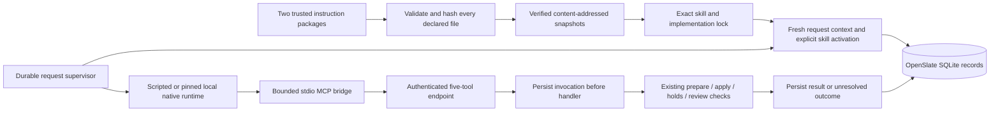

# T06 implementation: skills, tools and request context

September 12, 2026. This page records the original five-tool foundation and historical evidence. The local app now supports native configuration/browser conversations and a versioned six-tool narration contract with explicit upgrades; see [versioned narration tools](NARRATION-TOOLS.md) and [current implementation status](STATUS.md). Original catalogs and instruction packages remain available for existing locks.

## Ownership and flow

V0 places the application, database, media, workers and native Codex on one computer. Native setup uses `LocalCodexPolicy` with only mode `local`, bound to exact version/configuration identity. The accepted boundary trusts the installed runtime/sandbox while retaining catalogs, loopback MCP and application epochs/authority. It is not an independent isolation proof or a multi-host deployment framework. Cloud model/media services remain supported.

The [MCP follow-up](CODEX-MCP-FOLLOWUP.md) demonstrates the native transport and restart path with synthetic tools. The production bridge/database integration has offline coverage, and the later [native supervisor fixture](CODEX-SUPERVISOR-VALIDATION.md) verified the actual adapter, supervisor and input builder across a backend restart. That bounded result does not establish the complete production director or native structured-input/vision support.

## Instruction packages and locks

Two repository packages live under `skills/production` and `skills/plan-authoring`. They contain native `SKILL.md` entries, `openslate.skill.json` manifests and declared Markdown/JSON references. Production guidance covers the nine implemented stages, narration decisions, continuity and human review. Plan authoring describes the actual restricted grammar and includes a compiler-checked example.

`packages/director/src/skills` implements:

- Strict package validation, exact stable compatibility versions, duplicate-key checks and bounded text/JSON input. Scripts, dependency installation, undeclared files, path traversal and symlinks are rejected.
- A content digest over exact manifest and file bytes. Moving a checkout does not change identity; editing a reference does.
- Verified, read-only snapshots published atomically. Missing or corrupted pinned snapshots fail; the loader never repairs an active identity from changed source.
- Explicit per-request skill selection. Repeated requests and compaction can reactivate the same lock with a fresh activation/context identity. Unselected instructions cannot be fetched through the mediated-read helper.
- Pinned task-prompt paths/hashes and implementation binding digests. Stage methods remain guidance; application predicates still control readiness and authority.

The package compatibility labels currently use `1.0.0`; individual existing stage/recipe check versions retain their own identities. The input builder binds runtime port identity, stage/recipe contracts and the tool catalog. This does not freeze every compiler/runtime/handler binary or hosted model weight; stronger production binding remains required where behavior changes independently of these contracts.

## Durable context and provenance

`DirectorContextService` installs a verified lock through application authority, captures current project evidence and a skill activation, and records mediated instruction reads. Trusted startup configuration can bootstrap a project's first lock, including for a read-only first request; it cannot replace an existing lock. These records survive a server restart. An epoch cannot switch its lock, and a replacement request cannot reuse an older request's activation.

Stage bindings must name a known stage, its exact prompt reference, a current request-covered scope and, when supplied, a prepared proposal owned by that request/epoch. Selecting or reading a skill cannot mark a stage complete. File verification runs outside SQLite write transactions; the short commit rechecks authority, immutable identities and current context.

| Record | Meaning |
|---|---|
| `director_skill_lock` | Exact package, prompt and implementation identities |
| `director_epoch_lock` | One immutable skill lock for an epoch |
| `director_context` | Saved application evidence and digest |
| `skill_activation` | Explicit selections bound to request, epoch and context |
| `skill_read` | Exact mediated file bytes supplied for that activation |
| `tool_invocation` | Transport identity, original epoch, argument digest and recorded outcome |
| `director_turn` / `director_output` | Persistent dispatch, request/epoch identity, status, lease and assistant output |
| `director_question` | Pending question and its authenticated answer/continuation identity |
| `tool_reconciliation` | Evidence-backed resolution or required follow-up after an epoch is revoked |

These are application records, not proof that a model read or followed every instruction. The [native skill validation](CODEX-SKILL-VALIDATION.md) accepted explicit skill inputs on two real model turns and matched all 13 tool results to application receipts. Exact focused reference bytes were supplied by OpenSlate; native internal entry expansion remains unobserved.

## Five-tool contract and bridge

`packages/core/src/tools.ts` is the shared schema/catalog source. The tool IDs remain `read_context`, `prepare_change`, `apply_change`, `control_execution` and `inspect_artifact`. The preparation schema reuses the existing workflow grammar; additional actor, epoch and authorization fields are rejected.

The bridge captures its loopback endpoint, project and opaque credential once at launch. Model arguments cannot replace them. It sends an application call ID with every request, forbids redirects, limits input/output/concurrency/time, and performs no HTTP retries. A timeout, malformed response, lost connection or server failure after dispatch returns an unresolved outcome. Cancelling a wait does not imply rollback.

The stdio entry is `packages/director/dist/tools/mcp.js`. Launch configuration uses `OPENSLATE_BRIDGE_ENDPOINT`, `OPENSLATE_BRIDGE_PROJECT_ID` and `OPENSLATE_BRIDGE_CREDENTIAL`; the supervisor/input builder supplies these from trusted application state. Ordinary development uses the scripted runtime and does not launch a native process or contact a model automatically.

## Results and recovery

The server requires a stable `x-openslate-tool-call-id` and persists `started` before dispatch. Identical completed calls return their recorded result. Reusing an identity for another payload fails. A started or unresolved invocation is not dispatched again. Underlying domain receipts, grant slots and candidate identities remain the final protection against duplicated work across different transport IDs.

Preparation returns a compact durable ID and summary. Full source, proposed project and compiled graph remain in the saved proposal for debugging; large legal plans do not lose their usable ID by echoing all of that data through the tool channel.

`read_context` exposes a bounded overview plus paged shots, scenes, canonical plan source, logical aliases, grants and receipt summaries. Callers follow returned offsets and compare revision/plan identities across pages. This makes existing plan branches available to a resumed editor without sending the whole project on every request. Grant visibility describes saved eligibility and never grants new authority.

Known errors are recorded as failed outcomes. They can still leave a documented hold, so failure is not a claim of zero application effects. Unexpected failures and result-recording gaps remain unresolved. The supervisor now revokes expired epochs and records reconciliation: a matching saved preparation or domain command receipt can confirm an effect; missing evidence requires follow-up. The original transport receipt is preserved. Neither an unresolved tool invocation nor an unknown model turn is automatically replayed.

## Remaining integration work

- Local native configuration and browser setup. The actual supervisor fixture passed conversational question/restart/scoped-edit behavior, and offline queue/dispatch/reconciliation tests pass. Native structured pending-input and vision still require separate evaluation.
- Explicit stage/gap proposal, context efficiency and compaction evaluations with actual model output.
- Maintain the accepted local runtime policy and exact compatibility checks. Independent code-host/authentication isolation is unverified: command canaries passed, while the model declined the separate host script. This evidence limit is not a mandatory independent-isolation gate for v0. Real generation still needs its application-owned provider, review and allowance integration.
- General browser AI conversation and stage selection beyond the canned demo. The input builder already supplies exact locked entry/reference bytes per request.
- Canonical integration of the new narration/local-media services, provider adapters and six-minute workload measurements.

The latest complete offline baseline is 291 passing tests, including 36 runtime tests under the accepted local policy. The earlier September 12 pre-decision baseline was 290. Twelve native starts have now been used across the separate experiments; the latest three-start allowance is exhausted. Its final two starts verified the same skill lock with fresh activation/epoch, shot-2 and narration/story/motion/timing preservation, and old-bridge rejection after restart. No media attempts, artifacts, approvals or media API calls were created. Keep the default scripted while native product configuration/browser wiring is completed; T06 remains open. See the [accepted runtime decision](RUNTIME-TRUST-DECISION.md).

See [implementation status](STATUS.md) for the final verified test count and development sequence. Fake fixtures do not evaluate creative quality or spend provider credits.
