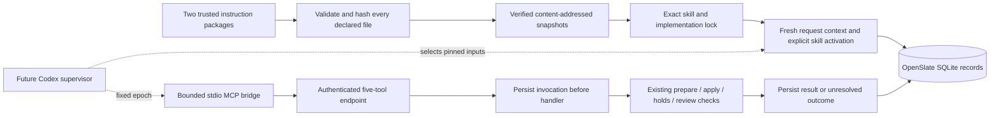

# T06 implementation: skills, tools and request context

September 11, 2026. This slice implements the skill/tool foundation and application records. It does not yet connect browser messages to a live Codex supervisor.

## Ownership and flow

The [MCP follow-up](CODEX-MCP-FOLLOWUP.md) demonstrates the native transport and restart path with synthetic tools. The production bridge and database integration below are verified offline. Neither result establishes the complete production director.

## Instruction packages and locks

Two repository packages live under `skills/production` and `skills/plan-authoring`. They contain native `SKILL.md` entries, `openslate.skill.json` manifests and declared Markdown/JSON references. Production guidance covers the nine implemented stages, narration decisions, continuity and human review. Plan authoring describes the actual restricted grammar and includes a compiler-checked example.

`packages/director/src/skills` implements:

- Strict package validation, exact stable compatibility versions, duplicate-key checks and bounded text/JSON input. Scripts, dependency installation, undeclared files, path traversal and symlinks are rejected.
- A content digest over exact manifest and file bytes. Moving a checkout does not change identity; editing a reference does.
- Verified, read-only snapshots published atomically. Missing or corrupted pinned snapshots fail; the loader never repairs an active identity from changed source.
- Explicit per-request skill selection. Repeated requests and compaction can reactivate the same lock with a fresh activation/context identity. Unselected instructions cannot be fetched through the mediated-read helper.
- Pinned task-prompt paths/hashes and implementation binding digests. Stage methods remain guidance; application predicates still control readiness and authority.

The package compatibility labels currently use `1.0.0`; individual existing stage/recipe check versions retain their own identities. The application must supply actual compiler/runtime/handler/profile bindings when building a production lock. A version string alone does not freeze hosted model weights or implementation bytes.

## Durable context and provenance

`DirectorContextService` installs a verified lock through application authority, captures current project evidence and a skill activation, and records mediated instruction reads. These records survive a server restart. An epoch cannot switch its lock, and a replacement request cannot reuse an older request's activation.

Stage bindings must name a known stage, its exact prompt reference, a current request-covered scope and, when supplied, a prepared proposal owned by that request/epoch. Selecting or reading a skill cannot mark a stage complete. File verification runs outside SQLite write transactions; the short commit rechecks authority, immutable identities and current context.

| Record | Meaning |
|---|---|
| `director_skill_lock` | Exact package, prompt and implementation identities |
| `director_epoch_lock` | One immutable skill lock for an epoch |
| `director_context` | Saved application evidence and digest |
| `skill_activation` | Explicit selections bound to request, epoch and context |
| `skill_read` | Exact mediated file bytes supplied for that activation |
| `tool_invocation` | Transport identity, original epoch, argument digest and recorded outcome |

These are application records, not proof that a model read or followed every instruction. The [native skill validation](CODEX-SKILL-VALIDATION.md) accepted explicit skill inputs on two real model turns and matched all 13 tool results to application receipts. Exact focused reference bytes were supplied by OpenSlate; native internal entry expansion remains unobserved.

## Five-tool contract and bridge

`packages/core/src/tools.ts` is the shared schema/catalog source. The tool IDs remain `read_context`, `prepare_change`, `apply_change`, `control_execution` and `inspect_artifact`. The preparation schema reuses the existing workflow grammar; additional actor, epoch and authorization fields are rejected.

The bridge captures its loopback endpoint, project and opaque credential once at launch. Model arguments cannot replace them. It sends an application call ID with every request, forbids redirects, limits input/output/concurrency/time, and performs no HTTP retries. A timeout, malformed response, lost connection or server failure after dispatch returns an unresolved outcome. Cancelling a wait does not imply rollback.

The stdio entry is `packages/director/dist/tools/mcp.js`. Launch configuration uses `OPENSLATE_BRIDGE_ENDPOINT`, `OPENSLATE_BRIDGE_PROJECT_ID` and `OPENSLATE_BRIDGE_CREDENTIAL`; the future supervisor supplies these from trusted application state. Ordinary development does not launch this process or contact a model automatically.

## Results and recovery

The server requires a stable `x-openslate-tool-call-id` and persists `started` before dispatch. Identical completed calls return their recorded result. Reusing an identity for another payload fails. A started or unresolved invocation is not dispatched again. Underlying domain receipts, grant slots and candidate identities remain the final protection against duplicated work across different transport IDs.

Preparation returns a compact durable ID and summary. Full source, proposed project and compiled graph remain in the saved proposal for debugging; large legal plans do not lose their usable ID by echoing all of that data through the tool channel.

`read_context` exposes a bounded overview plus paged shots, scenes, canonical plan source, logical aliases, grants and receipt summaries. Callers follow returned offsets and compare revision/plan identities across pages. This makes existing plan branches available to a resumed editor without sending the whole project on every request. Grant visibility describes saved eligibility and never grants new authority.

Known errors are recorded as failed outcomes. They can still leave a documented hold, so failure is not a claim of zero application effects. Unexpected failures and result-recording gaps remain unresolved. Automatic reconciliation of director invocation/turn records is still pending; current code stops rather than guessing whether to replay a command.

## Remaining integration work

- A production supervisor, durable model-turn dispatch/reconciliation, wakeups and pending-input replies.
- Production integration of the now-tested explicit skill inputs/catalog checks, plus explicit stage/gap proposal and compaction evaluations.
- Proven code-host/credential isolation before connecting real generation authority. Command sandbox canaries passed; the model declined the separate host script, leaving that boundary inconclusive.
- Wiring the locked production prompts into workflow stage selection and the browser conversation/review flow.
- Six-minute workload measurements, real narration ingestion, rendering and provider adapters.

See [implementation status](STATUS.md) for the final verified test count and development sequence. Fake fixtures do not evaluate creative quality or spend provider credits.
